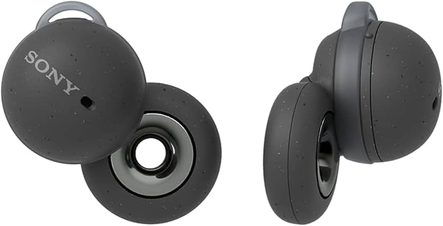

+++
title = "open-backed... earbuds?"
date = 2024-09-11T13:00:00-07:00
draft = false
categories = ["technology", "recommendations"]
tags = ["headphones"]
+++

Okay, so, we're now firmly in the era of "phones don't have 3.5mm headphone jacks". I don't like it but I've come to terms with it somewhat.

<!--more-->

I have lost more 3.5mm-to-Lightning dongles than anybody in history.

Anyways, what's the proposed alternative? Specifically for the problem of _outdoor use_ - your scooting, yardwork, going for a walk, running on a treadmill (ha ha, as if I would run on a treadmill) - that kind of thing.

That's not it, bro. I have wee tiny little earholes and Apple's hard plastic earbuds have always been _painful_ to wear, and have a tendency to just shoot out of my ear on their own power. "What if, every time that happened, you lost $220 CAD". No thank you sir.

I ended up settling on the Bose SoundSport:

* hard to lose (the connected "bolo" design means that even if one pops, they're still secure)
* more secure (the bat-wing ear wedge keeps them in tighter: I still have to deal with pop-outs but they're not quite so frequent)
* comfortable _enough_, I guess

Anyways, my pair of the SoundSports, after putting in a good couple of years of work, has been smashed up beyond recognition, doesn't have much battery life anymore, they're kinda done for. Also they have been discontinued.

> 
>
> can confirm, great design, only lasted a couple of years

I've been "borrowing" Tiff's pair, but I thought "hey, I wonder if there's a better solution?"

Actually, here's a big question: is there such a thing as an open earbud?

I love open-backed headphones: I'm actually really committed to the _opposite_ of noise cancelling. I don't want to shut out the outside world: when I'm at my desk or out and about, I want to be _present in the space_ while _ALSO_ listening to music.  On top of that, large around-the-ear open-backed headphones are better for your ears (headphones seal in all the juices, which are bad for you) and offer a superior comfort experience (breathability++).

Do open earbuds exist?

Well, there are the Sony LinkBuds, an experimental design that reviews very poorly because of battery and comfort issues:

Not much else...

except for...

[These guys](https://www.amazon.ca/dp/B0D2HKCMBP?ref=ppx_yo2ov_dt_b_fed_asin_title&th=1), the Shokz OpenRun Pro 2 headset.

they work through BONE CONDUCTION

> 
>
> finally, headphones for the earless

... oh, actually that's kind of exactly what I want

they don't actually cover or interact with the ears at all. They sit on your head, just behind your temples.

the sound doesn't go in through your ears

it goes in through your _bones_

but it goes in, nonetheless

... so, uh, I bought these. They arrived. I put them on.

I love them. I immediately love them so much.

They weigh almost nothing, they feel like wearing _nothing at all_, the sound quality is _quite good_, the battery is _quite long_, and I can hear very naturally while my music is playing. The sound isolation is middling: if I have the music cranked, nearby folk can hear a soft version of whatever it is I'm playing. But I can still hear _everything happening outside of the headset_. These are headphones I can wear while scooting, or _driving_ , or holding a conversation.

The OpenRun Pro 1 had a proprietary charging connector, which everyone complained about, so these ones (The OpenRun Pro 2) just have USB-C, which is great.

I feel like I can just _leave these on_. I'm currently sitting at my desk, where I have nice expensive headphones, and I'm not convinced I need to switch away from the headset. These might be _more_ comfortable, and I'm not tethered to my computer.

On top of that, I tested out the onboard microphone, and it's good for calls. If I wanted to talk to someone on the phone (I'm a Millenial, so it's unlikely, but it could happen) I could use it like those dorky Jabras every business douche was wearing a decade ago:

I popped this headset on and went out to do chores with Tiffany (need to fill the trunk with mulch and toilet paper, for _reasons_) and it was great, a soft musical interlude just followed me wherever I went.

When I came inside I had the _habit_ of taking off the headset (that's usually the first thing I do when I walk in the door) and then I thought "no, I don't have to do that with these".

anyways: I'm immediately a convert.