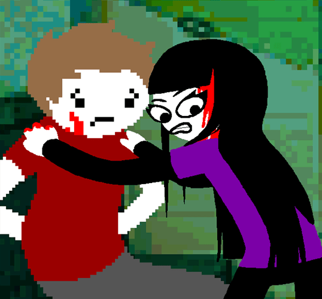
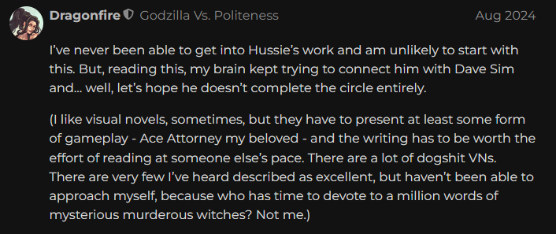

+++
title = "psycholonials"
date = 2024-08-15T12:00:00-07:00
draft = false
categories = ["visual novel"]
tags = ["homestuck", "enlightened centrism", "centrism", "hussnasty", "clowns"]
+++

So, I've made no small matter (outside of my blog) out of my growing _Homestuck fandom_. (And also: my complete and utter lack of interest in participating in Homestuck fandom.)

It really is a _singular piece of art_.

If you've ever wondered how Andrew Hussie felt about Homestuck, here comes [Psycholonials](https://store.steampowered.com/app/1529810/Psycholonials/), a VN by Andrew Hussie about... Homestuck.

I mean, it's not _really_ about Homestuck. It's just a story of a weird, self-hating depressed clout-chasing internet troll accidentally-not-accidentally becoming enormously popular with an enormous collective of nasty clowns who both idolize and hate their messiah.

Which is, as allegories go, about as subtle as a pie to the face.

It's really _just a graphic novel_, there's no interactivity to be had here.

It's rendered in Hussie's House Style, a nasty mixed-media horsetrash cartoon jumble that's just _plain ugly_. I'm, uh, actually _very_ fond of it.

Tiff leaned over my shoulder while I was reading this and commented that I had a higher tolerance for ugly art than she does, and _boy is she right_.

## Basic Plot Synopsis

The year is 2020 and Coronavirus lockdowns have basically closed Nantucket, a sleepy island that's mostly vacation properties left empty for a summer season that won't be arriving this year. Zhen, mentally ill, depressed, unemployed alcoholic twenty-something, operating online under the pseudonym "Z" because she's tired of people mispronouncing her name, is a social media influencer with no job and tens of followers. She gets in trouble with The Law and, in a panic, decides to hide with her rich and influential best friend Abby. She concocts a scheme to get out of trouble the simplest way that she can think of: by **creating a clown religion that came to her in a dream and using it to overthrow the government of the United States of America**. This, by virtue of being a work of fiction, _manages to somehow actually pick up some steam_

## More Plot Synopsis, This Time With Spoilers!

First of all, the trouble she gets into with the law is that _she picks a fight with a cop, then, fearing for her life, bites his arm, grabs his gun, and murders him, then rolls his car into the ocean._

So it's not a _small amount of trouble_ she's in, with the law.

Her pitch is that America is _already_ failed state: no legitimate power structure could have botched the pandemic response _so badly_, so Q.E.D. America is not a legitimate power structure. She dreams of a better, kinder, socialist future, and the only way to get there is with _preaching a violent clown uprising_. Part of this is inspired by dreams from a creepy space clown.

Growing in clout, her clown army starts to coalesce, echoing notes from [CHAZ](https://en.wikipedia.org/wiki/Capitol_Hill_Occupied_Protest) and the [Boogaloo movement](https://en.wikipedia.org/wiki/Boogaloo_movement), although it becomes almost immediately clear that by preaching _simple accelerationism_ rather than any kind of rational policy for improving things, she's mostly just accumulating people who want to watch the world burn.

The way that she pitches this is with "pranxis" - a portmanteau of "pranks" and "praxis" that mostly means scamming people out of their money and getting violent.

The violence proceeds. Z kills some _more_ cops which makes her _more popular_ rather than less popular. Percy, a "simp" - a horny boy from internet enchanted by Z's mystique - is brought in to potentially take the fall for Z's crime, and to help run the crime and organize the clown rebellion. Z can't work up the courage to explain to Percy that he's been brought in as a fall guy and  _whoops, Percy is killed by cops._

This triggers an event where Z runs an enormous, carefully planned prank to drive any non-clowns off of the small island of Nantucket and declare it a _sovereign nation_.

The clown nation's power keeps growing and a conniving, power-brokering Grand Vizier of a clown shows up, Joculine, who Z immediately hates because she realizes that Joculine was one of the random folks on the internet who tried to cancel her back when she had tens of followers.

Joculine green-lights progressively more horrible clown violence, at which point Z executes her for... being a hater, back in the day.

Abby points out that Z is growing progressively more insane and begs her not to start executing anybody who rubs her the wrong way, which would be (checks notes) bad.

_but wait_, it turns out that Joculine had ordered a hit on Abby's family! Joculine was bad all along and Z was retroactively justified in her violence!

The creepy space clown intrudes again and suggests that, because space travel is practically impossible, their mission is to psychically colonize other planets with their ideas. Z is just carrying the clown banner of distant civilizations. He also points out that everybody who has ever criticized Z is probably going to try to kill her eventually, so she's justified if she wants to kill them all.

This resonates with Z, who orders everybody who's ever criticized her online to be murdered by roaming clown hit squads.  This disgusts Abby, who begins to prepare an exit strategy from Nantucket.

Shortly after, everybody on the Clown Leadership Council tries to kill Z, and _also_ everybody else on the Clown Leadership Council, in a grand and violent knock-down drag-out fight for dominance. Z narrowly wins, with an assist from her new mute, cute, moe second-in-command, Mizzlebip.

Mizzlebip shows Z a CIA badge: this coup attempt was probably sponsored by the US Government, terrified at Nantucket's new global clout.

Z calls a big ol' clown meeting where she tells all of her followers that she's decided to declare war on the United States of America. Realizing that her insanity and paranoia is beginning to go a bit too far, she then quietly kinda disappears into the forest, where she finds... Abby, who is just about to make her escape. Abby invites Z to come along and leave this whole clown mess behind.

Z decides to run away with Abby. They leave the keys to the kingdom in the hands of Mizzlebip and fly off into the sunset to live on a beach.

Z realizes that Mizzlebip was playing her all along! Wait a minute: the CIA badge that Mizzlebip showed her was just lazily constructed internet art! (This twist concealed in the simple expedient of every other part of the story _also_ being lazily-constructed internet art, but this time it was _plot relevant_.) The whole CIA thing was just a ruse: the island's violence was concocted by Mizzlebip in _their own play for power_.

Z decides to just be Zhen again.

Afterwards, Zhen achieves some level of peace. She concludes that, while she was right about everything all along, her project was doomed to fail because any social movement will be infiltrated by haters who seek to subvert the project with their own clout-chasing and ego. She lives peacefully with Abby on an island, they get married and buy a horse, and the credits play to a whimsical smash cut of the immediate and rapid social media news of _rapid-fire clown assassination and succession_, as well as the clown's mind-virus spreading throughout the entire galaxy.
[/spoiler]

She ends the story by throwing her cel-phone into the sea.

Look, compressing six hours of reading into a handful of paragraphs is not easy and I've missed some major stuff, here. If you're interested in more details, you can just _read the thing_. It's free.

## Some Thoughts:

### Hussie Raises Some Good Points about Fame

The most prominent theme of the entire piece, here, is that being internet famous was _actually driving Hussie insane_ and that he's much happier now that nobody is paying attention to him. He was never terribly comfortable with the level of spotlight he had, he was handed the reigns to an empire that he did not ever understand or control, and as a result became paranoid and vindictive. The end result of clout chasing never made him happy, they just made him want to chase _more clout_, endlessly exhausting himself in order to fuel a content engine that was never satisfied, producing an empty kind of fame filled with people who just wanted to use Hussie as a jumping off point for their own clout chasing.

This is the face-value reading of Psycholonials, **in my opinion**, and it's... not a bad message to walk away from the piece with.  It's the Good Ending.

I think just taking the whole message of Psycholonials as "fame wasn't healthy for me" is probably the most enjoyable (and generous) reading of it.

### Clowngender and Horsegender

Hussie takes the floor for some time in this piece to announce his triangular theory of gender.

If gender is a spectrum, then "clowngender" is what Z (and Hussie) identify with: not being male, or female, or even enby, but simply not buying in to the idea that gender is meaningful in any way. Their pronouns are _whatever you want to use, they don't care_.

Horsegender is the opposite: very strongly identifying with a specific gender.

AFAICT Tumblr _mostly hates Hussie's clowngender ranting_ and think of it as kind of the boomer "I don't see color" of genderpolitick.

I ... don't have much of an opinion on it. It doesn't strike me as terribly objectionable, nor unusually insightful?

### Enlightened Centrism

Basically every point that Psycholonials tries to make about modern imperialist capitalism is a point that Disco Elysium _makes, too_,
and Disco Elysium does a much, much better job with its exploration of these themes.

The philosophy of Psycholonials, as far as I can tell, is that all revolutionary movements are destined to collapse because they're hewn from the same stuff as the thing they were attempting to overthrow, nothing but clout-chasing and trying-to-rewrite-the-current-systems-again-but-with-a-new-hierarchy.

It's a philosophy of cynicism, but naive cynicism, a giant shrug at the status quo, an absurdist "I guess you just have to look at it and laugh" take, a sort of South Parkian "Turd Sandwich or Giant Douche" philosophy:

In Disco Elysium's defense, when I dug deeper I actually found a much more nuanced philosophy and story under the hood.

I think folks would struggle to make the same defense of Psycholonials. Andrew Hussie is mad at the United States of America for police violence and badly handling a pandemic, but then throwing up his hands and saying that _you can't trust Americans to build anything new because they're too vain, petty and venal to build anything to replace it_.

This, as political rabble-rousing goes, is just not terribly compelling.

Like many creators who choose to advance the political message of _not having a lot of ideas_ but simply being angry at everybody for not being _better at all of this_, I have to say that this doesn't add as much to the conversation as they think it does.

### Hussie Hates the Internet, his Fans, Everybody he Has Ever Worked With, and America, and also He Has Never Done Anything Wrong, Ever.

Z is not a very sympathetic protagonist, but they're presented as a _clownish anti-hero_ rather than, you know, an _obvious villain_.

All of Z's insane paranoia and violence are... justified and rational, in the story, often post-hoc. America, the system, and all of the other clowns **are** really out to get her. They're all clout-chasing power-brokering haters looking to corrupt something pure and beautiful for their own ends! Z created something _perfect_ and they _perverted it_ with their _own ideas_.

When applied to the obvious allegorical retelling of the Homestuck Fiasco that it appears to be, it's easy to see this as Andrew Hussie justifying all of his bad behavior as necessary, wise, and brilliant.

As we all know, cancel culture is just _haters_ trying to bring down _brilliant artists_, and the only healthy and responsible way to respond to that kind of input is to tell them all to fuck off, disappear to an island, and make incredibly bitter art about how meaningful social change is impossible, the internet is a poisonous hellworld full of nasty clowns, and all art is just clout-chasing.

This isn't a very generous reading of the text but it's also absolutely there if you want to read this in to it.

### The worst thing you could possibly do is tell Hussie what to do. This game is not interested in your input, Hussie is not interested in your input, you can fuck right off. You're just another one of the nasty clowns.

One of the tricks the game plays on you is to offer you "choices" in the story, then tear them away from you at the last second. At the end it reveals that this is because, all along, Z had to learn _not to listen to your bullshit, random stranger_.

### Don't Like This

It's tough to find a lot of stuff out there about Psycholonials because _basically nobody read it_.

The online fan community for [Psycholonials](https://www.reddit.com/r/Psycholonials/) is _tiny_. Because, well, Psycholonials doesn't want you to be a fan of it. Psycholonials wants you to fuck off.

_It's an actively hostile and bitter piece of work that was barely advertised, by an artist that wrote a story about how they were right about everything and no longer want a fan following._

### The Visual Novel is an Interesting, If Niche And Irritating Medium

I'm kind of enchanted with the idea of the VN.

I mean, [I made one](/books/detective_capilano). The one I made is kinda dogshit, but I'm proud to have finished it. If I made, like, 4 or 5 more of them, the 6th or 7th one might turn out to be _actually readable_.

I think it's , like, a mixed-media _evolution_ of a comic book. You can have sound, and some light animations, short videos, but it still reads like a book. I _love_ books. I like _music_. I like the idea of a book where the parts of the book have visual accompaniments, books that steal little tricks from film and comics without entirely leaving the realm of books.

But also Psycholonials being a VN was actively kind of a deterrent for me.

Like, here's a content series from an artist you're interested in, it's complete and _free_ and has been available for _months_, and I'm ... like... "uuuugghggh, do I _have_ to?".  I barely advertised my own VN because once I finished it I couldn't imagine putting myself in the shoes of someone who _actually wanted to read a VN_, because I'm not sure _such a person exists_.

Something about the idea of a VN is just _exhausting_.

Psycholonials was exhausting. A _lot_ of times during the story, it _grabbed the reins of pacing_ just to slooooowly fade in a character and I could _feel my soul leaving my body_.

I want to understand what the problem is. Maybe if I knew why I don't want to read a VN, I could find a way to make one that people _would_ want to read?

Like, I'm _more likely to read a book or a comic_ than a VN, because somehow the prospect of sitting at my desk and clicking a thousand times to tap through small boxes of text displayed under an unmoving character portrait is so demotivating that I'm only willing to pursue it if the story is _excellent_.  There _has_ to be a better way to present mixed-media storytelling.

Is it, as a field, cursed to be exhausting and niche?  I mean, **I've** been described as "exhausting and niche" myself, maybe I just have to come to terms with that.

### Clark Powell

Soundtrack's pretty good. Did you know that Clark is from Vancouver?



### Charismatic, Nonetheless

A lot of this comes off as fairly critical. I can see why Psycholonials was _very unpopular_.

But also: I like Hussie's work. He's funny. He's got a talent for mixed media. He knows how to weave an interesting plot together. His Visual Novel is easily the best and most compelling Visual Novel I've ever interacted with, with the caveat that my experience with most VNs or VN-likes is to get irritated with them and bail - like that time, just recently, when I made it through just the first chapter of Danganronpa.

Despite the six-hour run-time, I sat down and read the entire thing in one sitting, stopping only to shotgun an entire pizza.

I hope Hussie recovers on his beach. I hope he keeps making strange art. I'll keep reading it. I hope that he'll spend some time away from the spotlight and come back and make more content - hopefully less _angry_ and _defensive_ art. I'm excited to see what Hussie makes next, if anything.

And, if Psycholonials has taught me anything, it's that _I hope that Andrew Hussie never discovers that I'm a fan of his work_, because I think that he would _hate_ that.

## P.S. : A Short Exchange about Dave Sim

> my brain kept trying to connect him with Dave Sim

I don't know Dave Sim's work, although I looked him up on Wikipedia

Ooh, Canadian.

... Cerebus? Wait a minute, I know that word, [I heard it on the TV Tropes](https://tvtropes.org/pmwiki/pmwiki.php/Main/CerebusSyndrome)

Ah, okay, so the Dave Sim who so famously derailed his comic with heavy-handed drama that they named a TV Trope after it.

But what did he do that made him so notoriously bad?

Huh, that's an ominous title for a Wikipedia header, especially one that appears to go on for _several paragraphs_.

(reads further)

...huh.

Dave Sim.