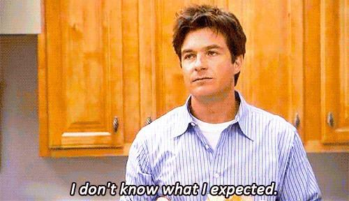
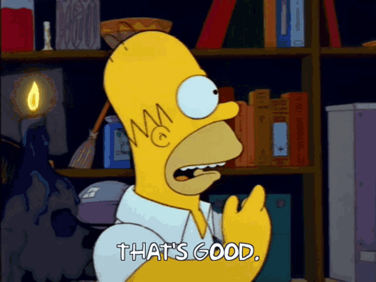
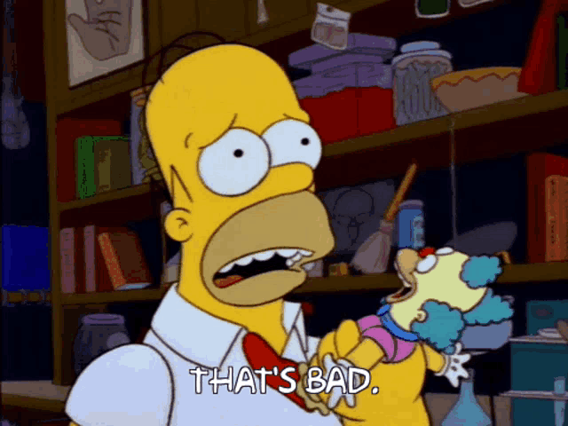
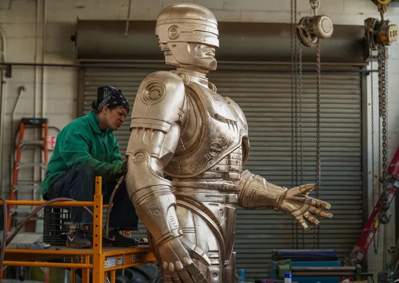
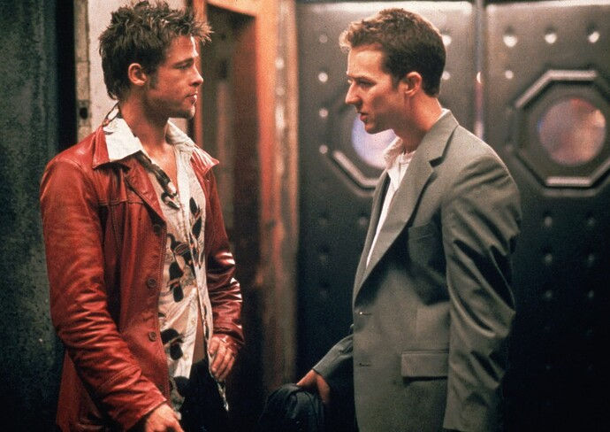
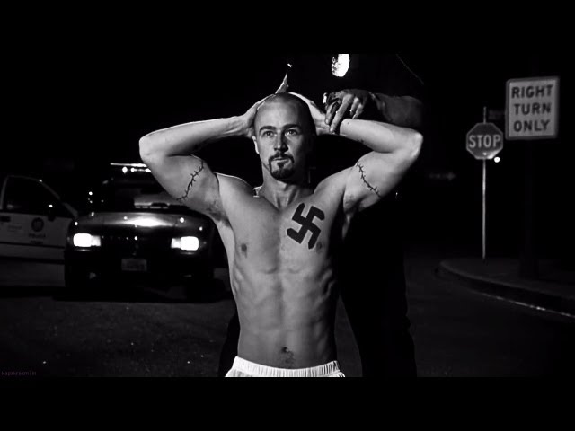
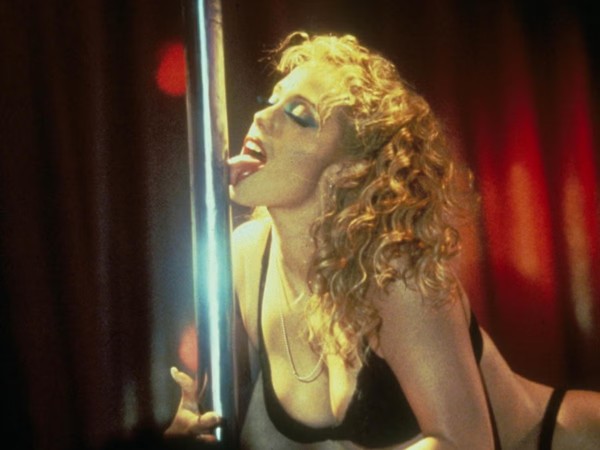
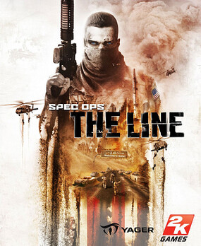

+++
title = "Satire is Hard"
date = 2024-05-15T12:00:00-07:00
draft = false
categories = ["media"]
tags = ["satire", "showgirls", "starship troopers", "robocop", "fight club", "pathologic", "lisa: the painful", "spec ops: the line", "the last of us: part 2", "ludonarrative dissonance"]
description = "Has Showgirls actually become kind of good? The answer is no."
image = "./lurid.png"
+++

So, both Tiff and I had seen some growing groundswell behind the old, famously terrible movie "Showgirls".

> **[Has Showgirls actually become kind of good?](https://www.flickeringmyth.com/2020/06/showgirls-has-actually-become-kind-of-good/)**
>
> Tom Jolliffe takes a look back at Showgirls, once universally derided and considered one of the worst films ever… but is it actually misunderstood? Upon its release in 1995, Paul Verhoeven’s trashy spectacular, Showgirls was obliterated by critics....

Showgirls: Complete and utter trainwreck or misunderstood satirical feminist masterpiece?

Anyways, we decided to give it a watch and decide for ourselves.

Cripes, this movie was a slog. Needlessly gratuitous, badly written, often badly acted. Cheesecakey but never sexy. Every character has an unclear, constantly shifting motivation.  _Bad_ rape scene. The movie struggles to find a thesis and just sort of lands on "las vegas bad". Eventually the movie kind of just _ends_.

It's _exactly as unwatchably bad as everybody said it was_.

It also contains _one of the worst sex scenes that I've ever seen in a movie_. Like, Watchmen bad.

> 
>
> this guy's got at least equivalent moves

This is not a good movie.

It does _try to do something_, though.

It's possible for bad movies to do things well. One of the things that Showgirls does well is that it actually goes way out of its way to ... put on a lot of the shows that are the topic of the piece. Putting on stage-show like this is, I think, actually really hard. There's a _lot_ of synchronized choreography in this movie. The movie goes _all in_ on the spectacle, often using it as a framing device for the _just abysmal story_.

It takes significant effort to fit it all in, but Paul Verhoeven puts a tremendous amount of effort to fit an entire strip-show and an _entire_ show-girl stage-show within this movie. Maybe 20-30 minutes of this's show's runtime is just dance routines.

The problem? A whole stage-show, on camera, is not as weighty and interesting as watching that same stage show in person. It can drag a little - but in a better movie, these scenes could elevate the movie rather than being the rock that drags it to the bottom of the sea.

Thing is, the movie itself condemns the spectacle of the showgirls as cheap and sleazy and vapid and hollow. It's simultaneously trying its best to _salaciously enjoy titties_ and also _harshly judge anybody who would dare to salaciously enjoy titties_. The movie tries to have-it's-cheesecake-and-eat-it-too, which creates a lot of thematic dissonance. This movie so delights in something that it's trying to condemn that it comes off as simultaneously kind of preachy and sleazy at the same time.

The main character is in full, aggressive make-up in every scene in the entire movie - when she wakes up, in the pool, after a 350-mile drive - every scene - and it's hard to tell whether that's bad directing or an intentional comment on hollow spectacle.

Like, the movie is cheap, and dumb, and sleazy, and vapid, and hollow, and hypocritical, _that might be on purpose_. If that _were_ on purpose, would that _intent_ make the movie _kind of good_?

**No!**

## Paul Verhoeven's Oeuvre

This is not the only Paul Verhoeven movie that tries to present a satirical point of view, but gets so lost in spectacle that the point goes way over most people's heads.

Take, for example, Starship Troopers, or Robocop.

## Does Starship Troopers Have The Exact Same Problem?

I've long been of the opinion that Starship Troopers is an oft-misunderstood work of satirical genius, but... is it?



It’s a fun space war movie!

The humans in the war are actually fascists!

The fascism is satire! You're not supposed to root for the humans!

The satire is muddy and unclear, and it goes over people's heads, leaving most people walking away cheering for fascism.

It’s not satire’s responsibility to be legible to anybody, and it’s not bad art if the satire isn’t _clear_.

But if we take Verhoeven’s _satirical masterpieces that are frequently misunderstood_ (Starship Troopers, Robocop) and his _total flop that is barely comprehensible_ (Showgirls), one thing they have in common is that they really can’t help but glorify the spectacle of the things they’re purporting to satirize, creating what is ultimately muddy satire.

That's bad.

Basically, Starship Troopers and Robocop struggle to tell clear “war bad” or “police violence bad” stories because they can’t help but get caught up in making those things look cool on film.

We end up with stories where “violence cool” is the text, and “violence bad” is the subtext and “violence cool” is the sub-sub-text again.

Which is how [this kind of thing](https://en.wikipedia.org/wiki/RoboCop_statue) happens:

Other media has this problem, too: _if you make shitty behavior look cool, it doesn't always matter if you lay out that it's shitty behavior in the story, people will still idolize and emulate it_.

Showgirls has this same problem: it gets so caught up in the thing it’s trying to condemn, it fails to be effective satire.

> 
>
> i think I saw an antivaxer do this a few years back on public transit

You know, it’s like how Spec Ops: The Line tries to shame you for enjoying its violence while also… you know, being a video game, where the point is also to enjoy the violence.

Or how The Last of Us: Part 2 forces you to make a bunch of bad, violent, video game decisions and then rubs them in your face. This game is fun, violence is fun, what you're doing is bad, revenge will ruin your life: mixed message.

That’s ludonarrative dissonance right there. (I got to say it! Roll out the prize!)  The story and the _fun_ aren't interacting right!

On the other hand, media often _has_ to be showy and fun. Nobody would watch Starship Troopers if the war wasn't a little fun. Nobody would play The Last Of Us Part II if the gameplay were as grim as the story. Down that road lies games like [Lisa: the Painful](https://en.wikipedia.org/wiki/Lisa:_The_Painful) or [Pathologic](https://en.wikipedia.org/wiki/Pathologic)
where the game's awfulness is perfectly aligned with the story, and then the only people who ever want to play it are a handful of art nerds.

... and all of these other things I've mentioned? The Last of Us: Part 2? Spec Ops: The Line? Starship Troopers, even? Well, they may not be perfect, but they're _interesting_, critically well regarded. The dissonance between the fun cool violence and the narrative telling you that the fun cool violence is neither fun nor cool _bring up that question_, but ultimately they're enjoyable media.

Lisa: the Painful and Pathologic aren't fun and cool, they're painful, shitty, nasty experiences that deliver razor-sharp commentary - they weren't wildly profitable but they're cult hits, critical darlings, art pieces.

Clearly there's a whole spectrum of ways to do satire that are interesting or successful.

The problem with Showgirls is that it's not cool, sexy, or entertaining, and it's **also** not thoughtful, well-considered satire. It fails on all fronts.

...

so, at the end of this entirely too long screed, I think I'm going to go out on a limb and say that I don't think Showgirls is a very good movie.