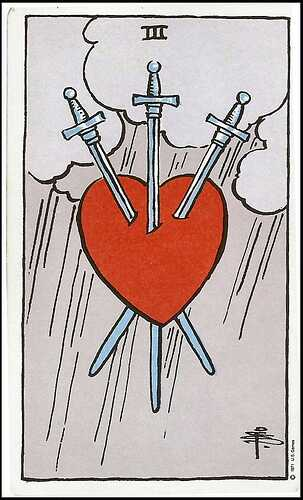
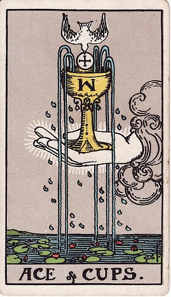
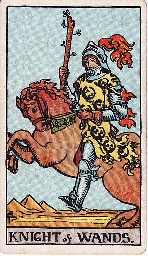
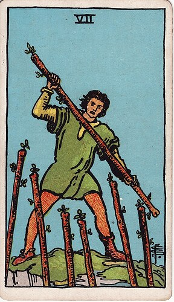
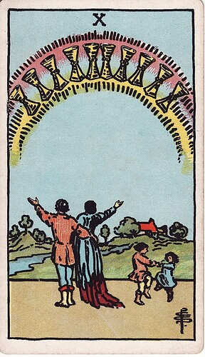
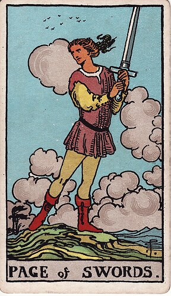
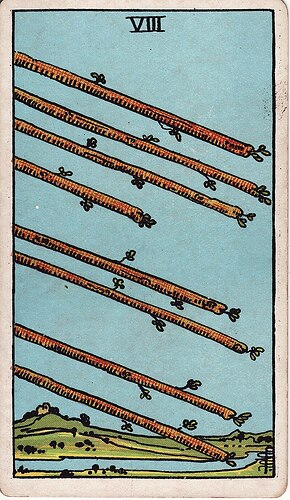
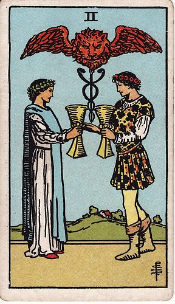

+++
title = "pocket fiction"
date = 2024-11-10T12:00:00-07:00
draft = false
categories = ["writing"]
tags = ["rt0", "tarot", "three of swords", "ace of cups", "knight of wands", "seven of wands", "ten of cups", "page of swords", "eight of wands", "two of cups", "i am bad at naming things"]
image = "./3_swords.png"
description = "I'm deeply embarrassed about my short fiction experiments, but not embarassed enough not to post them online."
+++

> I’m told by numerous sources that one of the keys to writing well is simply to write badly until you have exhausted your ready supply of dogshit words.
>
> I’ve also heard that about a lot of other things - coding, art, you do in fact get a lot better by simply doing it over and over and over and over again.
>
> Anyways, that’s the reasoning behind the Pocket Fiction topic, where I draw a random tarot card and use it to compose a little bit of flash fiction in the rt0 universe.

<!--more-->

## Three of Swords

Valentine trundled his heavy gurney along the dimly lit hallway between the morgue and the human recyling tanks, completely tuning out the one wonky wheel that squeaked every few seconds. Some folks found his job distasteful, but in Paradise there was no room for waste - if anything, Valentine found it kind of romantic, the thought that everybody would be together in the end.

While he walked, Valentine was reflecting on a recent heartbreak, trying to pinpoint the exact moment that things had gone wrong for him. He had gone over the entire relationship with a fine toothed comb and couldn't for the life of him figure out what he could have done better.

Perhaps, he thought - he should have asked for her name, at some point. The online forums, however, had indicated that showing too much interest in a female was a sign of something bad, called "betamaxxing". It was well known dating theology that the betamaxxers' sexual success would easily be trumped by the first VHS ("Very Hung Stud") who came along.

He had done everything that the guides had told him to do - flexing his athletic build while buying the female a drink, implementing the proven "Demonstrate Value Directly" stratagem. Something about Valentine's tactics had proven off-putting to the female, though, and he just could not put his finger on the cause.

Ultimately, there was really only one conclusion that Valentine could reach. He had done everything right, exactly by the book, and it was the stupid female who was the problem. The blonde slut had already been desecrated by too many Very Hung Studs to see a good thing when it was looming over her. The 8 inch carving knife currently lodged in her chest wasn't just a punishment, it was a public service.

Patting the large body bag on the gurney affectionately, he cheered himself with the thought that his career made break-ups so much cleaner. Anyways, he thought, at least they would be together in the end.

--------------------
### Card Interpretation

The Three of Swords is not a difficult card to interpret. A heart, pierced by three swords, while it rains in the background. This card means heartbreak, clear and simple. Standing out in the rain while sad jazz music plays heartbreak. It happens to everybody, sometimes.

--------------------
### Joyeuse Division: Recycling Tanks

Located in Joyeuse Division and connected to the morgue at Misericorde Hospital, the Recycling Tanks are an important part of Paradise Lua. It is every citizen's final duty to go into the tanks and become one with all the people.

Referred to as "the Tanks" colloquially, there are two major components to the recycling tanks - the industrial processing side, staffed by a chemical engineer and a small coterie of chemical workers, responsible for body disposal and resource extraction, and the much more somber Remembrance Dome, a solemn but religiously neutral mixed-use chapel where funerary rites of all kinds are held and congregants tack up photos of their lost loved ones.

## Ace of Cups

Standing in front of Margarita was a lanky teenager with a t-shirt wrapped around his face, brandishing a crude, rusted knife. The Overflow Slums weren't a good place to go for a stroll at night, and it was in its dark and labyrinthine hallways that Mags had become lost. Out of breath from the thin air, she was almost hyperventilating with panic.

Sure, mug the old lady in the dark. Nice. Great.

"Drop the bag!", she was instructed by a voice that, under most circumstances, would be too squeaky to be intimidating. She had little choice but to comply and hope that she would make it out of this situation safely.

She should never have come here, she thought. Bored in her retirement, she had spent the past few months bringing her cooking expertise to the understaffed kitchenettes of the Overflow. Being an executive chef for the wealthy families of Florin was no challenge at all, at this point; on the other hand, scraping meals together out of the barely sufficient tofu and cabbage rations of the slums presented a brilliant puzzle.

She wasn't thinking of the tremendous expense of replacing the objects in her canvas tote bag - the garlic, leeks, and spices were very expensive, and her chef's knives were irreplaceably dear to her - no, she was frantic because she would be losing her favorite picture of her boys before the accident - the last one she had taken with them. The one where both of them were smiling.

When her bag hit the ground it flopped over, and a couple of limes unevenly wobbled out. Her mugger took a look at the limes, then clocked Margarita's curly grey hair. His eyes went white. He let his knife arm down. "Wait... are you _Margarita_? The cook? The new one?"

"Yes?"

Margarita wasn't sure what was happening. Should she run? She didn't think she could get far with the oxygen turned down so low. The mugger was on the ground, scrambling to pick up the loose limes.

"Oh shit. Shit shit shit. _The_ Margarita? Please - please, take your bag, just... don't tell anybody what happened. If word got out that I hurt you, I'd be - they'd - - uh - it'd be really bad."

Margarita picked up her bag. The teenager looked pleading and backed away slowly, his hands to the air in his sides. "It's dangerous to walk the hallways late like this - I can escort you to wherever you're going if you'd like."

Apparently Margarita had made more of an impression on the Overflow than she'd thought.

--------------------
### Card Interpretation

The Ace of Cups depicts an outstretched hand holding a chalice overflowing with liquid, the "Cup" of the Ace of Cups. In the case of each of the Aces of the Tarot, the symbol is "just a hand holding that thing" and the Ace is indended to be most representative and exemplar of the suit at large - so the Ace of Cups is the most "Cup" out of all of the Cups. Being as cups are the suit of emotions, the Ace of Cups is the suit of big emotions. Emotions tend to be at their most intense at the beginning and the end of things, so meanings like "a new love", or "a new relationship", or "the end of a friendship" are all possible here.

--------------------
### Krater Valley: Overflow Slums

Paradise Lua was explicitly designed to support a population of about 20,000 people, which means that there are formally designed living spaces for _about 20,000 people_.

But it's a long-lasting, permanent colony that doesn't have perfect control over its population numbers, and for the sake of expediency the birth rate on this dangerous moon colony is encouraged to be very high, which means there are often (and currently) more people than there are room for. The Overflow Slums in Krater Valley are an vast and deeply unpleasant living space for Paradise Lua's desperately poor, with thousands of small, coffin-like cubbies stacked very, very high right on top of one another. The ladders up and down can get quite crowded, although the low gravity of the moon help to keep hop-offs safe enough. You're going to get some hop-offs.

The lights are kept dim in the Overflow. The oxygen is kept thin in the Overflow. The amenities are not well maintained in the Overflow.

---------

## Knight of Wands

"This is Sunday Night Blazeball at the Party Bowl and if you're just tuning in now, I'm your announcer, Batton Hatches."

"And I'm your color commentator, Staph Infection! This one's a real barn burner, Batton! I can really smell the ozone in the air!"

"At 48-43 with the Switchblades leading, all the Doubloons need to take the game are one touchdown or a home run, and they're up to bat. Staph, what do you think of their chances, here?"

"I don't know, Batton - Roddy is one of the 'Bloons' best hitters, but the Switchblades have been shutting him down all night with some truly vicious defensive work. I haven't seen so many in-game injuries since the '55 steroid shortage!"

"Dark times for sports fans, my friend. Tell our audience about Roddy, Staph!"

"Ok, Batton - Roddy Florin, currently next to bat, is one of the most promising rising stars of Blitzball right now. Utterly fearless on the field, he actually got his start in the Majors playing as Left Cavalry for the Muggers."

"Left Cavalry indeed, Staph! You know, most Cavalry players start off as EVA pilots, but Roddy managed to secure a position with nothing but sheer grit!"

"Sheer grit and a generous donation from his father, I bet."

"Ooooh, Staph! I can't believe you went there! You're a loose cannon!" (Cannon sound effect)

"That's why they call me the Mad Dawg! Bark bark bark!" (Dog barking sound effect)

"Staph, we _just did_ the cannon thing. You can't have two sound effects."

"You can't stop me! I can have as many sound effects as I want! I'm a Kuh-raaaazy Clown!" (Honka honka sound effect) (Air horn sound effect)

"Okay, Roddy's taking his position at the bat. This kid's got a batting average that can only be explained by a pact with the devil himself."

"Like his father, Batton."

"Savage, Staph! Are you ready? The pitcher is about to fire the cannon. Wait for it - wait for it - "

(BOOM)

"The Switchblades fired it way wide! Oh, he didn't even take a crack at that one - he's not going to fall for trash shots like that, Batton."

"It looks like the umpire is calling that a strike! Look at Roddy, he's _furious_."

"Batton, he has to know that getting in a fight with an umpire isn't a good idea - oh! He just threw his bat! That's a rookie move right there - and here comes the red light, he's being ejected from the game."

"Wow, Staph. We don't see a player throw away a game like that very often. It's a bad day for the Doubloons, - let's see who they substitute."

--------------------
### Card Interpretation

The Knight of Wands is steeped in "fire" symbolism, a knight riding a red horse with red hair, big fiery red plumes, and a salamander pattern on his cloak. This is a hot-tempered, fast-moving, potentially destructive adventurer.

--------------------
### Partisan Core: The Party Bowl

Partisan Stadium, colloquially called the "Party Bowl", sits in the very center of Paradise Lua, a grand stadium that's used for both sporting events and parliamentiary procedures, depending on the time of day.

The sport of choice in the Party Bowl is Blazeball, a violent game containing a possibly too-wide variety of elements from baseball, football, rollerball, lacrosse, polo, and a generous dash of "miscellaneous". It can be difficult to imagine, but it's depicted gorgeously in this [music video](https://www.youtube.com/watch?v=8DgAfs4FutI).

The other sport of choice in the Party Bowl is the management of Paradise Lua by a large council. Each chair is equipped with a convenient YES / NO / ABSTAIN button for rapid resolution of large votes. In a stunning example of direct democracy, anybody can drop in and vote on any resolution - with the important caveat that important resolutions are seemingly always scheduled during busy work-days, so voters are generally the kind of well-heeled aristocracy who have free time on their hands to participate.  The very open democratic procedures often lead to simple votes taking many hours to perform and the council delivering nonsensical or impractical populist decisions, like "all public fountains must dispense beer". This protracted gridlock has given the parliament a fairly terrible reputation on Paradise Lua, as it is an open secret that the parliament is not actually responsible for very much of import at all.

-------

## Seven of Wands

Lance was standing in a housecoat in the long Habcube hallways, and staring at his locked apartment door. The hallways of the Habcube were warmly lit and neutral, beige and grey with an inoffensive carpet, a pungent garlic cooking smell lingering from somebody else's dinner.

Lance had not been able to get into his own Habcube apartment for a little over a week. The doors were not supposed to lock without the renter's ID on the outside, but Lance's heavy, fully automated mechanical door had been acting up for some time. Lance had left his apartment in the morning without his ID, to check on a sound that he had heard, only for the door to slide shut, and lock, behind him.

What does someone do in a situation like this? Getting around without an ID wasn't particularly easy - he'd tried to sneak on to the Maglev, only to get a stern beating from a uniformed Executare. Lance groaned a little as he thought of his still-bruised shoulder.

His plan after was simply to walk the few hours to the ID offices in Partisan - exhausting, but straightforward. As it turned out, the ID offices were only open for a handful of hours a week, and days later when Lance had finally managed to meet with one of the ID Management functionaries they denied his claim based on his inability to remember a six digit PIN code that he had set without thinking about it several years past. "Do not worry", the functionary had assured him, "if you've forgotten your PIN code, we can send a reminder directly to the terminal in your home."

The resulting altercation ejected Lance from the ID Management building and left him temporarily without further recourse.

Lance, starving, had been forced to lower himself to eating the thin gruel that they served in the Overflow cafeterias, the only place he could get away eating without any credits at all. It wasn't much and he was still pretty hungry afterwards, but, honestly, the food was a lot better than he'd imagined it would be - he could have sworn that there was honest-to-god lime and pepper in that last batch.

The Overflow was where he got the brilliant idea for how he would finally resolve his identification problem, and breach his front door. Well, "brilliant" is a subjective term, he thought, as he wedged the heavy crowbar that he had stolen into the joint of his door.

--------------------

### Card Interpretation

The Seven of Wands depicts a man holding his own with a staff, holding the high ground against six aggressors, also with wands, all located just out of camera. He's wearing one shoe and one boot - he's not entirely put together, but nonetheless he's taking a stand against overwhelming odds. This is a card about meeting unexpected challenges, defending your hill against challengers, or fighting an uphill battle.

--------------------

### Partisan Core: ID Offices

Identification can be purchased and validated through ID-MAX, a private identification service with luxury materials, biometric pairing, instant-replacement, 24x7 concierge service, and many high end features.

However, Paradise Lua's government offers a very usable, if spartan free alternative for citizens. The Partisan ID Offices are located in the Bureau. For your convenience, they're open between the hours of 11AM and 3PM, Wednesdays through Fridays - days on which you can make an appointment to see an ID Officer, who can get the ball rolling on any kind of updates to your ID card!

-------

## Ten of Cups

Everything in Stein's life was perfect, he thought, as he looked at himself in the mirror of his small suburban home. Strong jaw, piercing blue eyes, crisp blonde crew cut, clean shave with a hint of citrus, four-in-hand tie knot and his best work uniform, freshly pressed. He loved the neighborhood he lived in - not a single blade of astroturf out of place. Trim, single-level mid-century modern homes in a cul-de-sac ringed around a large mock tree. A tree-house and a small playground.

His promotion to Sergeant in the Executare and the birth of his second child had been enough for him to finally afford to rent this vision of prosperity. A perfect place to raise a family.

Until he ruined it all by losing his job. Excessive violence? The whole department had been roughing up drunks and Maglev freeloaders that same way for years, but you gently bruise the heir to the Riksdaler dynasty and suddenly, poof, _out of work_, like that. He still hadn't told his family - he couldn't bear to tell them that they would have to go back to living in a crowded, dirty little Habcube apartment. He couldn't bear the shame.

No, it was much easier what Stein had chosen to do, much simpler, more streamlined, clean and final.

Before his ex-partners in the Executare found the bodies, he wanted to make sure that he had made himself look professional. If it was to be his last day, he wanted to go out projecting the immaculate look he had tried to cultivate his entire time on the force.

A voice, in his head, though. Something distant. Emboldened by Stein breaking his last human connection. It came with offers. Promises. What if there was a different way? A different kind of escape, allowing Stein to disappear entirely? The only thing it would cost would be his name.

It took some time for Stein to realize that the voice was not his own, to realize that the offer wasn't just a figment of his own imagination.

He looked at himself again in the mirror of his small suburban home. Mid-length brown hair, stubble, and a faded t-shirt with the logo of a long-forgotten band. He looked again and even the logo was gone. He somehow had become the color between grey and beige. Nondescript. He couldn't really remember how he looked, any more. This is not my beautiful house. Why was he in a bathroom? He looked down at the splatter of blood in the sink. He must have cut himself, although he didn't see any cuts on his soft hands. It was time to leave.

------

### Card Interpretation

A couple standing under a rainbow, on a lovely homestead with two frolicing children. This card's the dream, the happy ending, the grill on the patio and disposal in the sink, washer and dryer and ironing machine in a tract house. The Ten of Cups is about as good as it gets.

------

### Krater Valley: Apple Cider Falls

Beneath the Habcubes in Krater Valley are a space set aside for growing families, a mockup of a long-gone suburban dream on Earth. Children bicycle around in the streets - they'd dodge cars and deliver newspapers in the morning if newspapers were still a thing, or cars. Keeping the birth-rate high in Paradise Lua has called for some enticements, and once of those enticements are this unusually lush block of homes reserved for middle-class families with a steady income and at least a few children.

Despite the name, there is no actual "falls" in Apple Cider Falls. The name was simply chosen by committee, long ago, back when people still knew what a "falls" was.

------

## Page of Swords

Detective Song was pointing her stun baton at the prime suspect in her murder case, one Sam Valentine.

Detective Song had been on a rash of the most awkward, unpleasant dates. Most of them had been at the same handful of restaurants - the urban, chic Candlelight Cosmopolitan, the trashy Passionfruit, even one disastrous dinner at the hyper-expensive Louis XIII. Being honest with herself, the dates at the Passionfruit had gone the best - but she wasn't trying to meet a partner, she was trying to catch a criminal.

Young women had been going missing, and a common thread - one worth pulling on - was that each of them had been recently active in the dating scene. Detective Song had created for herself a mock profile on some of Paradise's most popular dating apps and started setting up dates - dates where her partner, Detective Santoku, had been lurking just in the peripherals the entire time.

Her rapidly-concocted mock dating alter ego, "Becky Smith", was a giggly, bubbly, airheaded communications major at Hwando University who asked a lot of questions and laughed at everything. Song was frustrated to discover that her Becky persona was finding a lot more success in the dating scene than she had.

This most recent date had gone much worse than the others, with the brash orderly from the Recycling Tanks lecturing her at length about why he was an ideal partner, pausing only to list Detective Song/Becky's visible shortcomings. Becky handled this date a lot better than Detective Song would: cheerfully laughing and asking Sam lots of follow-up questions.

Sam had a lot of very concerning opinions about women, it turns out. When Sam invited "Becky" on a walk along the Seven-Branched Promenade, she'd decided to go with him and see where this went. Which is how she ended up alone with Sam in a darkened alley. Sam had become a lot more aggressive, threatening, and he had pulled a knife on Detective Song.

Perfect. It gave Detective Song all of the excuse she needed to pull her own stun baton.

Which is why Detective Song was pointing her stun baton at the prime suspect in her murder case, one Sam Valentine.

"Put the knife down."

Sam kept his knife up. Taking down someone with a knife with nothing more than a stun baton was still a tall order. Sam was tall, lanky, with long arms, a head taller than Detective Song, giving him a lot of reach, even with his smaller weapon.

Detective Song circled slowly, getting Sam to turn his back to the alley's entrance. Santoku shouldn't be far behind, and badly needed to defuse the situation - although, after the awful date she'd had, Song couldn't help but needle Sam a little bit. "Aw, that's an awfully small knife you've got there."

Sam looked borderline feral. "Classic female deception."

Where was Santoku? Damn it, she'd need to buy some time.

"Do women deceive you a lot?" Big, open question. Sam was a talker, he wouldn't be able to resist the desire to exposit at length abo-

Sam lunged at Detective Song with his knife.

Clumsily, she thought. The big ones were always so confident, so much that they never bothered to train - a twist and a low-gravity judo toss relieved Sam of his knife and sent him sailing to the ground.

Sam rolled over, his eyes blackening with rage.

Detective Song pointed her baton at him. "You're under arrest."

Sam gagged. A noxious black liquid started to pour out of his mouth. What the hell? First a few drops, then a viscous torrent, forming an oily puddle in front of him.

Sam coughed, wiping his mouth with his arm, leaving a black and rainbow streak across the cuff of his white dress shirt. "You have no idea what I've become."

The black pool started to rise out of the ground, starting to take a distincly humanoid shape. Song was backing away, slowly, her baton pointed at it. Something strange was happening. Where was her partner? The silhouette reached for the knife.

Detective Santoku raced around the corner. Too late. Nothing left but a wide arc of fresh blood and a splattering of ... motor oil?

------
### Card Interpretation

The Page of Swords is young, clever, curious, and more than a little foolhardy. This is the card for brilliant plans that aren't thought through all the way.

------

### Joyeuse Division - The Seven-Branched Promenade

The Seven-Branched Promenade is a wide, pleasant loop demarcating the border between Joyeuse Division and Krater Valley - connecting the residential and commercial sectors of Krater to the academic, medical, and judicial functions of Joyeuse. Ringed with restaurants and convenience stores, it takes two to three hours to fully walk on foot. It also supports light traffic from small powered vehicles, like cargo scuttlers, scooters, and medical transporters.

------

## Eight of Wands

Bass's office was the most efficient, the fastest, the smoothest government office in existence, at least as far as Bass was concerned. Bass and his co-workers operated in a tiny corner of Maglev Central, where it was their job to provide second-tier support to complainants. The bright LED lights, the cold air, the thin grey carpet, and the stained pot of caff were all hyper-optimized to communicate government efficiency.

After the recent Proclamation that all government employees would be stack ranked in order of raw output, and only the top-ranked employees would be keeping their jobs, things started to get downright well-oiled in the office.

For one thing, they would refuse to serve any customers without a ticket. There is no benefit to completing work that isn't tracked in the system, after all.

They also refused to interact with any customers without an appointment. The act of getting an appointment required filing a ticket, and resolving those tickets was relatively easy - and more resolved tickets meant better productivity numbers. In fact, the only thing that really impacted productivity numbers negatively was actually working to resolve people's issues. Easy to resolve issues, of course, were good for numbers, but a single long or protracted investigation would impact the whole department. Bass had a whole bevy of special tactics to keep those issues off of his plate.

After a rash of complaints throughout the public service, the next Proclamation had been regarding their poor reputation for customer service. Each ticket would have to have identification attached so that, post-ticket-resolution, citizens would be able to provide feedback on how well that they thought that their customer service interaction had gone. This changed the game somewhat - every irate citizen was now a ticking time bomb that could go off in any customer service department. There were solutions to be found in transfer and escalation: the faster those customers could be offloaded to another department, the better.

It was around this time that co-workers in Bass's office, themselves citizens, started producing mountains of their own lightweight, easy to resolve tickets, and then (coincidentally) giving out five star ratings any time their home office resolved their problem, and one star ratings to any other office. Stack ranking is often a harsh mistress. Productivity metrics shot up, ratings looked good. This went well enough until some of the other departments started catching on and doing the same thing.

At this point Bass estimated that the whole of Maglev Central's complaints management department was now at full capacity producing and resolving their own complaints, each department within a well-oiled machine resolving tickets at whip-crack speed and getting high marks for customer service from themselves.

Bass thought about that poor, irate man who had been in his office a few days back complaining about a lost ID, and his subsequent rough treatment at the hands of some Executare. Of course, Bass couldn't help - without an ID, the man couldn't even open a ticket, because without an ID the man could not be sent a customer service follow-up survey, and then what would the point even be? On top of that, the man seemed very irate, so it seemed safer that his ticket never entered the system in the first place. He shuffled the man along to ID Services, who would probably be able to help.

Fingers clacking on a heavy, mechanical keyboard, Bass stopped briefly to think about the last time he had been home. It was odd that he couldn't remember. In fact, he couldn't even remember getting up from his chair. Thin strands of - silk? It seemed like silk - bound Bass's legs to his rolling office chair. He noticed some attached to his hands, as well, extending to connect to some far off point in the office. Curious. But curiosity wouldn't resolve tickets. Bass returned his focus to his terminal.

------

### Card Interpretation

The Eight of Wands is a card featuring eight wands inexplicably flying through the air. Who threw all these wands? Anyhow, all of these wands getting on their merry way with such gusto communicate urgency, rapid travel, efficiency, and movement, although it is kind of weird that the things doing all of the travel are just sticks.

------

### Partisan Core - Maglev Central Station

The Maglevs of Paradise Lua travel along six major spokes, and circle the ring along two loops, Outer Loop and Inner Loop, with the Outer Loop ringing the edges of the station and the Inner Loop sitting on the border between Florin and Krater Valley. Maglev Central is itself a small, tight loop, very close to the center of Paradise Lua. While it's filled with shops, stalls, and conveniences for people looking to connect to other Maglev lines, its central location has also made it a practical location for numerous government services, many of which have moved to less practical locations so that they could rent their space back to commercial interests in order to save money.

-------

## Two of Cups

Dr. Flask was gripping the patient's chart tightly with her cold artificial hand, in a room in Misericorde, mostly white and beige, with a strong antiseptic smell in the air.

Dr. Flask was surrounded by heavy equipment, standing in front of an unconscious pregnant woman in a hospital bed. All of the notes on this patient were from Dr. Klein (née Flask). Dr. Flask's sister. Amanda. Stupid, stupid, stupid. Her recommendation was ridiculous, it would put the patient at significant risk of death in order to offer a vanishingly small chance to save her patient's baby.

That wouldn't do. There was always another chance at a baby. Dr. Flask reached, smoothly and precisely with her good hand - her left hand - into her breast pocket for her pen. She would simply disregard the recommendation and terminate the pregnancy for the health of the patient.

Just as she did, she heard her sister. Her awful, trilling, sing-song voice, from behind her. "Oh, Doctor Flask, there you are."

"Amanda." Flask turned, acknowledging her sister. Bottle blonde. Full make-up. What kind of a doctor put on make-up? Amanda was the "older" sister, technically, even if only by a few seconds. Amanda's artificial arm was on the opposite side. She got the easy side of the deal - she got to have her right hand.

Dr. Flask gestured at the chart. "This is too risky. You can't possibly think that we're going to-"

"I know, I know", Amanda interrupted. "It's dangerous. But Bailey was very clear about her decision on this. She wants to take the risk."

"Maybe she wanted to take the risk while she was conscious, but things have become significantly more dire. At this point we have no choice but to-"

"We have to respect the patient's wishes", Amanda interjected.

Dr. Flask wished Amanda would let her finish a sentence without interrupting.

"She has taken out a significant pregnancy bond - if she has to pay it back, she'll be in the Overflow. She needs to risk it."

That... did, in fact, complicate things, somewhat. If Dr. Klein terminated this pregnancy it would save the patient, but at the cost of both the baby and whatever shreds remained of the patient's financial stability.

Terrible, but not Dr. Flask's problem. Her job was to keep the patient alive, even if her cheerful, bubbly, married-with-two-kids perfect sister wanted to intrude with her insufferable _care for the thoughts and feelings of her patients_.

"Termination is the only safe option here. I can't sign off on this." Dr. Flask started to write her correct plan of action on the chart.

But Amanda just wouldn't let things go. She never could. "Without the pregnancy bond she won't be able to pay her medical bills."

Dr. Flask grimaced. She couldn't violate her hypocritic oath - "first, do no harm to the hospital's bottom line." Delinquent patients were terrible for her objectives and key results, and she was hoping to make Head of Surgery. She frustratedly gripped the chart - so hard that the clipboard cracked.

Amanda heard the snap of the chart, saw the visible irritation on her sister's face. "Why... why do you have to be like this? What happened to dad - it wasn't my fault."

Horseshit. "Oh, sure, he just _happened_ to find the key to your practice's medicine cabinet."

Amanda had litigated this point endlessly. "It was a mistake. You didn't know what he was like."

Dr. Klein knew exactly what kind of monster her father was. If it had been her opportunity to leave a key to a massive overdose right in front of Frank Klein, she'd have taken it. That's how she knew her sister was lying. They were twins, after all.

Dr. Klein wasn't mad that her father was dead. She was mad that she didn't get to kill him first. She was mad that her sister didn't trust her enough to tell her the truth. She was mad that she would never again get a chance to tell Frank Klein how _little_ he meant to her. She was mad that her sister had one-upped her, _again_.

She couldn't share any of this. Dr. Klein gave Amanda a withering glare while she handed the chart back to her sister. The next bit was something she had had to say entirely too many times, something bitter and infuriating.

"I guess we're doing it your way, then."

------

### Card Interpretation

A man and a woman holding cups, sharing their emotions, with a caduceus and a lion's head lurking over them. The caduceus in modern times has unavoidable medical connotations, although its ancient association with the god Hermes could mean a connection with anything Hermes was about - commerce, fertility, message delivery, sheep herding, he was a Greek god with a lot going on. The focus of this card in readings is generally the pair of people: this is a card about a relationship between two people.

------

### Joyeuse Division - Misericorde Hospital

Medical treatment in Paradise Lua is not cheap, and its doctors are very busy. Being a distant colony with limited resources means that there's not a lot of slack for the infirm, and any slack that exists is reserved for those with significant capital resources - so the lion's share of people find Misericorde their first step on a journey to either the Overflow or the Recycling Tanks.

There is one MRI machine on the moon, in Misericorde. The cost to have it shipped to the moon was astronomical. Intuitively, one might imagine that it would be running day and night - but no. Most days it sits unused, as the fees charged for using it are so high that only the wealthy and the desperate bother.

The grim nature of Misericorde has also given rise to a number of cheerier family practices and small clinics throughout Krater Valley, dealing with less imposing family medicine, rashes and colds and pregnancies and the like.