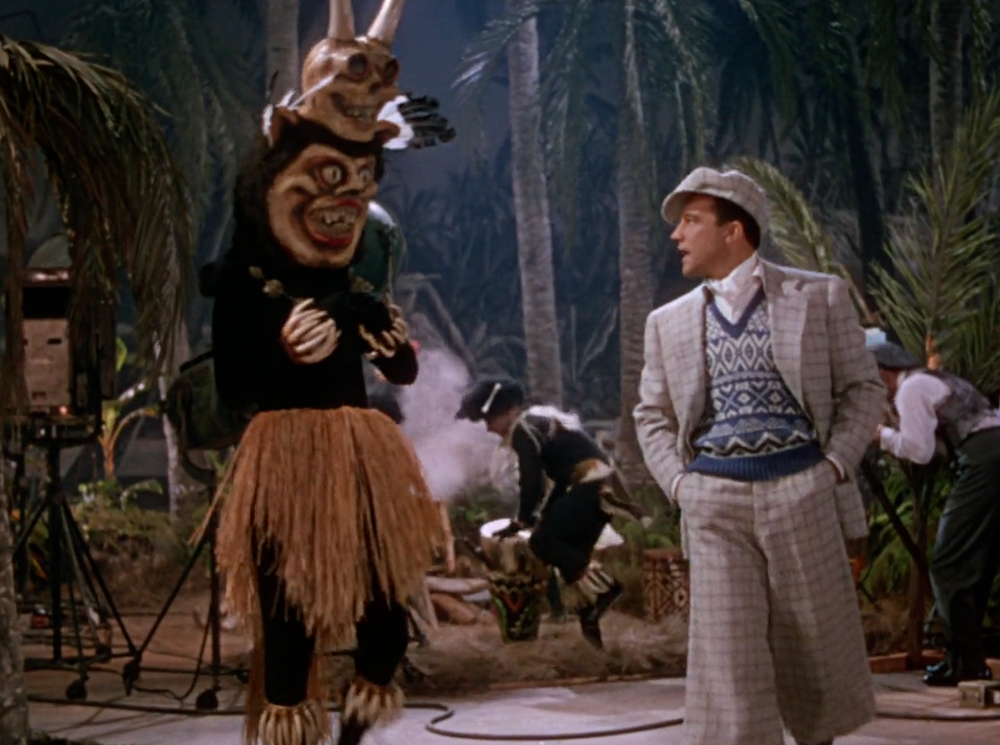

+++
title = "Singin' In the Rain"
date = 2024-01-01T08:00:00-07:00
draft = false
categories = ["media", "humor"]
tags = ["pie in the face", "singin in the rain"]
+++



<!--more-->

This is the only time in my entire life I'll be able to post this sequence on January 1, and so I have to make the most of it:

Happy 2024, everyone! :D

Singin' In The Rain (1952) is a classic musical about... classic cinema's switch to movies with sound.

The plot's real simple:

> Handsome Leading Man, Funny Sidekick, and Ditzy Broad are unbelievably popular
silent movie stars, but in the transition to "sound" they realize that they _don't know how to make good
movies with sound_. There are a tonne of foley problems that take their dramatic romance and make it
ridiculous, and worse still: Ditzy Broad's got a real mousy New York accent and a terrible singing voice.
>
> Voice Coach: "I Can't... Stand Them."
>
> Ditzy: "I CAAAN STANNNEM"
>
> Desperate to save his career, Handsome Leading Man comes up with a plot: They'll substitute in the voice
> of Lady Love Interest, who sings beautifully.
>
> Everybody loves Ditzy Broad's new singing voice and the plan goes almost without a hitch: the only problem
> is that Ditzy Broad brings in lawyers and her agent, demanding that Lady Love Interest get no credit
> and stay on with the studio, as her personal voice, _forever_. The studio's hands are tied.
>
> Heroically, at the last minute, Handsome Leading Man, Funny Sidekick, and Studio Head arrange a
> "staging accident" that reveals that Ditzy Broad's singing voice is actually Lady Love Interest in front
> of a huge crowd, ruining the scheme.

It's a very simple plot, giving the musical a lot of space just to do big, impressive musical numbers.

> they made lavalier mics so much bigger in the 20s
>
> but that didn't stop Kids These Days from trying to hold them _like this_ and talk directly into them
>
> 

there's a scene where they relentlessly bully a speech therapist for no clear reason

"AAAYYYYYYYYYYYY!"

> every man who pitches an open relationship is imagining it will go like this, but actually it only happens 7% of the time
>
> 

I actually wasn't paying close attention to how we ended up in "entirely unrelated fashion show" but I'm here for it.

"anyone for tennis? this girl thinks that doubles tennis means when you play with two tennis balls at the same time, and nobody is willing to argue with her because her clothes were clearly stolen from a much larger woman"

also this is in the movie, I bet you think that my watching the movie would make me _more prepared to explain it_, but no

"What this studio needs is a little electronic creature you wear like a pocketwatch, and when you press a little button on there, it feeds the little guy, and sometimes, he poops - and if you don't feed it? Boom. Dead."

even for the casual racism of the 50's this is a lot, Singin' in the Rain, come on

can't be _this_ smug without a good dodge reflex

great moments in cinematic history

> Free comedy tip, slick: the pie gag's _only_ funny when the sap's got _dignity_. Like **that** guy.



this Gomez-and-Morticia-lookin' couple just exists in the background of Singin' in the Rain and now I want a separate cut of the movie that's just about these two and whatever their deal is

I forgot that this movie really, really pads the ol' runtime

pictured: vancouver on any day between september and may

