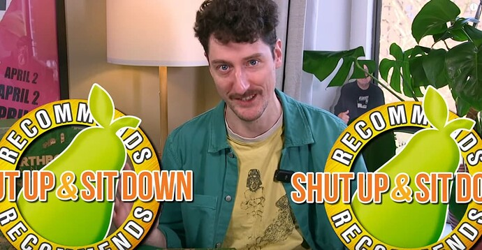
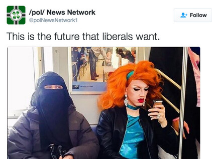
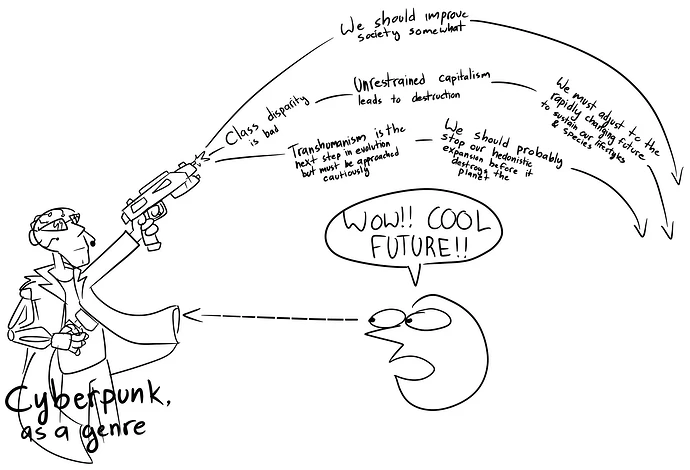
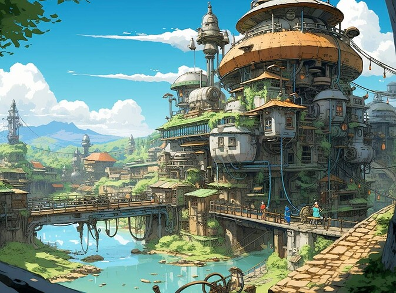
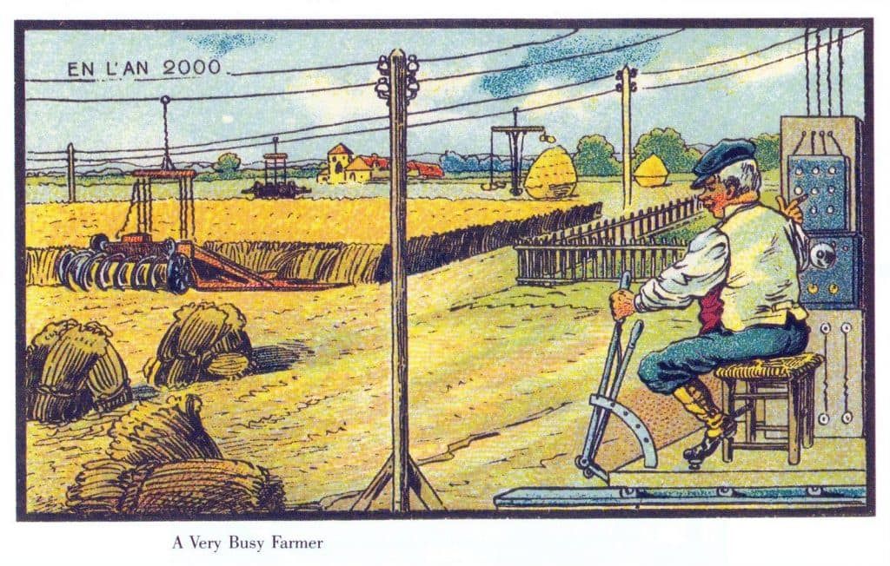

+++
title = "Solarpunk Might be More Cynical Than it Lets On"
date = 2024-03-15T08:00:00-07:00
draft = false
categories = ["media", "science fiction"]
tags = ["solarpunk", "yogurt", "quinns", "susd", "cyberpunk"]
+++

Solarpunk has been picking up in popularity in the past few years.

Like in this... weirdly gorgeous yogurt ad.



<!--more-->

------

I had mentioned it popping up in the last book I read, too: [Gods, Monsters and the Lucky Peach](/posts/2024/gods_monsters_and_the_lucky_peach).

Anyways, the last two Solarpunk Sightings have been fast-and-furious as Shut Up and Sit Down gave "Earthborne Rangers" their first ever _double recommendation_:

> 
>
> this may have just been a joke but Matt's real fired up here about this game



and Quinns's second-to-latest TTRPG review on his new [channel-for-just-reviewing-TTRPGs](https://www.youtube.com/@Quinns_Quest) featured **The Wildsea**, another game that easily fits into the Solarpunk genre.



-------

It's optimistic, I think?

Cyberpunk was always a look at the future that carried a lot of _political undertones_, most of them _pretty cynical_.

**The Cyberpunk Future** is one where unrestrained global capitalism has replaced _basically everything else_, which is to say, it's basically just _today_ except our transhumanists are _just trying to fix their gender_ and _everyone is mean to them_ and none of our implants actually work because _biomechanical engineering is way harder than anybody imagined_ and it turns out it's not profitable to maintain 20-year-old implants.

**Solarpunk** is a lot more optimistic, though: big swooping architecture full of plants and shit. It's _extremely_ pastoral, generally, or even focused on far-futures where there's actually _wilderness_ again.

People live in small, tight-knit communities, and trade _eggs_.

It's an optimistic view of the future... for the people who are there.

## Where Did All The People Go?

The trouble with everybody living on beautiful farms is that _we can't all do that, can we?_ One of the problems that Solarpunk just handwaves away, I think, is _where did all the people go_?

The sad, easy answer to this is "climate changed killed them all" but then it introduces a kind of _climate change accelerationism_ into the public consciousness: if "climate change kills most of the people" is a necessary step between you and the pretty post-apocalyptic solar utopia, why bother preventing it?

If that's the case, then Solarpunk isn't the optimistic future: it's the post-post-apocalypse: it's a hope spot in a future universe where most of the population has simply _died off_. That's **a lot more cynical than it lets on**.

## Malthus/Thanos Was Right?

Organic farming techniques make us feel good. Hopeful. Optimistic.

The problem with organic farming techniques is that they're expensive and low-yield, which means that they're not _really_ a solution for the world's food supply issues - they're really just a way for a handful of elites to feel better about their own part in the food system without actually being a meaningful solution to much of

 this is also at least somewhat true for my CSA membership: personally meaningful, but not a scalable, systemic solution to food supply.


There's an element of reactionary traditionalism to it, too - it's not a _high tech reimagining of farming_, it's _going back to the old ways_. Organic farmers are often _highly resistant to agri-tech innovation_.

So how do you make organic farming work? Well, it only works if there are a lot less people.

How do you **make there be** a lot less people? Which people get to stay in the rich-people-fantasy-where-everybody-owns-a-lot-of-land-and-the-poors-have-vanished?

I remember Sarah Taber, (currently running for Commissioner of Agriculture in North Carolina) pointing out in a long Twitter thread that ecofascism takes root _very quickly_ in organic farming communities.

It's easy to forget where the _soil_ part of "blood and soil" comes from, but reactionary politics, ecological extremism, and _pining for a more pastoral time in our history_ all fit together real nice.

If you want to forge a path to the Solarpunk future, a **lot** of people have to disappear.

I don't think this is an explicit or even implicit part of _any_ Solarpunk media, mind you: instead, I'm warning
that the kind of pastoral pining that informs the solarpunk aesthetic can also go in a _really bad direction_.
Some people may want to *force* a _beautiful solarpunk future_ and we _can not let them do this_.

## No Genocide, They're Just Over There

The "no genocide, only displacement" way that a lot of these stories (including Gods, Monsters and the Lucky Peach and Earthborne Rangers) solve this is with the _less horrifying_ solution of simply cramming most people underground (I mean, I guess that's also how the "genocide" solution works, if you think about it).

But then... maybe let's look at that part of the universe in more detail?

Gods, Monsters, and the Lucky Peach, we need to spend some more time in the Singapore Hell: the name doesn't make it sound so great.

If aboveground is so nice, what's belowground like?

If you handwave the "where did all of the _people_ go" away from Solarpunk, it's a beautiful vision of a future where we're more connected to nature than we are now. That's nice. But y'know what? I think my vision of a more utopian future still has _people_ in it.

Plus: I grew up in the all-concrete world of the 80's, so I'm allergic to something like 100% of the beautiful solarpunk future.

Let's peel away that pretty and see how we got there, and see what those _hells_ look like.

## Let's Not Forget, Farming Actually Sucks

A lot of pastoral pining comes from people who don't actually have any direct experience of food

I mean, I don't, either, but I also don't romanticize it.


I suspect a few weeks on an actual farm would have most folks missing the grim cyberpunk dystopia they
_currently live in_.

## Magic Future Levitation Is Cool Though

Half of the things in the Chobani commercial levitate, many times just for the aesthetic.

There's a weirdly common and honestly pretty awesome fantasy trope of “these glowing lamps cause frictionless levitation / flight”,
and I can't say I hate it.

This is levitated but also presumably extra engineering has gone into locking it in place so that you can’t accidentally bump the kettle and have a boiling hot metal curling stone glide through your kitchen, a problem that could also have been solved by simply not levitating the kettle.

But if Magic Future Levitation costs less energy than would be lost to friction, I guess it would be worth it, and it would make the cobblestones that are all over the place a lot less dangerous.
