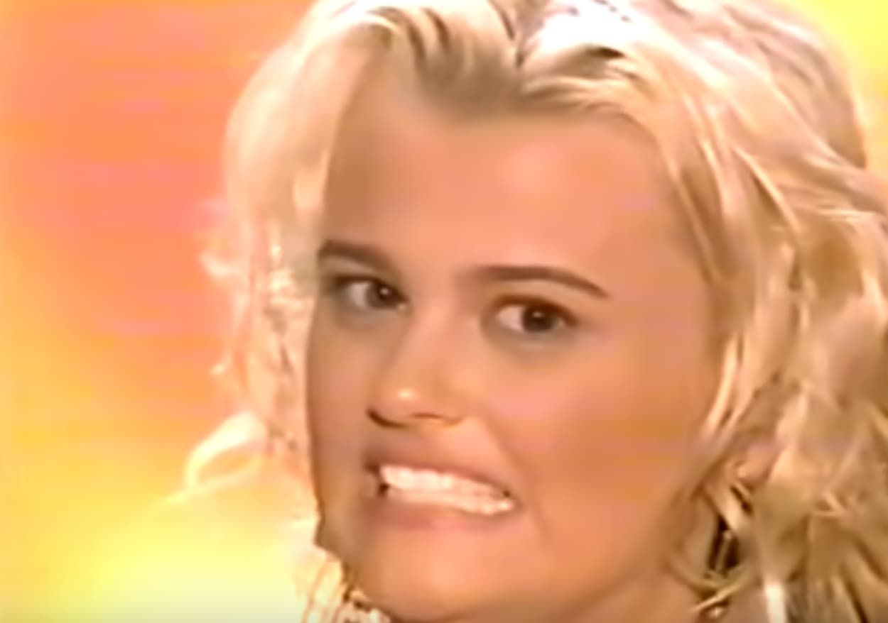
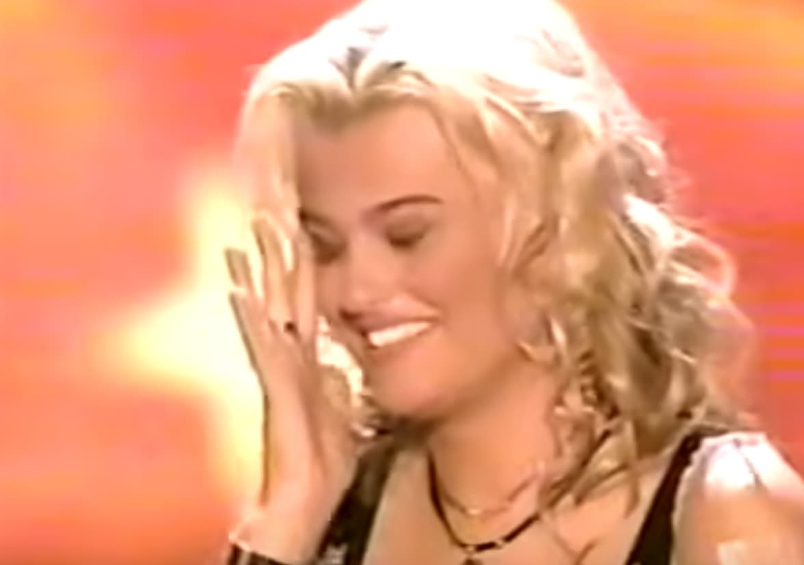
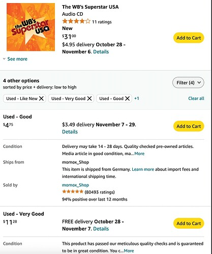

+++
title = "the 20 year anniversary of WB's Superstar USA"
date = 2024-10-15T12:00:00-07:00
draft = false
categories = ["media"]
tags = ["cruel pranks"]
+++

So, every now and then I rewatch Jenny Nicholson talking about [the worst reality TV show of all time](https://www.youtube.com/watch?v=JKFgn6tNU6w), because it's funny, and because I have a cold.

Anyways, the comments for that video are now filled with people pushing their own, alternate takes for worst reality TV show of all time, and, uh, okay.

**WB's Superstar USA**.

[The whole show is available in its entirety on YouTube](https://www.youtube.com/watch?v=sc3d-dB5vNg&list=PLyYhOnXik8uuHdjFyBAAdOUTEw-lyRPt7):

Whereas our legendary Opposite Worlds was merely dangerously incompetent, WB'S Superstar USA is _actively malicious_, a season long elaborate prank.

The conceit is: It's American Idol, but the judges are simply instructed to reverse their judgement. The worse the singer, the better.

This is essentially a show intended to try to chase the virality of the William Hung "She Bangs" clip, on purpose



anyways, even at the time it was _unpopular_. Like, it's a funny _idea_ in the writer's room but the execution is just so staggeringly, unyieldingly cruel.

America _hated_ WB's Superstar USA, because very few people actually want to be _this_ mean.

Watching these awful singers go to _all of these effort_ - learning choreography, practicing, putting their whole ass into a competition where they were judged based on how unlistenably bad the final result was? This was terrible. This was a terrible thing to do.

Even the show kinda soft-pedaled the reveal, explaining to the winner that they were looking for someone with _all of the qualities of a star_ **except** for the voice. Which was still very bad and embarassing for everyone.

-----
anyways, this does offer up the opportunity to put one of the world's least appealing CDs into someone's Toyota when they're not looking

-----

Have you ever heard of Florence Foster Jenkins?

> [Killing Me Sharply With Her Song: The Improbable Story Of Florence Foster Jenkins](https://www.npr.org/sections/deceptivecadence/2016/08/10/488724807/killing-me-sharply-with-her-song-the-improbable-story-of-florence-foster-jenkins)
>
> A Manhattan socialite, who sold out Carnegie Hall in 1944 despite having a very dodgy voice, inspired a new movie starring Meryl Streep — and aided generations of actual singers.

-----

This is a good opportunity to bring up Contrapoints, because I’ve very rarely seen people try to delve into why this kind of thing _works_.

