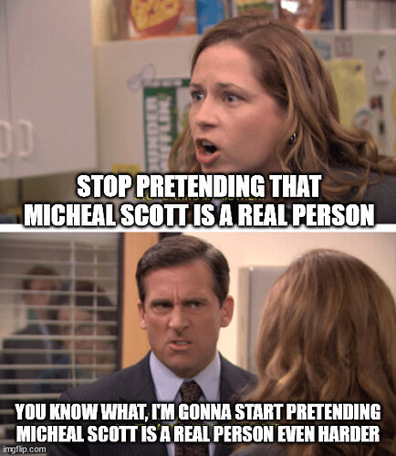
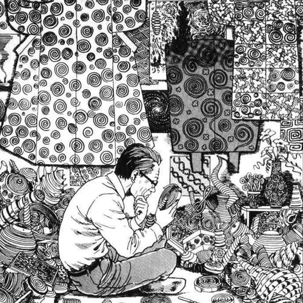
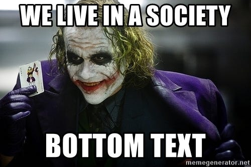

+++
title = "a taxonomy ruined my ability to think like an adult"
date = 2024-11-15T12:00:00-07:00
draft = false
categories = []
tags = ["taxonomy", "and jeff"]
+++

I mention this now because I saw it come up on the internet a _second time_ and it frustrates me that this thing exists:

So, at one point in my life, a friend of mine shared with me this document, which she believed in as an adequate explainer of modern office life, based... well, quite a lot on the TV show "The Office" - and accused me of being a quite successful and subtle Sociopath.

<!--more-->

https://www.ribbonfarm.com/2009/10/07/the-gervais-principle-or-the-office-according-to-the-office/

I ... don't necessarily recommend reading it.

I read it, thought about it deeply, and after a long brew I told this friend that I was sort of disgusted by this theory.

It's a deeply cynical piece, convinced in its entirety that all collaborative work is a zero-sum game where idiots are taken advantage of by the clever, written by someone who... writes blog posts in total isolation, for a living.

It starts by taking broken adages like [The Peter Principle](https://en.wikipedia.org/wiki/Peter_principle) and [The Dilbert Principle](https://en.wikipedia.org/wiki/Dilbert_principle) seriously (ah yes, well known and [extremely clever](https://twitter.com/ScottAdamsSays/status/1750883071635927312) business guru Scott Adams given an opportunity to weigh in)- but then tries its best to explain Michael Scott as part of an elaborate conspiracy that Sociopaths have constructed to elevate incompetent managers as a manner of protecting themselves from the consequences of their actions.

It divides all office workers into **Sociopaths** (savvy manipulators like David Wallace), the **Clueless** (patsies designed to throw themselves on grenades, like Micheal Scott), and **Losers** (just in it for a paycheck, like Creed).

And oh boy, not only does it treat Micheal Scott as a _real person who you will definitely encounter often in an office environment_, it actually decides to make the assertion that most companies are _mostly_ Micheal Scotts.

I don't want to go into a deeper analysis of the piece, it just feels like a lot of effort to dunk on a 15-year-old blog post, and it's late, but I did have a few thoughts:

There are actually _eighteen_ types of people:

* Unnecessary Taxonomists
* Normies
* Football Players
* Fartmunchers
* Greeks
* Alphas
* Chads
* Staceys
* The Very Tall
* Onionboys
* Metallurgists
* Cupbearers
* Dave Coulier
* Poker Players
* Lovers
* Fighters
* Romance Novel Authors
* Legendary Chinese Chefs
* the Famous
* Phishers
* ENFP
* INTJ
* Virgoes
* Jokers
* Smokers
* Midnight Tokers
* Evangelicals
* Protagonists
* Thinkers
* Doers
* and Jeff. (that was 18, right?)

The first type of people, **Taxonomists**, like to create big Systems of Analogies and divide people into Important Categories with Serious Explanatory Power. This exploits the brain's natural [apophenia](https://en.wikipedia.org/wiki/Apophenia) - it is easier to live in a world where everything fits into easily understood categories, and so Taxonomists fill the need for categories by inventing and systematizing them.

You can tell a Taxonomist when they decide on their categorizations up-front, and then, to support their freshly constructed analogy, start making huge assertions about human tendencies and pulling in whatever theory-du-jour they most recently heard about on Random Essay Youtube in order to support their 
 Maybe they will just toss in a Wikipedia link to "apophenia" like a fuckin' tool.


There's nothing that a Taxonomist likes more than to open an essay by telling you about the X kinds of Y. Let's learn about [a specific archetype](https://randsinrepose.com/archives/how-to-lose-your-job-part-1/) today - I've given it a name. Let's make a list. _I see patterns everywhere._

> 
> kinda like this but it's not trying to murder you

Taxonomists have been irreversibly poisoned by type systems and can't stop classifying.

The thing is, this is a fun mental exercise! Taxonomists can create _any model they want_ and use it as a lens to analyze _any thing they want_ and it's always valid! All stories are either Comedies or Tragedies! All stories adhere to points of Joseph Campbell's Monomyth! There are 4 kinds of ice cream recipe! **All food is either a taco, a sandwich, a dumpling, a burrito, a soup, or a salad!**

<small> for people who need to produce a lot of content, it's important to note that this technique can produce an enormous amount of words with very little effort or research, which is key for the lazy writer</small>

The trouble is when the Taxonomists start ascribing real power to these models and archetypes that they've freshly created in their own mind. Having systematized their archetypes, now it's time to use them to explain more and more of the real world, and how You might use it to become Successful!

But wait: these models don't have real predictive power, and rarely have real... practical value. Sure, they can allow you to confidently assert that, under certain conditions, **a hot dog is a taco**, but... :ok: :sure_haha: sure whatever.

Taxonomists often write blogs or business books. They're way, way more likely than average to start a sweeping statement with "humans", meaning "all people ever". "Humans need to feel emotionally safe", they might say, on the way to laying out their theory for why Baskin Robbins' overwhelming number of flavors is, actually oppressive and evil because it fits into their sixth category of information density.

That's about all I have to say about Taxonomists.

Okay, on to the other seventeen types of people in my hasty taxonomy, starting with **Normies**: they're... also a kind of people.

_(the rest of this essay has been removed for your sake and mine)_

-----

> I’ll conclude with one thought: Gervais deserves Nobel prizes in both literature and economics.

oh that didn't age so well