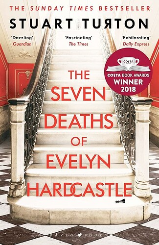
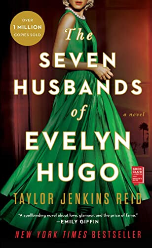
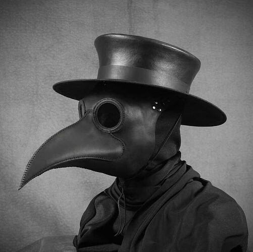

+++
title = "The 7½ Deaths of Evelyn Hardcastle"
date = 2024-08-15T12:00:00-07:00
draft = false
categories = ["books", "science fiction", "mystery"]
tags = ["super-hitler from the future", "seven and a half of a thing specifically", "stuart turton"]
+++



<!--more-->

This is slightly more deaths than the British edition:

A number of deaths is provocative, but a **fractional** number of deaths is unusual. That’s the kind of curious question that sells novels.

Disappointing, then, to learn that the extra 50% of a death was merely included in the North American market to help differentiate the novel from:

(at the time, the end of 2017/beginning of 2018, I recall posting a picture of the two books side-by side, along with a copy of "The Seven Habits of Highly Effective People" and a logo for 7-11, because I am very funny and smart)

So, the extra half-death is not plot critical enough that it even necessitates inclusion in the title, and now, having read the book, I feel like I'd be hard-pressed to even determine which death, exactly, that _was_.

## So What's it About?

_time loop victorian murder mystery_

## Be More Specific.

Okay, so, I went into this one essentially blind, on account of having downloaded it years ago and just now finally getting to it.
Like with other properties, I may have _known_ the _fun twist_ at the time that I added it to my collection, but by the time I actually got around to interacting with it I had _completely forgotten the high concept premise_.

So, when I started reading the book, I was presented with amnesiac Sebastian Bell waking up in the woods outside of Blackheath Manor, his only memory the name "Anna" with the strong feeling that a murder has been committed. Sebastian is something of a coward, so this first day of the book is largely occupied by Sebastian's efforts to run away from everything even remotely connected to the mystery.

What mystery? Well, we're not entirely certain yet. Maybe it has to do with an Anna, who was murdered? I'm pretty sure it has to do with an Evelyn Hardcastle, but Sebastian hasn't read the cover of the book yet, so he doesn't know about that. Blackheath is a crumbling manor belonging to the old-money-but-running-out-of-money Hardcastle family, holding a grand gala for their family friends to celebrate _some kind of announcement_.

He does briefly befriend Evelyn Hardcastle, who is kind to him in his confused, bumbling state. There's some kind of implacable foe here, "the footman". The name sends chills down Sebastian's spine, but _everything_ sends chills down Sebastian's spine and it will be several more chapters before we learn more of an outline of who or what "the footman" is.

This isn't spoiler territory quite yet: the concept of the novel is the sort of the thing one can easily discover from a cover blurb, but when he wakes up, he's... a different person entirely, now he's the butler and it's the same day as it was before, as he watches Sebastian bonk around running away from everything happening in the story. The only problem is that he distinctly remembers, as Sebastian, hearing that the butler had been beaten to a pulp by a madman and spent most of his day convalescing under sedation, with only a few bones left unbroken.

Which, too, comes to pass, and our main character now wakes up in Donald Davies, who spends most of his day trying and failing to escape Blackheath. This is the iteration where we learn the Rules from a Plague Doctor who has been following the spirit around:

* He's a spirit who is going to get to live through the same day, 8 different times, in order to solve the mystery.
* What mystery? At the end of the day, at 11pm, Evelyn Hardcastle will be murdered, by _someone_, and it's his job to find out _whodunit_.

Having wasted most of his time as Sebastian, Davies, and the Butler, that leaves only 5 more hosts to actually get anything _done_.

Being as _obviously_ he's only going to solve it on the last day (what story like this is ever like "I cracked it" on the fifth of eight iterations and then just blank pages for the rest of the book), Evelyn Hardcastle is going to have to die 7... and I guess ½ times, before the story is over.

## A Plague Doctor?

> 
>
> yup

## Middle Of The Book Spoilers Begin

One of the things that is made abundantly clear in his next iteration (4/8), as **Cecil Ravencourt**, is that the hosts _matter, quite a bit_.

Cecil is brilliant, ruthless, and so morbidly obese that he requires assistance to stand up, rendering him essentially restricted to a small patch of the ground floor of Blackheath for his portion of the story. Our spirit (who we will eventually discover is named "Aiden") discovers that having access to Cecil's significant mental prowess (and his personal valet) allows him to really make some _concrete forward progress_ on the mystery, up to and including finally managing to get his first actual viewing of the murder itself: Michael Hardcastle announces at this grand gala that Evelyn's hand in marriage has been promised to the wealthy, ruthless Cecil Ravencourt. (whoops!) Evelyn takes this opportunity to dash out to the lake and, with a large crowd of onlookers, _dramatically commit suicide with a small silver pistol_.

> ### Sidebar: The Nap Jump System
>
> While napping, (Cecil takes a lot of naps), he wakes up back in the broken body of the Butler. Apparently, _during naps_, Aiden can briefly travel backwards into previous iterations who were themselves asleep, and he wakes up as the badly injured Butler at a different time of day, then collapses from the pain back into Cecil, who wakes up. This "power" is going to turn out to be pretty useful because both the Butler and Donald Davies spent a good portion of their respective days a-snoozin', giving us access to some utility from their otherwise wasted days.
>
> The rules of Aiden using naps to jump backwards into previous hosts who are sleeping are **easily** one of the most complicated and irritating parts of this whole thing, and I had to puzzle on the rules of it a bit: each new day is a concrete fresh instance of the loop, so Aiden is actually jumping to a different part of the _same day_ that he's currently in, rather than jumping to the previous host's iteration of the loop. There are rules for when he can jump into the Butler and when he can jump into Donald Davies, (they have to be in parallel times in the story when both of them are asleep, I think?) but that leaves the open (and unanswered) question of "what happens if Aiden has a nap during a time while there are no available hosts"? Also, I could _swear_ that I remember a time in the story when Aiden nap-jumped to a different time in the day, but I _must_ have that wrong because it wouldn't be right.
>
> If this story could have been done without the confusing and often hard-to-follow nap-jump system, I think it would have been all the better for it.

Cecil's forward progress establishes a lot of the most key details of the scenario: who's who in the manor, and the basics of the Hardcastle family (father: Peter, mother: Helena, deceased brother: Thomas, alive brother: Micheal, and, of course, Evelyn) - details of the horrific murder of Thomas Hardcastle 20 years prior. He has an appointment with Helena Hardcastle, who doesn't show, and generally does a pretty competent job of setting up the rest of the story and the mystery at hand.

Our next host is **Jonathan Derby** (5/8), angry drunk and (later revealed) serial rapist. This is a much harder journey through the story because Derby is difficult to pilot and can't think so good. Derby's journey is much less helpful, and mostly serves to outline some of the other players in this mess:

* There are two other spirits in this game with him, one of whom is **Anna**. The first of the three of them to solve the mystery will be freed from the loop: the other two will remain forever.
* He meets **Daniel Coleridge**, his _final host_, who seems to know quite a bit more than him about what's going on, and who tries to set up a meeting with Anna to capture The Footman.
* He meets **Ted Stanwin**, serial blackmailer.
* He gets hit in the head by a vase and goes down for the count (the number of vase-smash head-injury knockouts in this book is "multiple"), waking up as the Butler again, this time discovering that the Butler's wounds are being tended to by **Anna**, a different player in the game, who reveals that she and Aiden are colluding to try and escape the game _together_: any time he needs to chat with Anna he need only take a quick nap as _any_ of his hosts and he can jump back to the Butler, so they can co-ordinate.
* Anna also reveals to him that **Gregory Gold**, the seemingly insane artist who battered the Butler, is _also_ one of his hosts.
* He gives the silver pistol to **Evelyn** that she uses to commit suicide. She asks him for it, revealing that if she _doesn't do it_, she's been blackmailed and someone else will suffer terribly!
    * Ted Stanwin, serial blackmailer, is a pretty solid candidate for "most obvious to cause Evelyn to commit suicide via blackmail". (_of course it wasn't Ted_)
* He meets **The Footman**, a terrifying serial killer who is hunting him and all of his other iterations. Derby is a fighter, though - he's not going to be cowed by some serial kill- oop, Derby got murdered immediately. Well, that ends this iteration.

Also: touch of concern: **Aiden** (the spirit that is the main character) is slowly disappearing into the various hosts, losing himself and just letting them _drive_. In a few thousand more iterations he might just be erased entirely.

## Gonna Stop Here With The Full Plot Synopsis

Practically, any point past here is going to be _so heavy with spoilers_ that it legitimately would threaten your good time reading the book.

## Thoughts?

I read a review online that gave the whole book poor marks for it's lack of character arcs, but, like, that's not what this story is about. Few people are out there reading intricate mysteries and going "i hope Sherlock learns how to _love_" - no, they're about _unwinding a puzzle_, and boy does this puzzle feel relatively satisfying to unwind.

There is a pernicious anti-trope in mystery fiction, where the main character sees something, goes "I solved it!", and rushes off without telling you what it was that they saw or what they solved.

> 
>
> pengwings

This book **mostly** manages to avoid that, although unfortunately Gregory Gold, the final host, is just sitting on the biggest and juiciest clue and if the author were to reveal it _fully_ it would reveal the big ending twist a little _too_ thoroughly - so instead he wildly downplays this huge detail as if it were a small, inconsequential thing, even though it would be as plainly obvious to Gregory Gold as the nose on his face.

So, the resolution of the main mystery is satisfying, but I had a fridge moment later where I was like... "wait a minute, that plot was a lot more fragile, and a lot less clever than the book made it seem..."

But then I thought about it some more and I was still pretty satisfied with the conclusion, with the single caveat that it introduces a mild plot hole, IMO.

I would regard both the mystery and the high-concept wrapper for the mystery, both **solid and satisfying**, A, would mystery again.

## Quibbles

There are some side-mysteries in this story that are also brought in, not part of the main mystery, but questions raised by the conceit:

* Who was responsible for the time loop?
* Why is the loop Victorian?
* Who are the other people in the time loop? When the loop ends, what happens to them? Does any of this matter to them, at all?
* Who are **Aiden**, **Daniel**,  **Anna**, and the **Footman**, the ghosts loopin' the loop?
* How did they get in the loop in the first place?
* Do they escape? If they do, what happens to them after they escape?

While these questions mostly get answered (no loose threads! nice!), some of them are **really** hand-wavey and dumb.

Most of those _are, in fact, answered_.  They're not _satisfying_ answers, but they're _answers_.

So: the high-concept mostly ends up getting waved away as "idk, they're in a time loop because time loops are cool, don't think too hard about it".

## Overall?

I'd mostly recommend this, especially if you are prone to enjoy things like time loops, mystery novels, and particularly if you feel like you would enjoy a time looping mystery novel or you thought [The Sexy Brutale](https://en.wikipedia.org/wiki/The_Sexy_Brutale) sounded interesting but exhausting.

-----
-----
-----

## All of the Spoiliest Spoilers, Seriously, Don't Read Past This Point if You Intend To Read The Book

### Gregory Gold, the final host, is just sitting on the biggest and juiciest clue:

Gregory Gold has been hired by a mysterious benefactor to replace a little brunette girl with a little blonde one in all of the family paintings.

The Evelyn Hardcastle who is murdered is a blonde.

The twist is that the _real_ Evelyn Hardcastle, a brunette, paid Gregory to do this, and has arranged for a fake Evelyn to pretend to be her. The murder plot is _hers_: she arranges to kill the fake Evelyn in order to get out of her family obligations and live free.

### Actually, In Retrospect, What??

Her parents didn't notice that all of their family paintings/daughter had been replaced because, I guess, _who just looks at the paintings in their own house_?
Who _speaks to their daughter regularly?_ Not the Hardcastles, apparently.

But that's only a small plot quibble, there's sufficient justification for it in the text of the book, I think.

Also: Apparently Aidan has _been stuck in a loop attempting to solve this puzzle several thousand times_ and never got all the way to the bottom of it, which is
surprising, considering how obvious Gregory Gold's clue is, here.

### Who was responsible for the time loop?

* Advanced future civilization? Literally no further explanation.

### Why is the loop Victorian?
* it’s an unsolved case from centuries ago that the advanced future technology can just drop people right into somehow.

### Who are the other people in the time loop? When the loop ends, what happens to them? Does any of this matter to them, at all?
* everyone in the story who isn't a ghost is a simulated NPC, they cease to exist, and no.

### Who are Aiden, Daniel, Anna, and the Footman, the ghosts loopin’ the loop?
* Anna and Daniel are super-max mega-criminals in the future, with thousands of kills to their name, (Anna is characterized as, like, "future-civilization mega-Hitler") which is why they’re getting stuck in the future’s most advanced form of punishment: victorian murder puzzles.
* Aiden lost his wife to Anna's regime and volunteered to get tossed into victorian super-puzzle-hell to try and torture her _extra_.
* the Footman is just a super fuckin’ creepy NPC that Daniel hired, he wasn't a ghost at all.

### Do they escape? If they do, what happens to them after they escape?
* Yes, Anna and Daniel, manage to rescue one another from murder-puzzle hell, although in doing so they both lose a lot of "who they were before they entered murder-puzzle-hell". Both decide to leave their horrible pre-murder-puzzle-hell memories and personalities behind and forge new identities, but on account of Anna's history as _future civilization mega-Hitler_, Anna is probably going to be hunted until the end of her days. Whoops.

### Wait, that's all nonsense!

Yeah. Yeah, I think that the author just wanted to put together a time loop mystery and struggled, at the end, to answer the meaty questions of "but what the fuck actually happened, there"?

I think a more confident author might have just Groundhog Day'd it and explained _nothing_.