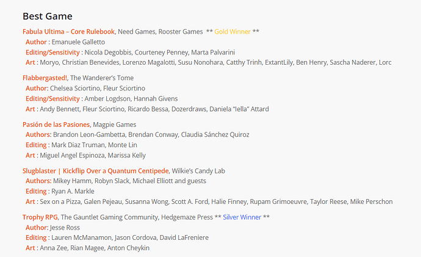
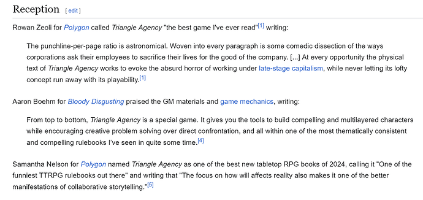
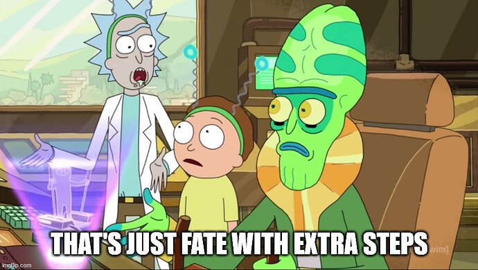
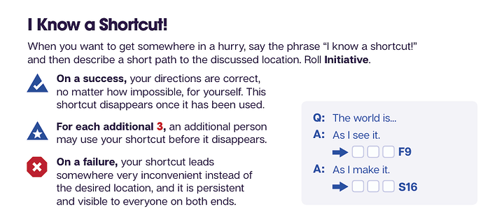

+++
title = "Triangle Agency"
date = 2024-12-15T12:00:00-07:00
draft = false
categories = ["rpg"]
tags = []
+++



<!--more-->

This game keeps gaslighting me. I thought Quinns talked about it on Quinns' Quest, but actually I was thinking about Slugblaster.



_(editor's note: I hear he might have a Triangle Agency review in the works, which I'd be excited to see.)_

Then, I thought it was in the running for a 2023 Ennie, but no, that was Slugblaster again.

which, uh, maybe I should be looking more closely at [Slugblaster](https://slugblaster.com/).

No, the only accolades that Triangle Agency accumulated were that Polygon really, really likes it:

and it's not clear that any of them actually played Triangle Agency or just _read it_.



## Plumbing

I don't love FATE. Some of the reasons I don't love FATE are spelled out in
[DMing Alt/Indie RPGs](/posts/2023/alt_indie_rpgs).

I don't love Powered By The Apocalypse. I don't love Blades in the Dark. I don't love Brindlewood Bay. I've tried these _very narrative driven systems_ and they're all missing, like, y'know... a game, at their center. There's just a little bit too much GM fiat involved in resolving the outcome of any given scenario: it really is about _telling a good story_ rather than _tactics and crunch_, and I like **a little bit of both things**!

And Triangle Agency's system is... well, it's got a lot in common with FATE's.

But dang, there's some stuff in here that's really compelling.

Let's talk about some of the weird shit in Triangle Agency...

## Causality Chain

Blades in the Dark has a brilliant "flashback" mechanic where you can spend Stress to retroactively change events in the past to, for example, make sure you have remembered to bring a critical item on your heist. It's a _great_ mechanic, but players often forget it exists or have to _really_ bend their brains to think about how they can use flashbacks to accomplish their current goals.

Triangle Agency decides to take this idea and really, really *abuse the absolute hell out of it*.

Triangle Agents _do not have skills_. Anything that you would roll a skill for in an RPG? A Triangle Agent would automatically fail that check: they're not fast, smart, good shots, or anything. All of their skills are just corporate buzzwords, like "Dynamism", or "Subtlety" or "Empathy",

In order to accomplish basically _anything_, then, Triangle Agents either have to engage with the Triangular Bureaucracy or their Anomalous Superpowers.

What players do to solve problems is: they're allowed to roll to establish just about any detail that has not yet been established, so long as they can describe any even-remotely-plausible causality chain that would cause that detail to exist. The rolls succeed about ~83% of the time.

So, uh, a Triangle Agent that can see you is extremely dangerous, because they can hit you with a bus. "A nearby bus driver falls asleep at the wheel of his bus, powering through traffic and smashing in to the scene from stage left, pointed directly at you." is a thing they could roll for, succeeding ~83% of the time.

That bus thing? That is a very direct, **Dynamic** way of solving that problem, so the roll is a **Dynamism** roll - so players who have **Quality Assurance** points in **Dynamism** can _spend them_ to fix even a failed roll.

(As a side note: one thing I know about my players is that they are _easily frustrated_ by oblique skill systems like this, so that presents something of a problem.)

But, uh, any change you make to the causality is permanent and irrevocable, so if you start solving all of your problems with snoozing bus drivers, it is the GM's responsibility to start having scientists and authorities poking around and investigating why there have been so many unexplained examples of Severe Bus Driver Narcolepsy lately. This creates **Loose Ends**, which are a problem.

If the bus driver _survives_ the invariable bus crash, and they see whatever it was you were trying to drive the bus _in to_ (something crazy, probably), they become a **Loose End**, creating _'mo problems_. And failed rolls _still create the entire causality chain_, but key details are fudged, so there's a 17% chance that the bus spawns in the scene pointed at _you, the player_.

It gets worse still! Every roll of the dice generates **Chaos**!  The DM isn't allowed to directly fuck with players (dang) but **Chaos** is the currency that they get to use to operate on behalf of the players' adversaries.

On top of that, the Agency itself _despises funny business_, as well as **Loose Ends** and **Chaos**. The Agency is trying its hardest to keep the game (and reality itself) sane and rational, so if the players start solving every problem with shenanigans, it's their General Manager (GM's) job to hand out **Demerits**, give them a **Low Operational Grade**, and, worst of all, deny them access to the **Frozen Yogurt Room**.

## Anomalous Powers

Players also have anomalous powers that are functionally just _straight-up superhero shit_. Using these powers is _strongly discouraged_ by Triangle Agency, they would prefer that you stick to simple careful, thoughtful detective work augmented with minimal causality modification to solve your problems.

## Hit Points
Each player has 1HP.
1 HP is described, in the game, as "about enough damage to kill one (1) person."

Being cut in half would probably deal about 2 HP of damage?

Players can ignore damage (for a cost) but onlookers watching them _not die_ become (you guessed it) **Loose Ends** - the more damage that was dealt, the less plausible it is that the player survived, after all - and should players choose not to pay to ignore the damage - well, resurrection is cheap. It might be more practical to conserve your resources, die, and wake up at headquarters to take a new crack at things in a bit.

## Half Of The Game Is Missing* (At First)
The game, as described, is both _quite easy_ and _not terribly complicated_.

In fact, a lot of the game is, initially, _hidden from the players_. There are a lot more **rules** and **details** packed away in the game's back half.

The only up-front detail players get about this is that - well, it's pretty strongly hinted that the Triangle Agency _may_ not have the players' best interests in mind all of the time, and _in fact_ resolving all of their problems with causality manipulation while avoiding using their powers outside of work (can't get those Demerits) may not always be the right move.

On top of that, the GM (Game Master / General Manager) is a representative of the Agency, so if player performance starts to visibly suffer - well, let's just say that the Agency takes job performance _very seriously_.

In fact, I think this was also something that Quinns gushed about when he was talking about Slugblaster: a fun, dumb open-ended narrative-focused RPG that gets more crunchy and serious _as you play it_ and new rules and restrictions start to pour in from the back half of the manual, which you _aren't even allowed to read yet_ when you've started the game.

I'm, uh, not always a fan of legacy mechanics in board games - I don't really _want_ a board game to evolve over time, because I'm not usually committed to playing it often enough to even _see_ that evolution. I want a board game to be in its perfect form on its first or second play, because I _don't_ play them in a campaign format, generally.

On the other hand, constantly evolving TTRPGs... that's... that's a lot more compelling.

## Conclusion

I want to run this at some point, and also, I should get around to reading Slugblaster, I hear it's really good.