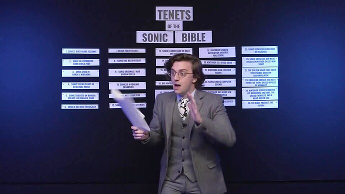
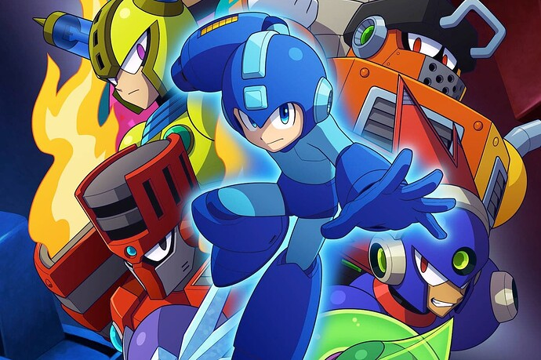
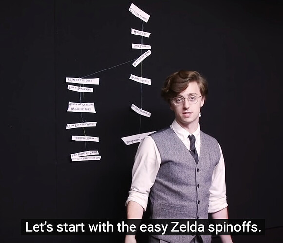
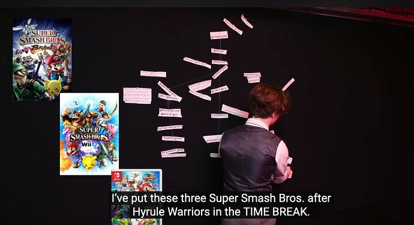
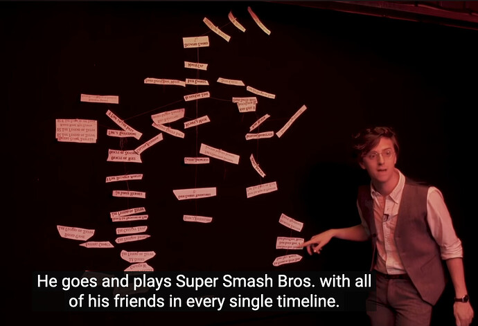
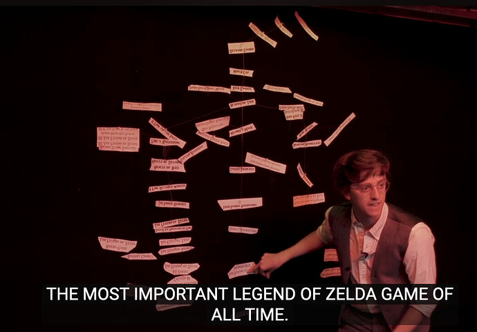
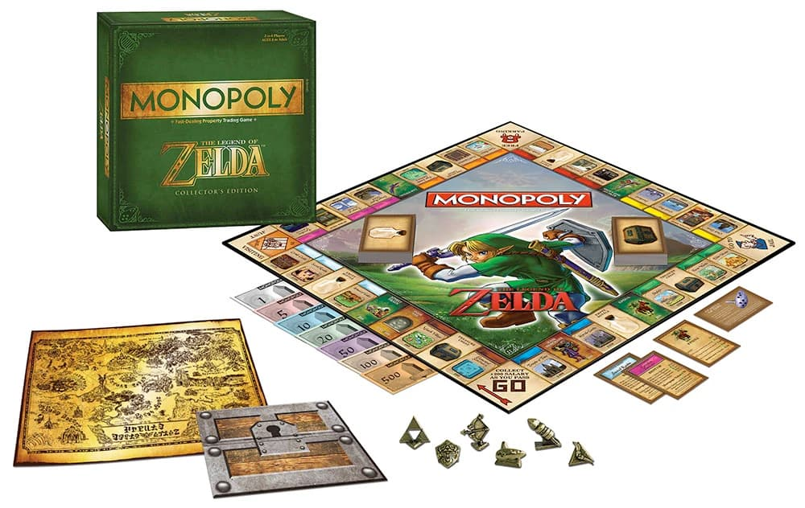
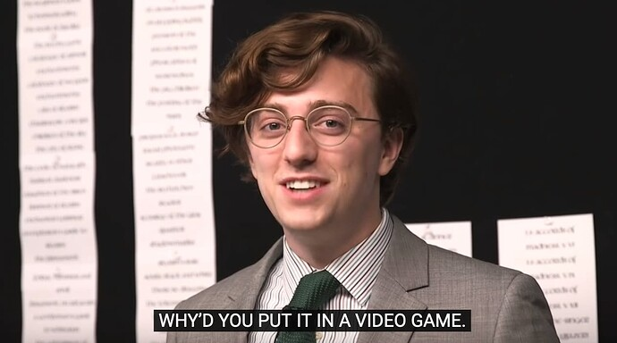
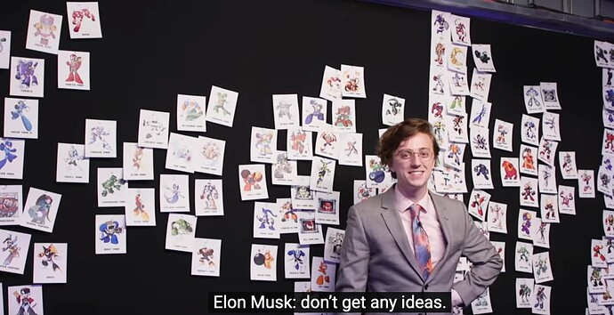
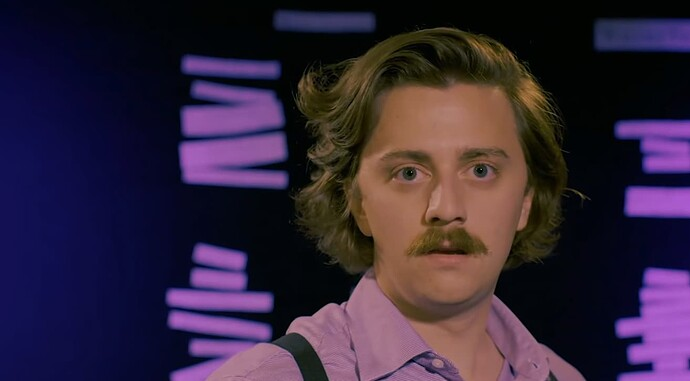

+++
title = 'The Best Episode of Unraveled, As Determined By Science'
date = 2024-01-17T12:00:00-07:00
draft = false
categories = ["humor"]
tags = ["bdg"]
+++



_I watched all 29 episodes of Unraveled so that I can tell you, scientifically, which episode of Unraveled is the best episode of Unraveled._

<!--more-->

Now, the ideal way to deliver this content would be while wearing a fashionable suit, in front of a large pinboard of some kind, but this won't work for me. Unfortunately, both my body and camera equipment are terrible, and I do not own a fashionable suit.

Unraveled, if you are not already familiar with it, is a [now-defunct Polygon series, on YouTube](https://www.youtube.com/watch?v=Q-25c8Rsobw&list=PLaDrN74SfdT7Ueqtwn_bXo1MuSWT0ji2w&index=1), where, along with his helpful team, video producer Brian David Gilbert tackles a difficult, obscure video-game-adjacent topic, like "reading every single Halo novel and telling you about them" or "actively losing his mind over obscure details in the Sonic lore".

There are 29 episodes of Unraveled, produced between the first episode on September 2018 and the last, two years later, on December 2020, at an approximate pace of one episode per month. I also have approximately one episode per month, although with therapy I might be able to get that number slightly down.

The first step in taking these 29 episodes and determining which one most closely fits the platonic ideal of an episode of Unraveled is creating a rubric which we can use to evaluate each episode.

We can start by identifying what really makes an episode of Unraveled so good:

## Authoritativeness
In order for the humor to land properly, it's important that whatever incredibly obscure topic the piece is covering is treated with the utmost gravitas. You don't just want to know which Pokemon is the most edible - you want that information from a source that seems authoritative. You want the _final word_ on Pokemon edibility.

Otherwise the topic could come off as frivolous, and we don't want that.

## A Topic of Interest Connected to a Popular Game or Franchise

The episodes are, of course, self contained and humorous enough that you'd enjoy them whatever the topic, but the reason you clicked on the episode in the first place was very basic and animal. It promised you Mega Man lore. You like Mega Man. I can say with some fairly concrete certainty that you like Mega Man because he fights a colorful rotating cast of fancifully themed opponents, and has an arm that's also a gun - it goes "pew pew".

## Subtly Flawed Methodology

Now that the problem space has been introduced, the next step is to concoct a plan to attack that problem space - a rubric with which to evaluate the data.

Now, considering the difficulty and relative intractability of some of the projects taken on, it's likely that no truly satisfying methodology could exist. That must be pushed aside in favor of something that's possible for a human to do, and satisfying enough.

However, this is a comedy show, not a dry lecture series, so the methodology must be in-and-of-itself entertaining.

## Foreshadowing and Call-Back

One crucial element of humor is that it is always in conversation with itself. One classic standby of comedic writing is the callback joke. There's a set-up, and then the set-up is left hanging for a bit, ideally just long enough for you to forget it - only for it to be invoked again. Callback jokes can be re-invoked again and again, but they're at their best when they give you enough time between the set-up and pay-off that you're caught by surprise.

The subtly flawed methodology itself is a form of foreshadowing: if you can catch what the problem is with the rubric, you'll be able to see the thread that, when pulled, will tease apart the whole plan.

## Act 1: The Set-Up

Together, Respectability, Topic/Franchise, Methodology, and Foreshadowing constitute Act 1 - the Set-up.

We've established that Brian is an expert, what he plans to do - and how. With that out of the way, all he needs to do is execute the plan, and we're set.

## Act 2: The Execution

This is the part where the rubber meets the road. The meat of the episode: the reason we came here in the first place. Exhaustive data. Conspiracy boards. We've established the silly premise and the absurd lengths that BDG will go to fulfil that premise, and so we're off to the races - and the more absurd the lengths are, the better the joke works.

This operates under the same logic as a virtuoso performance: it's impressive to watch someone who's mastered a difficult topic, but in this case it's a virtuoso performance of Brian suffering under an avalanche of trivial data.

## Act 3: The Twist

There comes a point in every Unraveled where the combination of data, flawed methodology, and meticulous execuction are starting to lean in the direction of an unorthodox or unsatisfying conclusion. Things started so well, but they're going off the rails quickly - what was promised was that a complex topic would be unraveled but what's quickly becoming clear is that it is the episode itself coming unraveled.

This is the twist, the turning point from which there is no return.

## Finally, the Prestige

When all is lost, though, one final beat: victory is snatched from the jaws of defeat. Perhaps from an unexpected source.

This is a great time for a callback to whatever we were foreshadowing, earlier, if possible.

---
So these are our categories:

* Authoritativeness
* Topic Accessibility
* Methodology
* Foreshadowing/Callback
* Execution & Suffering
* Twist
* Recovery

So, in order to evaluate the Unraveled episodes, we simply need to take each of these qualities, and evaluate them on a scale from one to five stars. The best episodes will be the ones that score the highest.

Actually, just before we begin, let's add one more category to the rubric:

## Does Brian Sing? How Much?

BDG has got _real theater kid energy_, and that expresses itself _constantly, through song_. Who am I to deny this part of his persona?

# Let's Begin:

## Solving the Zelda Timeline in 15 Minutes

* Authoritativeness: 5
* Topic Accessibility: 4
* Methodology: 3
* Foreshadowing/Callback: 3
* Execution & Suffering: 3
* Twist: 2
* Recovery: 3
* Does Brian Sing: 0
* **Total: 23**

A solid opening salvo, this one is the boring Mario of episodes, establishing the format and tone while not taking any big risks.

As the timeline dissolves into complete incoherence, the lights turn redder and redder.

The episode consistently foreshadows the mysterious details of the Time Break with the Twist being - well, the basic joke: this is getting ridiculous, and it _doesn't seem like it's going to be possible to reconcile all of the different timelines and the Time Break_ near the end.

The recovery?

## I read all 337 books in Skyrim so you don't have to

* Authoritativeness: 5
* Topic Accessibility: 4
* Methodology: 4
* Foreshadowing/Callback: 0
* Execution & Suffering: 4
* Twist: 1
* Recovery: 0
* Does Brian Sing: 0
* **Total: 19**

This one's played completely straight. Brian establishes a valid methodology, doesn't get silly with it, and just _executes the methodology as planned_.

After establishing in the first episode that "unraveled" isn't just about unraveling a deep or difficult lore, it's also about unravelling _Brian_, this episode is just a straightforward lore deep-dive with no complications. Huh.

## Ranking all 200+ Mega Man robots

* Authoritativeness: 5
* Topic Accessibility: 5
* Methodology: 4
* Foreshadowing/Callback: 0
* Execution & Suffering: 4
* Twist: 1
* Recovery: 0
* Does Brian Sing: 0
* **Total: 20**

Similar to the last one: Brian just identifies a topic and goes and makes a big old graph with it. It's funny because the _graph is big_ and _this seems like a lot of work_, but this Unraveled stays extremely well-raveled.

This one might be my _actual favorite episode_ because I am a basic bitch and I just love me some Mega Man robots.

## I wasted 3 weeks of my life finding Castlevania's hottest monster

* Authoritativeness: 4
* Topic Accessibility: 5
* Methodology: 3
* Foreshadowing/Callback: 0
* Execution & Suffering: 3
* Twist: 0
* Recovery: 0
* Does Brian Sing: 0
* **Total: 15**

I'm deducting some points from this one because it's pretty horny and it's methodology feels even more entirely subjective. Good methodology moments include "cutting animals and humans out of the list", but as we get further into the video the cuts include anything that would make the answer _too obvious_, which is a sign that the topic wasn't very interesting in the first place.

The suffering in this one is palpable, but it's referenced in a lost original cut of this episode which was apparently _very comprehensive_ but also _very boring_.

Losing some authoritativeness, here, too, because the cravate is clearly intended to bridge the gap between "professional" and "lothario" and its success in that space is limited at best.

## Smash Bros. owes millions of dollars in OSHA violations

* Authoritativeness: 5
* Topic Accessibility: 3
* Methodology: 4
* Foreshadowing/Callback: 0
* Execution & Suffering: 4
* Twist: 1
* Recovery: 0
* Does Brian Sing: 0
* **Total: 16**

This one suffers from the obvious problem: workplace safety, while it's everyone's job, is actually still very boring.

I'm going to give this one point of twist because it's all revealed, at the end, to be a scheme to hit up Sakurai for $50.

## Scientifically calculating the game of the year

* Authoritativeness: 4
* Topic Accessibility: 4
* Methodology: 4
* Foreshadowing/Callback: 2
* Execution & Suffering: 4
* Twist: 2
* Recovery: 1
* Does Brian Sing: 1
* **Total: 22**

Unfortunately, BDG's weak understanding of math hurts his bonafides when he's trying to build a formula, here.

Fortunately, that does constitute a twist: all of the effort that he spends building a formula ends up producing just _terrible results_ - results that make his GOTY simply the game with the most Google hits. If you are following the math as he develops it you can probably suss out that _this isn't going to end well_.

> "Maybe I shouldn't have made my mom's knowledge of the game an exponential factor."

This one also features a recovery: Fortnite may not be a satisfying GOTY, so the actual GOTY is _whatever your GOTY is_.

## Every Sonic game is blasphemous

* Authoritativeness: 3
* Topic Accessibility: 3
* Methodology: 1
* Foreshadowing/Callback: 3
* Execution & Suffering: 3
* Twist: 5
* Recovery: 2
* Does Brian Sing: 0
* **Total: 20**

A truly well-balanced episode - although plagued by weak accessibility and methodology, this one has a stronger showing in the arc and callback elements.

## Understanding Kingdom Hearts (and every other story)

* Authoritativeness: 5
* Topic Accessibility: 5
* Methodology: 4
* Foreshadowing/Callback: 1
* Execution & Suffering: 4
* Twist: 5
* Recovery: 1
* Does Brian Sing: 1
* **Total: 26**

Attempting to understand Kingdom Hearts through Joseph Campbell's "Hero's Journey" is as clever as it is cursed. There's a moment of foreshadowing the first time that Brian goes through the loop where he "accidentally" lets slip how needlessly complicated and ornate Kingdom Heart's backstory is, as a joke.

And wow, painless. A nice loop, Kingdom Hearts through the viewpoint of the monomyth. But then, the twist: as we start stacking more and more Kingdom Hearts games on top of the chart the chart gets more and more crazy and needlessly complicated, eventually necessitating a long string connecting the hero's journey to a whole NEW hero's journey loop, "the villain's tridecagon", which he had hidden behind a sheet.

## Bowser's military hierarchy

* Authoritativeness: 5
* Topic Accessibility: 3
* Methodology: 2
* Foreshadowing/Callback: 2
* Execution & Suffering: 2
* Twist: 1
* Recovery: 0
* Does Brian Sing: 5
* **Total: 20**

It's just kinda Castlevania's Sexiest Creatures again, with the same flaws: it feels arbitrary and the topic is pretty unsatisfying.

This one has a small twist: at the end we use Brian's newfound knowledge of the Geneva convention to accuse Mario of war crimes! Which is... I don't know, who cares?

On the other hand, a full 5 points in the Does Brian Sing category for "We Are the Toads", a full "We Are the World" parody trying to draw attention to the plight of Bowser's poor military.

## Which Dark Souls boss is the best manager?

* Authoritativeness: 5
* Topic Accessibility: 0
* Methodology: 2
* Foreshadowing/Callback: 0
* Execution & Suffering: 3
* Twist: 1
* Recovery: 0
* Does Brian Sing: 0
* **Total: 12**

I'm giving this one a 0 for Accessibility because I don't know what a "Dark Souls" is and I refuse to learn.  This episode also attempts to analogize management style with "how fun it is to play against the monster in Dark Souls".

IDK, it's all over the place. Unclear! Muddy! Everybody just liked Dark Souls too much to go high-concept with this episode and instead they just kinda did free-form comedy about how each boss in the game would perform in an office situation.

## No one asked but I found Mortal Kombat's best cuddler

* Authoritativeness: 5
* Topic Accessibility: 4
* Methodology: 3
* Foreshadowing/Callback: 0
* Execution & Suffering: 3
* Twist: 0
* Recovery: 0
* Does Brian Sing: 3
* **Total: 17**

I bet you thought "Castlevania's hottest monster" was going to be the horniest episode of Unraveled.

You thought wrong. It's this one.

## How to make a perfect E3 press conference (or drinking game)

* Authoritativeness: 5
* Topic Accessibility: 2
* Methodology: 5
* Foreshadowing/Callback: 5
* Execution & Suffering: 4
* Twist: 1
* Recovery: 0
* Does Brian Sing: 4
* **Total: 17**

The perfect E3 press conference is a relatively low-accessibility topic: an inside joke between gaming press and in-the-know gamers.

If what you're looking for is set-up and callback jokes, this episode is an exemplar: both for its constant set-ups and callbacks within the episode and the much larger set-up and callback that is "setting up the final episode of the show".

## We made all 78 Breath of the Wild recipes in one day

* Authoritativeness: 2
* Topic Accessibility: 5
* Methodology: 3
* Foreshadowing/Callback: 1
* Execution & Suffering: 5
* Twist: 3
* Recovery: 0
* Does Brian Sing: 0
* **Total: 19**

There are some serious methodological weaknesses here and Brian spending most of the episode _not in a suit_ and _cooking very badly_ hurts his authoritativeness. The "in one day" makes it essentially impossible to do well.

Most of the food comes out sad and unappetizing.

It does rank highly for accessibility and suffering, though: I really _want_ to see someone attempt all of these recipes, and Brian suffers mightily to try and provide this for us.

Good cooking content is hard. Do you know who could have done this topic justice? Joshua Weissman, and these "cooking everything in a category" videos look like they take _weeks_ of effort.



Ultimately, this episode is _entertaining_, but it's hardly an exemplar of the Unraveled format.

## Calculate your pet's HP with my 100% legitimate formula

* Authoritativeness: 3
* Topic Accessibility: 2
* Methodology: 4
* Foreshadowing/Callback: 0
* Execution & Suffering: 3
* Twist: 1
* Recovery: 0
* Does Brian Sing: 0
* **Total: 19**

Talking to real professionals always hurts Brian's credibility. Yes I'm counting the cat as a real professional.

## I fixed Fallout's music by creating a totally new genre

* Authoritativeness: 5
* Topic Accessibility: 3
* Methodology: 4
* Foreshadowing/Callback: 3
* Execution & Suffering: 3
* Twist: 5
* Recovery: 0
* Does Brian Sing: 5
* **Total: 28**

The twist in this is so epic that I feel bad spoiling it here. Spoilers. Spoilers afoot.

After spending the entire episode foreshadowing it, Brian's attempt to create the perfect music genre for the Fallout franchise ends up just... being Ska, Brian is just describing Ska, it's been Ska the whole time.

I'm mad that this video did so well in my rubric. Maybe I shouldn't have given so many points to "Does Brian Sing".

## Find your Kojima name with my simple 11-page form

* Authoritativeness: 4
* Topic Accessibility: 0
* Methodology: 5
* Foreshadowing/Callback: 2
* Execution & Suffering: 2
* Twist: 0
* Recovery: 0
* Does Brian Sing: 0
* **Total: 13**

Look, funny homework is _still homework_.

## How to tell apart all 596 Fire Emblem characters

* Authoritativeness: 5
* Topic Accessibility: 3
* Methodology: 4
* Foreshadowing/Callback: 1
* Execution & Suffering: 4
* Twist: 5
* Recovery: 0
* Does Brian Sing: 1
* **Total: 23**

Dividing the many, many Fire Emblem characters into archetypes? Good methodology, fun execution.

The twist? The archetypes themselves can be combined into even fewer archetypes. Eventually Brian ends up with just the 1 archetype, having fully wasted his time.

## I used The Sims to perfect my apartment

* Authoritativeness: 4
* Topic Accessibility: 5
* Methodology: 4
* Foreshadowing/Callback: 3
* Execution & Suffering: 4
* Twist: 4
* Recovery: 5
* Does Brian Sing: 0
* **Total: 29**

This has the strongest Recovery of any episode so far. Brian's methodology is _entertaining_ but it _utterly fails_. This episode has an arc! Brian learns a valuable life lesson! He _doesn't sing at all_, though, so the episode is trash.

## Waluigi, Unraveled

* Authoritativeness: 5
* Topic Accessibility: 4
* Methodology: 4
* Foreshadowing/Callback: 5
* Execution & Suffering: 4
* Twist: 5
* Recovery: 3
* Does Brian Sing: 0
* **Total: 30**

Imagine if you were to take " Every Sonic game is blasphemous" and do it much, much better. This episode is _rich_ in foreshadowing as Brian gradually unveils his Waluigi similarities while building towards a dramatic moment where he realizes that _he has been Luigi the whole time_ - and the episode constitutes a long-running meta-series lore joke as _that mustache was a lot of work_. Was this part of the plan since before the start of Season 2?

## Kirby

* Authoritativeness: 5
* Topic Accessibility: 4
* Methodology: 2
* Foreshadowing/Callback: 3
* Execution & Suffering: 3
* Twist: 5
* Recovery: 3
* Does Brian Sing: 0
* **Total: 25**

High off of the arc of Waluigi, Unraveled, we have Kirby, where Brian is forced to go on a similar journey of the soul while faced with the impossibility of _figuring out what the deal is with Kirby_. This episode has some top tier unraveling in it.

Ultimately, though, the episode ends with Brian defeated. The [aporia](https://en.wikipedia.org/wiki/Aporia) ending, with the unsatisfying conclusion that Kirby's many paradoxes make him impossible, unknowable.

## When can Mario retire?

* Authoritativeness: 3
* Topic Accessibility: 3
* Methodology: 0
* Foreshadowing/Callback: 0
* Execution & Suffering: 2
* Twist: 4
* Recovery: 0
* Does Brian Sing: 0
* **Total: 13**

Once again, Brian's interaction with a professional robs him of authoritativeness, and once again, Brian's weak math bonafides hurt the episode's credibility and methodology.

The twist is that Brian screws up his math and some of his major assumptions and convinces himself that it's impossible for himself or Mario to ever retire. It's funny,  but it's bad financial advice. My wife watched this and it just fed her increasing fear that it would be impossible for her, a millenial, to _ever retire_.

## How to increase your stamina with terrible video game tactics

* Authoritativeness: 2
* Topic Accessibility: 3
* Methodology: 2
* Foreshadowing/Callback: 1
* Execution & Suffering: 4
* Twist: 0
* Recovery: 2
* Does Brian Sing: 0
* **Total: 14**

This is another "weak methodology, humorous execution" episode.  A lot of Brian's time in this episode is also spent in a non-suit, sometimes while wearing clothing and accessories made of cardboard, which are a real hit to his authoritativeness.

## I built the perfect gamer space

* Authoritativeness: 1
* Topic Accessibility: 1
* Methodology: 2
* Foreshadowing/Callback: 1
* Execution & Suffering: 2
* Twist: 4
* Recovery: 2
* Does Brian Sing: 0
* **Total: 13**

The Valorant tie-in reduces the accessibility and authoritativeness pretty badly here: I don't care about Valorant. NOBODY cares about Valorant. It's got interviews, the methodology is weak, the execution is awkward, and the twist is simply how _weird_ BDG manages to get with his gamer space.

## I read every Halo novel and became the Master Chief of loneliness

* Authoritativeness: 5
* Topic Accessibility: 5
* Methodology: 4
* Foreshadowing/Callback: 2
* Execution & Suffering: 7 (+2 BONUS SUFFERING)
* Twist: 4
* Recovery: 2
* Does Brian Sing: 0
* **Total: 29**

Oh boy, this is a strong episode, partially because the sheer sisyphean difficulty of the task that Brian took on here was just _bananas_. The episode has some arc, some callback jokes, a little bit of everything.

## I made a '90s dimension to fully understand Crash Bandicoot

* Authoritativeness: 1
* Topic Accessibility: 1
* Methodology: 2
* Foreshadowing/Callback: 1
* Execution & Suffering: 2
* Twist: 4
* Recovery: 2
* Does Brian Sing: 0
* **Total: 13**

Another big hit to authoritativeness and accessibility from the sponsored episode.

I refuse to acknowledge that this episode is different from "I built the perfect gamer space" and will simply be giving it the exact same score.

## We created the sport of the future

* Authoritativeness: 2
* Topic Accessibility: 2
* Methodology: 2
* Foreshadowing/Callback: 0
* Execution & Suffering: 2
* Twist: 1
* Recovery: 0
* Does Brian Sing: 0
* **Total: 9**

A fake letterman's jacket is no authoritativeness substitute for a suit, and Brian spends a lot of this episode in shorts.

This is another episode marred by a weird concept and poor execution.

This was my pick for _worst episode of Unraveled_ and I'm glad to see it also does very badly in _the rubric that I invented_.

## Pokémon Edibility

* Authoritativeness: 5
* Topic Accessibility: 5
* Methodology: 4
* Foreshadowing/Callback: 3
* Execution & Suffering: 5
* Twist: 1
* Recovery: 4
* Does Brian Sing: 0
* **Total: 27**

After some of the weakest and _strongest_ episodes of the series, we come to this, the final episode of the series. It's a straightforward lore dive, like the ones that kicked off the series. A return to form - but with more of an arc, more emotional weight, than the previous lore dives. It's a fine way to send off the series, and it was foreshadowed as far back as "How to make a perfect E3 press conference (or drinking game)".

## Our Victors!

With that, we can crown our champion!

"**Waluigi, Unraveled**" is the best episode of Unraveled, narrowly beating "I used The Sims to perfect my apartment" and "I read every Halo novel and became the Master Chief of loneliness".

The worst episode is, unsurprisingly, **"We created the sport of the future"**.

### Problems
Is it really **Waluigi, Unraveled**, though? I'll admit, my rubric wasn't perfect. I didn't capture literally _every single thing_ that I like about Unraveled episodes in my rubric.

Like, for example, I like it when Pat shows up. I like it when Brian does _high kicks_. It's possible I've let my own bias colour these results far too much: there's no way that you're going to accept my own, personal ranking as the _one truth_.

I'm afraid that after going to all of this trouble I've ... I've wasted my time. Your time. Everyone's time.

There is no perfect Unraveled, obviously, so ultimately this is going to be a subjective endeavor.

Well, that's disappointing. Well then. Thanks for ... reading, everyone.

----------

----------

----------

----------

----------

----------

----------

# There Is No Perfect Unraveled

Huh.

You know what? There's one episode I didn't include.

A rare Unraveled, a live performance at PAX in 2019.

## The Perfect PokéRap

This... this is promising. It has "perfect" right there in the name.



Let's look at this one.

## Authoritativeness

Nothing projects more authority than speaking in front of an audience. Brian isn't just authoritative, he's commanding.

So that's an easy **5/5**.

## Topic Accessibility

Not only is Pokémon the third most popular video game franchise of all time, _I really want to hear Brian work on the PokéRap.  This is compelling!

Okay, another **5/5**.

## Methodology

With more time than usual to develop his methodology, Brian can spend the entire first 20 minutes of his presentation laying out the methodology underlying his _perfect PokéRap_. It's detailed. It's informative. It's precise. And, of course, just at the very end, it turns out to be subtly flawed because executing his perfect PokéRap would take longer than the amount of time remaining in his presentation block.

Well, that's a **5/5**.

## Foreshadowing/Callback

Brian manages to maintain a _number_ of running jokes throughout this presentation, including "Kevin Punt", "Terry", "Audience Participation", and, of course, the set-up and delivery of the PokéRap itself. In fact, the "Audience Participation" turns out to be key to the eventual recovery.

That's a **5/5**, too.

## Execution/Suffering

The Abridged Perfect PokéRap is, indeed, a virtuoso performance: at over 9 minutes long, it still manages to include over 400 Pokemon. While I might be over-estimating the difficulty of preparing and memorizing such a thing because I am _not musical_, I think that everyone found this impressive.

Another **5/5**.

## Twist

Obviously Brian got carried away with his plans for the True Perfect PokéRap, which became downright fanciful, and just as obviously it was going to be impossible to perform, bringing him to an end-of-Act-2 darkest before the dawn moment. This Unraveled _unraveled_ and needed to be glued back together.

**5/5**.

## Recovery
But there's rescue from an unlikely source. A callback: __Audience Participation__. And this is a clever solution, too: Brian's Abridged Perfect PokéRap _does_ - sort of - contain every single Pokémon.

## Does Brian Sing

You're goddamn right he does.

**5/5**.

So there we have it. We've done it - we've found - not just the greatest episode of Unraveled: A **perfect** episode. We've done it. Science has done it.

there's only one way to celebrate

