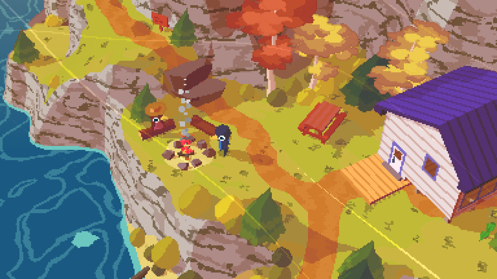
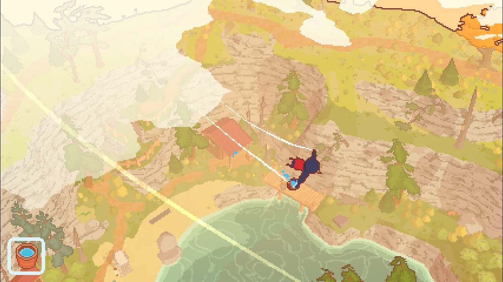

+++
title = 'A Short Hike'
date = 2025-09-23T04:00:00-07:00
categories = ["video games"]
tags = ["a short hike"]
description = "short, pleasant, fun, give it a try"
+++



In 2019’s “A Short Hike”, you’re a girl, Claire, and also a humanoid bird on - what is essentially - an Animal Crossing island, and in order to get cel-phone reception you need to get to the top of the mountain.

<!--more-->

Getting to the top of the mountain is not terribly hard, and most people finish A Short Hike in about 90 minutes.

It’s got crunchy Playstation 1 graphics, a very intuitive and pleasant control scheme, and the little world of A Short Hike feels vibrant and playful and fun.

Pleasant, relaxing music plays and there’s basically no part of the world that doesn’t have something for you to do, collect, or explore.

You can glide around.

I really like it when games are, you know, efficient, they take a little bit of time to show you what they’ve got, they don’t overstay their welcome, and A Short Hike - well, it’s not LONG but it’s lovely. Completionists might dig a lot deeper into this game, opening all of the chests, finding all of the golden feathers and shells, resolving every quest on the island, and I bet that wouldn’t take more than another couple of hours.

What a cool little game!

If you have about the amount of time it would take to watch a medium-length film, I recommend it.