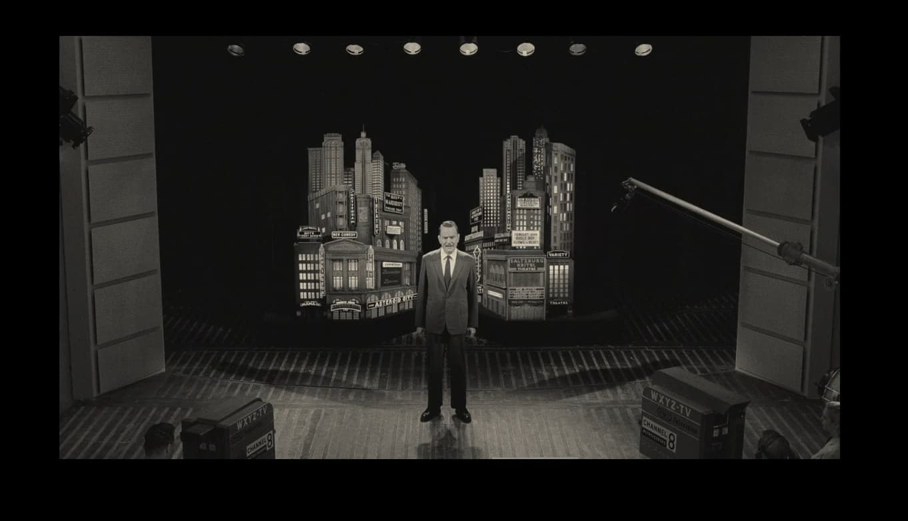

+++
title = "Unavoidable Thematic Parallels Between Asteroid City and House of Leaves"
date = 2025-10-30T12:00:00-07:00
draft = false
categories = ["media"]
tags = ["house of leaves", "absurdism", "asteroid city", "wes anderson"]
description = "my favorite games of the year"
+++



<!--more-->

Okay, so, I really don't want to write a whole little essay about Asteroid City. There's a lot going on in this inscrutable film.

I did write a whole little essay on House of Leaves, though, and I want to talk about some of the ways in which these two units of media overlap:

> [House of Leaves](../house_of_leaves/)
>
> I think that House of Leaves works and is worthwhile because it is thematically and structurally about unsolvable mysteries. It’s a rumination on the meaning and draw of unsolvable mysteries.

But in order to establish a shared frame of reference for the very small point I hope to make, I will need to describe what happens in this movie - spoilers abound, although this is not a movie that's really ... spoilable?

Okay, so, this movie starts by introducing the concept: it's a broadcast of the behind-the-scenes of an imaginary play, Asteroid City. Asteroid City is not a real play: the whole play is made up in order to _present to you a bunch of information about how theatre works_.

So, Asteroid City isn't real: it's a play - but it's not even a real play, it's a _fake play_, made up for the sake of this documentary.

## Within the play:

Augie Steinbeck's car breaks down, and his son (Woodrow) and three young daughters are stranded in Asteroid City, where they were supposed to be, anyways. Augie summons his father-in-law to help: he is struggling to reveal to the children that their mother has recently died, and he's been carrying her ashes around in a small Tupperware container. Many of the bit part characters of Asteroid City are introduced in fun little micro-scenes, all linked together in smooth camera moves.

Augie reveals to his children that their mother has died.

## Outside the play:

The actor playing Augie within the play is introduced as a bit-part player. He asks the writer why Augie does something confusing in the third act. ("Why does Augie burn his hand on the Qwik-E Griddle?") - the writer doesn't know. The actor tosses out a theory ("He was looking for an excuse why his heart was beating so fast.") The writer likes the theory quite a bit but prefers to leave the explanation out of the text.

The actor playing Augie, presumably trying to snag the juicy role of Augie, clumsily dresses in costume and delivers an emotional speech from the point of view of Augie, to his son, Woodrow, about his similarities to his now-dead mother.

The writer gives the part to the actor, who undresses: they kiss.

## Within the play:

Woodrow is here in Asteroid City to participate in a science competition.

Augie seduces an actress, Midge, for a bit. He's a war photographer.  She's reading lines for a movie she's going to be in (yet another layer of story in this damnable story).

The science competition takes place, and is interrupted by an alien (puppet) stopping by to steal the city's titular Asteroid.

The military quarantines the city.

There are loads of little micro-stories embedded in this larger story -

* The director of the movie is going through a tough divorce and sleeping on set.
* Augie's father in law struggles to convince his grand-daughters not to bury their mother in a random hole they made.
* The science nerd kids bond with one another over a word game.
* The motel operator (Steve Carell) is running dozens of businesses.
* The kids sneak pictures of the alien out of quarantine.
* A teacher responds to the alien's presence by continuing with her regular lesson plan. The kids refuse to play ball and only want to talk about the alien. Some local cowboys sing about it.
* The writer of the play is working on a scene (which won't be in the play) with a room full of prospective actors exploring "sleep".

Augie runs more lines with Midge. She confronts him with the possibility that this may be developing into a serious relationship, and Augie responds by intentionally burning his hand on a Qwik-E Griddle.

A lead scientist confronts Woodrow to reassure him that all of this is happening for a meaning and that his curiosity will lead him forward.

Just as the military is about to un-quarantine the city, the alien returns very briefly to return the asteroid. The city is rapidly re-quarantined and everyone riots.

During the riot, Augie's actor decides that he's still unhappy with the answer to why Augie burns his hand on the Qwik-E Griddle, and rushes off-stage to confront the director. As he does, he walks by the alien, who is half out of costume and JEFF GOLDBLUM, who delivers his only line in the whole movie to someone who's asking him a question:

> "I don't play him as an alien, I play him as a metaphor. That's my interpretation."
> "Metaphor for what?"
> "I don't know, yet - we don't pin it down."

Augie's actor confronts the director: he still doesn't understand the play and he feels strange performing it every night. The director assures Augie that he's doing it right and to just keep performing it, anyways.

Augie's actor rushes outside, where he's confronted by the actress who played Augie's dead wife, in a scene that was cut: a dream sequence. She remembers the sequence exactly. The emotional content of the scene is Augie's dead wife confronting Augie with the reality that he'll have to make do without her.

It's revealed now that the writer of the play died during the play's production, explaining some of Augie's actor's confusion.

We cut back to the writer doing his workshop with all of the sleeping actors from earlier - but instead, each of the actors in turn faces the camera with a spotlight on their face to chant **"You can't wake up if you don't fall asleep"**, getting louder and louder until they all fade out.

These two scenes form the emotional climax of the film.

I can't find the exact quote here, but someone on the internet pointed out that while Asteroid City has developed a reputation as being one of Wes Anderson's least accessible films, he definitely still includes a scene where a bunch of actors shout the movie's message at you.

This takes us to the epilogue. Augie wakes up late to discover that the city has been un-quarantined again, and everyone has gone home.

In an impromptu funeral for Augie's lost wife, Woodrow reveals he no longer believes in god.

In the final scene of the movie, Augie and his son and father-in-law sit in a diner. Woodrow won the science prize, and he's dating one of the other nerds. Augie is dating Midge, the actress. Augie's father-in-law approves of this new relationship. Everyone drives off, into the matte painting at the back of the city.

### Okay, What?

See, that's why I said that this story isn't really one that can be _spoiled_ - because the dominant feeling, after watching it for the first time, is just... "what?"

"What just happened?"

"What did any of that mean?"

While it's a sprawling, busy story, it doesn't feel like it actually ... goes together. A lot of stuff happens and you're left kind of not understanding any of it.

### Drawing the Parallel to House of Leaves

All of that was just to get to the point I'd like to make here.

So:

* After the death of his father
* The author of this work of fiction wrote a rambling, fragmented, confusing piece of layered metatextual fiction
* Who's core themes are grief and absurdist nihilism
* As they struggle to find meaning in the loss of their loved one and find none.
* The events of the story exist inside a fictitious framing story that's somehow also itself fictional.
* Within the story itself, the characters obsess over _but can not grasp_ the meaning of the story.
* The story (the fictitious one, at least) doesn't really have a meaning.

These are the parallels I'm trying to draw between the two works.

Asteroid City's a little kinder about where it ends up, though - while House of Leaves pitches that trying to understand the absurd and unknowable nature of reality will inevitably lead to obsession and madness, Asteroid City simply ends up at the softer "well, no use trying to figure it out, best just to go with it".

### Asteroid City is Less Obnoxious About It, Though

I mean, _less_ obnoxious. Not _zero_ obnoxious.

Asteroid City is funny. House of Leaves examines its hollow absurdist core through an academic, horror, obsessive, mystery lens, whereas Asteroid City chooses wit, theatre, dumb camera tricks, and absurdly famous people delivering their lines like they're reading them for the first time off of a cue card.

It delivers its story in a tight hour and 45 with so much trademark Wes Anderson deadpan delivery and tight, symmetrical camerawork that it almost seems like he's becoming a caricature of himself.  It's like Tim Burton with black stripes, hollow-eyed waifs and Danny Elfman music.

But... I don't know, if you're going to have to slog through a shaggy dog story about the doomed quest for meaning, might as well do it in less than 2 hours and have Tom Hanks show up in it.
