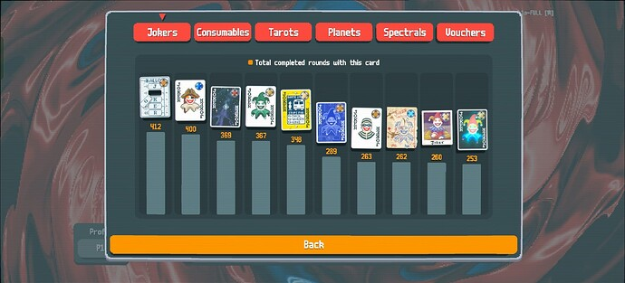
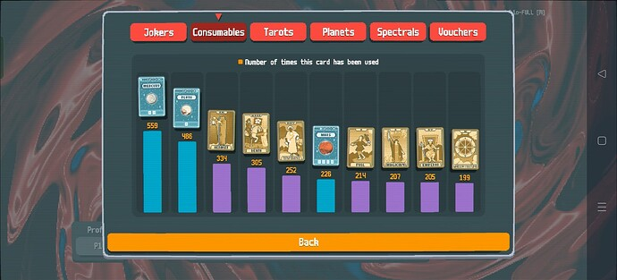

+++
title = "too many words about balatro"
date = 2025-06-06T11:00:00-07:00
draft = false
categories = ["video games"]
tags = ["cards", "balatro"]
description = "i just blither about balatro for a while, you can probably skip this one"
+++


Normally I try to keep my blog posts at least a little bit general-audience, but this is
exclusively Balatro DEEP LORE which is only _maybe_ interesting to people who obsess over this game.


okay, so, I hear on the _grapevine_ that Black Deck Gold Stake is the nastiest challenge in Balatro.

<!--more-->

And, yeah, it's... it's pretty hard. It's a bear, but I managed to finally, eventually, crack through Black Deck Gold Stake. Even this, possibly the meanest of the Gold Stake runs, still only took ... well, quite a lot of tries, but it was doable.

then I hit the Golden Needle challenge in the Challenge deck.

It's not even the _final challenge_, "Cruelty" and "Jokerless" come afterwards, but it turns out, Cruelty and Jokerless are not _too bad_. I managed to beat Jokerless on only my second try with a 4-of-a-kind build.

no, Golden Needle. It took _weeks_, and I'd estimate upwards of a hundred tries. I am pretty sure it is the hardest single challenge in Balatro.

You start with $10, a Credit Card joker, and _6 discards per turn_, whoa, that's so many discards!

The problem? 1 hand per turn, and using the discards costs $1 each.

Thanks to the 1 hand per turn limitation, your economy is going to be _so busted_ - if it takes you 4 discards to get to a hand that will beat the round, you've broken even: no money for you.

Black Deck is considered the most punishing deck in the game because you only get 2 hands and you can _still add more hands to that with jokers or tokens_. 2 hands is _a luxury_. Golden Needle not only forces you to work with 1 hand the whole time, you can't even add more hands because all of the hand-adding jokers are verboten.

I finally beat Golden Needle today, with a pretty lucky build that involved **Hanging Chad** and getting _very lucky_ with a single glass 3 that didn't break juuust long enough to scrape past Ante 8.

I hate Golden Needle and want it to die.

The argument that Balatro isn't actually very fun at higher stakes because it forces you into a handful of viable builds? Totally legitimate, and Golden Needle is _this ramped up to 11_ because the number of actually viable Golden Needle builds are _incredibly small_ and thanks to your weak econ and being stuck with 1 hand _every round_, surviving long enough to put together ANY build is very hard.

But I'm done. I did it. I beat all of Balatro's challenges. I collected all of the cards. I beat the highest stake with the hardest deck.

I mean, there's still "Gold Stake all decks" which I'll get through eventually, organically, if I keep playing this on my phone casually.

And there's "Gold Stake all jokers" which I might get through eventually, also, but aside from the WAR OF ATTRITION goals, I think I can say I've about _beaten_ Balatro.

------------------

## Now I'm Going To Talk About My Top 10 Balatro Jokers For A Bit, Because I Want To, Please Only Read This If You Are A Crazy Person

The top jokers in my collection make my winning strategy all too clear. These are, in my opinion, the heavyweight champion jokers of Balatro.

**Hanging Chad** is, in my opinion, the _third best joker in Balatro_, behind only the copy jokers (Blueprint and Brainstorm) - and Hanging Chad is **Common**, while the copy jokers are Rare, so you're going to see a lot more Hanging Chad.

Honestly, a lot of the time what you're copying with Blueprint? Hanging Chad.

All it does is retrigger your first played card, 2 times in a row. Why so good?

Retriggers are insanely useful, and a card that retriggers _anything_, _twice_ means that any face card becomes a Bonus card, any Bonus card becomes +100 chips, any +4 Mult card becomes +12 mult, any glass card becomes an X8 mult card - so, a joker that provides +100 chips, +12 mult, or a staggering X8 mult is _already_ pulling its weight in your joker deck. It's also flexible: if you're hurting for chips, it can provide chips. If you're hurting for mult, it can provide mult.

But that's not even the start of it because it takes _literally any_ joker that triggers off of a card _or_ any effect or joker that _also_ provides retriggers and jumps them into the stratosphere. Hanging Chad is a legitimately powerful joker on its own _before_ ALSO being one of the best combo enablers in the game.

The four jokers that give you +3 mult per card matching a specific suit? Well, that plus a Hanging Chad makes +12 mult - nothing to sneeze at, and that _stacks_ with any other effects - a Mult Club that provides +4 mult (from the "Mult" modifier and +3 mult (from the Club) is going to get up to a nice +21 mult - that's a solid late-game mult joker and applying "mult" to a Club is something you can do from the first shop in the game.

When localthunk inevitably nerfs Hanging Chad I'm going to pour one out for this joker.

Hanging Chad's best friend, **Photograph**, is also in my top 10, although much lower because it's not nearly as useful on its own as Hanging Chad - it's there _just in case_ Chad comes around. Photograph gives the first face card you play a X2 mult bonus. Because card-based-mult-mult happens _before_ the rest of your mult stack (if you understood this, you're huffing nearly as much Balatro as I am) - on its own it is good for maybe 2-7 mult unless you've been hitting the celestial cards pretty hard, making it ... pretty weak.

A Hanging Chad and a Photograph make that face card into X2, X2, X2, which is an X8 modifier on your base mult: that's a +38 multiplier on even a _base tier Full House_, and that scales up quickly with Celestial cards making it an extremely powerful combo. That's better than two +15 mult jokers, which are some of the stronger mult jokers.

But that effect _just keeps on stacking_. If you hit a glass card with it? Now that's not 2^3 (8), that's 2^6, an x64 multiplier, so a Full House is now +256 - combine that with _any_ chip joker and scale it even gently and you're cruising through Ante 8 no problem.

If what you crave is darker, infinite mode, getting into the _scientific notation_, well, that effect just keeps on stacking. Add the joker that retriggers all face cards? Add a red seal? Add a blueprint? Add a brainstorm? Now our _multiplier_ is getting deep into scientific notation - not our _score_ - our _multiplier_. This'll get you into the forbidden antes, no problem. With a combo that starts with 2 common jokers. Nice.

One of the other things is that most of the rest of the well-known insanely broken joker combos - Baron, Mime, and Red Seal Kings, or Idol and _every card in your deck is the same card_, also require an enormous amount of setup, to the point where they're not actually good builds for trying to take down high stake runs: they're simply too impractical to set up on anything but a run where you're already Killing It.

Compared to all that, **Swashbuckler** is pretty boring. He gets +mult equal to the sell value of all of your other Jokers.  Thing is, though - that reliably makes him at least a +8-12 mult joker (nothing to sneeze at, that's solid) but also gets more value out of any expensive joker, including rare, uncommon, holographic, polychrome, or foil jokers - which you _already want to take anyways_. Swashbuckler has synergy with _every expensive card in the game_ and you **want** every expensive card in the game - making Swashbuckler just a slightly better **Abstract Joker** (+3 mult per joker, including itself - which provides a little more mult on average, but comboes with nothing). Also, I really, really like the Swashbuckler+Gift Card and Swashbuckler+Egg combinations.

Okay, then there's **Supernova**, **Green Joker**, and **Ride The Bus**, which are each jokers that get +1 mult every time you play a hand - Supernova scales the hand you play _most often_ with no ill-effects, whereas Green Joker and Ride The Bus scale uniformly but can lose their mult - Green Joker loses 1 mult every time you discard, Ride The Bus loses _all_ mult if you happen to play a face card.

That sounds _really bad_ - +1 mult? Pfeh, trash - and you can't play face cards? Ever? Too harsh!

Okay, but, like, if you can arrange it so that you're playing 4 hands every round - expensive, but you can do it - that's +4 mult every round. If you have two of these cards, that's +8 mult every round. "Playing hands" is one of the easiest scaling routes in the game and you can easily get these jokers into the 30-40 mult territory by Ante 8, which is Good, that's a Good Joker - also, when they stop scaling as well, that's because your hands are TOO POWERFUL and closing out the round _too quickly_, but that's a good problem to have, it means you're ahead of the scaling curve. Win win.  Combine with _any_ X3 joker and a chips joker and you've probably won Ante 8.

Everyone knows why **Blueprint** and **Brainstorm** are the best jokers in the game, right? They're just _your best joker_, _again_, and you can _always_ rearrange your jokers, so Blueprint is _always_ the best joker. You have a +45 Ride The Bus? Now you have two! You have an X3 joker that only activates once in a while? Now it's two X3 jokers when that happens! Have a joker that does something cool at the beginning of the round? Now two cool things happen! Get 3 extra hands per round from your Burglar? Now you get 6 extra hands per round, AND you still get to copy other jokers!

**Burglar** seems bad at first - you trade all of your discards for +3 hands? Well those hands aren't going to be very GOOD if you can't _discard cards_ , right? Well, yeah - but - a hand is better than a discard, right? You remove the cards _and_ you get the points for the cards you removed. Plus Hands are worth _money_ - Burglar is secretly an Econ joker, because +3 hands is +3$ - not a great Econ joker, but free money is free money. Also, uh, you may have noticed that a whole lot of my favorite jokers _scale better the more hands you play_.

Really, once you've got hand-scaling going, the only thing you need to win the ante is an mult-mult joker - I have a lot of favorites here - Drivers' License (X3 if you have >16 enhanced cards) is pretty good, Blackboard (X3 if you leave only black cards in your hand) is pretty good, Card Sharp (X3 if you've played this hand before, this round) is _very_ good with my "lots of shitty hands" strategies (although Card Sharp is basically hard-countered by The Needle AND The Eye, both of which have ended a lot of my runs) - but the one that made it into my top 10 was good ol' **Hologram**, which is, in my opinion, the easiest mult-mult scaling in the whole game. "Oh, I need to add cards to my deck?" that is already not a hard thing to do, hit a couple of shops and you're at X2 already.
