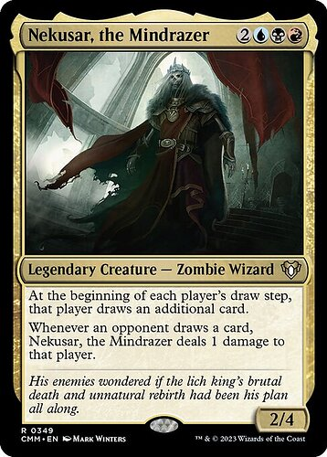
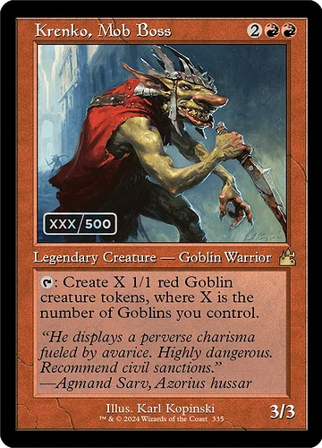
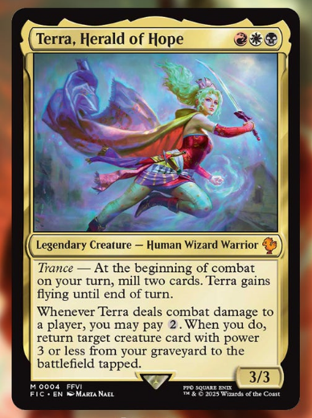
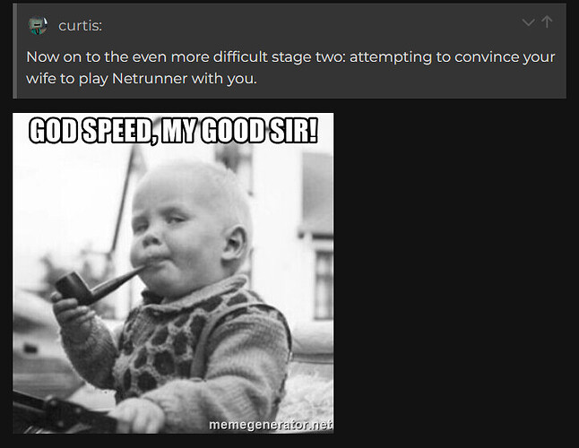
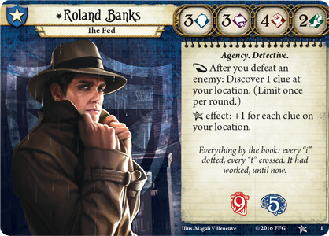
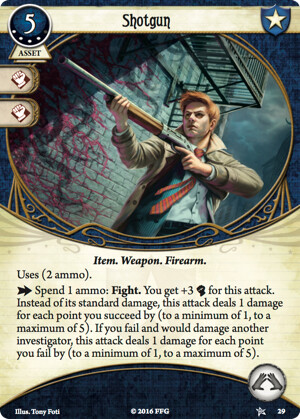

+++
title = 'I Love Complicated Card Games'
date = 2025-03-05T09:00:00-07:00
draft = false
categories = ["board games"]
tags = ["cards", "balatro", "slay the spire", "magic: the gathering", "arkham horror", "netrunner", "earthborne rangers", "final fantasy 6"]
+++

Magic: the Gathering really captured my heart from a young age. There's something really compelling about _building a deck_ and doing _fights_ with it.

I kinda drifted away from it, though. It's an _expensive_ hobby, and the "C" part of CCG never really appealed to me: I derive little joy from _collecting_.

<!--more-->

__"But Curtis, you have terabytes of pirated content and you clearly derive some joy from the act of both adding to and managing that collection."__

That's _curating_, not _collecting_.

Anyways, when I was young, MTG kinda just had the one format and it was barely-limited 40-card decks, which wasn't a very good format.

* _Pay to Win_: better cards will win more often and you can pay more for better cards.
* _Well-Defined Competitive Meta_: in the competitive scene, everybody gets to know what kind of deck is dominant and has to build for/with full knowledge of the entire competitive scene, which includes which (expensive) cards are mandatory to collect.
* _Turn One Infinite Combo_: With so many cards in the pool, players were bound to find cards that could interact to produce _infinite goblins on turn one_ or _something like that_.
* _The Berenstain Bears and Too Many Cards to Memorize_: As the card pool grew and grew, the number of cards people had to be aware of _also_ grew enormously.
* _Rarity_ : Getting good cards involves booster pack gambling, and, well:



Anyhow: more modern _formats_ of M:tG attack some of these problems head on.

One solution is that M:tG moved towards, near immediately, was rolling editions and active ban lists. Only the past handful of M:tG editions are _street legal_ (constricting the number of card interactions the designers have to consider), and cards that utterly ruin the meta end up on ban lists so that they don't completely overrun tournament play.

## Commander

The Commander format changes the deckbuilding and game rules pretty significantly: it allows for some of the most expansive deckbuilding by mandating _exactly_ 100 cards and mandating _no duplicates_. Players can fill their decks with nasty and destructive infinite combos, and wildly over-powered $20 collector's item cards, but with such large decks these combos are _unreliable_.

Commander is a "collector who wants to flex a little" format. I a-little-bit-fondly remember spending a little time and more money than I care to admit (I can't remember how much, less than a hundred dollars) building a couple of Commander decks by cherry-picking exactly which cards I wanted from the internet and ordering them as a block.

There was a balanced, fun, interesting Nekusar the Mindrazer build that focused on _giving the other players cards_. It's not too bad to play against because _while it does a load of damage_, it also gives you enormous card advantage while it does that.

"Did you build a mill deck in Commander? That's crazy!"

nah it kinda works and it's fun. team Nekusar. toot toot.

I also built a Krenko: Mob Boss deck that I was politely asked to retire forever because it was disgustingly powerful.

Seriously, this motherfucker is like the Ryzen 7 of Magic: the Gathering. He's been in print forever so he's available for a toonie, goblins are some of the cheapest and most plentiful creatures in Magic-dom - I dare you to find better price: performance in a Commander.

Anyways, I donated my Magic cards to one of my younger brother's cube projects, <small>I think?</small>, and haven't seen them again since.

## Draft

Commander is still a collector's game, a "pay to win" game. My Krenko deck was something I had to curate and assemble myself. It was a neat novelty, but I wasn't that sad to see it go.

A format where everybody has a much more even chance to win? Well, there's Draft.

I've only played in a handful of drafts, ever. I ran one for my younger brothers' bachelor party weekend many moons ago. You buy a shit-load of booster packs (3 per player),  and everyone plays a little game where they open a pack, pick a card, and pass the remaining cards around in a circle, picking and passing until the cards are all distributed.

Sometimes trades are allowed after the draft? It depends on the situation.

Canny drafters should end up with a deck that's pretty powerful - but not _too_ powerful.

Then, players play with the decks they have constructed.

This solves a lot of M:tG problems, in my opinion: you _can't_ pay to win, you can't assemble a game-breaking turn one infinite-combo... and if you're lucky, you can play with a group of people who aren't _intimately aware of the competitive meta_, making it possible to have fun, still, with a pretty mediocre deck.

In fact, my biggest problem with drafts is that, uh...

well, playing a draft with friends creates a LOT of Magic games, and...

I don't actually like playing Magic: the Gathering that much.

## The Trouble with Deckbuilding

I think it is more fun to _build a M:tG deck_ than it is to _actually play M:tG_.

The game itself is fussy, dense, sluggish, filled with unfair-feeling randomness.

In fact, I think this is the case for a _lot_ of games where you spend a lot of time tuning your deck up-front.

On top of that, the social context of games like this makes it harder to arrange games with your friends: in order for a game to take place, every player must buy in with _a deck arranged according to a rule-set pre-arranged for the game you're playing_.

This is a game where playing it casually is near impossible, because the only practical way to play it is in an _event_ format, which calls for a _lot_ of buy-in.

It'd take something pretty special and unusual to get me to run another Magic draf-

oh

oh no

The Final Fantasy decks are proving immediately _very popular_ so it'll be a while before they're reliably _in print_ and _sealed_ without paying wild scalper prices for cards in them, but if the cost is ever under control I might.. consider... a Final Fantasy draft. For old times' sake.

## Netrunner



Netrunner!

One of the nice things about Netrunner is that it is a "LCG", not a "CCG": a "living card game", not a "collectible card game".

The difference? In an LCG, while new cards get printed periodically, there's no _rarity_ or _gambling_, you can just _buy whatever cards you want_. The company that makes the cards just releases new sets every now and again, and you buy them.

Oh, also: the IP is now abandonware, and a company named ~~NISEI~~ Null Signal Games exists: devoted enthusiasts now make and manage Netrunner despite having (AFAICT) no actual claim on the IP:

[I Just Printed the Entire NISEI System Gateway at Home; Learn From My Mistakes](/posts/2022/nisei/)

Also, despite releasing the game for free as print-and-play, they are actually increasingly unfriendly towards Print & Play players - even in my Reddit post about printing the NISEI System Gateway they intruded to "how dare you" about not paying for their print-on-demand cards from MPC for _over a hundred Canadian dollars_, and have since reduced the resolution of their print + play cards significantly to try and drive sales to their product-that-they-don't-actually-have-the-rights-to-sell-as-far-as-I-can-tell.

Aaaanyhoo:

_this is the part where the plan fell apart_, I could not convince Tiffany that Netrunner was worth playing, she played a couple of noncommittal token rounds with me but never really got in to it - which, considering the hours and hours I had spent individually cutting and sleeving hundreds of these cards, was _not a worthwhile use of my time_.

Honestly, Netrunner proved not terribly amateur friendly.

The gameplay revolves around protecting assets with Ice as a Corp, and trying to break that Ice and steal the assets as a Runner.

The asymmetric peek-a-boo runner-vs-corp gameplay is... okay, but while you're learning it is _all too easy_ to find yourself in an utterly hopeless game, trapped for 20 minutes while a corp stomps all over you because you can't find an Icebreaker you desperately need - or trapped for 20 minutes while a runner stomps all over you because you can't find Ice you desperately need. In fact, _building your own deck_ without too much advice from the internet is a recipe for getting stomped in exactly this way because building a balanced Netrunner deck is _much harder than building a Magic: the Gathering deck_ (because the gameplay of Netrunner is so abstract), which is _already_ much harder than Just Playing a Regular Board Game.

Magic: the Gathering is very obviously the game that inspired the Cheese Tasting Phase:



but games of Netrunner devolve into Cheese Tasting _so much more severely than M:tG ever did_.

anyways, if you _do_ want to play Netrunner, I think the actual recommended way to play is just to polish your build on netrunnerdb.com and play a buttload of Netrunner on jinteki.net with random strangers.  In fact, I think that is just _how modern Netrunner is actually played_.

It's less of a card game and more of a wiki/database/video game hybrid at this point.

## The Arkham Horror TCG

you're still building a deck in this one, but it's to play a co-operative game!

I had a lot of thoughts about this already:
[Arkham Horror TCG](/posts/2021/arkham_horror_tcg)

Tiff and I played a full campaign! It's fun, and as I mentioned earlier it's out there solving problems with both Android: Netrunner AND Arkham Horror. In that article, I focused on some of the Arkham Horror problems it solves handily - like co-op quarterbacking, and the unfocused "misc. horror happens" decks creating a Very random atmosphere.

However, here, I could focus on some of the Netrunner problems that Arkham Horror solves: by simple virtue of being a _co-operative_ deckbuilding game, suddenly all of the problems of getting _lost in the meta_ disappear. You're not trying to build a good deck to _utterly wreck_ your friends, you're doing it to _try and save them from otherworldly horrors_. Tiff wasn't irritated when I managed a clever move with the almighty Dynamite card, she was happy!

It doesn't matter which cards you have in the card pool: the cards you have are the cards you have. Build some investigators and get horror-in'!



But it has downsides, too. It's still a lot of _pretty stressful_ up-front effort to try and build a good investigator deck.

The individual campaign entries each feature custom rules: the game wants you constantly on your toes but that means your deck might be absolutely terrible at the goal for one particular chapter, and also: some chapters are just _a lot more fun/difficult/playable than others_. Every campaign has "the chapter that everyone thinks is pretty shit".

The game's base rules also really discourage _changing your deck_ once you've started a campaign - a rule that I pretty thoroughly discarded as we were learning the game, because _getting stuck for multiple sessions with a bad deck_ is _no bueno_. A little bit of creative deck modification never hurt anyone.

Also: when we failed the campaign halfway through? Instead of starting the campaign again from the beginning, as intended, we just started again from the _part of the campaign that we failed_.

## Just Playing a Drafting Game

A big part of doing well in Magic: the Gathering drafts is... well, playing the draft mini-game to try and get the best deck!

But drafting in-and-of-itself is a skillset.

Heck, one of my favorite games for a few years was all draft and no... the other part.



7 Wonders is a game of _just draft_. _Only draft_. Draft the best deck, and you win.

Drafting is fun in and of itself, and drafting, as a mechanic, has been showing up in more and more games.

Simpler than 7 Wonders is Sushi Go! , a drafting game so simple you could play it with children, or your parents.



And there's The Isle of Cats, a game where you draft cards that let you attract tetromino-shaped cats on to your boat, which honestly scratches multiple very real itches in my brain at the same time:



 I should crack this one out again, soon. caaaaaaats.

## Deckbuilding During Gameplay



Almost 20 years ago, this masterpiece came out: a game where you set out a menu of possible cards to add to your deck, and buy cards to add to your deck _during play_.

I don't... play Dominion often, any more. I still have most of the cards, from multiple sets,  although they are in pretty battered condition: but the big reason why I don't play Dominion so much any more is that this utterly incredible idea got adopted IMMEDIATELY into the board gaming world as a first-class Concept that now gets included in all kinds of games - many of them more refined and fun than original-recipe Dominion.

For example, Ascension: Chronicles of the Godslayer, a game I liked enough that I made a partially-AI-generated print-and-play snowclone of it ( https://cube-drone.itch.io/attack-and-dethrone ) a few years before AI generated art became _very easy_ and _very common_.  I made an Geforce RTX 1080 work _very hard_ on that.

"Deckbuilder" is fun on its own, but it's also an ingredient that works well in other kinds of game.

Mix Deckbuilder into your racing game? Well that's The Quest for El Dorado, which is very fun! Build a deck to get through this jungle as quickly as you can!



Mix El Dorado with a dash of Quacks of Quedlinburg, a push-your-luck game, and you end up with Cubitos, which a dice-based push-your-luck deckbuilder!  Sure, we're getting a little lost in the sauce with game mechanics here but it _still works pretty well_.



Oh, but mix deckbuilding with _roguelike_ mechanics and you end up with the King, the grand-daddy, the great big boy that easily, handily hammered its way near to the top of the heap of my most played games of all time:

## Slay the Spire



Built by... a bunch of Netrunner enthusiasts.

I _LOVE_ Slay the Spire. I hit A17 with each of the game's four decks on my iPhone after hundreds of hours of gameplay, and then I moved to my new Android, where I bought Slay the Spire again, and now I'm just chillin' at the bottom of the spire getting ready to start climbing all over.

[Slay the Spire's Opening Monsters Won't Deal 10 Damage](/posts/2022/slay_the_spire)

## Slay the Spire: The Board Game

Slay the Spire is very good, but explicitly single player. Slay the Spire: The Board Game is a co-operative experience where you get to bring all four of the Slay the Spire decks to the table at the same time, each of you working together to try to slay the titular _spire_ as a TEAM.

As I mentioned about Arkham Horror: TCG above, Co-op and deckbuilding work really well together!  Slay the Spire is HARD, and when someone's deck starts to pop off, it creates _room for everyone else to breathe a little_. On top of that, thanks to Slay the Spire's innovative "build the deck as you go" format, nobody has to do a bunch of prep building a deck beforehand like they would with Arkham Horror: TCG.



But also: Slay the Spire: the Board Game is HARD, and complicated, and a lot of work. Like: it's a complicated video game, but when you're playing the video game the _video game does a lot of the work for you_. When you're playing Slay the Spire in person, a _real person_ has to figure out how many hit points each of the games' many gremlins has.

The best way to get my friends to agree to play it with me was to breathlessly recommend Slay the Spire the iPhone game _dozens of times in conversations with them_ until they all got as addicted to the mobile game as I was, then finally _once the pump was primed_ roll out the gigantic board game edition.

It went so well, though. I got to play this game all the way to the end of the Spire. Twice. At one point we played it while camping, with friends, in the outdoors.



this day in late 2024 was the highest point of multiple consecutive decades of me trying to manufacture A Good Time With Collectible Card Games:

_playing Slay the Spire co-operatively with friends combined all of the stuff I've wanted from all of these systems over the years_.  It's got the good co-op I wanted from Arkham Horror. It's got the good deckbuilding I wanted from Magic: the Gathering. It's got drafting moments that feel enormously important but there's not a hint of hate-drafting.

## Inscryption

> 
> i hope it isn't apparent where I stole this image from

good lord above if you like narrative puzzle games and card games and you haven't played Inscryption yet I want to shake you until you do, it is unbelievably good

## Balatro

after Slay the Spire: loads, LOADS of games inspired by Slay the Spire.

in my 2024 GOTY roundup, I gave "every Slay the Spire inspired game I played" a collective spot at **#3** because there were a lot of 'em and I wanted to fold them all together in "pretty damn good" territory.

Then, of course, I gave Balatro **#1**.

Again, I was pretty far into unlocking everything and racking up the gold stake wins on my iPhone when I switched to Android, only to devote myself to _starting the whole project all over again_. Just because Balatro is very good.

It's the deckbuilding roguelike stripped down almost to the studs. It's not _that_ complicated, but it's just complicated _enough_.



It's not better than Slay the Spire. It's _really good_, though.

This is also one of the few that I'd _try_ to recommend to my parents. I think most people could get good and addicted to Balatro.

## Earthborne Rangers

Look, I trust SUSD pretty well with the old recommendinos - they're not 100% right about what I'll like (Tom's recommendations tend to be the worst for me, he's just A Different Gamer than I Am) but by and large they are a trusted source of interesting recommendations for me,

and as a result, this frigging YouTube channel probably costs me a few hundred bucks a year.



They gave Earthborne Rangers _two_ stickers. TWO!  I had _no choice_ but to to kickstart its second printing and wait over a year to see what they're going on about, for a game that Matt Lees was so ungodly excited about that he genuinely believed that Shut Up & Sit Down should introduce some kind of _new recommendation tier_ for the game:



(I've been assured that my copy will be along some time in the June-ish 2025 territory)

It's... very clearly got a lot in common with the Arkham Horror TCG pedigree, being a game where you build a deck to tackle a co-operative problem solving situation.

but Matt here assures me that that's not the whole story:



> so, tonally, Earthborne Rangers is more "Avatar: the Last Airbender" to Arkham Horror's "Cabinet of Curiosities"
> and if it was just a less oppressive, more expressive version of that game it would already be great
> but
> it's just loads more, it's so much more than that

so, I'm excited to give this one a try when it finally shows up
