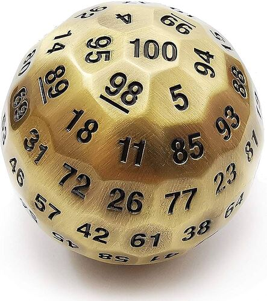

+++
title = "Delta Green Tarot Conversion"
date = 2025-06-24T11:00:00-07:00
draft = false
categories = ["rpg"]
tags = ["delta green", "tarot", "quinns"]
description = "It's a modification to Delta Green where every agent gets their own Tarot deck."
image = "./sample-character-16-point-buy.png"
+++

_I've devised a way to play Delta Green with one Tarot deck per agent._

<!--more-->

## What is Delta Green?

Quinns just covered it in a mammoth review:



But, in short, it's a spy thriller where you fight _lovecraftian horrors_.

Call of Cthulhu, but set in the modern day.

And I want to tinker with it.

## The d100 is Fine, Actually

The d100 is an awfully rare and difficult to find die:

Okay, nobody has one of those, uh, usually two of these:

So, in Delta Green, you might have a skill with "66", and in order to succeed at a check with that skill, you need to roll <= 66.

This is a very natural, very easy-to-understand system.

Percentage-based checks will feel very familiar to anybody familiar with games like X-Com or Fallout:

I don't know why, but for some reason d100s feel a little _antiquated_ and stuffy to me. The idea that you have a 38% chance to hit a gremlin with your pistol feels a little bit _too granular_ to me.

I _suspect_ that the game would run perfectly fine if you put a little effort into discarding the second d10 entirely. Can you really feel the difference between an 85% chance and an 8/10 chance?

That's not a _real_ concern, though.

Here's the real concern:

**I would like to use Tarot decks for Delta Green, and a d100 is not a deck of Tarot cards.**

So the problem I'm trying to solve here is not mechanical, but simply one of _preference_.

## Each Player Starts With Their Own Tarot Deck, As Does the GM

This is important, for a few reasons:

* Player customization: in the same way that players like to bring their own _really nice_ dice to games,
    I'd like to support players bringing their own decks. Or using one of my decks. I have so many decks.
* The DM needs a neutral deck for NPCs.
* The SAN rules determine how many of an agents' Tarot cards they get to keep (explained more, below).

## Skill Checks

How do we replicate the d100 skill system with a Tarot deck?

### Single Card Draw Doesn't Work So Well:

Of course, with a 78-card deck, you can make any probability from 1/78 to 77/78 by simply creating a larger or smaller subset of cards.

Obvious subsets include:

    Only one numbered card (kings)? 4/78 ('bout 5%)
    Only one suit? 14/78 ('bout 18%)
    Two suits? 28/78 ('bout 36%)
    Three suits? 42/78 ('bout 54%)
    Four suits? 56/78 ('bout 72%)
    Only major arcana? 22/78 ('bout 28%)

For a nice 1/4 chance, we can say “Major Arcana, but The Tower and The Moon are always critical failures”

The skill model in the first build of this did depend on just drawing one card and changing the size of the target group based on chance of success, with “Four suits (any Minor Arcana)” (72%) being an “Easy” check, and the odds just getting worse from there.

But… variegating the selection criteria based on the check difficulty, while mathematically sound, is also… kinda fussy and complicated? You need to check a chart every time you make a check to see what cards you’re looking for.

On top of that, I think drawing a Major Arcana should be good, not bad. They’re the _special cards_!

## A Fresh Idea: Multiple Card Draw
Okay, so, the chance of drawing a major arcana on one card is 28%.

What if we draw 4 cards?

28% + 28% + 28% + 28% is 114%, a _guaranteed success_.

Anybody who's taken combinatorics &mdash; or, hell, anybody who can imagine the obvious counterargument that lots of four-card minor arcana hands exist &mdash; will point out that the math here doesn't track.

UGGHGHG HOW DID THAT WORK AGAIN

> 
>
> curtis, trying to make his pudding do math

so, if we build a chart of possibilities, we've got

* success on first card: 28.2%
* failure on first card: 71.7%

.... and then the success on the second card only matters if we fail on the first card, so that's 22/77 (one less card in the deck) * 71.7% - so, 20.4%

So the chance of drawing at least one major arcana, having drawn 2 cards, is 20.4% + 28.2%, totaling 48.6%, so just under 50%.

Oh, let's remember I'm excluding The Moon and the Tower (so, 20/78), and do that math out to six cards:

| cards | P(success) | P(fail)
|----|---------|-------|
| 1   | .256     | .744  |
| 2  | .449    | .551   |
| 3  | .594    | .406  |
| 4  | .702    | .298  |
| 5  | .782    | .218   |
| 6  | .841    | .159   |

Oh, I like that curve. It's got _properties_.

Like: each card after the first is _technically_ a teeny tiny bit more likely to be a Major Arcana than the last, _but_ actually each card that you add to the calculation has diminishing returns in terms of its utility.

This is actually a really desirable property for skill checks: if you know enough about lockpicking, or computers, to get around day to day, you're probably competent enough to do a _lot_ of day to day tasks - BUT - the more you specialize, the less likely that dense specialization is going to be helpful in any given situation.

This also asymptotically approaches a 100% chance of success without reaching it (until you draw fully 58 cards, at which point the chance does, in fact, become 100%, because there aren't any "fail" cards left in the deck to draw).

So that gives us a nice, tidy scale from **1-6** that we can use easily for stuff!

Amateur at a task? Draw 1 card, 25% chance of success!
Pretty good at a task? Draw 3 cards, 60% chance of success!
Mega-doctorate at a task? Draw 6 cards, 85% chance of success!

That also offers a _very_ easy scheme for making checks harder or easier.

* **The task is unusually difficult**: -1 Card
* **The task is banana-lana-bonkers**: -2 Cards
* **The task is pretty easy**: +1 Card
* **I should barely even consider making you draw for this**: +2 Cards

And again, the shape of the card distribution makes sense here: _difficult_ tasks are going to be much more punishing for Amateur users, who lose bigger chunks of their percentage chance of success - but for experts, difficult tasks cost them fewer percentage points because _being an expert_ means _being prepared for the difficult stuff_.

### This Does Lean a Little Bit More Towards Success Than Failure

Yes - I, uh... I'm not going to lie, my DMing style is a little bit biased towards player success in TTRPGs?

The story is more interesting when the players succeed _more_ and fail _less_ so giving the players a small mathematical advantage
near the low-ends of the skill scale is not a bad thing, IMO.

Your mileage may vary.

## Drawing When You've Got 0 Cards Left in a Skill

When you're drawing with 0 Cards in a skill, _only a Critical Success will succeed_.

For the likelihood of that succeeding, see:

## Critical Fails and Crit Successes:

So, the existing Delta Green system turns a draw into a Critical Fail or Critical Success if you roll a pair: so, a 22 on a 50% difficulty task would be a Critical Success, and a 22 on a 10% difficulty task would be a Critical Fail.

I think a Critical Fail is called a **Fumble** in Delta Green terminology.

But it's pretty easy to tell that we're looking at a **1/10** chance of, uh, _criticalizing_ any given roll.

I'm used to a **1/20** chance of crits from D&D, and I'm pretty comfortable with anywhere between a 5-10% chance of crits. (or a 10-20% chance of critical hits OR critical failures)

There are some cards that seem particularly suited for this in the deck - _thematically_ The Fool and The Sun are (IMO) obvious critical success cards, The Tower and The Moon are obvious critical failure cards.

So, if we assign 6 cards in our deck: 3 crit success cards and 3 crit fail cards, then....

| cards | P(crit) | P(no crit)
|----|---------|-------|
| 1   | .076     | .924  |
| 2  | .148      | .852  |
| 3  | .215       | .785  |
| 4  | .277     | .723   |
| 5  | .335     | .665   |
| 6  | .390    | .610   |

so that's a 7-40% chance of a crit, which is... uh, a lot swingier than what I'm hoping for.  Maybe just 4 cards in our deck? 2 crit success and 2 crit fails?

| cards | P(crit) | P(no crit)
|----|---------|-------|
| 1   | .051     | .959  |
| 2  | .095    | .905  |
| 3  | .142     | .858  |
| 4  | .187     | .813   |
| 5  | .230     | .770  |
| 6  | .272    | .728   |

so a 5-27% chance of a crit... still don't love that. It's too low at the low end, and too high at the high end - plus, I think this means that it's _way more likely_ to get a crit success than a crit fail - because if you're pulling a low number of cards (and thus, less likely to succeed) you're also in the low percentage chance of getting a crit, whereas way up in the 5 and 6 card draws we're a lot more likely to pull a crit and also a lot more likely to succeed.

The magic of looking for pairs is that it is always a 1/10 chance of a crit, regardless of the outcome of the check, but that's not really available here in cards.

> 
>
> even more pudding exercise

We could make it so that a crit fail has _priority_ and **immediately** kills the hand, stop drawing, may god have mercy on your soul - that gives it a little _more_ juice.

We could make it so that just the _first_ card of the set determines the criticality of the hand... 8 cards, divided cleanly between Major and Minor arcana - say,

* **Critical Hit** - First Card is The Fool, The Magician, The Sun, or Strength
* **Fumble** - First Card is The Moon, The Tower, or a 9 or 10 of Swords

That's just a 5% chance of Critical Hit or Fumble at any given moment, on any roll, which is pretty much what I want, I think.

_Technically_ we could choose cards that are, like, a little more memorable - like "Any Ace" could be a Fumble, and that's easier to remember, but...

thematically, these are some **Crit Fail cards** right here

and, correspondingly, these cards all do a pretty good job of communicating "yeah, I got this"

## SAN Checks

Sanity Checks work differently! We need something that starts out pretty easy, and gets harder as your sanity ticks down.

Okay, so: here's the fun trick at the heart of my Tarot system.

Every player, regardless of their Power, starts with 78 SAN points. (Power still provides other useful bonuses, but every player starts out with a pretty generous 78 SAN score)

When players lose SAN points, they don't tick off any boxes - what they lose are _Tarot cards_. From their deck.

The fewer cards they have,
* the more effective they are going to be at all of their skills (as we whittle away cards that fail checks)
* the more critical hits and critical failures they are going to see (as we whittle away cards that aren't crits)
* the easier it will be to lose sanity (as we whittle away cards that aren't sanity losing)

So, a SAN check is a single-card draw from the deck, and the player simply fails if they draw a Sword, or a **Fumble**.

16/78, that's a mere 20% chance of failure. Your players' SAN is safe! (at first)

With every SAN loss, though, the chance increases!

## SAN Loss Card Order

Ugh, this unfortunately introduces a nasty complication in our design.

We don't want a player's deck to become _immune to SAN damage_ (no swords), or immune to crits (no crit cards).

So here's the ruling: when a player loses SAN, they hand their deck to the GM, to remove cards behind a screen.

The GM doesn't say _which_ cards they remove. **Players Can Be Discouraged From Closely Examining Their Decks**.

It's up to the GM what to remove here, although I recommend something like the following order:

The GM starts by _only removing Pentacles, Cups, or Wands_ until only Swords and Major Arcana remain.

They can pull a few unimportant Major Arcana if the player is becoming _too unstoppable_ at skill checks.

That will carry them through the first 42 points of SAN damage.

Then, we remove _either Major Arcana_ or _Swords_, trying to keep a sort of 50-50 balance between the two,
but carefully leaving The Fool and The Moon as the second-to-last and final card removals of the deck. Once the Moon is
removed, the character is - well, a  it's a moon joke .

### Again, Doesn't That Make Their Skill Checks Way Too Strong?

Yeah - with over half of their SAN gone, and only swords and Major Arcana left in their deck,
the player has a 61% chance of success with just
_one card_ in a skill, with a now 10% chance of critical success or failure.

| cards | P(success) | P(fail)
|----|---------|-------|
| 1  | .611    | .389  |
| 2  | .850    | .150   |
| 3  | .947    | .053  |
| 4  | .982    | .018  |

However, there's a countervailing force at play, here:

### Disorders & Exhaustion

Every time the DM collects **14** SAN a full suit, for quick reference
from the player, they get a new _Disorder_.

Most of these disorders put the player in situations where they lose cards from skill checks, or are
more likely to gain **Exhaustion**, which also puts the player in a position where they lose cards
from skill checks.

A character starting from 3 cards in Forensics: 60% chance of success &mdash; losing half of their sanity &mdash; could
find themselves in a position where their _agoraphobia_ and _exhaustion_ lead them to a -2 card
penalty to bury a body in the woods, so now they have 1 card in Forensics: 60% chance of success.

The goal, I hope, is to give players the feeling of _this is going off the rails_ while still having
the results be _relatively_ consistent?

### No Need For Skill Improvement

Being as the players get _better_ at their skills the less sane they are, there's no need
for the traditional "1 point of skill improvement at the end of the session" style leveling, here.

## Damage Rolls

I'd consider _still keeping dice around for Damage Rolls_, to be honest, but it's, of course, possible
to keep doing everything with just a Tarot deck.

* To roll 1d4, _just keep drawing cards until you get a card numbered between 1 and 4_.
* To roll 1d6, _just keep drawing cards until you get a card numbered between 1 and 6_.
* To roll 1d8, _just keep drawing cards until you get a card numbered between 1 and 8_.
* To roll 1d10, _just keep drawing cards until you get a card numbered between 1 and 10_.
* To roll 1d12, _just keep drawing cards until you get a card numbered between 1 and 12_.

I had a little fun with lethal damage, which is 2d10:

* you take 2d10 damage as usual, but if you draw Death or _any Fumble Card_, you die immediately.
* it gets worse the more Lethal the attack is.

## Opposed Checks

Are you familiar with the children's card game **War**?

That's right, these are real easy: each player (or NPC) involved in the opposed check draws as many
cards as they have available to them in the skill, and the player who draws the "best" card wins.

* A Critical Success always wins.
* A Fumble always loses.
* Major Arcana beat Minor Arcana.
* The highest card breaks ties.
* In the case of a true tie ("We both drew the knight of wands"), draw again.

("Initiative" is just an opposed Dexterity check for everyone involved.)

## Automatic Success

* 1 card can auto-succeed a check at 10% or lower.
* 2 cards can auto-succeed a check at 20% or lower.
* 3 cards can auto-succeed a check at 30% or lower.
* 4 cards can auto-succeed a check at 40% or lower.
* 5 cards can auto-succeed a check at 50% or lower.
* 6 cards can auto-succeed a check at 60% or lower.

## Putting it All Together on One Sheet for Easy Reference

Wow, this is... quite complicated when you look at it all together like that.

But it is the whole rules for skill checks baked into _one tidy sheet_, at least.

------

## Stats & Skills

You know what? There _are_ some things about Delta Green I kind of want to address when I'm working on stats & skills.

## Craft (Macrame) Unlikely To Be Useful

This game offers a stunning array of abilities, from Archaeology to Artillery, as well as _separate_ "Medicine" and "Surgery" checks because, you know, pharmacology is not the same thing as removing a spleen.

Technically true, but... perhaps _too_ fine-grained a distinction?

There's also a real hierarchy of importance in these skills.

The published Delta Green adventures _really_ try their best to sneak in some uses for the more esoteric skills, but, _honestly_ there are some real stinkers in here.

**Ride**, for example, measures your ability to ride a horse - or, to be generous, any rideable animal, really. I have read a handful of published Delta Green adventures, _long and detailed ones_, and let me tell you: I have found not a single solitary horse in this gritty urban horror/spy series, nor has an excuse to ride one popped up.

I get that they are _flavor_, but, like, there's not much in the way of differentiation between absolutely crucial skills and ridiculous flavor skills.

### Absolutely Crucial Skills
* Dodge
* HUMINT (detect lies)
* Persuade (tell lies)
* Search
* Bureaucracy
* Forensics
* maybe a weapon skill, like firearms, or unarmed weapon

### Utterly Ridiculous Skills
* Ride
* Language (French)
* Craft (Macrame)
* Artillery
* Military Science (Navy)
* Pilot (Jetski)

### Warning, One Tiny "Impossible Landscapes" Spoiler In This Paragraph

I'm not going to lie, I chuckled when I found the _one single way_ that Impossible Landscapes managed to work in an **Artillery** check.

<small>I'm unlikely to run my own game this way, but it's _possible_, rules-as-written, for someone to run a months-long Impossible Landscapes campaign and suffer a [TPK](https://tvtropes.org/pmwiki/pmwiki.php/Main/TotalPartyKill) mere moments from the grand finale because everybody has 0% in this, one of the _least useful skills in the game_, at which point - failing to identify the incoming artillery - the players get shelled, which is a Lethality 15% attack - a 15% chance of dying immediately or a brutal 2d10 damage (in a game where "20" is a very reasonable amount of max HP for an agent and HP is wildly difficult to recover. )</small>

### Toaster Repair

The Wasteland series of games hung a lampshade on this kind of RPG design with the famous "Toaster Repair" skill, which they then delighted in finding many practical uses for in their game.

## Obvious Dump Stats

Delta Green offers you

* **Strength** - determining your might
* **Constitution** - resilience
* **Dexterity** - speed
* **Intelligence** - smarts
* **Power** - mental fortitude
* **Charisma** - pizzazz

The benefits offered by each of these are variable.

Your HP are set by your Strength plus your Constitution - but that means that you either need a lot of Strength OR a lot of Constitution, no need to pump both. Strength also applies a small bonus to melee and unarmed damage, so I guess pick that one?

Most of the things you would do with Strength are covered by an Athletics skill check, and the Athletics skill check is unrelated to Strength, Dexterity, or Constitution - you can have 2 points each in Strength, Dexterity, and  literally just a torso and still have an 75% in Athletics, or a 60% in Dodge.

Dexterity just determines your initiative in battle: important but not _that_ important.

Intelligence seems like it would be important in an investigative game, but Intelligence is completely unrelated to Skills: you can have an Intelligence of 2 (Lord Timothy Dexter became an accidental millionaire by shipping hundreds of wool mittens to the tropical West Indies, this worked out because fate was on his side) and an 80% in Science (Astrophysics).

Then there's Power - which determines your Sanity score as well as your ability to use magical effects - and Charisma, which determines your Bonds, which provide vital Sanity-boosting effects. Power and Charisma are very, very important.

## The "Perfect" Build

This is a joke character, obviously, but a pretty viable Delta Green build, stats-wise would be:

* 18 in Strength, Power, and Charisma, giving the player generous pools of Willpower, Sanity, Hit Points, a powerful punch and lots of friends.
* 6 in Constitution, Dexterity, and Intelligence, making the player dumb, slow, and sickly.

My mentally resilient but incredibly stupid and clumsy investigator who still somehow manages fantastic feats of skill is not a great thematic pick for the vibe of Delta Green, but someday I do hope to ruin someone's game by showing up as, essentially, Inspector Clouseau.

> 

On Reddit, when people point this out, people respond with things like [paraphrased]:

> I wouldn't allow that as a DM, obviously someone with 2 INT couldn't even become a federal agent in the first place.

> The stats in Delta Green are a lot less meaningful than the stats in games like D&D. Think of it more like "flavor" - is your agent strong, fast, or smart? Let that shape how you play the character.

> You still have to do raw INT, CON, or DEX checks every now and again! If your character isn't smart, they will get stumped by the first puzzle that comes along!

idk, sounds like you're trying to paper over some mechanical issues there, the rules accidentally made most of the stats pretty irrelevent, whoops.

## Let's Look at A Horrifying Character Sheet:

Let me preface this with:

I think that Blades in the Dark really revolutionized TTRPG design by putting _a lot more of the game_ right on the character sheet.

This means that their character sheets are _dense_, but _very useful_ during gameplay. I'm hoping to have achieved something
similar here, although the end result is something that I'd loosely describe as "it looks like a crazy person made it".

Woo, that's a lotta details, but I'll explain them as we go:

### You Can Have 1-6 Points in CON, STR, DEX, POW, INT, and CHA

Like with skills, the 1-100% rating has been replaced with a 1-6.

If you're making a STR check, you draw 1-6 cards and resolve them, as if with the skill check rules.

### CON and POW determine HP and WP

Strength no longer has an effect on HP, Con needed more of a _niche of its own_.

Power no longer determines starting SAN, because, as established, that is _always_ 78.

### Many skills have been turned into raw Stat checks.

You don't even have _access_ to that skill unless you have at least that many points in the Stat.

So: Dodge? That's a DEX check.

Shoot? That's a DEX check, too, and you don't get access to it until you have at least 3 cards in DEX.

This is a _hard_ buff to Dexterity because many of the game's most useful skills lie along the DEX track.

### All of the skills remaining are INT-bound.

Everything that's left in the "skills" pile _cannot go higher than your INT score_.

If you have 1 card in INT, _none of your skills can go higher than 1 card_.

### "Firearms" has been divided into "Shoot" and "Craft (Firearms)"

So, "Shoot" is your ability to point a gun at a thing and hit the thing you're pointing at. That's a DEX check.

Sure, you can train your ability to shoot better, but what you're doing is _training your body_, training your _dexterity_.

Then there's "I know how a gun works, I can turn off the safety on a gun, I can load a gun, I can fix a broken gun". That's **Craft(Firearms)** and it's INT-bound.

### The Arts & Crafts Rule

The skills ART, CRAFT, LANGUAGE, HISTORY, OPERATE, SCIENCE, and WEAPON all allow the agent to choose a specific _thing_ that they've
trained in.

However, at the GM's discretion, this skill can be used for _any_ check in the matching category, with a card-penalty determined
by how _far off_ the skill is.

If you have ART(Piano), and an ART(Violin) check comes up - well, that's a -1 card penalty, because _learning the piano involves
building a lot of broad familiarity with the language of music_, so picking up a new instrument is _much easier_.

On the other hand, an ART(Piano) might get -2 or even -3 cards on an ART(Oil Painting) check - maybe they have some innate creativity
to draw on, here, but it's possibly a bit of a bridge too far. But they still get to _make the check_.

That goes for any of these: somebody well trained in SCIENCE(Chemistry) is going to have a much better chance to take on a
SCIENCE(Physics) task than someone with _no formal chemistry training_ at all. Somebody who's learned LANGUAGE(French) is going to
have an easier time translating an unknown language than someone who only speaks their own native tongue, and so on.

### A Few Skills Have Been Combined or Removed

Did we really need

* MILITARY(Army)
* MILITARY(Navy)
* MILITARY(Air Force)
* MILITARY (Coast Guard), _and_
* Artillery (which should just be Military(Army), right?).

No, that is just "MILITARY".

SURVIVAL and NAVIGATION have been combined into SURVIVAL/NAVIGATION.

There are still separate FIRST AID and MEDICINE checks, but SURGERY is out.

Just a few tidy-ups like this. There are still _fully 22 skills_, that is _plenty_.

### ENDURE, ESPRIT, and EXAMINE

In order to _further bolster_ some of the skills:

STR, POW, and INT each come with a pool of tokens that the agent can _use for stuff_.

### ENDURE

For each point in STR, the player gets an ENDURE token.

With ENDURE tokens, the player can:

* Spend 1 token to add a card to a STR check, before that check is drawn.
* Spend 2 tokens to add a card retroactively to a failed STR check.
* Spend 1 token to redraw a damage roll - for damage they've _received_ or _given out_.

ENDURE _can prevent death_ on a bad lethality roll.

These tokens refresh at the rate of 1/night of sleep.

### ESPRIT

For each point in POW, the player gets an ESPRIT token.

With ESPRIT tokens, the player can:

* Spend 1 token to redraw SAN or WP damage.

These tokens refresh at the rate of 1/night of sleep.

### EXAMINE

For each point in INT, the player gets an EXAMINE token.

With EXAMINE tokens, the player can:

* Spend 1 token to add a card to any skill check, before that check is drawn.
* Spend 2 tokens to add a card retroactively to a failed skill check.

These tokens refresh at the rate of 1/night of sleep.

### Unnatural

Since you gain Unnatural a few points at the time, those points don't coalesce into a whole _card_
in Unnatural until you have at least 20 points in Unnatural.

### Character Creation:

Character Creation is accomplished with:

* 1 point in each stat by default
* 3 bonds by default
* **16** spendable points. (GM fiat here: 16 is a pretty median character, for more experienced agents you might give +2 points but take away a Bond or give a Disorder)

Each point buys either:

* 1 card in a Stat
* 4 cards to distribute throughout the Skills

### Let's See a Filled Out Character Sheet

Ed, here, was made with 16 points.

See, that's not so insane! It makes perfect sense! No I will not lower my voice, I'm allowed to be in this Wendy's!

### Some More Helpful Sheets:

## Conclusion

And there we go!

That's a rough conversion for Delta Green into "a thing you can run with Tarot cards".

It doesn't accomodate for _all_ of the rules: you'll need to make a lot of judgement calls at _time of_, but I think it might be serviceable.