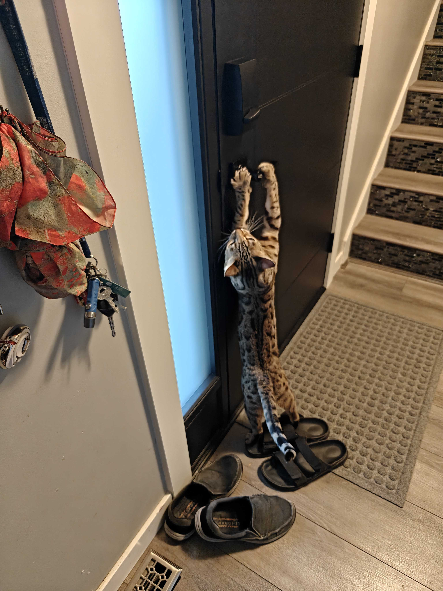

+++
title = "Hold the Door"
date = 2025-09-09T11:00:00-07:00
draft = false
categories = ["cat", "zapp"]
tags = ["home", "doors"]
description = "We replaced our house's front door."
+++



So, when we moved into our new place, the front door was very bad? Just, like, an inside door mounted on the outside, warped, with peeling paint, letting in so much cold, and instead of a deadlock just a doorknob lock.

When the doorknob lock started to fully jam, rendering the door unlockable, instead of replacing the knob, we replaced the full door with a whole new frame and insulated steel door for ~$4000 CAD (I'm not a confident enough homeowner to replace a full doorframe on my own, we paid A Guy).

Tiff really wanted a smart lock: I was dubious about the utility of the smart lock because I don't trust anything that connects to wifi, but we verified that this one works as a proper deadlock even when unpowered and can be opened with a passcode, which means I can uninstall the app and forget it exists (which is good, because as it turns out the app is dogshit and the lock often struggles to connect to wifi, meaning it's not actually that SMART).

We also replaced the knob with a more ergonomic door opening system: a lever. Building codes, I think, strongly discourage knobs now because they're hard for people with mobility issues to operate, and the mobility issue that I have is that I'm often struggling with EVERY BAG OF GROCERIES I PURCHASED on the way into the front door, because two-trips are for COWARDS. My arms criss-crossed with the purple streaks of the one-tripsman, I appreciate the easier to open door handle.

Unfortunately, our too intelligent by half cat also determined that the new handle is much more ergonomic, and can now open our front door on his own. We have to keep it locked 100% of the time now. The smart lock has been configured to lock itself if left alone, so that's fine, but I think it is pretty funny.

It was a few instanes of my wondering how the door had opened on its own before I realized what was going on. Fortunately, when Zapp escapes, he mostly just hangs out in the vicinity of our house.