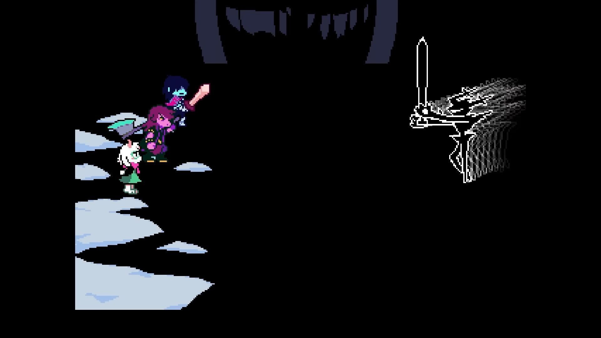
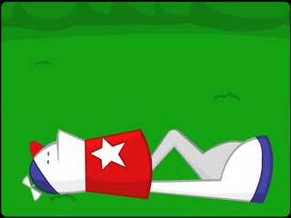
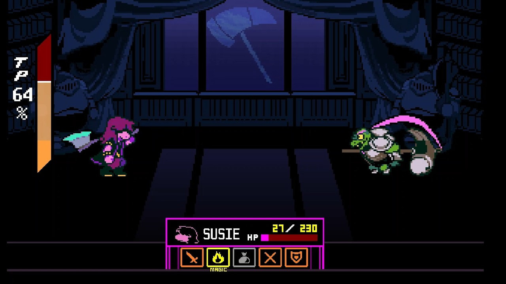

+++
title = "GOTY 2025"
date = 2025-12-30T12:00:00-07:00
draft = false
categories = ["video games"]
tags = ["storyteller", "the dark queen of mortholme", "blue prince", "stimulation clicker", "mouthwashing",
    "9 kings", "a short hike", "tactical breach wizards", "hades 2", "sunderfolk", "expedition 33", "deltarune"]
description = "my favorite games of the year"
+++

I do my own little list every year. Also, the games _don't even have to be from 2025_, I just have to have played them in 2025.

<!--more-->

## Actively Bad, Do Not Recommend

* I didn't play any bad games at all this year, I don't think.

## Not GoTY, but Fun Enough I Guess

* [Storyteller](https://store.steampowered.com/app/1624540/Storyteller/) - a clever and fun puzzle mechanic, good use of a few hours, but ultimately kinda hollow feeling once you burn through the puzzles.
* [The Dark Queen of Mortholme](https://store.steampowered.com/app/3587610/The_Dark_Queen_of_Mortholme/) - neat concept, best to watch someone else play it.
* [Blue Prince](https://store.steampowered.com/app/1569580/Blue_Prince/) - I never got so far as to write my _final_ thoughts on Blue Prince, but I got... only so far into this game. I really enjoyed one of the earliest puzzles presented to me, a _clever word puzzle_, but I felt like the Roguelike parts of Blue Prince got in the way of the _puzzle_ parts of it: it's frustrating to stumble around _not knowing whether you even have all of the components of the puzzle that you need to solve_. Many of the puzzles are just "draw tiles in the right order". Ultimately, I felt like the two core game mechanics: "puzzle" and "random mansion" kinda work against one another and left feeling kind of meh about the whole deal, _but_ the people who got _way in_ to Blue Prince got **way in** to Blue Prince.
* [Stimulation Clicker](https://neal.fun/stimulation-clicker/) - This is a web "idle clicker" style game, but it's intended as _social commentary_, and it's quite effective, at that. There's a joke in Stimulation Clicker where you order a single item from an online retailer and the game sends you easily two dozen updates on the exact position of the object you've ordered in near real time, and _now every time that happens to me in real life_ I can't help but think of this game.

## Not GoTY, but Highly Recommended

* [Mouthwashing](https://store.steampowered.com/app/2475490/Mouthwashing/) - this purported "video game" is actually a thinly disguised "short play, that you read", which makes the horror a lot more manageable: it's a horror game that I think I could actually play. It's told out-of-order, told by the world's _most unreliable narrator_, and delivered with a lot of symbolic meaning, and it's the kind of story that keeps you thinking about it for _weeks_ afterwards. A good analogue for Mouthwashing would be, I think, What Remains of Edith Finch: short, spooky, narrative-focused experience. Actual game: 90-120 minutes. Time spent watching [video essays about game](https://www.youtube.com/watch?v=vqkvucVw5AI): 4+ hours.
* [9 Kings](https://store.steampowered.com/app/2784470/9_Kings/) - "Balatro, but for X", well, this time it's Balatro for a little war game, and it's pretty fun. They're also working on 9 Kings _so hard_, I would have given it a 6/10 after my first play, but by the time I went to write about it they'd added _more stuff_ and I'd give it a 7/10, then I played some of that and by the time I got to the end they'd added _even more stuff_ and, and - honestly, they're improving this game at such a fevered pace that I'd keep a close eye on it. 9 Kings is a game for people who like watching a game break apart in front of them.
* [A Short Hike](https://store.steampowered.com/app/1055540/A_Short_Hike/) - At some point someone pointed out that the 3D Mario games all start with and _depend upon_ carefully tweaking Mario's movement until the simple act of navigating any space that he's in feels bouncy and reactive and tactile and _joyous_, and that's the same feeling I get when navigating A Short Hike's little universe: it's a game where the point is movement but also _movement feels very good_.
* [Tactical Breach Wizards](https://store.steampowered.com/app/1043810/Tactical_Breach_Wizards/) - What if XCom was tight and fast and funny.
* [Hades 2](https://store.steampowered.com/app/1145350/Hades_II/) - There's not that much to write about: _It's just more Hades_, which doesn't seem like it should be a knock against Hades 2, because Hades was absolutely excellent and Hades 2 is just _more_ of an absolutely excellent game. If you want more Hades, Hades 2 has got _more Hades_. Great way to kill some time.
* [Sunderfolk](../sunderfolk/) - they fixed Gloomhaven!

## Should be GoTY, but Isn't For Some Reason

* [Expedition 33](https://store.steampowered.com/app/1903340/Clair_Obscur_Expedition_33/) - we spilled so much ink about this one already. It's Final Fantasy X, it's Super Mario RPG, it's So French, it's So Beautiful. The last 15 years had me thinking that I stopped liking JRPGs, and this one game showed up and went "no, they just stopped making the kind of JRPGs that you liked".

## Definitely Actually GoTY

c'mon, you already know where my heart lies, it's [Deltarune](https://store.steampowered.com/app/1671210/DELTARUNE/). I gush about this game _plenty_. I'm gonna do it some more here:

Every time I've played a new chapter of Deltarune it's made me laugh out loud at least once, _and_ included a part that's made me feel Real Actual Legitimate Feelings, and _also_ included a part so gripping that I've been couchlocked through _something else important_.

Like with its predecessor, the game of Deltarune is so _seemingly simple_, basic graphics, simple gameplay, but that's a pallette that allows its creator to _do_ a lot of _weird, fun, clever stuff_. The over-wrought term "ludonarrative dissonance" has cropped up for when a game's mechanics and its story _don't line up very well_, but Deltarune exists on the opposite side of that spectrum - ludonarrative _harmony_?

This is a fight you're supposed to lose, and it feels desperate, insane, impossible, and the game itself acts confused when you try to win it.

(But you _can_ win it, because Susie's got the _heart of a champion_.)

> 
> HAWT OF A CHAMPION

This is a fight with an old man who's something of a mentor figure, who likes you and just wants to make you stronger. You notice as you work your way through it that _he hits you hardest when you have the most hit points_ because he _doesn't really want to hurt you_. It's mechanically designed to _force_ Susie to use an ability that **you've been ignoring, admit it**, her incredibly _weak_ healing magic. And as Susie works at it, it starts to get... kinda good. And this fight - it's maybe _harder_ than the fight against the impossible adversary above. But it doesn't feel that way. It feels friendly. Fun. He _wants_ you to win. You don't feel frustrated, you feel _determined_. You _like_ these characters.

These story beats line up _so well_ with game beats that you _feel_ them intuitively, and lo, the game's soundtrack is just as tightly integrated.

Look, this game is just chockablock with _moments_ like this. It's why this seemingly simple video game is quite possibly going to take 10 or more actual human years to finish.

It's like how Stardew Valley got to be _absolutely perfect_ because it's one creator's _obsessively polished vision_.

I think Deltarune is a masterpiece, by the original definition of "masterpiece": a talented creator flexing unbelievably hard.

### Tiff's List:

* Avowed
* Dragon Age: Veilguard
* Metaphor: ReFantazio
* Blue Prince
* Wanderstop
* Sunderfolk
* Dispatch
* GOTY: **Clair Obscur: Expedition 33**