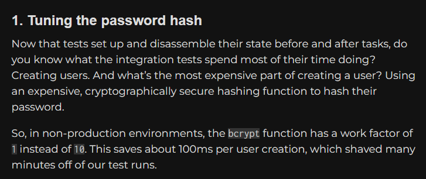
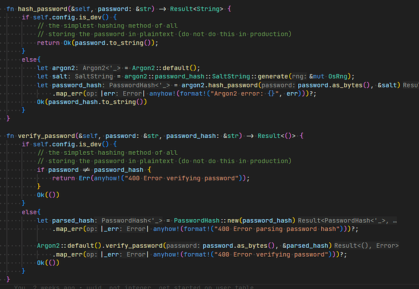
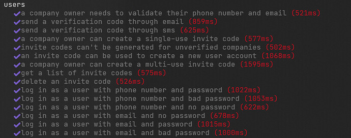
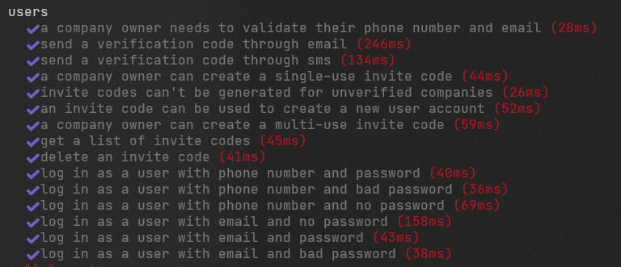

+++
title = "Hash Tuning"
date = 2025-03-11T11:00:00-07:00
draft = false
categories = ["software"]
tags = ["testing", "hash functions"]
description = "Expensive hash functions are good for security but bad for your automated test framework."
+++

I build a new auth system about once a year.

That's a weird hobby, but, it's, like, incidental to the actual hobby: I start a lot of projects using new technologies, and the first thing I have to figure out in these new technologies is always _auth_.

And every time I do, after I've got most of auth working, I have to figure out why my test suite takes 500+ms to run per test, despite my using an all-local stack of generally pretty performant technologies - in fact, a lot of the time it feels like the _more_ modern and performant my stack is, the slower all of these tests are.

And every time, I spend a whole evening investigating _why this happens_.

And every time, I eventually re-discover the same result:

**it's password hashing, dummy.**

I mentioned this 2 years ago, as a trick that I figured out to make testing VRChat's enormous backend noticeably faster:

it turns out, enforcing byzantine best-in-class Argon2 anti-brute-force password hashing technology while creating a disposable test user for every single test? That's just heating up the environment for no good reason.

There are ways around this - I've done things like
* tuning the password hasher to a much lower work value in dev
* replacing the password hasher with md5 in dev
* and
* just having a function that poops a fully created user as quickly as possible into dev without bothering with ANY of the regular user creation flow

these are all perfectly cromulent strategies, but

ask yourself this:

are my integration tests manufacturing hundreds of test users and doing full-fat password hashing for each one?

if so, maybe give'r one a these:

before:

after:

