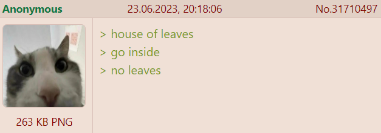

+++
title = "House of Leaves"
date = 2025-01-27T11:00:00-07:00
draft = false
categories = ["books"]
tags = ["the king in yellow", "house of leaves", "homestuck"]
+++



So, 25 years after it launched, I finally read House of Leaves.

<!--more-->

That time I read Homestuck 5 times over 5 consecutive 
I feel like I should write a very long blog post about this sometime.
:

> * it’s like if House of Leaves was awesome instead of horseshit
> * <small>I’ve never actually read house of leaves it sounds like horseshit though</small>

That time I read Neverending Story:

> (side note: this is also why I’ve been holding off on [House of Leaves](https://en.wikipedia.org/wiki/House_of_Leaves), which is also in my reading queue now that I’ve got a color e-reader)

So I've been _aware_ of House of Leaves for a long time, but I wasn't willing to fully tackle it until I had a _large format full-color e-reader_.

Which, uh: I guess I've had one of those for a little over a year now.

So I guess it is _time_.

I'll even write an article about

with a bunch of images that I stole from the r/houseofleaves subreddit because they are funny and illustrative.


------

## Reading Patterns

The first 50 pages of House of Leaves took me weeks to read. I'd open it, power through some boring-ass text, fail to see what the deal was, and put it back down.

The last 700 pages of House of Leaves took me 2 days to read. Once I got in to it, it became harder to put down.



-----

## This Is Not For You

The first line of the book. It's become something of a mantra for the community surrounding House of Leaves. It's a _warning_, intended to give this horror story some edge. Beware this tome!

I think this line puts in some work to shield the book from criticism, too: if you like the book: great! If you don't like the book? Well, it's not _for_ you.

I bet you'd live to criticize that, wouldn't you, you Critics! But you can't. It's not _for_ you.

This is also, uh, maybe a good time to talk a little bit about how _divisive_ House of Leaves is.

Loved by many, hated by many:

I wanted to characterize the reviews of this book as bimodal, mostly 5 star reviews or 1 star reviews, "love it or hate it", but the data didn't bear out my hypothesis: mostly people like House of Leaves.

Detractors of the book claim that House of Leaves is complex for complexity's sake, self important, plodding, rambling, either they didn't finish it or they finished it and they regretted it.

One histrionic one-star review claims that the books' popularity is actually a symptom of some greater disease in society, that art itself is collapsing around him:

_to lighten the mood he opines that books should have more intercourse with him_

(uh, he didn't mean it that way, he meant that part of the book is the relationship you form with the book, but the line is too funny not to include at face value.)

Fans of the book will then just turn around and go "it's not _for_ you".



There's an in-group out-group mentality to that: this is not for _you_. It's for _me_. Some people _get it_ and some people _don't_. **I** get it.

Beyond that, though, what does "this book is not for you" mean, at the beginning of the book, in Johnny Truant's

oh, btw, every narrator of this book is written with a different typeface.
?

Well, it could mean any number of things, each interpretation supported by the text:

* This is a note from Johnny Truant to _himself_, pointing out that this book is potentially dangerous to his

which: it is, good call Johnny
.
* This is a note from Johnny Truant to _the potential reader of the text_, warning them that this book is potentially dangerous to their

which: it is not, bad call Johnny
.
* This is meant to indicate that Johnny took on the task of compiling this book for personal reasons, rather than out of a desire to share it with the

Definitely true: Johnny never seems to care about the book's popularity - he is compiling it for his own, personal reasons.
.
* Mark Danielewski wants you to know that he doesn't care if you like this book, because _he_ wrote it following the death of his own father as a meditation on the complex feelings one gets when they grieve a parent who was not always kind to them.

Okay, there we go, we've made it through the first line of the book, only about ten thousand more to go.

------

## Horror Thrives Off of Ambiguity

One of the failure states of horror, one that Tiff and I frequently discuss, is that it is unbelievably difficult to _stick the landing_.

Horror is better when it goes underexplained: spooky things don't tend to _remain spooky_ under careful examination.

In this 30-minute

by this youtuber's current standards, this is an unbelievably short video

YouTube video, Hbomberguy makes the point that horror suffered in theaters and thrived on VHS partially because _the format itself_ obscured the fine details: horror is more terrifying if it's blurry and hard to parse.



This makes long-form horror incredibly difficult. Longer horror series tend towards separating into episodic horror stories &mdash; Black Mirror, Twilight Zone, the _excellent_ [The Fall of the House of Usher](https://en.wikipedia.org/wiki/The_Fall_of_the_House_of_Usher_(miniseries)), ... Goosebumps, Are You Afraid of the Dark: and that's partially because horror just works _better_ in shorter form.

So in order for longer-form horror to thrive, it has to be, well, incredibly oblique.

And boy, does House of Leaves understand the assignment.

## Puzzle-Box Writing

In fact, a lot of the time it does this _too well_: House of Leaves is one of a long series of prominent media properties that _raises a lot of questions_ and doesn't seem too concerned about _answering them, ever_.

One of the most prominent questions raised by the book is that the word "house" is always written in blue, regardless of who's narrating at any given moment.

Why? Why is "house" always blue? It can't be a persistent tic of any of the books' individual narrators, because then it wouldn't be consistent throughout the whole book.

Of _course_ this is never explicitly explained.

The real answer to the question of why the word "house" is always blue is, I think, ultimately, "because that's a compelling question to ask the reader". It is a question that makes you want to dig to find an answer.

This was, uh, a major criticism of shows like Lost and the unsatisfying ending of X-Files (neither of which I've seen, BTW, I'm aware of these criticisms only through cultural osmosis):



They raise a lot of _juicy questions_ because juicy questions get people engaged, but then they never answer them to any satisfaction, choosing to leave their solutions _up to the reader's imagination_.

This earned the derogatory term "puzzle-box screenwriting", and ... well, in a much _longer_ hbomberguy video, Harris goes on for multiple actual hours about how constantly raising juicy, leading questions _for their own sake_ and then just _abandoning them_ is actually a really shitty thing to do to your audience.



I'll argue that House of

and a different "puzzle box" obsession of mine, Homestuck. &mdash;

Homestuck actually explains almost everything, to full satisfaction, if you bother to close read it.
That's... well, rare, and nightmarishly difficult, although the method by which it accomplished this magic trick is actually hilarious in retrospect: Hussie raised impossibly complicated and difficult questions in his text, and Hussie wrote it **live**, which gave him access to a rabid, insane fan community who would put in mountains of effort creating impossibly detailed theories explaining how everything could, in fact, fit together in a satisfying way. Then Hussie just... read the forums and quietly implemented and validated the fan theories. This creates the impression that he's a brilliant author when, in fact, he just created compelling questions and crowdsourced the impossible solutions. Homestuck is a story about using clever temporal tricks and metanarrative to solve impossible problems where ALSO the author is using clever temporal tricks and metanarrative to solve an impossible problem, which is... pretty great actually.

manages to stick these landings _better_ than Sherlock, or Lost - they're all properties who introduce a lot of _complexity for its own sake_ and _juicy questions that are hard to answer_, but Sherlock and Lost felt like betrayals when they didn't actually have any good answers in them.

House of Leaves doesn't explain everything - and this powers a one-star sense of angry betrayal amongst some of its readers - but it makes its own refusal to explain itself _thematically important_.

House of Leaves is a book full of juicy, unanswered questions, but it executes a clever dodge by making itself _about_ juicy, unanswerable questions.

## The Structure

Talking about the book is going to require that I give you a brief look at what happens in it. Beware: past this point be spoilers (for a 25-year old book).

* Johnny Truant, a punk kid who's mostly interested in drugs and sex, comes into possession of the detailed, rambling, and mostly insane notes of Zampanó, an elderly blind man who was writing a book.
* The compilation of the book appeared to be something of an obsession for Zampanó.
* For some reason (the question of "why does Johnny DO this?" is actually one that I think is actually thoroughly answered by the text) Johnny decides to make it his mission in life to clean this book up and get it into a state where it could theoretically be published.
* This is that book: you're reading it now, so Johnny succeeded! But you're still getting the framing story of Johnny compiling the story through his constant elaborate footnotes that take over the story to tell you about what Johnny is up to.
*  The actual book is an academic treatise that closely examines "The Navidson Record", a short documentary film (imagine "The Blair Witch Project") covering explorations of a _very clearly evil_ house.
* _Even within the book_ The Navidson Record is dismissed by most of the academics discussing it as a hoax: but Zampanó clearly believes that this house is The Real Thing and makes a case that the events of The Navidson Record actually _happened_.
* But in a layered double-cross (that is explained in the first 20 pages by Johnny, so it's not a twist, even) it turns out that The Navidson Record and the academic discussion surrounding it are not real: most of its academic references are to books that never existed, the real people quoted in the book do not recognize the quotes they've given, and Johnny can find no evidence that the main characters of the book _exist at all_. The entire book is seemingly an invention of Zampanó. The Navidson Record is _not_ a hoax: it simply never existed in the first place.
* Compiling the book is difficult for Johnny - in compiling the book, Johnny slowly loses his mind, getting more and more trapped in nightmares and paranoid delusions and withdrawing from society.
* The book itself retells The Navidson Record in exhaustive detail

Most academic works don't, in fact, provide within themselves an exhaustive re-telling of the source material, but, of course, since the Navidson Record doesn't actually exist, we wouldn't be able to talk about it, really, if House of Leaves _didn't_ re-tell it.

* Within The Navidson Record, the photo-journalist, Will Navidson, moves into a house intending to have a _nice time_ with his family, only to discover increasing irregularities in the house's architecture.
* Measurements indicate that the house is, uh, just a little bigger on the inside than the outside? That's weird. Will Navidson becomes obsessed (obsession is a major theme in this book) with resolving this mystery.
* A freshly discovered door appears in the home, leading to... a dark hallway. Down the dark hallway? Another dark hallway, an endless procession of lightless hallways and rooms, all of them empty, all of them painted a charcoal black, the rooms getting bigger and more abstract the deeper Will explores.
* Behold: Impossible geometries!

* Will's claustrophobic wife insists that Will not explore this all by himself, causing _marital strife_.
* Will gets an Exploration Team interested in exploring the house, who bring ropes and lights and supplies.
* Whoops: the Exploration Team mostly just goes crazy and kills one another while they're in there.
* Everyone attempts to escape the house, and on the way _out_ the house starts wildly shifting in size and scale, doin' a few more kills but leaving Will's family mostly unscathed. They escape.
* Will's wife Karen takes the kids to New York while Will broods and obsesses over his footage.
* Eventually Will goes back in.
* Karen goes back to the house to find Will, but he isn't there.
* Johnny has a full schizophrenic break from reality, losing months at a time, his footnotes starting to appear out of chronological order, or describe events that never happened.
* After the book is released, Johnny appears to enjoy a moment of peace and relaxation.
* Johnny tells a story about a boy who died shortly after birth, shepherded by his oddly mystical mother.
* Karen braves the dark, despite the claustrophobia, to be with her husband. They escape once more, this time selling the damn house.
* The book ends.
* Some Zampanó appendices and footnotes.
* _(most of the stuff past this point was added after the fact for the second edition of the book)_
* included in the Appendices are all of the letters that Johnny saved from his mother, Pelafina, who wrote to him from the mental institution where she was kept after she, in a break from reality, attempted to strangle Johnny to death when he was 4 years old.
* at the end of the letters is included the notification that Johnny received from the institution when his mother committed suicide during one of her bad breaks.

and that's it, that's the book!

## The Book Itself Contorts

The thing that a lot of people remember about House of Leaves is that, in the parts that take place within the deepest and darkest parts of the house, the book's text gets wonky, contorting and shifting to force the reader to ... adjust to its strangeness.



this structural difficulty is _mostly_ saved for the parts of the book exploring the darkest depths of the house.

Another detail of the book is the near constant

nobody else does this
: in fact, Johnny Truant, arguably the main character of the whole book, exists
_only_ within the introduction and footnotes of this book.

## Johnny Gets Fingered

Johnny Truant, the unreliable narrator who compiled this whole tome, continuously interrupts the book's flow to tell these long, rambling stories about his happy-go lucky life of taking drugs with Lude, inventing elaborate stories on a dime in order to impress women (and hide from the much darker stories that he implies outline his actual past), and his myriad improbable sexual conquests.

Fans of the book, of course, will defend that Johnny is enormously important to understanding the whole thing: even if it is just through footnotes, the book is _about_ Johnny, and establishing his character is just as important as the mock horror tale that exists within its pages.

Most of these stories are told in intense, lurid detail, however, and even fans of the book easily admit to getting sick and tired of Johnny's frequent and meaningless interruptions, especially in the first 100-odd pages of the book.

Even if the _point_ of these interludes is (I believe) to gradually call into question Johnny's reliability as a narrator... they're exhausting.

It's the topic of the [top reddit post _ever_](https://www.reddit.com/r/houseofleaves/comments/1g23mfq/dear_reader/) on the `/houseofleaves` subreddit. And the next few after that.  Shut the hell up, Johnny.

## Zampanó Might Be Worse

Johnny may be irritating, but Zampanó is honestly pretty bad, too.

He apes a lot of conventions from academic writing, including _endless navel gazing_. He can't seem to form a complete thought without referencing a dozen other works: Zampanó is just presenting these ideas, he's not generating new ones.

But _of course_ Zampanó _is_ generating new ideas: his references are entirely

ChatGPT learned it from Zampanó.
, as is the entire _topic_ that his book covers.

When he uses _real_ references, he uses a sneaky technique that the book calls out: to appear more well-read than he actually is, he'll read a single primary source that brings in a number of quotes from secondary sources, then reference the secondary sources directly while leaving out the primary source.

You know, like when folks just read the Wikipedia article and _reference all of the things referenced by the Wikipedia article_ without mentioning that all of the work of compiling these references was just A Single Wikipedia Page All

This was the subject of YET ANOTHER hbomberguy video, I need to find a different _guy_ to reference, why is this one video essayist so frequently relevant in this particular discussion?
,

When people complain that House of Leaves is unbearably stuffy and pretentious but ultimately kind of hollow of meaning, it is generally Zampanó's writing that they are carping about.

## The Impossible Question of Who Wrote "House of Leaves"

I think one of the core mysteries of the book, and the one it is least willing to give up, is _who wrote what_. Every source of information in this book comes from an [unreliable narrator](https://tvtropes.org/pmwiki/pmwiki.php/Main/UnreliableNarrator) who may or may not even exist. It's a 50 unreliable narrator pile-up!

That's why the blue "house" remains such a compelling mystery: it is a persistent detail _regardless of who's narrating_, and since the book itself exists within the story it raises the question: did one person write the whole thing? And if so, who?

Johnny, of course, is both a consummate liar and serial storyteller who invents elaborate stories as a defense mechanism and is revealed to be _significantly_ more intelligent and well read than he lets on. One of Zampanó's bad habits is including long stretches of quotations in other languages, which Johnny has to struggle to translate &mdash; but events later in the book conspire to reveal that Johnny may, in fact, just know these languages, his struggles in translation may be fabricated. _The only lasting record of Zampanó's existence_ appears to be Johnny's memories of him, as most of the people who could corroborate his existence are... dead, and also hard to corroborate. Zampanó is an odd and fanciful name, and Zampanó himself is blind and yet seems to have an awful lot to say about the visual composition of Will Navidson's photojournalism.

Zampanó could absolutely be a fiction created by Johnny, his intense effort "compiling Zampanó's notes" instead disguising the even more intense effort of fabricating them.

Zampanó himself is revealed through the text to _also_ be a consummate liar, given that he has prepared an elaborate academic treatment of a documentary film that doesn't _actually exist_, stocked by a great many academic references that _also don't exist_.  To futher muddy the waters, in a footnote, Zampanó describes his desire to invent a mythological "perfect son",
going on to describe, in detail, what seems like a rough sketch of Johnny. It even includes a subtle jab at the sort of readers who would _ignore the Johnny footnotes_ just because they're unreadable trash.

Johnny could absolutely be a fiction created by Zampanó, an elderly blind man who always desired to have a child who _cared about his work_.

Johnny's very last words in the book describe a scene where a newborn baby (very like Johnny) dies in hospital in the arms of a woman who is very like his mother, Pelafina. Did Johnny exist or was he just a projection of a sad storyteller?

And, of course, Pelafina's footnotes also introduce this brilliant mad-woman who seems to constantly introduce themes and concepts that would later show up in House of Leaves. Are these concepts in House of Leaves because she was an enormous influence on Johnny, who subconsciously edited them into the text? Or because Johnny _fully wrote the text_? Or because Johnny died shortly after he was born, and Pelafina wrote the whole thing?

The question of _who invented what_, here, is both central to the mystery of House of Leaves and _utterly unanswerable_. Investigating it just leads one down rabbit hole after rabbit hole, as each path seems to draw you in while also defying any kind of explanatio...... oh damn.

Oh, damn.

## The Book Is The House, The House is the Book

I'm a sucker for meaningful framing devices.

It shows up in a lot of fiction, I also loved The Grand Budapest Hotel, a wonderful movie where the framing is key to its telling, and Asterios Polyp, a graphic novel where the form and structure of the novel echoed its _themes and direction_.

The book, House of Leaves, has a cover that's a little short. The cover of the book doesn't extend all of the way to the end of the pages. It's, uh, how do I say this, _bigger on the inside than the outside_.

House of Leaves, the book, is full of these long, meaningless, irritating digressions that go nowhere, and _also_ takes the time to explains to you in an aside that solving a labyrinth can be performed exhaustively, but that this would take forever, and suck, which is why the only way to get through at any kind of a clip is to _pick a path_, not going too fast or too slow but deciding your own pace and committing to it before you realize that _whoops, you've become irrecoverably lost_.

The way to read House of Leaves is to be a bit discerning about what you even _choose_ to read, made easier by some of Zampanó's longer interludes just being _him listing off various names of architects for 8 straight pages_.

Which is to say: like a labyrinth, you can navigate House of Leaves by working through it exhaustively, which sucks, or by choosing threads and pulling on them at your own pace, which will get you lost.

The book describes _a labyrinth_ that
demands to be explained, yet contains no answers and engenders obsession and madness from people who _demand_ those answers.

Also _the book itself_
demands to be explained, yet contains no answers and engenders obsession and madness from people who _demand_ those answers.

The main character of the book tries to fully understand the mysteries of the book and goes mad trying.

Seemingly an endless, infinite, self-referential loop, but actually pretty easily explained if you think about it.

## Technically, Nothing Happens

While there's a horror story _in here_, one of the most obvious conclusions to the story is that an increasingly schizophrenic Johnny inherited a huge pile of academic notes from a dead man, and it triggered a bunch of latent trauma, causing him to revise and revise and revise until it told the exact kind of elaborate and completely fabricated story that Johnny was prone to concocting.

Zampanó (the _least_ well defined character in this story) may or may not have been an invention of Johnny but whether or not he _is_ an invention of Johnny is hardly important, because Johnny's treatment of his materials is likely to be so comprehensive and warped that his original perspective would have been mostly overwritten anyways.

This book is nothing more than the ravings of an imaginary madman.

## The Actual Answer To The Impossible Question of Who Wrote "House of Leaves"?

Mark Danielewski, obviously. Someone had to point these mirrors at one another and then hand it to you like some kinda big fuckin' mystery.

## Johnny's Mother's Impossible to Decipher Letter

The one question that the book always seems to attempt to answer, in the case of _most_ of its characters &mdash; even its second-order-fictitious-ones &mdash; is _why_ do they do any of this? Why do they become obsessed so easily?

Why are they projecting their own obsessions and madness on to this story?

Johnny, as the central character around which this whole tale revolves, is the one who gets the most exploration.

Johnny, it is revealed, has kept every letter his mother had ever sent him from her asylum. She was _enormously_ important to Johnny. She was afflicted with the same kind of paranoid schizophrenia as Johnny, but while Johnny's response to it was introspection and self-analysis, his mother Pelafina tended towards a kind of grandiose narcissism. He kept all of her letters, but she kept just one of his.

Pelafina would frequently mis-remember details, invent things out of whole cloth, generate pleasing stories to tell herself as a salve.

And when Pelafina became increasingly paranoid, she'd begin to layer encoded messages _into_ her messages to her son - encoded messages, that, when read, felt _more real_ (because of the effort involved in decoding them) but were, of course, still nonsense.

Then she sends this letter to her son.

It _seems_ pregnant with meaning, overflowing with a code that lies _just below the surface_. These words appear again and again throughout the book, they must be some kind of code &mdash; but I checked online, and 25 years later nobody has cracked it.

Because there is nothing to crack.

Ultimately, at the center of all of this puzzle solving, it's just made-up nonsense, just overheated minds attributing meaning where none exists. It defies reason. It's just nonsense and we're reading too much in to it.

> [Page 633](https://www.reddit.com/r/houseofleaves/comments/j5ryae/notes_on_the_three_attic_whalestoe_letters/)
>
> This page. This fucking page. [I've spent a lot of time on this page.](https://imgur.com/9paUZEd.jpeg) I think that's maybe the point of it. Here, at the nucleus of Pelafina's madness, the riddle is unsolvable. Before, the meaning was concealed in codes, but no matter how much effort Johnny or the reader puts into these words, they [mean nothing](https://en.wikipedia.org/wiki/Word_salad).
>
> *However.*
>
> The words may not mean much in themselves, but their significance is so enormous that any attempt to construct an all-encompassing interpretive lens for *House of Leaves* must take them into account. That's because they reappear all over the book. Not just words, but whole phrases appear in Johnny's poems, elsewhere in Pelafina's letters, and *even in Zampanò's writing.* For the sake of brevity and sanity, I will leave it there, and you can do whatever you want with it.

And that is kind of key to the whole book. You can easily imagine Johnny, desperate for communication from his mother, trained to find hidden codes and ciphers in everything, already prone to [apophenia](https://en.wikipedia.org/wiki/Apophenia), poring over these words again and again and again, attempting to solve this unsolvable puzzle forever until it spirals out, destroying his life.

This is the same self-destructive impulse that could cause Johnny to compile House of Leaves, why he would do it despite it driving him mad.

This book is this page, too: a meaningless labyrinth, meant to be explored but not understood.
Like the [Codex Seraphinianus](https://en.wikipedia.org/wiki/Codex_Seraphinianus) it's meant to _evoke_ internal consistency without needing to _contain_ it.

## That's Why It Works

A lot of people don't like House of Leaves because Zampanó is unbearably pretentious and Johnny is unbearably lewd, this is a an entirely valid complaint and I think a good reason to have not enjoyed House of Leaves.

A lot of people like House of Leaves because it's a rich, layered, seemingly-solvable mystery and they can devote many hours to trying to unearth its rich trove of mysteries.

A lot of people don't like House of Leaves because it's fundamentally an unsolvable mystery where most of the threads lead _nowhere_.

I think that House of Leaves works and is worthwhile because _it is thematically and structurally about unsolvable mysteries_. It's a rumination on the meaning and draw of unsolvable

Like, for example, the unsolvable mystery of death, which had just, at time of writing, claimed Mark's father, causing Mark himself to experience a bit of an unhealthy fixation with an unknowable concept. Grief, too, is a major theme of House of Leaves. The house is death. The house is grief.


The book is the house, the house is the book, and both the book and the house are impossible, unresolvable labyrinths concocted by grieving conmen with unhealthy fixations.

## Academic Faffing: This Book Demands To Be Discussed

Fascinating.

One feature of the book that honestly almost seems a little silly, even if it _is_ made up by Zampanó (or Johnny, depending on your interpretation), is just the sheer volume of words fictitiously spilled on the topic of The Navidson Record.

Zampanó discusses _hundreds_ of sources while compiling his notes. For a small documentary dismissed by most as a hoax, the amount of literary ink spilled on the topic of The Navidson Record is _wild_. At some point he alludes to folks writing hundred-page diatribes covering a single page of correspondence between Will and his wife &mdash; diatribes that Zampanó will helpfully summarize for your benefit.

This book is just as interested in the conversation surrounding the book as the book itself.  Which, again, is structural and self-referential: the open, unresolvable, puzzle-box nature of the book of course means that it is _itself_ nearly irresistable to TALK ABOUT, which is how I've managed to spill some 2000 words covering it so far.

The book invites that discussion while also containing within itself myriad examples of the kind of endless dissection that it so clearly invites.

It’s got that kind of “abstract art” quality to it where you can take a lot of different lenses to it and get something different each time, which is powered a lot by how vague and dense it is and how much you’re willing to bring to your particular read on it.

That’s a strength of metaphor-heavy, symbolic fiction, like… Moby Dick. That white whale was never just a whale, but when it comes time to determine what exactly it was, well — that’s an exercise for the reader. Get out the interpretive lenses baby, it’s time to cook.

No question, though, a lot of readers (myself included) can find that kind of inchoate storytelling frustrating.
**But what happened though!?!**

## Infohazard

_good god damn this book is hard to stop thinking about_

I’ll be chillin’ at work trying to put together Avatar Grembling or whatever the feature of the week is and suddenly I’ll just think “but was Johnny real tho”.

_this book is exactly the sort of infohazard it purports to be_

## Why Is The Internet Obsessed With This Book?



Man Carrying Thing here makes the, I think really valuable point:

> so much of this book’s flaws, you can support by saying “that’s intentional”
>
> Johnny Truant and Zampano are two of the most obnoxious narrators but also the most obnoxious writers, and there is some pretentious writing in this book that is played to be the point?

Just because a book is metanarratively and thematically **about** being badly written, impenetrable, sexist, frustrating, self-contradictory, meaningless, and the topic of endless circular debate… doesn’t… mean it’s **not** badly written, impenetrable, sexist, frustrating, self-contradictory, meaningless, and the topic of endless circular debate.

Something can be fascinating and even self aware without being… y’know… 
you know, like (he gestures around) me


Like, I love The Room because it’s a fascinating trainwreck and it’s fun to dig in to, but also The Room is objectively a terrible piece of fiction.



Part of the reason that The Room succeeded where other terrible projects fail is that that it has that so-popular-in-the-2000s meta-narrative layer, just by accident:

The story’s heavy-handed, confusingly-told message of the perfect and flawless Tommy (played by himself) and his utter betrayal at the hands of a feminine wretch - it works because you can’t help but look at it and think about _who MADE this_?

And if you include the extra story that you concoct in your head while you watch it: It’s actual art, something you can’t see anywhere else: the story of a bad break-up, told very badly, from the point of view of an complete idiot who doesn’t understand what happened at all.

## Conclusion

anyhoo, that's a _soft recommend_ from me

