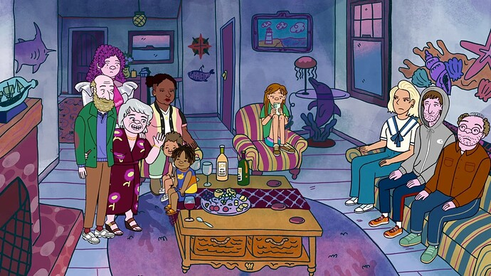
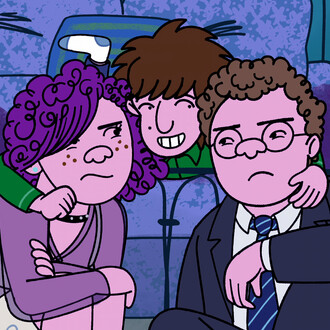
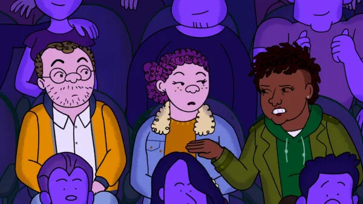
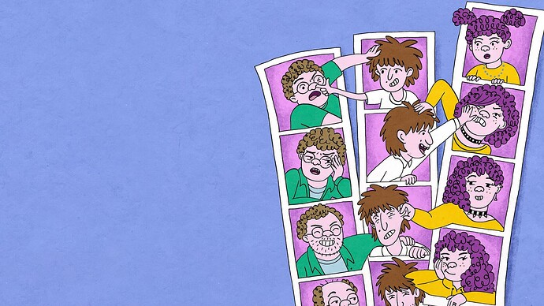
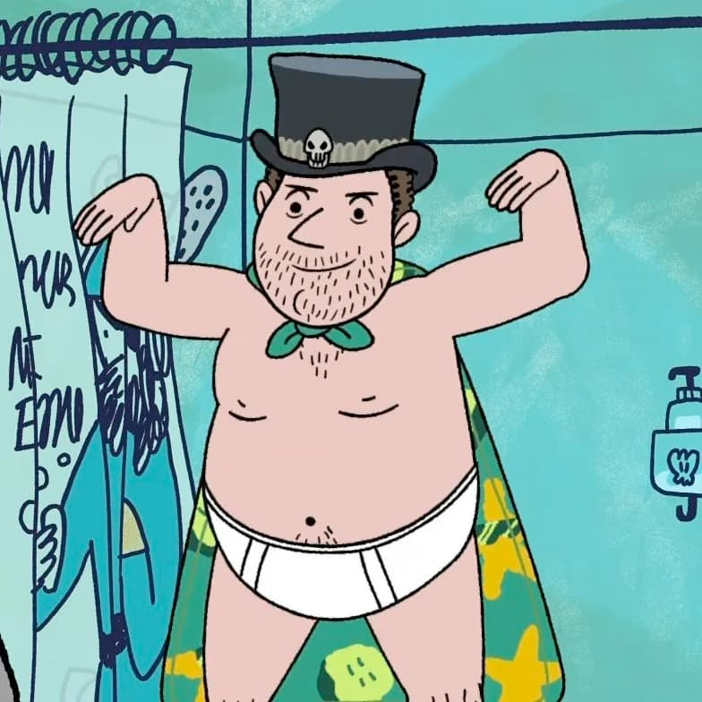
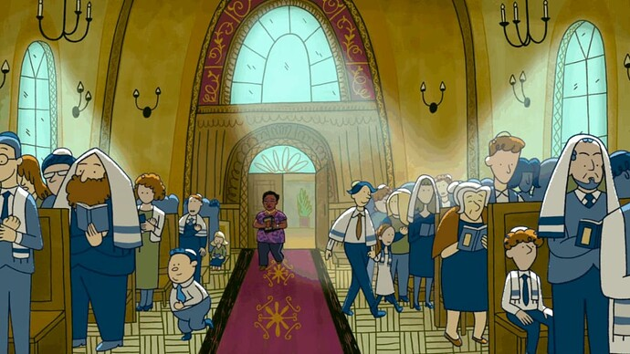

+++
title = "Long Story Short"
date = 2025-10-16T12:00:00-07:00
draft = false
categories = ["media"]
tags = ["bojack horseman"]
description = "the most jewish show on television, for what that's worth"
images = ["longstory.jpg"]
+++



<!--more-->

A new story from the creator of Bojack Horseman, this one is a family comedy.

The gimmick is that it’s set, kind of variably, in the years between 1950 and 2025 - different scenes and stories are set at important moments in the life of each of these characters.

Most of these characters are awful in one way or another, and you get to see exactly how and why they turned out that way. It’s funny!

One of the questions I like to ask myself when I’m writing about media is “what is this about”?

Long Story Short is, as far as I can tell, about family toxicity and judaism.

Avi and Shira are both intensely resentful of their domineering, difficult, histrionic, narcissistic, overly critical mother… and, yet, mirror images of her in many ways.

This makes them _difficult, self absorbed adults_.

Yoshi’s a little different: as the youngest he got a lot less attention and focus, struggled with the low expectations everyone had for him as the youngest - and instead seeks roots and meaning and challenge as an adult while being a bit of a fuck-up.

This is in no small part exacerbated by his idiot best friend, a wealthy failson and object lesson in poor impulse control.

We don’t see idiot best friend as much past a certain point - which makes me wonder if Yoshi’s search for meaning and structure was helped along by something tragic happening to his doofus.

So, in large sense about how these adults are shaped by childhood experiences, and often for the worse.

------

This show is _extremely and a lot about judaism_.

The show revolves around the ceremonies and ritual of judaism, and it takes time to explore every character’s relationship with and reasons for interacting with (or not interacting with) judaism - whether it provides “something to believe in that’s not just work”, “structure and guidance”, “community and validation”, “a feeling of connection to lost relatives” - each character has a different relationship with their faith and it’s a big part of the show.

> “There’s no wrong way to be Jewish.”
>
> “But there is — a progressive egalitarian Conservative Judaism with an emphasis on ritual and community over faith and blind practice. That’s literally the only way it makes sense. I figured it out. And I gave it to my children because I love them. But they reject it because they want to reject me.”

I, uh, of course, don’t have much of a relationship with faith, but I don’t object to seeing people explain the myriad ways that it’s personally meaningful to them.

------

Anyways: it was good and I liked it. Season 2 confirmed, so more’s a-comin’.