+++
title = 'Sakamoto Days and Ranma'
date = 2025-09-04T04:00:00-07:00
categories = ["media", "anime"]
tags = ["sakamoto days", "ranma"]
description = "i watch some stuff"
images = ["sakamoto-1.jpeg"]
+++

Sometimes I feel like I need to justify my popcorny TV watching habits: so, I watch TV while I code, which means that I can’t watch anything deep or cerebral because that’s too engaging. No Pantheon, no Ghost In the Shell: Stand Alone Complex, no Arcane: when I’m coding I need something more in the Brooklyn Nine Nine territory.

Anyways: **Sakamoto Days**!

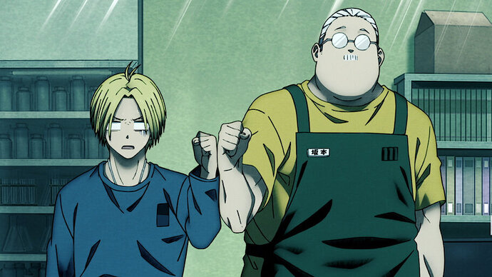

It’s a comedy/action Netflix anime that’s… okay, I guess?

See, Mr. Sakamoto here is basically One Punch Man, goofy looking but essentially an invincible god.

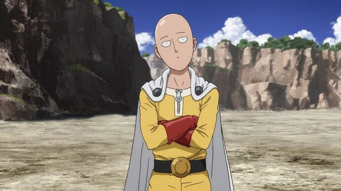

Mr. Sakamoto used to be the #1 Hitman in the entire assassination world, and then he met a girl, gave up man-hitting, had a family and got fat, and here we are. He gets a huge bounty on his head, and spends most episodes fighting off standard anime wild & wacky assassins.

As in One Punch Man: because Mr. Sakamoto is essentially established to be an unkillable force of nature, any time the show wants to manufacture any drama, they need to bring in some of his less powerful friends to get in a fight while Mr. Sakamoto is having a nap or whatever.

As in One Punch Man: it starts out as an action comedy but after a while they seem to forget the “comedy” part and just start making what feels like a pretty standard FIGHTY FIGHT ANIME.

### The Regular Guy to Clownpants Ratio of Realism in Comic Universes

One thing you have to ask yourself when going in to a show: how many regular guys with guns would it take to defeat a single weirdo in clown pants? That makes a real impact on the show.

Sliding scale, here, like, in a realistic universe, one might expect that the exchange rate would be just 1 - one regular guy with a gun could handily defeat a weirdo in clown pants.

In a comic book universe, there is no amount of regular guys with a gun who could ever beat a weirdo in clown pants:

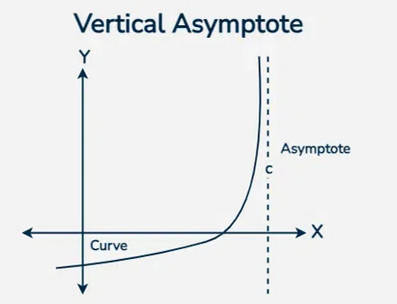

Sakamoto Days exists in this kind of universe: Mr. Sakamoto is fast enough and strong enough that there is literally nothing that a billion yen price on his head has to threaten him with except mild inconvenience as he’s constantly having to repair bullet holes in his little convenience store.

Once we’ve established that, the show goes with just a time-tested anime plot: an endlessly rotating [Carnival of Killers](https://tvtropes.org/pmwiki/pmwiki.php/Main/CarnivalOfKillers).

I'm going to admit it: I love a Carnival of Killers. Seriously, give me a show or a story and say "you're going to fight a numbered list of guys with wacky themes" and I'm _all aboard_.

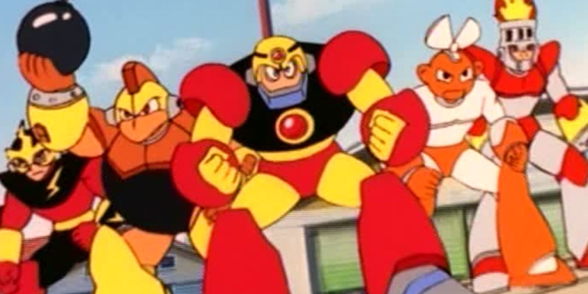

Mega man. Pure cinema.

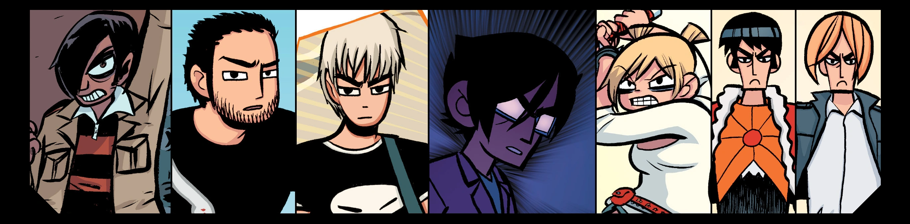

Scott Pilgrim. Love it.

I'm also told it's a reliable way to give your players something to do in a TTRPG like D&D. Things are feeling a little lost? Well, then, how about 5 to 8 wacky _colorfully themed foes_ to fight? Doesn't that just activate something primal in your _psyche_? Maybe it's just me.

We’ve all seen it before, we’ll all see it again: we introduce some guy covered in pool cues and chalk, and he’s like “MY NAME IS CUEBALL” and then he makes a crazy face, licks some blood off of his pool cue, kills some mook in an impressively arcane way while shouting “bank shot” and laughing maniacally, and then he tries to take on Mr. Sakamoto who fully whips his ass with some shoelaces and some gum he had in his 
_technically Cueball does not actually exist in Sakamoto Days, but, like, honestly this is not far off from the formula_
.

Once that starts to get a little old, we start going to some of the other tired anime cliches - now an arc where we’re trying to figure out why Mr. Sakamoto has a price on his head, to give him something to do - eventually, in order to do that, Mr. Sakamoto and his friends have to enrol in **assassin school**, putting them through a complex multi-round gamified selection 
every anime turns into Hunter X Hunter if you leave it in the sun for long enough
.

I honestly don’t mind watching a show where a guy shows up with a weird hat and we get to watch for a while and go “I wonder what his deal is”, and then he explains his whole deal and then there’s a little fight and we move along.

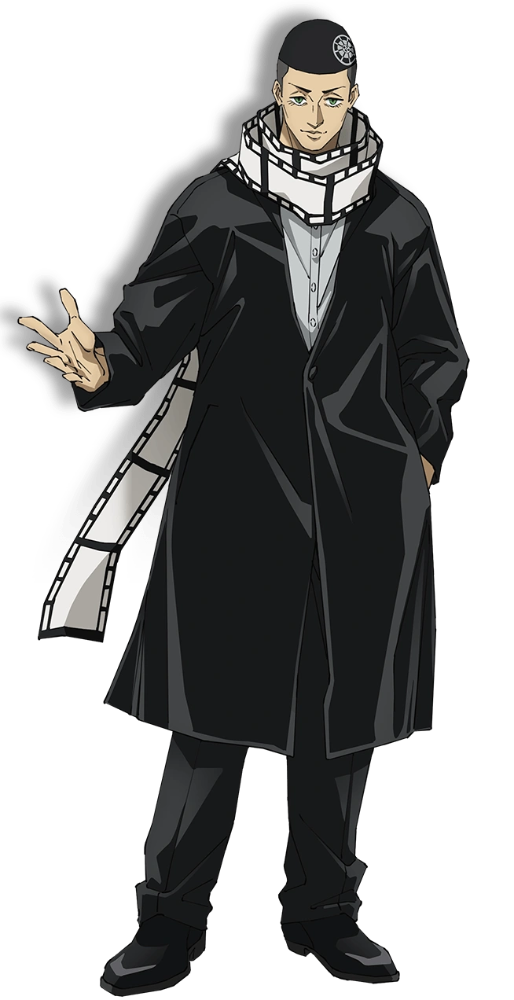

_guess what, his deal is that he likes movies, and also is an insane murder guy, because they’re all insane murder guys_

Every now and then Mr. Sakamoto has a fight that’s hard enough that he has to get serious, at which point he moves so fast that he instantly loses a tonne of weight and turns into Mr. Sakamoto (original recipe):

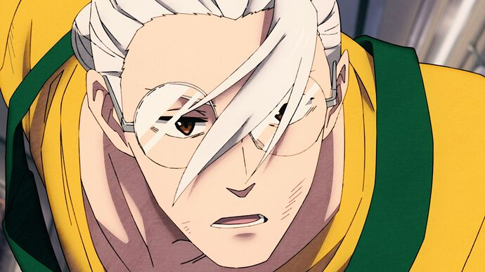

then, after the fight is over, he gains all of the weight back right away:

This isn’t, like, a metaphor or anything, like, other characters can see it too. What the show never mentions or even addresses is that his moustache comes and goes with the fat.

Eventually the show gets tired of this and an acupuncturist takes away Mr. Sakamoto’s ability to do this forever, which is, honestly, the better choice, IMO.

------

## Ranma 0.5

So, I’ve long been familiar with the general idea of Ranma ½ - it was a popular anime when I was a kid, like Tenchi Muyo! or Macross Plus.

“So, it’s an anime where there’s a boy, and when they’re soaked with water, they turn into a girl. Also I guess there is a panda?”

I never really poked into it any further, although I was always curious what the deal was.

Lo, a new anime adaptation of Ranma ½ launched, like, just recently (2024, apparently) - and shortly after was picked up by Netflix for global distribution. I guess if there’s any time to get into it, it’s now.

### First of All, The Look

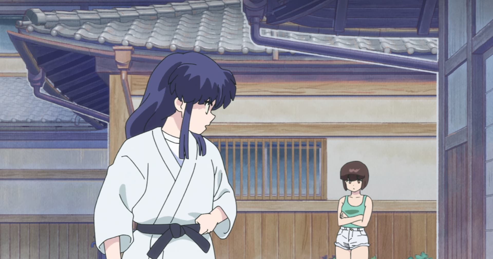

In my opinion, immaculate. This looks like 90's anime but, you know, if you actually go back and watch 90's anime it's often kind of a mess - lots of clever tricks to make the most of a low animation budget, filmed in glorious 333x480 - none of that, here, this looks expensive, high-resolution, crisp and smooth.

Then they’ll throw in some crisp modern motion graphics for chunky sound effects!

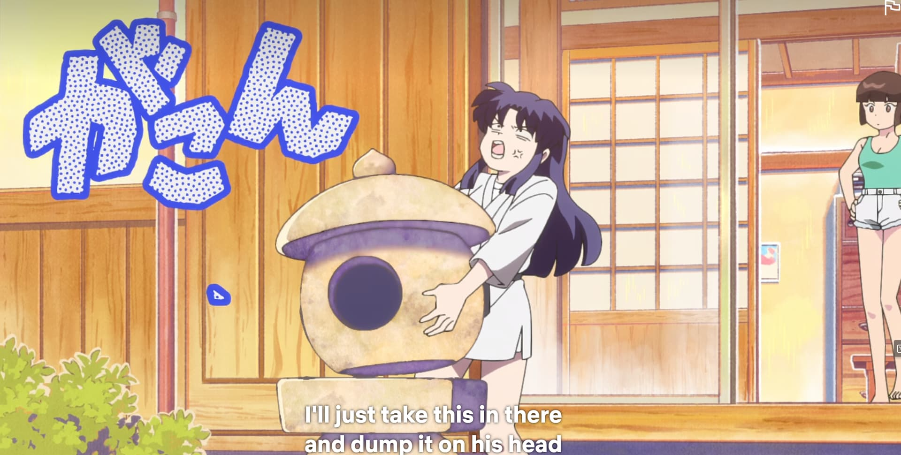

It’s, like, _evocative of manga_, but stylish and well put together.

Also, a fight broke out and for a while they replaced all of the blacks with purples. Neat!

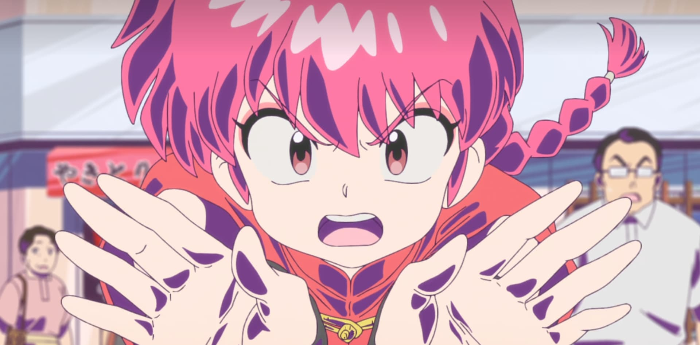

Like, I don't know _why_ they did this but it looked visually arresting.

### Second of All: Wait, This is What Ranma Has Been About All Along?

The only thing I knew going in was that Ranma was a gender swapping comedy manga.

I figured, based on the concept, that Ranma would be a dumb raunchy sex comedy and/or a comedy of errors about Ranma hiding either his girl or boy sides in a variety of situations.

You know, like a Tootsie or Mrs. Doubtfire.

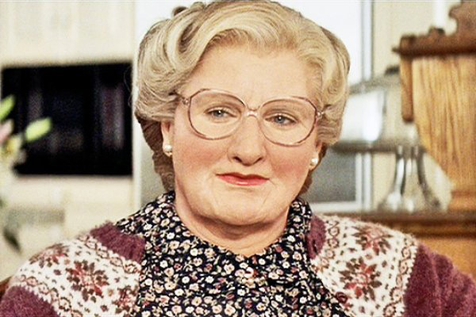

But, uh, no! Not at all!

I mean, it contains gender-swapping, but it doesn't lean on the western comedy tropes I would expect given that as a premise.

### What is It, Then?

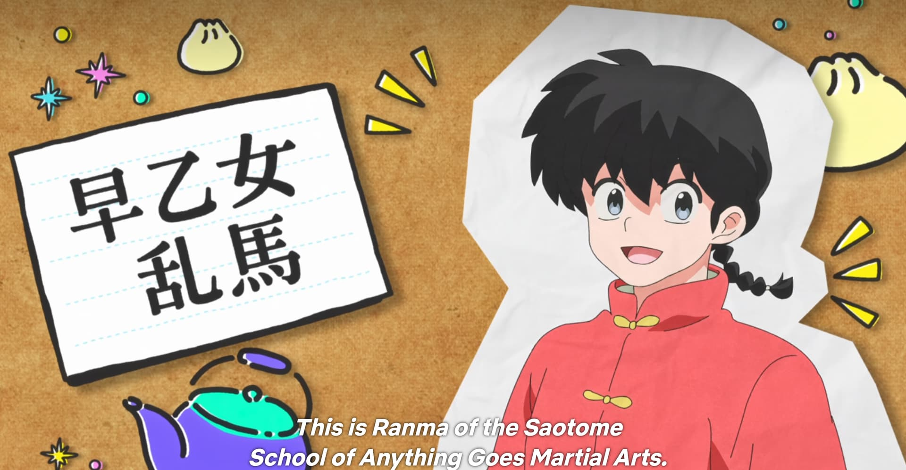

Ranma is a boy. He’s cursed to be a girl sometimes when doused in cold water - but he was born a boy, prefers to be a boy, identifies as a boy all the time, and so is pretty firmly "boy". Hot water turns him back, which is why “giant pot of hot water” makes an appearance in nearly every episode.

For reasons that largely don't matter, he’s stuck to be arranged to marry a girl named Akane. They’re both super young, so they don't have to actually _get married_ yet, but... someday. They don’t like each other very much at first, so their dads are waiting it out, so I guess these two just... go to high school together for now. There's [tsundere](https://en.wikipedia.org/wiki/Tsundere) romantic tension between the two.

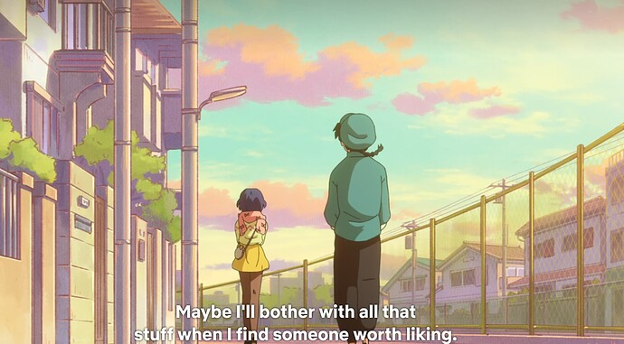

Let’s go to the 3-Venn diagram describing the core properties of every single Shonen I'm only slightly exaggerating:

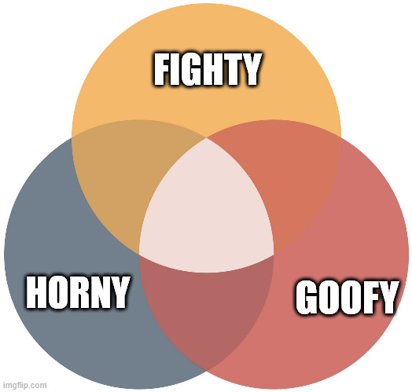

**Dragonball Z**? Fighty.

**Love Hina**? Horny.

**Yakitate!! Japan**? Goofy.

**Cowboy Boop Boop**? Mostly fighty, but a little bit horny and goofy.

**Rurouni Kenshin**? Fighty.

**Inuyasha**? Fighty.

Anyways, based on the limited data I had, I assumed that Ranma ½ would slide neatly into the “Horny” category, but I was wrong. It’s actually a little bit of everything, with way more "fighty" than I'd have expected!

See, Ranma Saotome is actually a super good fighty boy who fights super good, so a lot of the series is about Ranma getting in fights! Big overwrought anime fights! In fact, the series has to go to some pretty absurd lengths to keep Ranma constantly in a situation where he is always fighting something, considering how he’s a teenager in a regular Japanese school.

At one point, for example, the schools hold a … uh, combat gymnastics meet-up? Where the rules are, the girls are supposed to hold a no-holds-barred cage match, but they’re only allowed to fight with … gymnastics stuff?

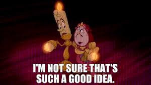

Or a different episode, where a random girl invites the characters to a **high stakes skating duel that is somehow also a fight**, and even though the character have basically no serious skating experience they agree **immediately**.

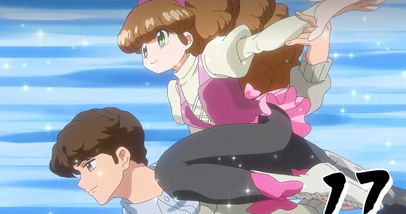

In fact, any character in this show can point at Ranma or Akane, declare a fight with any stakes and any rules, and they’ll immediately accept that.
If I were to point at Ranma and say “you and me in a computer hacking challenge, and if I win I get the deed to your father’s dojo” they’d be like “I GUESS I HAVE TO LEARN PROGRAMMING!”

That covers “fighty” and “goofy”, as for “horny” - well,

Remember how I figured "a bunch of the humor is going to be derived from Ranma hiding or concealing his gender?" Nope! Ranma seems utterly unconcerned with keeping the secret of his gender transformations. I figured that’d be the engine of the show’s comedy, but in fact he seems pretty willing to reveal it to basically anybody who cares to listen. In fact, the comedy often lives in the fact that despite this, nobody outside of the core family ever seems to clue in.

But since his transformation requires, essentially, being doused in water, like 50% of this show is spent with Ranma in various stages of dunking himself in water.

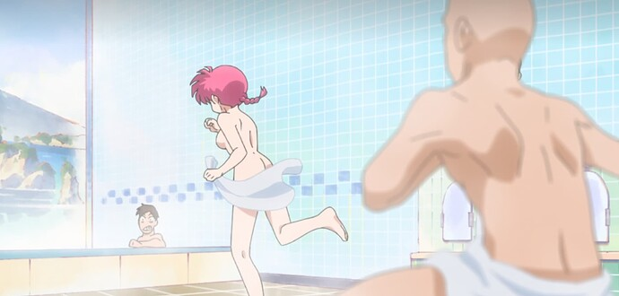

Anyways: I was curious what Ranma is, and now I know!

It’s… kinda dumb! I don't mind it at all!

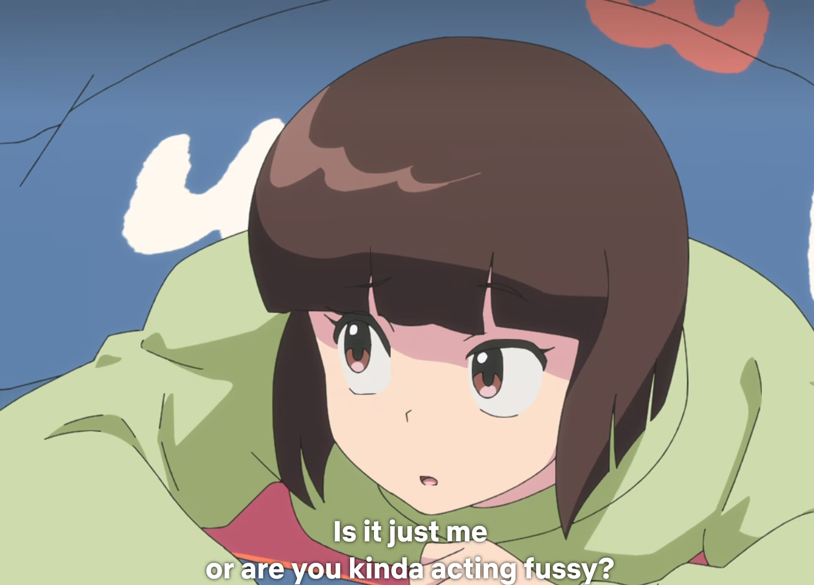