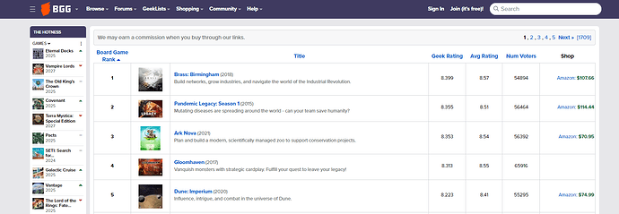
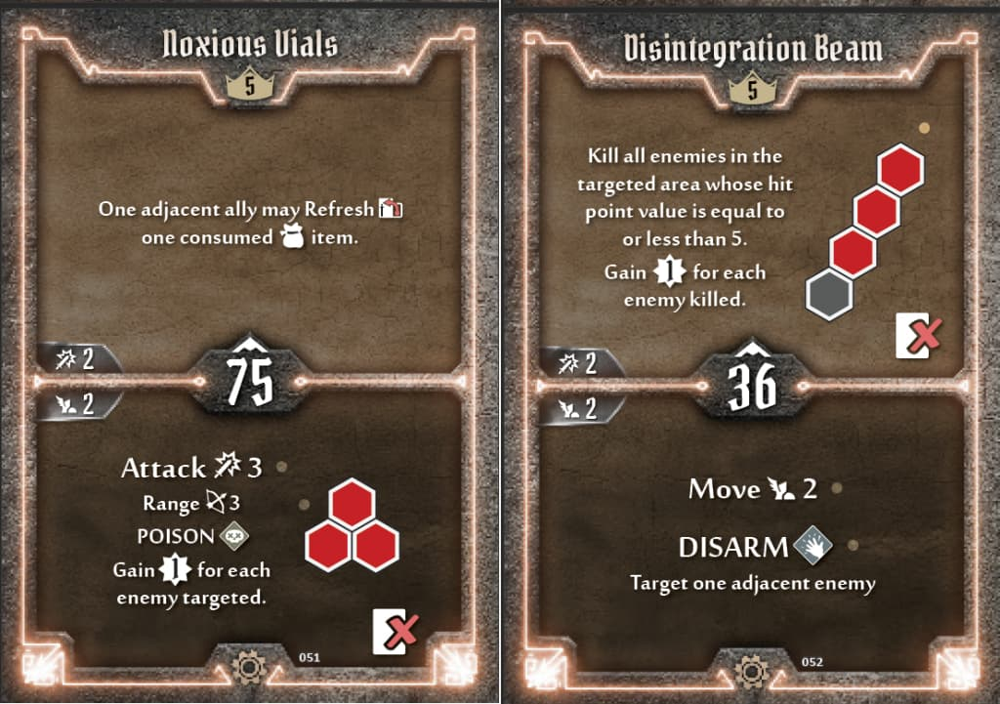
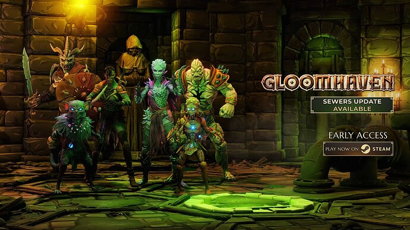
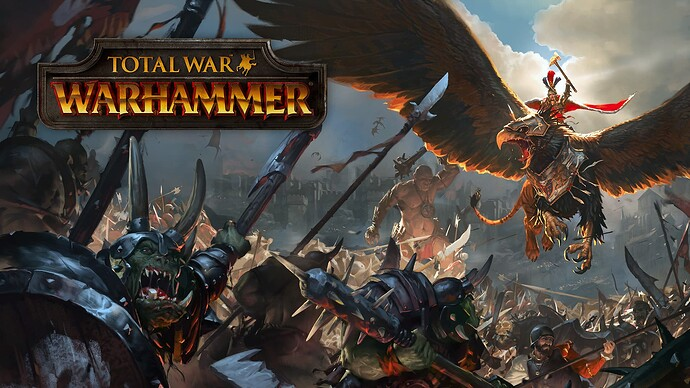
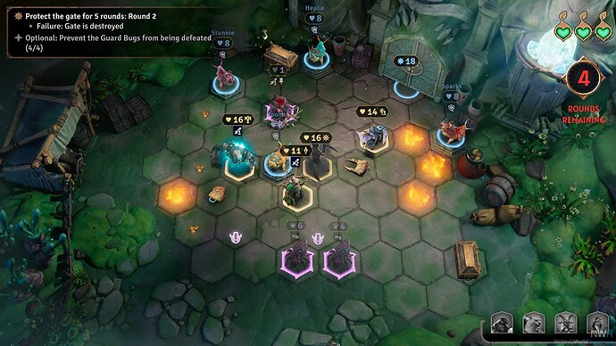
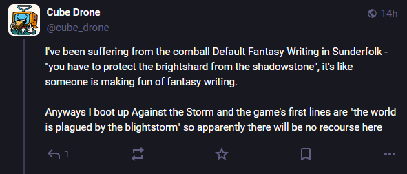
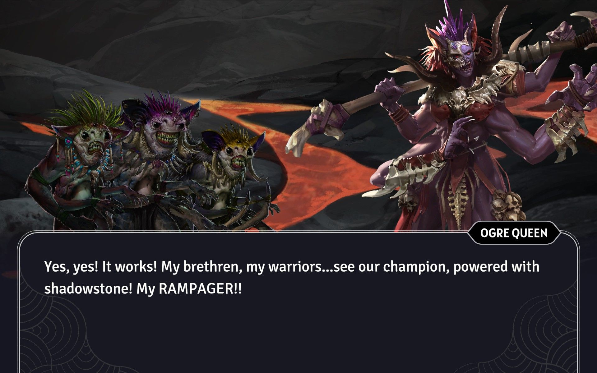

+++
title = "Sunderfolk"
date = 2025-11-14T12:00:00-07:00
draft = false
categories = ["video games", "board games"]
tags = ["jackbox party pack", "gloomhaven", "sunderfolk"]
description = "sunderfolk is the best gloomhaven and it's not even close"
+++



<!--more-->

When a bunch of folks left Ubisoft and went it on their own as a small studio looking to build something impressive, we got Expedition 33 - letting their true identity as “what if final fantasy, but SO FRENCH” come to the fore.

So what happens if a bunch of folks leave Blizzard?

Well, we get **Sunderfolk**.

Okay, so, it’s a little bit hard to talk about Sunderfolk because it’s an entirely new kind of game. I have to lead in by talking about two other games:



## Jackbox Party Pack

Look, I expect you know about the Jackbox Party Pack at this point.



Jackbox revolutionized the party video game format by recontextualizing the games as things you and your friends play around a TV, with your phones.

This works _really quite well_, so long as the games are simple: everyone has a phone. The game's input prompts are not too complex, and delivered as web applications, so people can get into the games instantly so long as they have any device more powerful than a Blackberry.

The problem with running most party games is that they honestly run a lot better with a _host_ - you need someone to distribute little slips of paper, collect them from players, keep them in order, read them out, manage the game, it's all a bit of fuss - and, honestly, I have spent more than a few Christmases acting as Party Game Host myself. I'm not bad at it, but Jackbox Party Pack takes all of that hosting out of my hands and automates it! Nice!

It doesn't work with my parents, though. From first-hand experience I can say with some authority that my particular pack of boomers don't understand technology well enough to be able to keep a phone charged and a web browser open and focused for the entire length of a 10 minute game, at which point the effort I would have save hosting instead goes into a flurry of IT support as folks wave their phones at me and complain that they've been thrown out of the game.

Anyways: the Jackbox Party Pack model: it works really well! But, thanks to the input limitations, as well as their _brand_, Jackbox tends to limit their party games to short-form experiences that aren't too complex - you _could_ use a system like this to play, like, **Twilight Imperium**, but Jackbox ... probably won't.

_fuck, that's not a half bad idea, if someone wants to drop everything and build a Twilight-Imperium-like TV+phone game with me, I definitely have the server half of that knowledge on lock._

Of course, the technical limitations ALSO mean that the game _must_ be asynchronous. The latency involved in having a web-server and a bunch of shitty phones (each of them turning off at the most inopportune times) involved means that it's reasonable to expect that any input with a less than 30s window might just be _lost_. So this is good for party games, and "board" games, but it would quite bad for ... fighting games.

I think for that reason, primarily, I haven't seen a lot of other video game developers embrace the format, despite its obvious merits: this is possibly the best and easiest way to play a fun video game with your friends - so long as the game is _extremely asynchronous_.

## Gloomhaven

I heard really good things about Sunderfolk, and then, when I played it, it gradually set in that what I was playing was just... the board game, Gloomhaven.  Later, I'd read some interviews with the developer confirming that Sunderfolk was _extremely_ inspired by Gloomhaven. Like, "they were trying to fix the problems that they had with Gloomhaven, and they ended up at Sunderfolk".

Gloomhaven is one of the most well-rated board games of all time.

Lo, here it is, sitting at position 4 on Board Game Geek:

While I find that BGG's rankings don't _often_ line up with my own opinions of a board game, _the fix is in_: Gloomhaven is enormously popular and influential, at least in the world of _adult board gaming_.

Gloomhaven is a... dungeon adventure.

The sort of game one might liken to, say, HeroQuest:





Basically, the way it works is that your most dedicated friend will spend the better part of an hour laboring over a trunk full of miniatures and deployable scenery to construct a very specific scenario from a large book of combat scenarios, they will read to you some special rules from that large book of combat scenarios, and you'll spend about an hour delving through that particular dungeon with whatever heroes you have on hand. Like D&D, but the DM _also_ gets to play, because the DMing is all pre-determined and nothing can happen outside of the tightly defined rules system.

Gloomhaven revolutionized the format with a few great ideas:

* A very tight and well-designed combat system that presents a complicated and deep board-gamey puzzle for the players involved.
* A long, complicated, branching campaign where your players' actions _deeply_ affect the story.
* Tonnes and tonnes and TONNES of unlockable content under the hood.

The combat system involves a hex grid and a bunch of cards:



Each hero has a hand of cards, with both a top half, and a bottom half, and by combining sets of two cards, they can form a complete action: they get to do the top half of one card, and the bottom half of the other:

The cards also always have a 2 damage "basic attack" on top, and a 2 move "basic move" on the bottom, forming the sort of base tier "default move" for a character.

Past that, card management becomes very important, because once played, getting those cards _back_ is complicated and difficult, either involving a short rest (where you trash one card from hand to redraw your deck), or a long rest (where you ... still do that, but lose an entire turn and get to heal some, too), because either route is going to cause you to gradually permanently lose cards from your already small hand. You might also lose cards to damage - and some cards have very powerful effects that cause you to immediately trash them.

When you can't play any more cards (because you've run out), that's it, you're done, you've lost. If all of the players lose: that's game over.

There's much more said about it, here:



I... have a copy, somewhere, occupying a giant chest, I think?

Okay, I don't ... I don't actually like Gloomhaven that much?

Let's talk about some of my problems with Gloomhaven:

### Set-up Takes a Fucking Hour

Do you have any idea how good a game has to be for me to want to set up all this fuss to play it?

The bar is **Slay The Spire**, and sometimes, **Eclipse**. I'll set those ones up for an hour. While I'm likely to be the dissenting opinion, here, I don't think Gloomhaven is... necessarily... good enough to justify that hour of set up.

### It's Hard

In order for co-op games to appeal to the kind of tight, strategic grognards who command the top slots in the Board Game Geek top 100, they have to be balanced such that they are thorny, difficult, strategic puzzles.

Nobody likes a steamroll, right?

### Actually, I Like a Steamroll

So, what, you're just going to spend an hour setting up, getting a bunch of friends together, and as a lot you're all going to spend 90 minutes working a tough scenario only to fail at the very end because you're two cards short?

Losing, as a team, _sucks_. We all lost. Together.

In my opinion, the correct balance for a D&D game, the correct balance for a Co-op game, is to present _the illusion of difficulty_: situations should seem dangerous, extremely threatening - because if they don't, there won't be any sense of urgency, or stakes - **but** - the game should be subtly weighted in the players' favor.

Then - _if_ the players crave more of a challenge, they could stack difficulty modifiers, or chase optional secondary or tertiary goals.

### Let's Talk about Quarterbacking a Bit

Co-op games often have the problem where one more-experienced player can, in fact, _run the whole table_. By polling every player for their state, and then issuing directions and strategy for the team, they can... significantly simplify the strategy involved!

Depending on the temperaments involved, this can ... suck for every other player at the table. It can also be fun, if the leader is good at leading, good at sharing ideas, if players are willing to collaborate with one another to come up with solutions to problems around the table.

This is kind of a fundamental, unsolvable co-op problem and we see thoughts about it reflected in the designs of all kinds of co-op games.

### Our Plan Has Come Undone

Turns in Gloomhaven fall apart really easily.

You see, you all pick your moves at the same time, with too much coordination... gently discouraged by the manual (in order to discourage quarterbacking). I believe that the manual explicitly forbids sharing the "initiative" numbers on your cards during this phase: you can't say "I have an 83, so I'll be going first", at best you're allowed to say "if I go after that big guy, I'll be really early in the turn order".

The baddies will roll a random initiative _after_ you've decided your move: so it's quite common that the following scenario will play out:

* Player 1 goes first. They didn't expect that they'd have the highest initiative, so they partially waste their turn, rushing towards the enemies who are still too far away.
* The enemies all move, but thanks to Player 1's updated position, they move towards Player 1, changing where Player 2 thought they would be when she planned out her AoE attack.
* Player 2 decides not to use her AoE attack, now, because the board state has changed, and instead ditches her turn on a simple move-and-attack.
* Player 3, new to the game, does something stupid and burns a card on an action that doesn't help much at all.

Thanks to the fairly tight difficulty of Gloomhaven, it only takes one or two of these catastrophic turns to ruin a session entirely.

### Level Problems

Gloomhaven does "EXP"-style leveling, and you accrue EXP by performing certain actions within a level. Different characters get access to different levels of EXP: in my game with Tiffany, her character had access to a powerful ability that just spit out EXP like a slot machine and she used it often, whereas my EXP-granting ability was a lot more situational.  When a character gets _too_ powerful, they're likely to finish their arc entirely, retiring from the game and replacing themselves with a whole new character: fun and exciting, but back down to Level 1.

The way that the campaign structure in Gloomhaven works, it's quite likely you'll eventually be bringing a sparsely equipped Level 1 character, a semi-equipped Level 4 character, and a heavily equipped Level 9 character into the same fight: how does the game account for this in its scaling?

Well, by setting the level of all of the monsters to the average level of your party.

Imagine for a second why that's not an incredible solve: your Level 1 player is going to be soft and ineffective, while your Level 9 player is going to chew through opponents like nobody's biz.

In order to combat _that_ problem, Gloomhaven's designers instead, as far as I can tell, tried to make it so that every character combination you might be able to bring to the fight is _more or less equivalent_ in terms of ability: a low-level fighter with limited equipment might not have the same tactical breadth as a high-level mage, but they can still _be_ useful.

If you go into the Big Boss Fight with four Level 1 characters with no equipment? Well, you're getting a scaled-down Level 1 boss fight - it's gonna be real hard but it should still be doable, if you're good.

But - if you go too far down that road it starts to make leveling and equipment feel meaningless: so the designers had to walk a _super delicate_ tightrope, here.

And you know? They did a really good job with this _seemingly intractable problem_. There's a reason why Gloomhaven is such a well respected game. For a game with an impossibly large setup space, _most scenarios still play pretty well_.

### Just The One Campaign

If you have Gloomhaven, you're playing it with _exactly and no more than one group at a time_. Anything else is impossible: the whole campaign state is written irrevocably into the box and the decks. Your best-case scenario for introducing Gloomhaven to some new friends might be the starter scenario, or just _playing the level you last played with your campaign group and discarding the results_.

This is _great_ if you have a dedicated Gloomhaven group. It completely sucks ass for Complex Human Beings.

## Gloomhaven Digital Edition

So, after mostly putting the physical Gloomhaven away, they launched a digital edition!

If you want a taste of the Gloomhaven experience without the _hour of fucking setup_, I absolutely recommend this. It's a complete reimplementation of the _enormous_ game of Gloomhaven, but all of the difficult set-up and fussy deck management? Handled for you. Lovely.

On top of that? _Great_ tutorial. Considering how dense and complicated the game is, this helps a lot.

Honestly, what killed this game for me and Tiff was the dodgy netcode in the early access edition: on top of being able to lose a hour-long scenario to a bad card misplay, now we could also lose that hour-long scenario to bitrot and desync errors.

It's been, like, 3 years, though, so I imagine this is probably a lot better now! Seriously, if you're interested in Gloomhaven, I can't recommend the digital edition highly enough.

Well, except for...

## Sunderfolk

That's right! I was talking about Sunderfolk, and how some ex-Blizzard developers set upon what I think of as the "most Blizzard" kind of game design: let's take something great but flawed that already exists and _polish, polish, polish_.

> 
>
> Pictured: The thing what WarCraft yoinked and polished.

The game devs at the newly created Dreamhaven just... kept on playing Gloomhaven, and started prototyping on ways to improve it.

Obviously a digital Gloomhaven works: if you've tried the digital version of Gloomhaven you can see that it plays better than the board game - but one of the struggles is that it kinda hurts the co-op aspect of it: in order to play a 4 player game, now you need 4 people, and 4 computers, and 4 microphone headsets, and that's a big ask for folks.

This seems like a game that would _really benefit_ from the Jackbox couch-co-op model.

So... they did that. Sunderfolk is played on a central TV, with one to four phones, with "one" as a highly discouraged option because playing a co-op game alone is not exactly going to be the best experience.

Now, Sunderfolk, like Gloomhaven, is quite complicated. It would be a struggle to deliver this game's client experience as, say, a React app in the browser. Even as a lifelong web-developer, I have to admit that the non-native experience on mobile devices kinda sucks ass - so Sunderfolk delivers their game client on mobile devices as standalone iOS and Android applications.

Past that, the experience is _extremely Gloomhaven_, but - simplified, clarified, tightened up.

For one thing, the campaign has a very neatly defined difficulty ramp: not just in terms of game difficulty, but in terms of game _complexity_. It does that thing that games can do so well: introducing mechanics one step at a time. You don't get complex weapons, or items, or even complex _abilities_ up front. Instead, the game introduces them, one at a time, in scenarios designed to show them off.

I'm playing late-game Gloomhaven with two groups of friends: with my board game / D&D friends, it was smooth and almost a little _too easy_ at first - but I'm also playing it with one of Tiff's friends, a guy who doesn't shy away from complexity, but who I've never once played a complicated board game with. _The board game has been boiling him slowly_.  Also note: that's two, separate, side-by-side campaigns with 2 different groups of people. Which, of course it supports, because it's a video game, and there's no complicated state to manage.

The ability cards have been simplified: you get fewer of them, they're more flexible, you play _one_ card per action, and they don't disappear. This is _much easier_, especially for new players.

One of my big frustrations with Gloomhaven has been discarded entirely: you play your turns in _any order_, and you pick your card when you play your turn - which means that you can _always_ choose what you believe to be the best action for the current board state. Sure, it takes away one of the most creative parts of Gloomhaven, but it gives players a much more satisfying connection between playing a card and its outcome.

The game is also good at giving a kind of inflated sense of danger to the scenarios: each hero only has enough hit points to soak about 3-4 hits before they go down, helping things feel precarious - buuuut - the game has a lot of ways to fast-track scenarios that are starting to get a little dicey, as well as a generous "lives" system to keep players in the game after they've been beaten. Losing a turn to getting murked might not be fun, but it won't lose you the scenario. In a good scenario, your team might get to wander around collecting optional objectives and treasure and taking their sweet time - in a rough scenario, your team might lose 2 out of the game's 3 team-lives and rush to the finish line, but _most scenarios move forward_.

Of course, I still have complaints about Sunderfolk -  but I am compelled to say that **Sunderfolk is the best Gloomhaven experience and it isn't even close**. I unreservedly recommend it to anybody who likes board games and has friends and a TV.

Complaints? What complaints?

## Writing Bad

So, the plot in Sunderfolk is, essentially, that the village of Nicetown (Arden) needs to protect the Light Crystal (Brightshard) from the corruption of the Shadowbad (Shadowstone), but Shadowbad keeps getting Shadow-worse so some heroes need to show up and whack it on the Shadow-noggin.

The writing in Sunderfolk feels like someone forgot to change the names in the Default Fantasy Template and turned in their homework anyways.

## Voice Acting Bad

So, I think the idea was, if you were playing a game like this with your friends, there would be just one narrator- your GM, reading the whole story out of the book and maybe putting on a lot of wild and wacky voices for the different NPCs you encounter.

So... they simulated that. By getting _just the one voice actor for the whole game_. And having her put on a different silly accent for each NPC in the game's huge and varied roster.

She's... clearly very talented (I think she's from Critical Role?), but, like... this sucks. I get what they're going for and I really don't like it, it _works_ when it's one of your friends, it doesn't work when it's a professional voice actor pulling out a bad cockney accent and going "hOw yOU DoIn GuVNah?"

Honestly, okay, my _real actual preference_ for a system like this is to **make your friends act out the scene**. Put the text of each character who's speaking on _individual phones_ and make your friends do the scene themselves. Have the narrator's silly accents available for shy friends, but keep them off by default.

## Lots of Writing and Voice Acting

Given that the writing is cornball and the voice acting is cringey, it would be awfully awkward if the game forced you to sit through absolute _mountains_ of it in order to play the-  **yes that is definitely what happens**.

## The Phone-To-TV Control Works Really Well, 95% of the Time

Because it doesn't work well 5% of the time, the menus are full of "are you sure?" and "confirm?" prompts, as well as ways to back out of a badly botched action, but it's still easy for players to struggle with the control scheme and badly bungle an action in the complicated Phone interface, wasting a turn and experiencing _The Frustration_.

## The City is Kinda Boring And Optional



In both Gloomhaven and Sunderfolk, the game's balance would be thrown way off by letting players get too powerful... but that also means that they kinda restrict the usefulness of items and gear, which makes the city play feel slow and meandering. Oh, I collected a bunch of gold last scenario, then spent 5 minutes chatting to various city folk and upgrading mushrooms to get a +2 bonus to _one attack, once a scenario_? Ok. Sure. Fine.

## But.... It's Good, And I Hope They Make More

I'm going to be a little sad when we finally get to the end of Sunderfolk with the two different groups I'm playing it with right now.

With the engine fully constructed like this, it seems like it would be much easier for the Sunderfolk team to construct a whole new adventure - with new heroes, a new storyline, new abilites, new art assets - the tech would barely need to change. Of course, from my limited experience of game development, I'm pretty sure all of that "art" and "polish" is actually the expensive part.

Maybe set it in space, this time: Space...der... folk. Sunderspace. Sunderfolk 40K.
