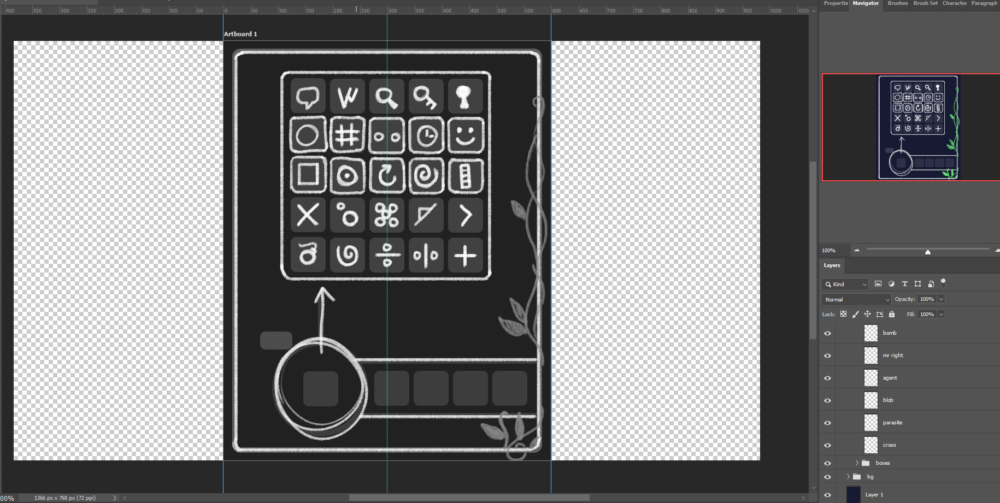

+++
title = "The Watchmaker's Dilemma (2)"
date = 2025-09-21T12:00:00-07:00
draft = false
categories = ["video games"]
tags = ["triangle agency", "quinns"]
description = "quinns reviewed a cosmic horror corporate RPG"
+++



"Wow, Curtis, you had so much free time during your recent vacation, did you do anything cool?"

Ha ha, no, definitely not.

One thing I did do, however, was make a video game.

<!--more-->

[Play it Here](https://wwwww.gooble.email/watchmaker/index.html).

I forgot how to make things in Godot (I learned some Godot back in Godot 3.4-4.0 era, but forgot how it all works in the intervening years) and in order to relearn, I thought I'd build something really simple. For some reason, I had a real itch to rebuild "The Watchmaker's Dilemma", the first video game I ever built, fifteen years ago, a game who's entire purpose is being frustrating and opaque.

The game's mostly about figuring out how to place these tiles.

Now YOU TOO can be as irritated by my game design choices as two to seven of my friends, decades ago!

I made all of the art and the music myself (I mean, look at it, obviously), and this one works a little different from the original: now it creates a unique puzzle every day you play it, although I did very little work no work at all to guarantee all days are possible to solve.

-----

## How Did We Get Here

Okay, so, I let my Godot skills get real rusty over the past little bit.

I disappeared down a bit of a Rust programming rabbit hole, and now I’m pretty confident in my ability to build web services in Rust!

I spent a good portion of this year building something for a family friend: he was curious if I could build a website that would allow him to manage exactly one form that he has to manage, and I felt like it would be an interesting learning exercise, so I went off and build https://concrete.tube, a whole website that provides exactly just that one form and nothing else. I delivered it and I don't think he's looked at it at any point. Ah, well.

Well... I mean, it took me about six months of spare time to build, it has some other features in it than just the form:

* You can create a company!
* You can log in to that company with a phone number, or an email address, or a password.
* You can invite people to that company using an invite code!
* You can change your phone number, or your email address, or your password, or your name.
* You can find your company from a list of companies supported on the site,
* You’re an admin, and you can throw people out of your company, or lock their accounts so that they can’t log in.
* There’s a messaging system that lets you (an admin) see when someone has created a new form in your company.
* The forms have a signature field that you can actually sign, like, by drawing a signature.
* When the form is created, the admin gets an email!
* There’s a company called “Admin” containing just me, the superadmin, and everybody in the Admin company (just me) can log in to every other Company for freeeeee.

So, a bunch of super basic website plumbing.

Okay, I’m going to admit: there’s an ulterior motive, here.

This is intended to be the base for the next version of Groovelet!

Perhaps you remember this? This hopelessly complicated online RPG that was connected to a server despite having no ability whatsoever to interact with other players, with a minute long turn tick timer to keep everybody synchronized, making the gameplay painfully slow.

It wasn’t terribly good. I will love it forever. It was my third video game (2021), after **The Watchmaker’s Dilemma** (2010?) and **Horse Drawing Tycoon** (2015), (and before “**Detective Capilano** (2023)”) and I wouldn’t regard it as anywhere near complete, but eventually I feel like the whole thing hit kind of a dead end.

So, for the last little bit, I’ve been gearing up to take another crack at it.

This time I’m hoping to go a LOT less, you know, hopelessly I will fail at this..

The version one I’m targeting is a website where you can create a little group, and log in, and play simple games, and invite friends to your group, and, by playing simple games, get points and stuff, to, like, customize a cute little town together?

I’m looking at inspirations like NeoPets, PIxel Cat’s End, Ferry Halim’s [Orisinal](https://www.ferryhalim.com/orisinal/) (somehow still working?!?) and The New York Times Games platform.

And lo, the code powering concrete.tube can already provide a lot of the meaty undergirding for a project like that! It’s like I’ve been working on it for months! because I have!

## Godot Re-Rears Its Ugly Head

So what’s a good tool for making fun little games?

Godot!

No, no, hear me out: I tried out Godot earlier, and abandoned it for a bunch of very salient reasons:

* Making a large game and delivering it via web WASM is a bad idea, because WASM has no way to manage memory in the long term, virtually guaranteeing that the game will become unstable and crash eventually.
* Making a large game and delivering it via web WASM is a bad idea, because delivering 300MB of video game over the web is a lot to ask of someone potentially on a mobile phone connection.
* Actually using Godot 4.0 on the Web platform called for a special server flag you had to set to enable an experimental threaded performance mode that was lightly supported.
* There was, in Godot 4.0, an absolutely gamebreakingly bad bug on Mac/iOS platforms that just completely broke the game on these platforms.

But! **but**!

There are good reasons to want to use Godot, rather than developing web games directly in JavaScript:

* JavaScript’s tools for building anything “video gamey” with the canvas are a handful of libraries that haven’t been updated since 2015 with documentation entirely in half-German half-English.
* Building anything fun with React and CSS is about as exciting as dentistry. Great way to build Eve Online (Just Spreadsheets Edition), though.
* Godot’s actually put a lot of effort into their web WASM builds since I last looked, including fixing a bunch of the serious problems it had before.
* Many of my concerns about Godot are less salient for small games.

So: a new little project! Let’s make a little taster Godot game and get it on to the website. This doesn’t have to be big, or impressive - in fact, what I want here is something small and dumb as a proof of concept!

ALSO I want to focus on more small, dumb games ANYWAYS, because one of the problems with Original Groovelet was that its scope was unmanageably huge and I’m just one guy.

So… what to build?

And I was thinking about it, and I thought…

"Why not rebuild **The Watchmaker’s Dilemma**? It’s the first game I ever made, and while it was, you know, terrible, there’s at least one person who still loves The Watchmaker’s Dilemma: **me**!

## The Watchmaker's Dilemma

So, The Watchmaker’s Dilemma was a game that presented the player with a large empty grid, and gave that player a variety of square tokens with odd symbols on them, and those odd symbols had to be placed on the grid according to placement rules that… you don’t know.

Well, I know the placement rules, because I built the game, but you don’t, because you didn’t.

The game was slow, because it did a whole bunch of unnecessarily server-authoritative thinking, and also because calculations on a large NxM grid were expensive, and also because I was but a child and wrote a lot of hilariously inefficient Python code to run the game. It didn’t even keep active games in cache, _it rehydrated the whole game state for every player on every move_.

But, like, I actually quite liked the game! And of the people I showed the game to, I recall some of my friends enjoying it a little bit too!

Okay, so, let’s reimagine this as a simple, lightweight Godot game…

We’ll just start by mocking something up in Photoshop…

(with a much smaller, more manageable 5x5 grid)

and now it’s time to … watch a bunch of Godot tutorials.



_god, I forgot almost all of this_

At least it’s faster to learn the second or third time.

And, after a few days (I took some time off from work to donk around with stupid personal projects. Using vacation time to Go Places sounds expensive.)

Anyways, I make some forward progress on the game itself, and now the game could use some… sound.

Let’s talk about another one of my little obsessions:

### Adaptive Music

Okay, so, again with Groovelet I ended up way, waaaaaay down a rabbit hole. See, I wanted a game with adaptive music, and I figured the best way to have music that adapts to what’s happening in the scene at hand would be to generate the music, using scene details to seed a bunch of stuff in the generator.

This was… well, an insane rabbit hole that ate time like candy.

And despite my learning more and more about music theory and construction in order to make it increasingly powerful, at the best of times it produced music that was, like, [borderline listenable](https://soundcloud.com/user-120828335-918863707).

If you ever read Sid Meier’s Which I don’t recommend, mind you: it’s incredibly boring. He spends like 2 chapters talking about how much he likes trains, and also isn’t responsible for most of the good Civilization games. 
, it turns out he spent a bunch of time chasing the generative music dragon too, and even with all of his industry clout he ended up producing something that was utterly unmarketable.

> [C.P.U. Bach](https://en.wikipedia.org/wiki/C.P.U._Bach)
>
> C.P.U. Bach (also known as Sid Meier's C.P.U. Bach) is an interactive music-generating program designed by Sid Meier and Jeff Briggs for the 3DO. It can create Baroque music in the style of Bach for various keyboard, wind, or string instruments and in a variety of forms (e.g., concerti, fugues, minuets, chorales). The compositions are then performed by the software with synchronous 3D graphics on screen showing the virtual instruments being played...

So, like, what kind of adaptive music can I make, in, like… one day?

Well, okay, here’s a really simple idea. This is something that I saw in a presentation at EA like 10 years ago: just… just make a bunch versions of the same music track, play them all at the same time, and then depending on how the scene is going, you can jump between the different versions of the track.

This would require that I actually compose a piece of original music.

Huh.

Well I guess I’ll finally need to learn how to use a DAW.

So, I do a little research online and pick out FL Studio (my old pal Fruity Loops from high school!), give them the amount of money appropriate for their least expensive version, and I’m off to the races.

Okay, so, I’m … I’m not a great composer. Not even an amateur composer. I’m GUY LE DONKING AROUND WITH A DAW FOR THE FIRST TIME.

But, at least, after spending all of that time trying to figure out how to make generative music into a thing, I understand some of the most basic basics of music theory, and I manage to poop out some basic tracks.

Then, I wire them all up in the game: when a successful token is placed, the song “level” is upgraded, and when a failed token is placed, the song “level” is downgraded.

It works! Huzzah!



And while it’s not exactly Good Composer McGee, it’s a damn sight more listenable than anything the generator ever managed.

### That Was All I Needed To Do All Along?

It’s so weird, after devoting months and months and months of my life to the stupid “let’s build a generative music engine” path, just composing the music myself like an idiot, and I managed to get something working in one day.
