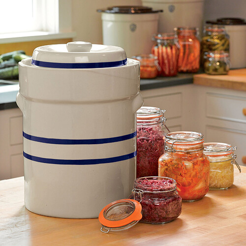
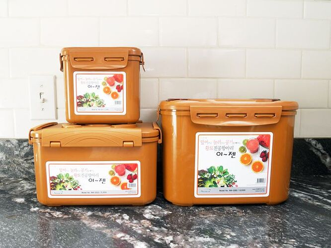
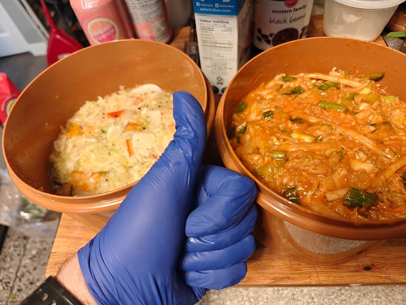
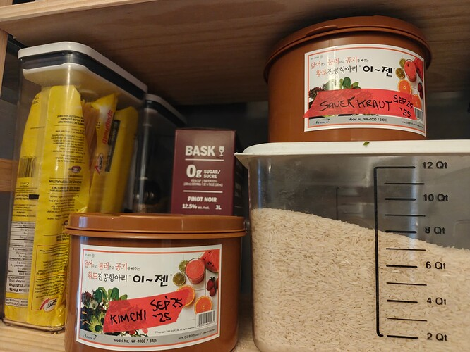
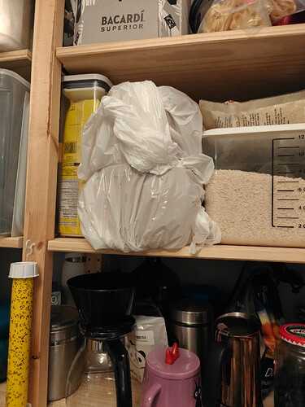

+++
title = 'I Have Too Much Damn Cabbage'
date = 2025-09-25T04:00:00-07:00
categories = ["food"]
tags = ["cabbage", "fermentation", "sauerkraut"]
description = "stank ass cabbage"
+++



The CSA is great...ish.

A few weeks in a row they’ve sent me home with a huge head of cabbage.

My fridge is filling up with cabbages.

<!--more-->

Now, I like cabbage as much as the next guy, but I have, like, 3 moves with cabbage:

* Make a big coleslaw, eat like half of it, throw the rest out.
* Stir-fry it and serve it with rice for dinner. (Alongside A MEAT, usually)
* Toss chunks of it in borscht.

Four moves if you include the exciting game of _cabbage ball_.

Since cabbage in the fridge lasts for _yonks_, I’ve been focusing on trying to eat other CSA vegetables - the ones that go bad basically right away, like zucchini and kale - and letting the cabbages build up.

So, now, I have three gigantic cabbages in my fridge! This is starting to become a cabbage problem!

Okay, here’s what I’m going to do. I’m going to make some ferments.

I watch some videos online (this is usually the way to begin):





and I’m off to the races - well, not quite off to the races. I don’t really have a good container for fermenting things - you know, “gigantic jar” or “multiple gigantic jars”.

Some people even have these awesome giant earthenware self-burping pots:

So cool! But also: that doesn’t look like it would be practical to cram into my dishwasher.

I found a beautiful one [made in Canada on Etsy for like $200](https://www.etsy.com/ca/listing/975842765/fermentation-crock-water-seal-pot-kimchi) and I thought “nice! but 2L is kinda small, actually, and also I am not going to spend that much for a hard to clean pot that I only use once or twice.”

Lotta good buzz behind these relatively inexpensive E-Jen Kimchi Pots:

> [For Fermentation, We Love E-Jen Containers](https://www.seriouseats.com/e-jen-kimchi-containers-review-7562869)
>
> For fermentation of all kinds (like sauerkraut and kimchi), we love E-Jen Kimchi Containers. They keep vegetables in the brine for lacto-fermentation.

So, I picked up two little (“little”) 3L E-Jen tubs (one for Kimchi, one for Sauerkraut) and got to work.

Two big heads of cabbage cut into delicate ribbons filled my biggest bowl, the one I use for breadmaking, and I thought “oh no, there is no way this is all going to fit into these two little 3L buckets”. I separated the cabbage into two teams, “sauerkraut team” and “kimchi team”, and added onion, garlic, jalapeno, bell pepper, coriander, black pepper, and mustard seed to sauerkraut team, as well as 2% of the mixture’s weight in salt.

Kimchi team got more of a workout: the cabbage got dressed with green onion, gigantic white radish I found at the H-Mart, and some jalapeno pepper. It spent some time with salt, then had all of the salt washed off again, then I added a slurry of flour (not rice flour, just flour flour, sue me), water, onion, garlic, fish sauce, anchovy paste, salt, and a whole bunch of starting-to-get-a-little-long-in-the-tooth gochugaru.

Surprisingly, the intense process of beating up these cabbages significantly en-smallened them, and they did, in fact, fit into these 3L containers!

------

it has been two days

my whole home smells like the inside of a garlic’s butthole

------

Brief strategy/stank management update.

------

### Weeks Later:

Okay, so!

How’d it turn out?

**The Sauerkraut**: 8/10, delicious sauerkraut. It’s sauer, it’s krauty, it has a nice balance of flavors, it’s great on hot dogs, it’s everything I wanted the sauerkraut to be.

**The Kimchi**: 2/10, dubiously edible. I sent some home with some friends - for which I might have to apologize because this is some trash-tier kimchi. I let the Kimchi ferment for much less time than the sauerkraut, at first, because fresh kimchi can be super delicious (local Korean restaurant Sooda serves a fresh kimchi that’s real good) - but I’m relatively certain that I used way, way too much garlic, because this kimchi is so eye-wateringly pungent that it burns when it hits your tongue - not good spicy burn, baaaad garlic burn. This absolutely eradicates any of the interesting, varied, funky flavors and replaces them. With **garlic**.

When I was new to cooking, I thought “there is no such thing as too much garlic”, and then I learned that even this beautiful bulb has its limits, around the time that the person who sat nearest to me on the bleachers was 3 seats away.

When I went out of town, I tried leaving it on the shelf for another week to see if some more intense fermentation could arrest that garlicky attack on the senses, but nay, I came back and it was just as potent as before.

It’s basically inedible when raw, and so the only way I can imagine using it is in stir fries where I can tame some of that brutal allium pungency with some cooking. Also there’s pounds of this stuff.

My granddad used to say: you can’t make a kitchen mistake so bad that you can’t eat it, unless you do, then don’t eat it. This kimchi is definitely on the border.