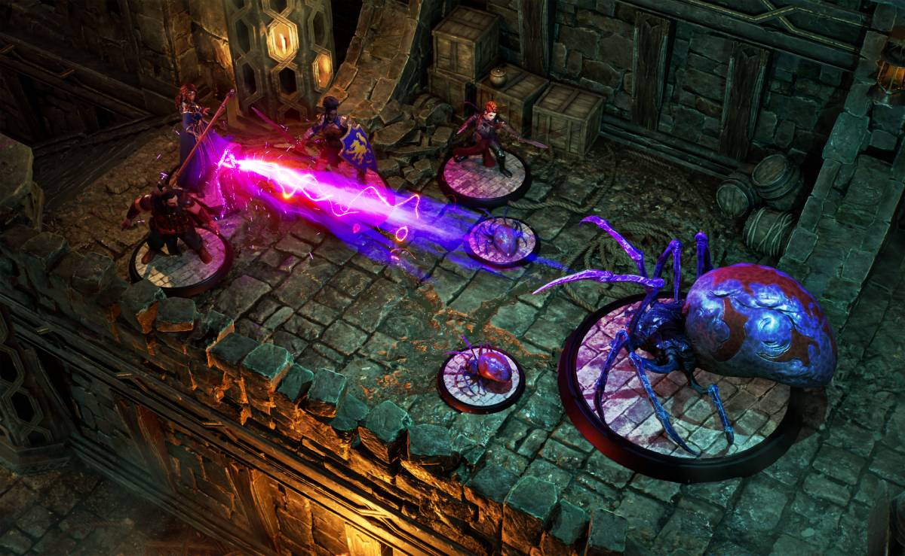
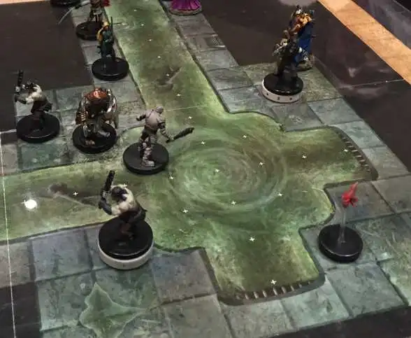

+++
title = 'Junk Drawer D&D'
date = 2025-07-06T04:00:00-07:00
categories = ["rpg"]
tags = ["D&D"]
image = "./graph.png"
description = "playing D&D in lo-fi is more accessible and improvisational, lose the complex battlemat"
+++

The ideal level of abstraction and prep for a D&D dungeon is a graph that looks like this:



<!--more-->

If you are the kind of player who likes a complex digital battlemat, or - heck, even going so far as to prepare full on 3D physical dungeons:

Well - more power to you. But I'm here to advocate for what is, essentially, the _opposite thing entirely_:

I think that you should try playing D&D with loose trash.

If you have a Chessex grid, wet-erase pens, and loose trash like poker chips, erasers, and pepper mills - well, all of the effort of establishing your scenes and characters and stakes are going to come down to your ability to describe and improvise.

You must consistently establish and maintain the scene without having to have gone so far as to prep a whole thoughtfully detailed graphical battlemat environment, and in doing so - you might find that your game moves a lot more smoothly _without_ the battlemat.

This helps to keep your universe light, flexible, and reactive: if you have poured hours into a battlemat your players are _definitely_ going to have a fight on that battlemat, but if your area is a series of nodes with light descriptions then it is much easier to have the entire environment stay responsive to your players.

What if the fight takes place in the courtyard rather than the ampitheatre? What if _no fight takes place at all_?

It leans much more heavily on improvisation and evocative description than _prep_, but the idea is that what you're prepping is things like storyline beats, big ideas, neat treasure and interesting locations rather than specifically deciding "this dresser has 10gp sitting within".

This also makes it harder to differentiate between stuff you've explicitly planned and stuff that's "off the rails" - if your players start chasing a loose thread, you can make it up as you go along, and _because_ that storyline path is ALSO made out of pepper shakers and loose screws, it can feel like you planned it all along.

## But How Do You Fill a Battle Scene With Interesting Terrain?

The Battlemat isn't just there to be evocative! It's also there to provide interesting scenery for your players to have a fight atop.

So: build the battle mat _as part of the session_.

For an important battle scene with my players, I pulled out the chessex battlemat, started by drawing key scene items I knew would be present, and then described the "vibe" and asked my players for items to help fill in the scenery. "It's a huge workshop. What's in the workshop?"

"Tool chests!"  (ok!)

"Barrels of loose acid! For etching and cleaning!" (ok!)

"Piles of oil-soaked rags!" (ok!)

I'm an _acceptable_ draftsperson, although you'd better believe that most of these were labeled for clarity.

This method has cons: if they return to the same workshop, it's unlikely I'll remember exactly where everything  although, surprisingly, and quite oddly, six months later I can still remember the layout of that workshop with some detail. At the moment, however, what we were able to lay out was a pretty compelling battle scene with a lot of interesting scenery to bounce off of.

Loose. Reactive.