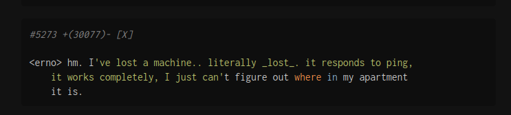
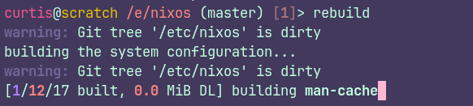
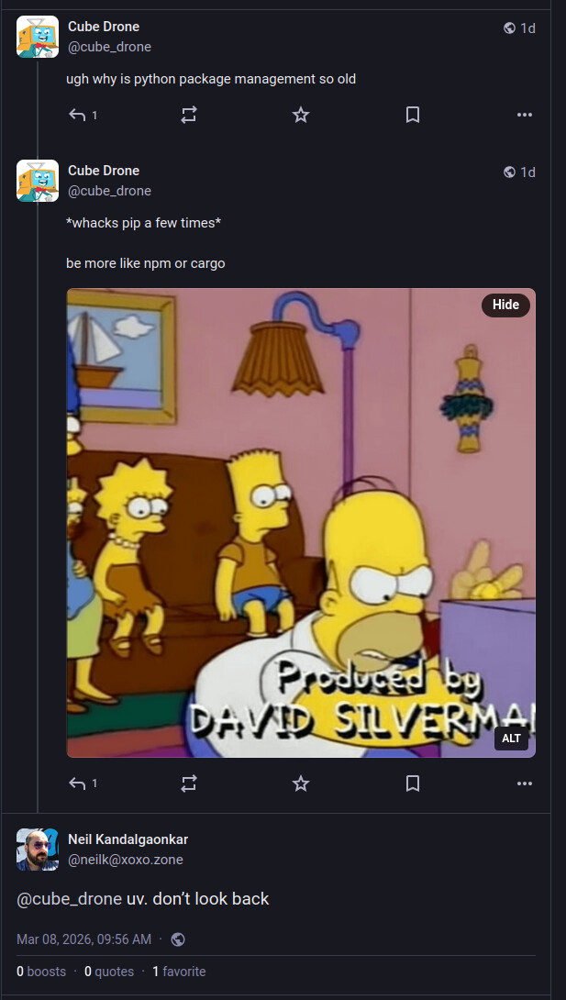
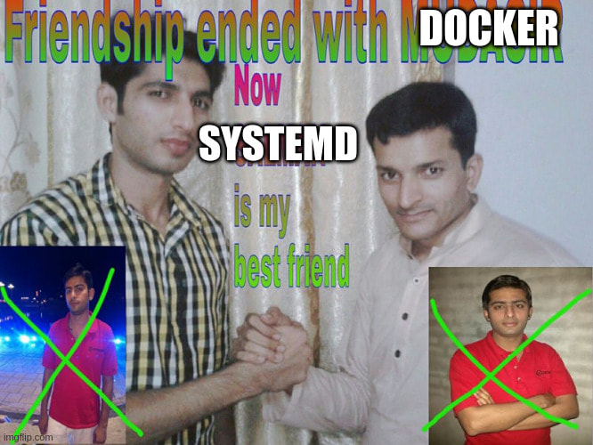

+++
title = "A Home Lab Journey"
date = 2026-03-10T10:00:00-07:00
draft = false
categories = ["software", "technology"]
tags = ["hosting", "infrastructure", "devops", "vancouver"]
description = "I moved all of my hosted services to Inside My Home"
images = ["is_this.jpg"]
+++



<!--more-->

-----

Like most of the things in my life, a lot of my major decisions are powered by whim and spite.

> [Hetzner: 50% price hike, no fooling, from April 1st](https://www.theregister.com/2026/02/24/ai_isnt_done_yet_memoryrelated/)
> 
> No, customers aren't laughing either as pressure from memory shortages bites

Hetzner have for a long time been the cheapest game in town when it comes to server hosting. They're still probably in the running, but this forced me to contend with how much I pay to keep my various personal services running on a medium-sized VPS - 29.99€ per month for a VPS doesn't _seem_ like a lot, but paired with a few other services (like the 4.50€ a month grafana/logs stack that I never bother to actually look at) and with the usually poor state of the Canadian dollar, I'm still paying too much for hosting. With the new price increases I'm going to be staring down the barrel of over a hundred Canadian dollars a month in hosting fees! 

I could scale back my VPS a little bit - do I really _need_ a medium-sized VPS? I could probably stand to downsize a little - but I like to have that headroom for Personal Projects, 
and I run a lot of experiments from there. 

Just like I had the "why not move my main computer over to linux" itch a few months ago, I've been _waiting_ for my house to have fiber internet to consider the rollout of a _home lab_. 

## The Cheapo Box

At $50-80/mo of savings, if I buy a cheapo box to run my home lab, I should break even in only a handful of months! And April 1st is a fine deadline to get my stuff migrated over!

This fella was on sale when I was looking: a pretty middle-of-the-road laptop chip at a svelte 35W draw (low power usage was an important target, here), and with slightly better specs than the Hetzner imaginary computer I'd be replacing:


Honestly, the spike in component pricing kinda gets me in the shorts _here, too_ - these minicomputers cost _near exactly the same as they did three years ago_, which is a little frustrating. 

Even worse: I swear I have one of these in my house somewhere already. I just can't find it! The mini-computers are too mini, sometimes. 

> 
> 
> relevant bash.org quote

Ah, well, it'll turn up some day and maybe then it can become part of the new Home Lab. 

## The Plan

How to maintain a stable home-LAN from a potentially dynamic IP address on a home internet connection?

I've fussed with this before and let's look at all of the reasons why home-hosting is a bad idea:

* **Dynamic DNS is horseshit**: The idea here is that you deploy an agent on your computer that's responsible for constantly updating a rolling DNS entry that points back at your computer. This works about as well as you imagine - one of the persons who spoke highly of this technique mentioned that their DNS never stayed out of date for more than an hour or so after a change. :unamused_face:  DNS's propagation delays make doing this with direct DNS technology a complete non-starter unless you're okay with _long_ periods of server inaccessibility.
* **Port Blocking**: A lot of "service" ports make little sense to give your residential users full access to - like 80 (HTTP), and 25 (E-Mail), where it doesn't make sense for users to host these themselves out of their home, most of the time.
* **Asymmetric Bandwidth**: In particular, where I live, there's for a long time been a provider who provides low-bandwidth symmetrical connections using DSL lines (TELUS) and a provider who provides high-bandwidth but very asymmetric connections using cable connections (Rogers/Shaw) - great for TV, but good luck streaming, seeding, or hosting out of your own home. Neither of these are appropriate for home labs, really, you want at least a fiber connection which is a high-bandwidth symmetrical connection to the internet.
* **Added Latency & Slow Routing**: Home servers often have a pretty torturous route to the internet - if your home connection has a lot of latency, that's going to be reflected in every call to your HTTP services. 
* **Outages**: I have no shortage of experience with how cavalier providers can be with reliable power and internet to BC homes, especially during storms. For a long time, my home connection's cabling was, as the tech who I had to keep summoning to repair it mentioned, "loose", which meant that every time someone else moved in and had a tech add _their_ connection there was a good 75% chance that they'd bump my connection off and I'd have to spend 8 hours on hold summoning a tech to repair my internet days later. 
* **Lack of Redundancy**: It's just the one delicate, named server sitting all on its lonesome? What happens when it invariably lights itself on fire and falls into the sea?

By and large, these are headwinds against self-hosting, but I have ideas to deal with all of these problems!

## Fixing Latency & Bandwidth: Home Fiber

I have [fiber](https://cube-drone.com/notes/2026/vegetables/) now, next question.


## Fixing Dynamic DNS and Port Blocking: I'll Pay For Just The One VPS 

With modern Content Delivery Network DNS proxy services like Cloudflare and BunnyCDN that can keep your DNS up-to-date in seconds rather than 
 if you're not using one of these, you're mad, it takes DNS from frustrating to legitimately useful
, you could concoct a pretty coherent dynamic DNS strategy... but...

... I have a different idea. Let's keep _just the one VPS server running_. 

> 
> 
> behold my awesome diagram-concocting strategy

The gateway server exists on the public internet, and will create a private network that the home server logs in to from _wherever it happens to be_. So long as the gateway doesn't move, there's no DNS dancing - it's the anchor for the whole project. 

At first I was thinking of putting this together with the WireGuard-powered Tailscale or Netbird, but ultimately an LLM talked me into the much simpler system of just... doing it with WireGuard. I don't need identity management or a complex multi-node enterprise system: I have **two nodes**.  The wireguard configuration file on my gateway server is a handful of lines long:

```
[Interface]
Address = 10.20.0.1/24
ListenPort = 51820
PrivateKey = <vps_private_key>

[Peer]
PublicKey = <home_public_key>
AllowedIPs = 10.20.0.2/32
```

This mostly worked, but I will note that debugging WireGuard problems turned out to be _hard_. As a "quiet by default" protocol, its default behavior when something unexpected is happening is to _emit no errors_ and _do nothing_, which can make debugging connections issues (like an unexpected firewall rule) a real pain in the ass.

## Sovereign

If I'm only paying for one computer, I could consider paying the exorbitant price to host a server... _gads_ - locally?

By "locally" I mean "in my city, the city I live in, [Vancouver](/tags/vancouver), [Canada](/tags/canada)".

I mean, it'll help to eat some of the time lost to that second-hop to my house. 
If the server and the _my house_ are both near to one another, there's less latency - plus, _the 7 people who actually interact with my sites most often_ are probably in or near Vancouver. 

Hosting in Vancouver seems like a fool's errand - our cheap electricity can not outweigh the problems of local hosting: we do not have ready access to high bandwidth, cheap real estate or high-end computer equipment, compared to even Seattle.

So, local providers tend to be... let's say "
rather than what I'm actually thinking, "some guys operating out of a garage somewhere, using mostly Java and PHP". There's a _reason_ why I haven't touched the local tech industry for goin' on 15 years, now.  
". 

A co-worker recommended these guys, ( https://www.canhost.ca/ ) with the caveat that _if you want a server, you literally have to wait for a human being to provision it_.


Their cheapest VPS is still going to run me $15CAD/mo, which is $5/mo more expensive than Hetzner's equivalent, even _after_ the Hetzner price increase, but being as this is the only server I'll be running, I'm willing to accept this _for King and Country_.  

OKAY I GUESS.

They also [install a non-standard firewall on their VPS servers on deploy](https://github.com/Aetherinox/csf-firewall), which is something they don't document or explain as part of their server onboarding, which I discovered... pretty quickly. What is this cPanel-era bullshit?  


Actually having a human in the loop, while a little old-fashioned, ain't so bad. I had a question, they resolved the ticket quickly and professionally. It might keep me from standing up a VPS on a whim at 2AM as I often do, though, but the Home Lab is supposed to discourage that anyways. 

So, our new gateway server is born, `sovereign`. 

Sovereign is very simple, also: it just runs WireGuard and a nginx reverse proxy configured to pipe everything it encounters to its one WireGuard partner.

Here's the nginx reverse proxy config - "just send everything on ports 25 and 80 to your WG partner": 

```
user www-data;
worker_processes auto;
pid /run/nginx.pid;
error_log /var/log/nginx/error.log;
include /etc/nginx/modules-enabled/*.conf;

events {
    worker_connections 768;
}

# this is for the marquee's mail forwarding
stream {
    upstream scratch_smtp {
        server 10.20.0.2:25;
    }

    server {
        listen 25;
        proxy_pass scratch_smtp;
    }
}

http {
    sendfile on;
    tcp_nopush on;
    types_hash_max_size 2048;

    include /etc/nginx/mime.types;
    default_type application/octet-stream;

    ssl_protocols TLSv1 TLSv1.1 TLSv1.2 TLSv1.3;
    ssl_prefer_server_ciphers on;

    access_log /var/log/nginx/access.log;

    gzip on;

    upstream scratch_http {
        server 10.20.0.2:80;
        keepalive 32;
    }

    map $http_upgrade $connection_upgrade {
        default upgrade;
        ''      close;
    }

    map $http_x_forwarded_proto $best_forwarded_proto {
        default $http_x_forwarded_proto;
        ""      $scheme;
    }

    map "$http_x_forwarded_port:$best_forwarded_proto" $best_forwarded_port {
        ~^[0-9]+:  $http_x_forwarded_port;
        ":https"   443;
        default    $server_port;
    }

    server {
        listen 80 default_server;
        listen [::]:80 default_server;
        server_name _;

        location = /healthz {
            return 200 "ok\n";
            add_header Content-Type text/plain;
        }

        location / {
            proxy_http_version 1.1;
            client_max_body_size 100M;

            proxy_set_header X-Real-IP         $remote_addr;
            proxy_set_header X-Forwarded-For   $proxy_add_x_forwarded_for;
            proxy_set_header X-Forwarded-Proto $best_forwarded_proto;
            proxy_set_header X-Forwarded-Port  $best_forwarded_port;
            proxy_set_header X-Forwarded-Host  $http_host;
            proxy_set_header Host              $http_host;
            proxy_set_header Upgrade           $http_upgrade;
            proxy_set_header Connection        $connection_upgrade;

            proxy_pass http://scratch_http;
        }
    }
}
```

So now we've solved port-blocking and Dynamic DNS: wherever I plug in my box, so long as it has access to the internet, it'll find `sovereign` and start serving traffic. 

## Solving Outages: It's Hard But The Best I Can Do is Buy Some Uninterruptible Power Supplies

I have a beefy UPS upstairs- I tossed another, smaller one downstairs on the modem to try and keep it up and running, but these two UPS-s are going to be the entirety of the power management. This remains a - uh - _low redundancy environment_.

There is one step I could consider for even more reliable internet - something I've actually considered after my frustrations with TELUS's reliability - getting _two parallel internet connections_ from two different providers and buying a router that can shift to either in an emergency. This, however, would cost hundreds of additional dollars a month. No thanks.

## Solving Redundancy, Kinda:

I have lots of experience building redundancy at _work_, but at home, I'm cheap, so "redundancy" is just a comprehensive backup and reconstruction strategy. If something goes down, it'll take me _days_ to get it back online, but I'm confident that I _can, in fact, get it back online_.

So, this is not the right solution if I need good uptime - but I don't, not for personal stuff. If this blog goes away for a day, most of you won't even notice!  

As for the backups? Well, most of the state of the server, including config and all data, are backed up _one way or another_, mostly to github and Wasabi (S3 compatible).

## Power & Cooling

One of the reasons power is so important to manage around here is that this house is _old_, in a townhome complex that's old: it's very easy to blow the dusty panel of overloaded breakers in my basement, and upgrade options are _extremely limited_ without the strata approving millions of dollars of electrical capacity upgrades (unlikely). 

The sheer number of computers in my home presents a power & cooling problem, _especially_ in the summer (it gets hot in here) - which is why this project is running on a little 35W Minicomputer box rather than on a proper tower computer, where I could probably achieve a much better price/performance ratio with a lightly used computer. 

The 35W chip - costing about as much to run as the lights in my office - shouldn't add meaningful electrical or heat load to the house. I say, hopefully.

## The Tech Closet

Come at me, cable management internet:


There's a decade-old black and white laser printer (still a workhorse), my work computer, a color printer/scanner (new, excellent), the NAS, my main computer, and on top of it, the new home lab. 

It's tough to see in there because it's black on black, I'm gonna have to get a sticker for it: 



## Scratch

Okay, time to provision the home box. `scratch` is born.

As I've mentioned before, my entire backup strategy is based on a repeatable server installation: we're not just configuring `scratch` - we're not done until the configuration for scratch is fully reproducible from the ground up. 

Once again, time to change some stuff about how I do things. 

I've been deploying things using `ansible` _forever_. All of my server settings as complicated YAML recipes - but the new architecture would require a pretty significant rewrite, so there's no time like the present to learn a new technology!

If you like "declarative server set-up" - the kind that you've come to expect from tools like Ansible and Dockerfiles - but you don't need the Huge Fleet Management tools of ansible or chef (or, ugh, puppet) - you're looking for NixOs!



I've been an Ubuntu die-hard for _ages_, so trying out an experimental OS for this was a tough decision, but... well, if it went very badly, I could always try again with Ubuntu.

I'll report, though: NixOs is actually great for this. What I wanted for this project is exactly what it is, I think: an operating system you define with a handful of files.

## NixOS Learning

NixOS's installer runs you through a nice, tidy UI that writes the OS to your hard drive with a `configuration.nix` that looks like this:

```
{ config, pkgs, ... }: 

{
    # Import other configuration modules
    # (hardware-configuration.nix is autogenerated upon installation)
    # paths in nix expressions are always relative the file which defines them
    imports = [
        ./hardware-configuration.nix
    ];

    # Name your host machine
    networking.hostName = "mymachine"; 

    # Set your time zone.
    time.timeZone = "Europe/Utrecht";

    # Enter keyboard layout
    services.xserver.layout = "us";
    services.xserver.xkbVariant = "altgr-intl";

    # Define user accounts
    users.users.fartyjeff= {
      extraGroups = [ "wheel" "networkmanager" ];
      isNormalUser = true;
    };
    
    # Install some packages
    environment.systemPackages = with pkgs; [
      ddate
      testdisk
    ]; 
 
    # Enable the OpenSSH daemon
    services.openssh.enable = true;
    
}
```

You can't modify the system with commands like `sudo apt-get install florp`. If you want florps? You gotta edit that config. 

The actual command to commit your changes to the configuration is `sudo nixos-rebuild switch`, although I very quickly was like "nuts to that" and wrote an alias for it:

```
  # look, there's a lot to type here, how about just "rebuild" instead
  environment.shellAliases = {
    rebuild = "sudo nixos-rebuild switch --flake /etc/nixos#scratch";
  };
```

`rebuild`

> 
>
> finally, a place to keep my **man-cache**.

The "--flake" thing is an extra thing that got added later, it's an experimental feature that pins everything's exact version to _when you first added it_, like a `package.lock` file for your whole OS.

### Goin' Wide With NixOS

Here's my config file, now:

```
# Edit this configuration file to define what should be installed on
# your system.  Help is available in the configuration.nix(5) man page
# and in the NixOS manual (accessible by running ‘nixos-help’).

{ config, pkgs, ... }:

{
  # look, there's a lot to type here, how about just "rebuild" instead
  environment.shellAliases = {
    rebuild = "sudo nixos-rebuild switch --flake /etc/nixos#scratch";
  };

  # flakes is required for some of our more advanced configs
  # think of it like package-lock.json, but for ... nix, I guess
  nix.settings.experimental-features = [ "nix-command" "flakes" ];

  # yeah we're going to be using a lot of docker
  virtualisation.docker.enable = true;
  virtualisation.oci-containers.backend = "docker";

  imports =
    [ # Include the results of the hardware scan.
      ./hardware-configuration.nix
      ./bootloader.nix
      ./xserver.nix
      ./sound.nix
      ./network.nix
      ./openssh.nix
      ./utilities.nix
      ./secrets.nix
      ./ulimit.nix
      # groove.ogg
      ./radio.nix
      # all of the various and sundry things served out of the "public" wasabi directory
      ./public_folder.nix
      # it's my blerg
      ./hugoblog.nix
      # all of the various and sundry things served directly out of github
      ./github_static_sites.nix
      # discourse! marquee.click! the home base!
      ./discourse.nix
      # wireguard is how we connect to the Real Internet
      ./wireguard.nix
      # nginx is how we do EVERYTHING
      ./nginx.nix
    ];

  # Set your time zone.
  time.timeZone = "America/Vancouver";

  # Select internationalisation properties.
  i18n.defaultLocale = "en_CA.UTF-8";

  # Enable CUPS to print documents.
  services.printing.enable = true;

  # Define a user account. Don't forget to set a password with ‘passwd’.
  users.users.curtis = {
    isNormalUser = true;
    shell = pkgs.fish;
    description = "curtis";
    extraGroups = [ "networkmanager" "wheel" ];
    openssh.authorizedKeys.keys = [
        "ssh-ed25519 AAAAC3NzaC1lZDI1NTE5AAAAIAmHKN6ZKR69Z/sE9JJ2g/gDq8+A/vb3jrnUGUwjTEVr curtis@lassam.net"
	"ssh-ed25519 AAAAC3NzaC1lZDI1NTE5AAAAIMuTbOHVjXyjPmvCEIf28vLIRoa1k0qph0xzJmPkRAyn curtis@lassam.net"
    ];
    packages = with pkgs; [
    #  thunderbird
    ];
  };

  # Sudo success should last a while, because this computer has a pretty irritating sudo to type
  security.sudo.extraConfig = ''
    Defaults timestamp_timeout=120
  '';

  # Install fishyfish
  programs.fish.enable = true;

  # Install firefox.
  programs.firefox.enable = true;

  # need git everywhere
  programs.git.enable = true;

  # Allow unfree packages
  nixpkgs.config.allowUnfree = true;

  # List packages installed in system profile. To search, run:
  environment.systemPackages = with pkgs; [
  ];

  # NixOS isn't great at dynamic libraries? Ask about this later.
  programs.nix-ld.enable = true;
  programs.nix-ld.libraries = with pkgs; [
    # Add any missing dynamic libraries for unpackaged programs here, 
    #  not in environment.systemPackages
  ];

  # Some programs need SUID wrappers, can be configured further or are
  # started in user sessions.
  # programs.mtr.enable = true;
  # programs.gnupg.agent = {
  #   enable = true;
  #   enableSSHSupport = true;
  # };

  # This value determines the NixOS release from which the default
  # settings for stateful data, like file locations and database versions
  # on your system were taken. It‘s perfectly fine and recommended to leave
  # this value at the release version of the first install of this system.
  # Before changing this value read the documentation for this option
  # (e.g. man configuration.nix or on https://nixos.org/nixos/options.html).
  system.stateVersion = "25.11";
}
```

Why, that's not that much bigger at all! 

Except... all of those `imports` .... they seem like they describe an awful lot of stuff.

Like `utilities.nix`, which brings in a bunch of the stuff I want to have around for convenience:

```
{ pkgs, ... }:

{
  # this is just a bunch of stuff I expect everywhere
  environment.systemPackages = with pkgs; [
    neovim
    ripgrep
    fd
    bat
    jq
    eza
    htop
    tree
    curl
    wget
    unzip
    zip
    dig
  ];
  
  # Neovim should be the default vim
  environment.variables.EDITOR = "nvim";

  # Sane neovim defaults (I've decided on a universal 2-space tab because I'm a monster)
  programs.neovim = {
    enable = true;
    viAlias = true;
    vimAlias = true;
    configure = {
      customRC = ''
        " Spaces, 2-wide indent by default
        set expandtab
        set tabstop=2
        set shiftwidth=2
        set softtabstop=2
        set smarttab

        " Sensible indentation behavior
        set autoindent
        set smartindent
        filetype plugin indent on
      '';
    };
  };
}
```

## The Configuration is a Github Repository

The whole config directory goes into a _private_ GitHub repo. 

So, saved and versioned in case of trouble.

I mean, I guess I _could_ make it public (all of the secrets are managed as if the repo is public, see below) - but just in case I accidentally commit something operationally important it makes more sense to have just that little extra slice of security.

## Headless, scratch.local
I could, technically, plug a mouse and a keyboard into that l'il box, but that's not how you run a home lab. What I've actually done is configured Bonjour zero-configuration networking using Avahi on the box, so that it always appears on the home network as `scratch.local`. 

This took adding one line to the `configuration.nix` (i tossed it in my `networking.nix`): 

```
  # Configure Avahi, so this device shows up on networks as "stacks.local"
  services.avahi = {
    enable = true;
    nssmdns4 = true;
    openFirewall = true;
    publish = {
      enable = true;
      userServices = true;
      addresses = true;
      workstation = true;
    };
  };
```

Then, on the **my computer** side, I added this to my `~/.ssh/config`: 

```
Host scratch
    User curtis
    HostName scratch.local
    ForwardAgent yes
```

So now, I can just `ssh scratch` and I'm there. Nice.

(I do something like this with all of my servers, generally).

## Digression: Color Coding

And one step further: I **color-code** my environments: 

[Why I Color Code My Environments](../themed_terminals)

## SystemD Does Everything 

One of the things I like about Docker is that I can wrap projects in nice tidy environment files that pulls in all of their deps and supervises their execution, which is why my rule for marquee deployment was generally "no local languages, only docker". 

I don't want to have to manage a local python, a local ruby, a local node, a local go, I just want to install _docker_ and run all of my projects in there.

But... buuuut....

A lot of that is inspired by my experiences with old languages like PHP and Ruby and Python, where it took a lot of extra effort to keep their language runtimes _encapsulated per-project_. 

Now, though, I'm using a lot of `node` and `cargo`, and both JavaScript and Rust have _very good environment encapsulation stories almost out of the box_. In the case of JavaScript, I install `nvm` and I'm good to go- every environment can have its own version of node and set of libraries - and with Rust's `cargo` I'm right there also. 

Kinda makes all of the extra effort involved to bundle projects with an _entire operating system_ seem silly. 

Heck, now that these tools exist for modern languages, they're also gradually working their way into the older boys:



Python's `uv` is... okay. I guess. 

So if we don't _really_ need docker any more, what do we use to supervise all of our deploys? 



Gradually over the past few years I've been moving to running a LOT of my _lightweight_ stuff over to just run on `systemd`, which is present by default on most modern linuxes AFAIK (and has been for over a decade) and serves as a nice combination of "supervisor", "task runner" and "cron". 

A lot of the stuff I manage is statically generated or literally _just hosted out of a directory that's periodically synced with a S3-compatible bucket_, so the deployment complexity is 90% cron-job. Which, uh, despite the fact that I haven't run anything with `cron` in a long, long time, I'm going to keep calling background timed events "cron jobs" even if they've been _systemd timer jobs_ for a good long time, now.

At least in my head, "cron job" just carries a lot of semantic weight, y'know.

## SOPS handles secrets.

The way I handled secrets for Hetzner was so dumb, I wrote a little script of my own that would use a local key-file to AES-encrypt a file full of secrets that I could then check into GitHub without worrying about losing them (so long as I still had the key, which I keep in my password manager).

Not at all like SOPS, which uses a local key-file to AES encrypt a file full of secrets that you can check into GitHub without worrying about losing them:

> https://github.com/getsops/sops
>
> SOPS is an editor of encrypted files that supports YAML, JSON, ENV, INI and BINARY formats and encrypts with AWS KMS, GCP KMS, Azure Key Vault, HuaweiCloud KMS, age, and PGP.


I'm always glad to replace a dumb little thing I wrote with a tool that's someone else's job to worry about.

SOPS is also tidily integrated into NIX thanks to this helpful library:

> https://github.com/Mic92/sops-nix
> 
> Atomic secret provisioning for NixOS based on sops  

So NIX can do things like "pull secrets and use them to write a templated file", which is often what I need to do to set up a service.

## The Transition

So, with all of that in place, I just had to rewrite all of my `ansible` code into `.nix` configuration files and run it on Scratch.

So, I've just been going through my services, one at a time, over the past week - migrating them over, setting them up, switching over the DNS to point at `sovereign` instead of `girlboss`, checking to make sure they still work, rinse, and repeat.


My personal, private Discourse installation (marquee.click) for friends got transitioned over the weekend, with that and the Mastodon instance `xoxi.ca`, marking two _very difficult changeovers_ because these were the only services where they also included a _fussy service_ with a _live data component_. 

While I was at it, I had to fuss intensely with the quite difficult Discourse Mail Receiver configuration, which operates via a completely different non-HTTP pathway and _also_ has a protocol that isn't terribly easy to debug.

Helpfully, NGINX also has access to a TCP proxy plugin that you can install, `stream`, which can pipe raw TCP if needs be.


## Personal Services All Over the Place

I have never once maintained the same tech stack and deployment strategy for two products in a row, so each and every single one of my personal projects that I've bothered to keep running had a different deployment story. 

What a horrible walk down memory lane, for stuff like:

* This website, which is ... mostly just Hugo with a lightly modified theme.
* [gooble.email](https://gooble.email) is a personal wildcard email forwarding service I set up so that I can give people absolutely insane sounding email addresses whenever I please. Yes, that's `gooble.dot.dotat@gooble.email` I can say, out loud, to another human being. If someone with a name tag asks for my email, I can give them `their.name@gooble.email`. I'm a monster.  
* [cardchapter.com](https://cardchapter.com/#root), which is a multi-planar presentation/storytelling technology that runs entirely from the browser and just needs to be served as-is out of github.
* [ministry.cardchapter.com](https://ministry.cardchapter.com), a second crack at the cardchapter idea that calls for rust compilation and a separate, github-tracked "content" directory.
* [books.cube-drone.com/](https://books.cube-drone.com/), where most of the books are generated in subtly different ways (I've settled on _mostly_ Rust's `mdbook` for now, but the diagrams work slightly differently in each of the projects)
* [concrete.tube](https://concrete.tube), a tiny little social network I built for a friend exclusively to manage a _single form for their company_, which they haven't actually tried to use, yet. (I'm happy I built this because I hope to use the code as a base for More Projects, like maybe Cardchapter 3 or Groovelet 2)
* [radio.marquee.click](https://radio.marquee.click), my personal playlist, which - okay, so, I wanted to be able to stream my whole music library from anywhere, but I also wanted much more intelligent playlist management? so this uses `liquidsoap` and `icecast` to provide a feature that I actually badly need, _probabilistic weighting of songs by category_. Like - you know how, if you like Micheal Jackson a _little bit_, but if you grab his discography and include it in your playlist to get more exposure to his music, the sheer _size_ of his discography means that the chance of a Michael Jackson song coming up is very high, even though you only wanted a little bit of Micheal Jackson? Well, with `liquidsoap` you can solve that by giving a "Micheal Jackson" bucket equal weight to, say, your "Madonna" bucket, while giving much higher weight to your "Daft Punk" and "Caravan Palace" and "Gorillaz" buckets. As a complete fucking nerd I have become hopelessly addicted to this level of _playlist control_, and baking it in to a radio station that I can't interact with keeps me from fussing with it too much, idly clicking "next song" forever until the perfect song comes up.  

In fact, now that I've got a home-lab and computing is _cheap as chips, comparatively_, I might even consider recovering some of my older projects and popping turning them back on again under cube-drone subdomains, like "groovelet 1", the insanely abstract and _weird_ single-player real-time MMO card  "That doesn't make sense, how is it both single player and a real-time MMO?"  good question, I never ever resolved _why_ this needed to be a live web service, that's just how I built it. 

# Why "Scratch" and "Sovereign"? 

Oh, I'll explain this in a [whole other post](../be_sharps_naming/).

## Anyways, It's Done

I'm sorry, Hetzner, but this is goodbye.

