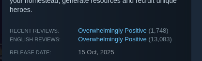

+++
title = "Ball X Pit & Dogpile"
date = 2026-02-17T12:00:00-07:00
draft = false
categories = ["video games"]
tags = ["ball x pit", "ball pit", "dogpile", "vampire survivors", "megabonk", "balatro"]
description = "it's vampire survivors again, and balatro again"
images = ["titlecard.jpg"]
+++



<!--more-->

I talked to a friend about "Ball X Pit" and they said, "oh, Ball Pit?" and I said "Wait, you don't pronounce the X?" and she said "Well, I did, but then I saw the developers talk about it and _they_ don't pronounce the X." 

I'm going to keep pronouncing the X. 

This game's been getting great buzz! People love Ball X Pit!

I... don't. It's been about 5 hours.

I don't _hate_ it, but I also don't feel like it adds anything much to my life. 



I was hoping for kind of an Arkanoid x Balatro, but what I ended up getting was just **Vampire Survivors**.



Collect gems, spend them on upgrades, maximize DPS with good knowledge of the upgrades and builds, last a long time, buy permanent upgrades, repeat, repeat, repeat.



But I played Vampire Survivors already! That's... about enough of that, for me, I think. I can FEEL the game trying to hack my dopamine receptors. I have been going back to Ball X Pit, but it doesn't feel good, it doesn't feel like I'm really DOING anything. 

I passed on the recent and also popular Megabonk for the same reason: I simply have already played enough Vampire Survivors.



If you've played Vampire Survivors and _that's enough of that for now_, I don't recommend Ball X Pit - if not, you should probably try out the very addictive Vampire Survivors formula at least once and Ball X Pit is probably the better game of the two. (Although Vampire Survivors works on a phone, which is its own compelling pitch.)

--------

## Dogpile





Dogpile _is_ a Balatro, the purpose of which is to carefully merge dogs. If two dogs touch, they make a bigger dog! You have to manage your deck of dogs and dog-based-abilities to try and make a really big dog!

Dogpile is pretty fun! I only cracked through one round, and _in_ that round I feel like I _saw_ a lot of the content in Dogpile, which is a sign that maybe it's a little bit _light on content_, but it did feel pretty solid. 

The problem with Dogpile is, I think, that it's a Steam game but it's actually a _perfect phone game_. This good boy is perfect for a bus ride or a poop, but I don't really see myself lugging out a Steam Deck for it.