+++
title = "Blippo+"
date = 2026-01-09T12:00:00-07:00
draft = false
categories = ["video games"]
tags = ["hypnospace outlaw", "blippo", "killing time at lightspeed"]
description = "interactive fiction takes another step forward"
+++



<!--more-->

Oh, this is a weird one.

Blippo+ is not a game, it's _interactive fiction_. It has a lot in common with [Hypnospace Outlaw](https://store.steampowered.com/app/844590/Hypnospace_Outlaw/) - but where Hypnospace Outlaw's goal is to capture the vibes of 90's internet:

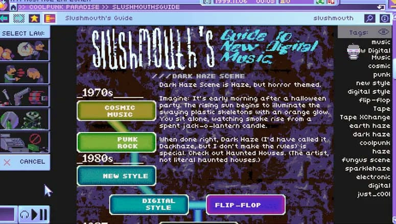

Blippo+ is instead trying to capture the vibes of 90's _wild channel flipping_.

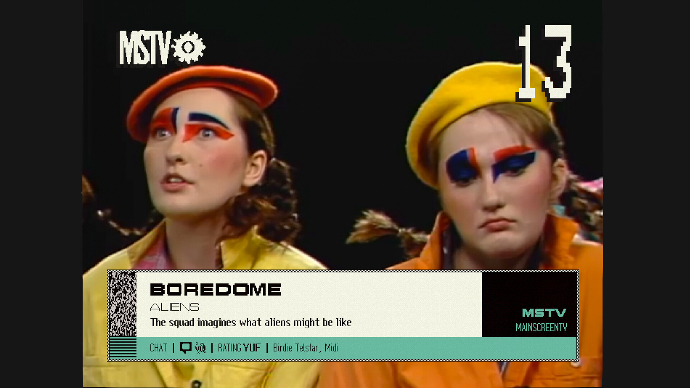

While the gameplay in Hypnospace Outlaw was mostly a hollow pretext to keep you paging around in it's play area of fun dumb made-up websites, the gameplay in Blippo+ is basically nonexistent: it just checks to see if you've watched all of the TV in any given "packet" before it lets you move forward to the next one.

Each packet contains about 10 "channels", each which have four one-minute-long shows playing on an endless loop - with about half of the channels being contentless filler.

Blippo is set on the planet Blip, an alien planet that's ... well, just an alternate Earth, really.

The story - well, it's a thin story, but it plays out over something like 11 packets - features the Blippians discovering that Earth folk are watching their TV through a weird space anomaly.

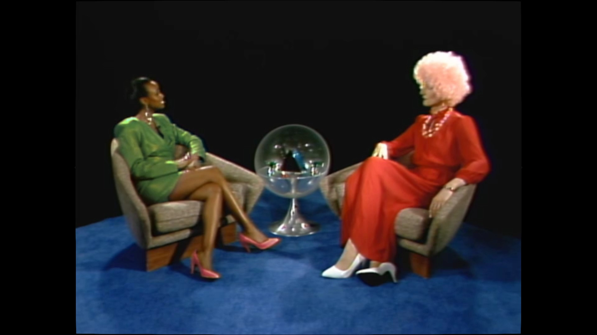

This "news" filters into all of their pop media, with talk show hosts, news stories, the commentariat, and weird art almost all reflecting the news in one way or another.

Not all of it, though, some of the shows are reruns or just _gleefully obtuse_ about what's going on in the world.

Like Clone Trois, a just terribly acted soap opera where all of the hospital staff are played by the same woman.

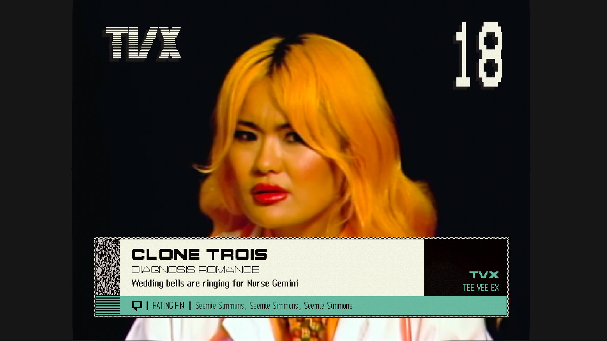

It's all filmed in front of a green-screen, but with pretty lush sets and costumes and lighting: clearly something of a labor of love.

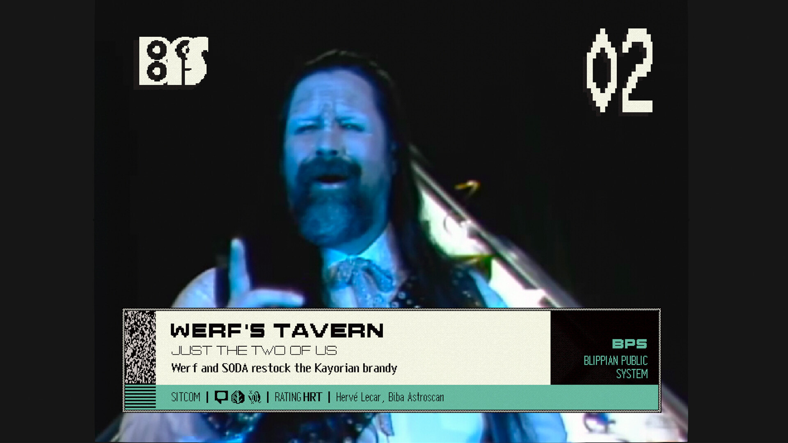

One minute is kind of a perfect amount of time for each of these shows to take up. It absolutely succeeds at capturing the vibe of _channel flipping_, something I haven't really experienced for _literal actual decades_.

And that's it, that's the whole game of Blippo+. It's just... a bunch of weird one minute clips of a variety of imaginary TV shows from the planet Blip.

It's obviously divisive: the oblique, slow-moving story and complete absence of gameplay have some folks convinced it's inscrutable performance art and others convinced it's the funniest game of the year.  I think it's brilliant: Hypnospace Outlaw and Blippo+ are out there literally pushing the boundaries of what interactive fiction can _even be_.

"Here's an interactive, story-rich space you can exist in, we will move time forward when you're done with this moment." That's a fresh kind of storytelling!

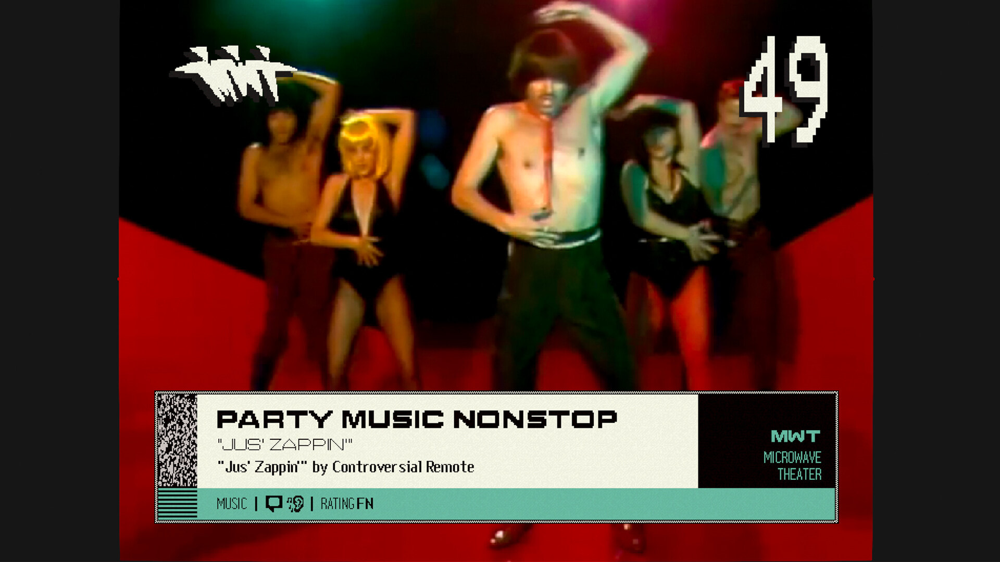

## It's Kinda Gay (In A Good Way)

There are a _number_ of drag performances in Blippo, and Blip's clearly got a subtly different relationship with gender than we did in the 90s.

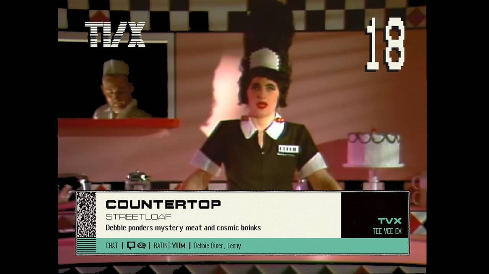

Blip gives the creators a good opportunity to replicate most of the vibes of the 90s without... you know... quite so much of the _family values shmaltz_, which is for the better. This is a much cooler 90's than the one we actually had to live through.

## Is This Kind of Storytelling Irrevocably Tied to Nostalgia?

This is kind of an open question I'm thinking about while playing Blippo+.

Blippo+ and Hypnospace Outlaw both are relentless exercises in _nostalgia_.

Is it  _easier_ for a modern production team to replicate _older media_? A LOT of effort goes into getting the "style" right, but once you do, the lower fidelity means lower production cost... right? I don't know.

One of my first ever (long since deleted, never ask me what it looked like) film projects was the extremely inexpertly shot "Captain Andy and the Spaceketeers", and at the time I foolishly thought that "well, things just looked amateurish and silly in the 40's and 50s, the time-frame I'm trying to evoke". This lazy ethos lead to me making something so _bad_, so _foundationally unwatchable_, that I quickly decided that film might not be the media for me.

A lesson I took from that, though, was that you can't hide all flaws behind the lower fidelity of media from the past, and that accurately replicating an era's "vibe" in a way that resonates with people takes a lot more skill than I had given it credit for - so maybe the "cost & difficulty" argument for setting this kind of project in the past doesn't hold as much water as I think it might.

Would it work as well if it were setting a story in a simulation of modern TikTok? Or would the fact that it's a low-fidelity simulation of TikTok competing with _actual TikTok_ which you can just go look at _right now_ reflect poorly on it?

Also, the format of navigating through _time capsules_ feels like it pairs well with, you know, "the past".

## Is Nostalgia Okay To Like?

I'm _really suspicious of the artistic value of nostalgia_. It can feel really navel gazey to make a game who's message is just "remember the 90s?". I think things have to be more than that, otherwise you end up with stuff that's all reference and no _content_.

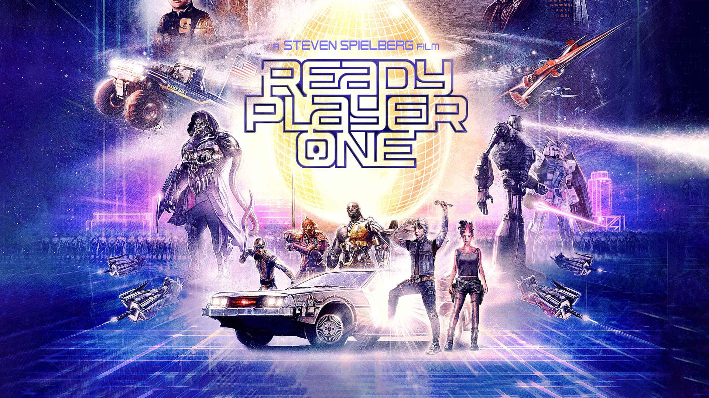

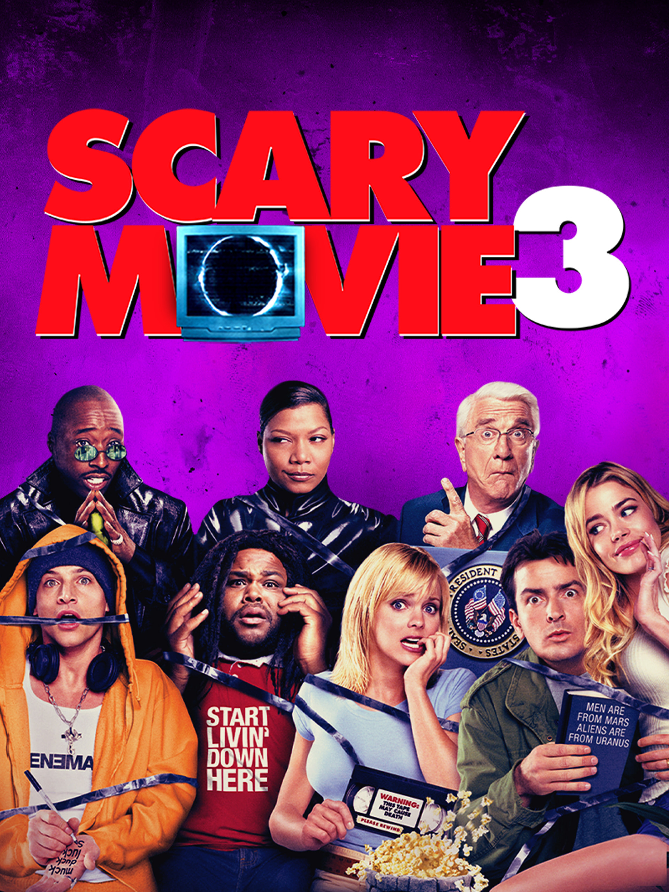

I really appreciate the nostalgic vibe of stuff like Blippo+ - because I _do_ fondly remember some parts of being a child and teenager, but, I remain very suspicious of that feeling. Am I being manipulated? The past only seems idyllic because I've started to forget running out of AA batteries and lying catatonic in front of the Channel 2 info-crawl because nothing interesting was playing on _any channel_.

And MY nostalgia isn't gonna stick around and stay relevant for long. The classic Christmas film "A Christmas Story" was a pretty cynical exercise in evoking nostalgia for the 40s, and while elements of that might resonate with my grandparents and parents, it feels like a foreign country to me most of the time.

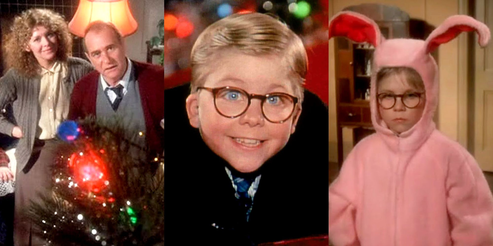

I think I should get over it - my suspicion of nostalgia's artistic value may be unwarranted. Almost all media is set _somewhere_ in the past, right? Are we not just constantly referencing all of the things that came before?

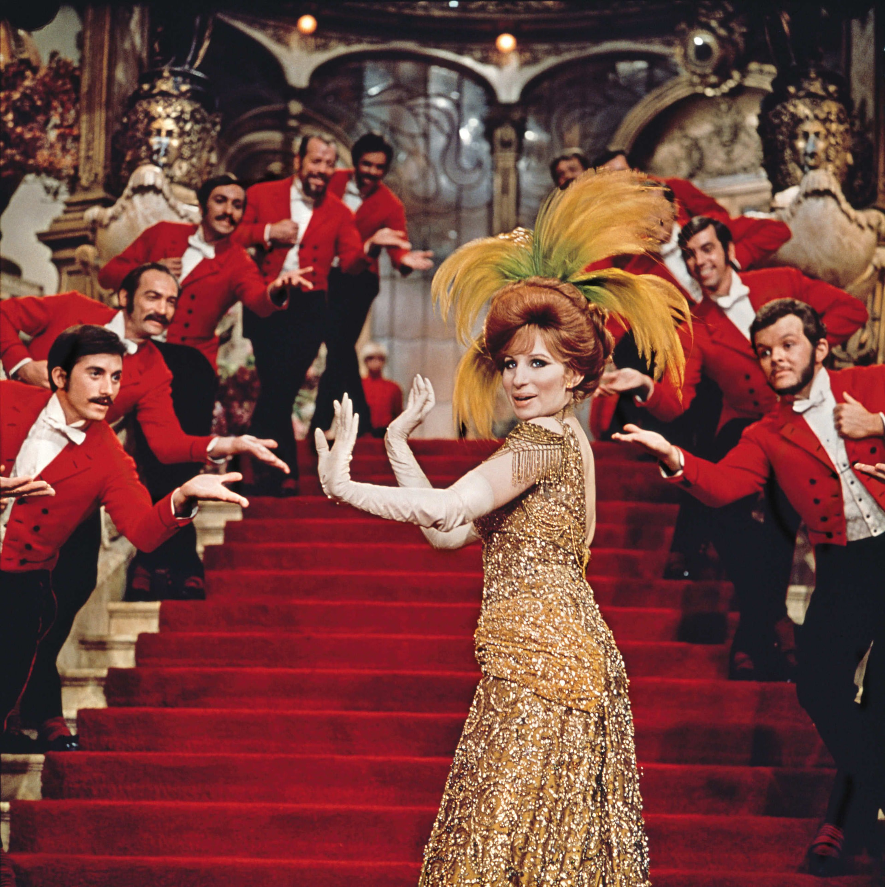

That's probably okay, even now that the past that it's referencing is... my past, and I love it a little extra because I grew up in it.

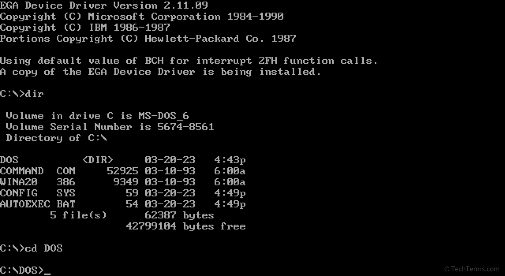

## Killing Time at Lightspeed

I bought and _haven't played_ Killing Time at Lightspeed, but it appears to be the same idea:

It's got a sci-fi premise, paired with a retro aesthetic and a simulated social space, although this one appears to be trying to capture nostalgia for DOS interfaces:

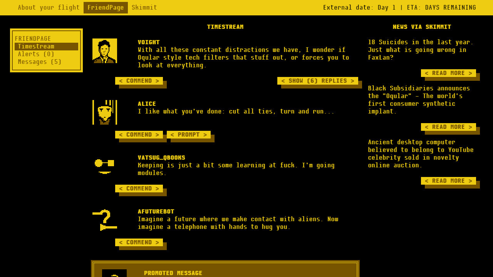

Which, let's be honest, I _have_.

## Back To Blippo: The Playdate

Oh, okay, here's a thing about Blippo that's insane.

It wasn't intended to be played like this:

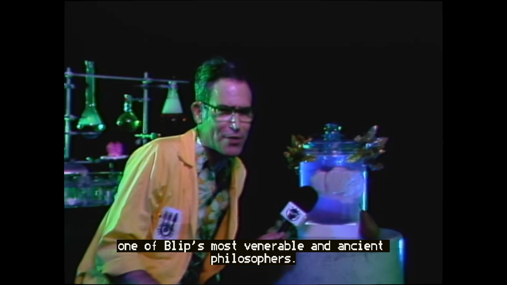

As far as I can tell, it was intended to be played like this:

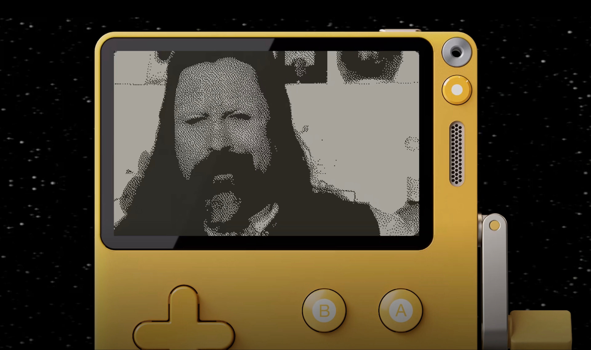

That's right, Blippo+ was/is a **Playdate** game.

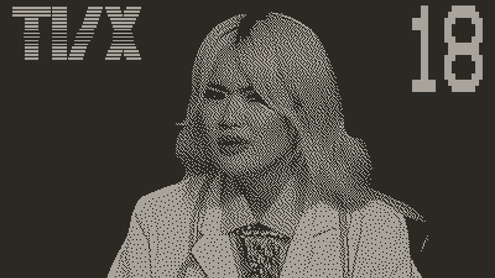

The content "packs" were originally released one week at a time, for 11 consecutive weeks, and if you wanted to watch the whole thing you'd have to just _wait_.

I'm not sure how I feel about that design: I'm just ... so... impatient.

I am and remain utterly confused by the Playdate. I should be in to it, I'm an experimental games guy, but... this weird, expensive little device cost a lot and I never bought in. I kinda regret that, now - not because of Blippo (I think Blippo's experience IS better on the Steam Deck), but because as far as I can tell, the Playdate has spent years and years now being a surprisingly successful and well-supported little oddball console.
