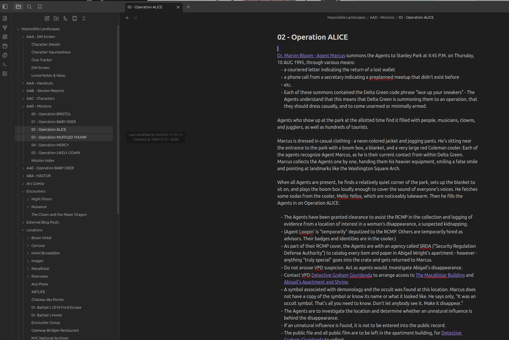
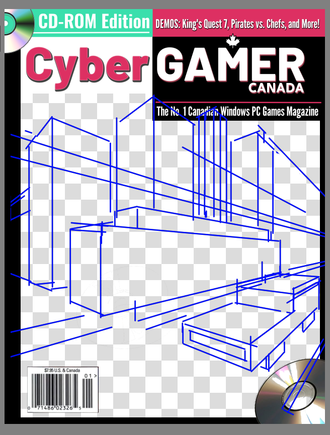

+++
title = "Cybergamer"
date = 2026-02-12T12:00:00-07:00
draft = false
categories = ["video games", "art"]
tags = ["blippo", "epistolary", "retro video games", "90s", "nostalgia", "cybergamer"]
description = "_my_ interactive fiction takes another step forward"
images = ["cyber.png"]
+++



<!--more-->

## Stuff I've Been Up To Lately (It's Relevant, I Promise)

So, lately, I've been showing an interest in interactive epistolary storytelling - for example, [A Normal Lost Phone](/posts/2026/a_normal_lost_phone), or  [Blippo+](/posts/2026/blippo). 

----

A coworker of mine has been [streaming themselves](https://www.twitch.tv/ticky_d) running an x86 emulator ( https://86box.net/ ) to run Windows 98 and go through old magazine CD-ROM treasure-troves. 

It's been fun to watch! I recommend it! Go be a fan of their streams!

-----

Also also, I've been preparing to run Impossible Landscapes, the Delta Green adventure, for some of my friends. 



This is a horror RPG set in the distant fantasy realm that is the year 1995. As a result of prepping this _monster_ of an adventure, I've been concocting an Obsidian knowledge base that's _absolutely enormous_. 

I've been making subtle changes to it, too, in no small part because Delta Green is _extremely American_ and I am... _not_. In fact, I'd go so far as to say that nobody is terribly excited about playacting as law enforcement in the USA right now. The adventure will take place in... Vancouver.

Oh, that and I bought an elaborate, expensive and thematically appropriate puzzle from the [Mysterious Package Company](https://mysteriouspackage.com/), spent a day solving it, wrote a _detailed_ 
mine is currently the best and only one accessible on the internet, AFAICT, the mysterious package company is still very niche and have also been tying it in to the campaign at large. 

I've also built an era-appropriate _playlist_.  Of course, era-appropriate playlists are never truly _accurate_ - because I'm remixing 1995 into "just the parts I liked". That playlist has Portishead and Groove is in the Heart, but leaves out Boyz II Men and Celine Dion. 

-----

Oh, and I put up xoxi.ca, [A Private Mastodon Instance](/posts/2026/a_private_mastodon/), a whole Mastodon server who's purpose is "put weird experimental art here", without any plan as to what that weird experimental art is going to be. 

-----

## An Idea Forms

So, things that have been very on my mind lately?
* Epistolary narrative storytelling
* Retro PC Gaming, specifically: the CD-ROM's that came in magazines.
* Absolutely Steeping in The Year 1995
* Building a Big Wiki
* Posting Stuff on Xoxi

And I thought "do you know what would be fun? starting to build a 90's gaming magazine, trying to do Interesting Storytelling in the periphery of that."

So I started cooking up this plan, and this plan _started_ with research, and this research started with PC Gamer, and would not have been possible without [RetroMags](https://www.retromags.com/magazines/usa/pc-gamer/). 

I grabbed a copy from January of 1995 and dug in. 



I skimmed the entire thing, taking notes on the tone and style and things that I thought were funny.

## Notes and Sketches

What's the parody going to be called? 

Ticky's streaming was focused on stuff that came out of Australia in the 90's, which is already kind of an alternate universe - setting mine in Canada's an obvious slam dunk, and it kind of creates the obvious explanation for why nobody has ever _seen_ this magazine and why it references a bunch of video games nobody's ever heard of. 

"Computer Gamer Canada?"

that's a little boring, though, and I want something that feels a little more intensely dated and cringy in retrospect:

"CyberGAMER Canada"

So my Joplin notepad is filling up with details on CyberGAMER Canada - the editorial team, some rudimentary articles, ideas and ads I want to work in.

### PC Sound Was Awful
I booted up The Incredible Machine 2, which you can play entirely through [browser emulation](https://playclassic.games/games/puzzle-solving-dos-games-online/play-the-incredible-machine-2-online/play/) at this point, and was greeted by that telltale Sierra Sound - which was so harsh and blaring that _even through my headphones_ Tiffany got irritated and shut the bedroom door because it was interfering with her sleep. 

I shut it off shortly after. If I'm going to explore retro games I might need to keep the door shut, or turn the volume waaaaay down. 

### Oh My God These Things Used to be Huge

PC Gamer was a particularly well-stuffed magazine, _even for the time_. I've always loved magazines (I love me an _article_) and I remember being profoundly disappointed by a Wired magazine in the 10's that felt like it only had maybe 4 or 5 real articles in it. Magazines are smaller nowadays.

This PC Gamer? 190 pages long with ads. There's a lot of magazine in here! 

I'm obviously not going to do _that much_. 

### Excited To Chop and Screw

Something about collaging together old screenshots into fake 90's retro games that never existed seems _very fun_ to me. We'll see if it's as entertaining to build as I hope it's going to be. 

### I Could Actually Make Some of These Games
In fact, one of the things I kind of like about this project is that a lot of the dumb little fake game demos I'm describing are _scoped very generously_ to be things I could actually crack together in Godot in a weekend. Don't want to build a feature? _Oops that part of the demo is broken_.

### I Immediately Wish I Hadn't Left Photoshop and InDesign

As I [wrote just a few days ago](/posts/2026/the_year_of_the_linux_desktop), I've been trying to wean myself off of Adobe and Windows, which means that I don't have any access to Photoshop or InDesign, which are _the tools I would definitely use to build a fake magazine_.

There are no good publisher packages for Linux at all, and Krita's text management is _much less polished_ than Photoshop's, so I'm kinda doing this project with one hand tied behind my back. 

That being said, it's been good to force myself to learn this new software. I've already steamrolled through a few frustrations. 

### It's Starting to Take Shape

The notes are almost ready to move from "loose Joplin notes" to an Obsidian knowledge base of their own.

And I've started working on the cover:

## Update: Making Do With Linux Publishing Software

I _do_ use publishing software once in a while, for physical game prototypes and D&D stuff and sometimes trying to concoct retro video game magazines I guess?

As I mentioned earlier, there's no really compelling option for publishing software in Linux: the only option is Scribus and _it bad_. 

I was in the shower and I had a _stroke of inspiration_.

_"Wait, I already solved this problem months ago!"_

Okay, so, earlier this year, I wanted to help a friend with their resume, and when I mock up resumes, I tend to do that in publishing software. 

But also: I **didn't want to send them an Adobe file**, because if I made the resume in something they couldn't edit, then... well, worst case scenario they liked the resume design and either they'd have to buy Adobe CreativeSuite every time they changed it, or, _worse_, I'd have to help.

So I wracked my brain and composed this in the best free publisher that I could find: **Google Sheets**.

Yeah! Do you know what's a _very similar_ problem space to desktop publishing? PowerPoint-style presentations! 

The features are startlingly similar. You've got pretty fine-grained layout of text, drawing tools, lots of options for content importing, styles & layouts, multi-page support, and direct export to PDF! While it lacks some of the highest-end publication features I'd need to take things all the way to a physical printing press, presentation software has definitely got the first 80% of the "publishing software" problem down pat.

So, if I'm looking for a good FOSS publishing tool - why don't I look at **LibreOffice Impress**?



Okay, so, it crashed a few times while I was working, but it ... recovered from those crashes without losing any data, so... that's ... _ok_.

Huh, yeah, **that'll do it**. There's even _line-height_!