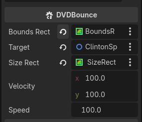
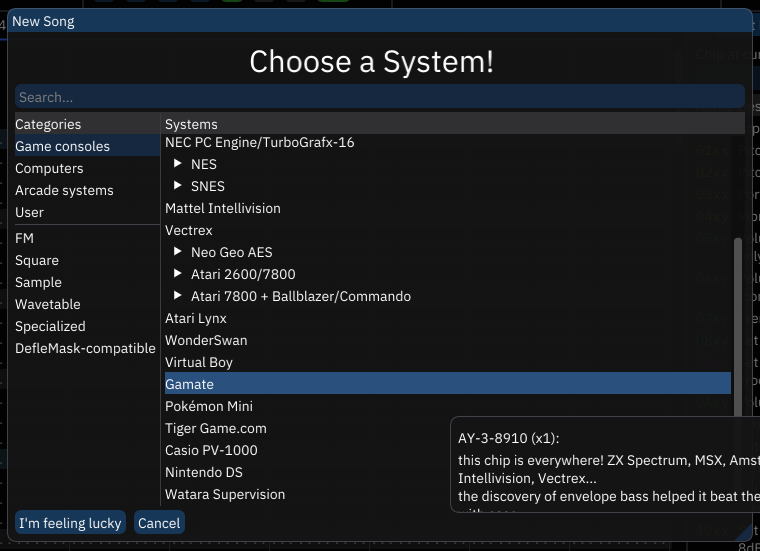
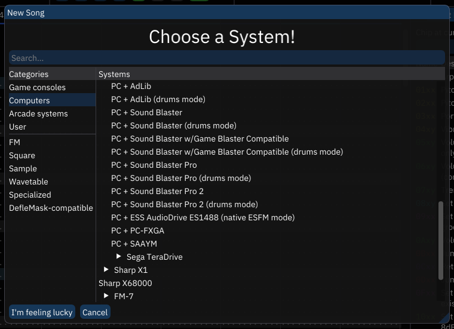
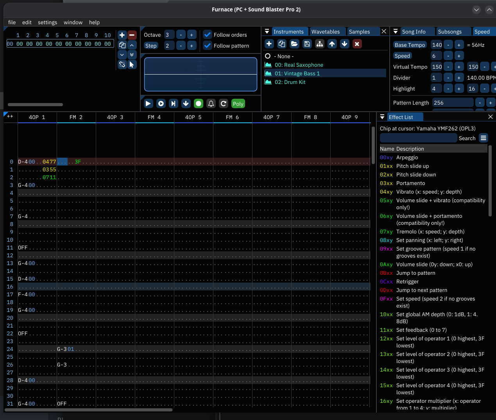
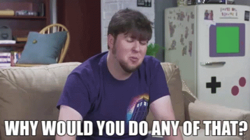

+++
title = "Pulling My Hair Out With Frustration to Make The Dumbest Shit You've Ever Seen"
date = 2026-03-23T22:00:00-07:00
draft = false
categories = ["video games", "art"]
tags = ["cybergamer", "90s", "retro"]
description = "I spent my weekend building a forgettable trash retro screensaver"
images = ["cybergamer.png"]
+++

CyberGAMER Canada is further than it was the last time we checked up on it.



<!--more-->

-----

## What's CyberGAMER Canada, again?

A fake computer magazine from the Year 1995.

It's not done, yet. I'm working on it. 

_you can hear me breathing SO MUCH in this video it's weirdly ominous_



------


## BCLINTN_SCRN.exe

Okay, so, one of the things that PC Magazines of the era used to come with was a CD loaded with freeware goodies, and these freeware goodies were usually bits of software design _so disposable_ that you would forget them immediately and never think about them again. 

This seems like fun? It seems like a fun thing to try and replicate.

One of my co-workers, Ticky, has been running [a twitch channel](https://www.twitch.tv/ticky_d) where she goes through 00's era computer magazines, _specifically their software_. This is a fun and interesting project. 

So, the idea that stuck in my head as the most deadass-simple bargain-basement stupid fucking thing that I could possibly build: A Bill Clinton Playing The Saxophone screensaver. 

## Well That Sounds Very Easy
Somehow it took my entire weekend. This is because

* **A:** It is much harder than it seems, and
* **B:** I am not terribly competent.

I'm using a [pretty fresh linux computer](/posts/2026/the_year_of_the_linux_desktop/). I _completely forget how to build things in Godot_ every single time I boot up Godot. So let's get that stack back up and running. 

I download the Godot runtime from [the website](https://godotengine.org/) (as usual), and get cooking. 

I've spent a lot of time learning GDScript on previous runs, but this time, I'm using C#. So I lose some time to setting up a basic C#+Godot development environment for the first time on this computer. 

I don't know why, but the "Bill Clinton Screensaver" of my dreams does the DVD bounce. 

You know, this: [Bouncing DVD Logo](https://bouncingdvdlogo.com/).

And it's quite easy to get the basic DVD-bounce animation in place using the Godot Default Image. 

> 
>
> this little robot head has been a placeholder for so many things

I did some stuff I consider a tiny bit thoughtful: 



The "boundary" of the DVD bounce isn't hardcoded, it's set to a rectangle! And the size of the target "bouncable" is also defined by a rectangle, because I can't just poll "size" from an arbitrary Node2D.

We're only hours into Saturday and the coding part is already done. Nice. This is going to be in literary terms this is known as _foreshadowing_. 

## Oh No, Art

Now I need... a little Bill Clinton to toot a little saxophone? 

How hard could it be to do art? 

First of all, visual reference. 



I'm relatively depending on who you compare me to, "Bill Clinton playing the saxophone" for me is a weird running pop-culture joke from the animated TV show Animaniacs, I'm not sure what the actual cultural context for that is, but the internet indicates it's likely to be this: 



So, this was 1992 (I'd have been 6, I probably wasn't watching the Arsenio Hall show at the time). 

Also: this has exactly the right combination of "cool" and "deeply dorky" to really capture the Democrat brand, I can see why it played well.

[Aseprite](https://www.aseprite.org/) lets you set your color wheel to "256-Color VGA" - which, by 1995, is kind of a dated standard, at this point 16-bit and even 32-bit color modes are super common, but restrictions breed creativity:



Would you believe that this is my THIRD crack at the character? Pixel art is always harder than I give it credit for, for one. My first and second shots at this art weren't "cartoony" enough for this dumb little joke to _feel right_. 

Oh, and it needs to be animated. Not just one frame, but... _two_. 



2 full frames. We're really breaking the ol' budget on this bad boy. Move aside, [Pedro Medieros](https://saint11.art/blog/pixel-art-tutorials/) and [Brandon James Greer](https://www.youtube.com/@BJGpixel), there's a new sheriff in town. 

With that out of the way, I had to bake the texture into a spritesheet:



And watch a tutorial on how to use the basic sprite animation tools, again. 

Yeah, by end-of-day Saturday I had completed this single sprite animation _and_ made it move around slightly!



... this is why _game jams_ are so suspicious to me. You have to be going in to them with huge amounts of pre-existing library and knowledge just sitting around because every time I do _anything_ it takes Calendar Days. I'm not in Game Jam shape, unless the Jam is willing to take "Bill Clinton Screensaver" very seriously.

## Day 2: Sound

"Screensavers don't have sound."

Not true! Obnoxious novelty ones absolutely did!

I'm imagining some really nasty, crunchy, MIDI saxophone here. 

This proved to be a bigger challenge than the coding and graphics by _far_. 

For one thing, I don't have any software for this, really - while I donked around with Fruity Loops to make [Adaptive Music](/posts/2025/the_watchmakers_dilemma/#adaptive-music) for the last little Godot game I built, **Fruity Loops does not run on Linux**, at least not without a Wine compatibility layer. Either I need to fuss with Wine, or learn a whole new DAW (and it's not like I knew any of the old DAWs that well).

Once I had Fruity Loops running, I'd need to get an appropriately _retro-sounding VST_ to simulate an old PC.

Ugh, okay, that's one option. Another option might be to buy [Renoise](https://www.renoise.com/), which is inexpensive and runs natively on Linux. The "tracker" format's kinda ugly but it certainly feels _emotionally right_ for retro projects like this.

Then, I'd need a VST that would simulate a sound chip from the era. Which would likely be a ... Yamaha something-something? One of those Sound Blaster chips, y'know. 

So, research into the retro sound-chip VST emulation space takes me to a lot of dead ends, like this old abandonware: 

> https://github.com/Jeff-Russ/AdlibBlaster
>
> A VST instrument which emulates the Yamaha OPL sound chip used in PC sound cards from the 90s.

then, to this more modern and maintained option: 

> https://github.com/jpcima/ADLplug
> 
> FM Chip Synthesizer — OPL & OPN — VST/LV2/Standalone

-----

All of this DAW stuff is frustrating. I saw someone do some cool live-coding music gen on YouTube, let's look into that. 

> https://sonic-pi.net/
>
> Sonic Pi is a new kind of instrument for a new generation of musicians. It is simple to learn, powerful enough for live performances and free to download.

```
with_fx :reverb, mix: 0.2 do
  loop do
    play scale(:Eb2, :major_pentatonic, num_octaves: 3).choose, release: 0.1, amp: rand
    sleep 0.1
  end
end
```

Oh yes, I remember now: the reason I didn't want to fuss with live-coding music was because the most popular language for it looks like _this_. It's terrifying. 

Perhaps more of a dealbreaker, here: it's just _its own synth_, there's no way (according to my minutes of research) to make it sound like a specific retro box, so it doesn't quite fit the design brief. 

-----

### Salvation From An Unexpected Tool

While I'm poking around trying to figure out how I'm going to fit all of this together, I run into ... FurnaceTracker.

> https://tildearrow.org/furnace/
>
> the ultimate chiptune music tracker.
> supports nearly every old-school 8-bit/16-bit system out there! from the Atari 2600 and Commodore PET to SNES, Genesis and arcades, you'll feel at home with the vast selection of systems Furnace supports.

This is a fully FOSS tracker that doesn't support _any_ modern DAW features, but instead supports an _unbelievably deep roster_ of retro system emulation options.



And look! They also have Sound Blasters and AdLibs! 



Easy installation, all I need to do now is watch the tutorial and get up and running with this not-at-all confusing and arcane interface:





The tutorial is quite good, actually, easy enough to get started although _holy shit this is hard_.

Also, I need some instruments? The Yamaha YMF262 is pretty late in the "sound chip cycle", so it's a powerful chip that has loads of parallel FM Synth channels, and it's _all FM synth in there_. If I want to do _anything_ I'm going to need to make some instruments.

I try to find some instructional material on how to make FM synth instruments in Furnace, but it's pretty light on the ground. FM synth is, how you say, _a little complicated_, but I can probably just cobble together any old HONK and I'm on my way. 

I have a little _stroke of inspiration_. Why look, there's a "load" button. I bet other people have already built a library of instruments for this.

Ayoooooooooooo.

> https://magmania.itch.io/furnace-tracker-opl3-patch-pack-300-instruments
> 
> A pack of instrument presets for use with the Yamaha OPL3 chip in Furnace Tracker. A majority of patches use only OPL2 features but many of them use OPL3-specific features. 4-operator mode patches are separated into their own folder.


-----

Okay, so, actually laying down any kind of _sound_ with the tracker is going to be a lot easier with a MIDI keyboard. I _could_ do it just with a normal, non-MIDI keyboard, but... I mean, if I want to be able to pick out any kind of tune, that's going to be easier with a MIDI keyboard. I have a MIDI keyboard in my office, it's just not set up right now. So I set it up. Get it configured with Linux. 

Nice.

And with that... I spend some time listening to the Bill Clinton/Arsenio Hall clip and compose a _just dogshit_ rendition of it with the "Real Saxophone" and "Vintage Bass" FM patches, using 2 of the available **18** FM channels and letting the rest go to waste. 

This takes... well, the rest of the day. I could try and get some drums in there, but it's late, and I think it's time to call it. 

The amount of effort this unimpressive 36-second honking saxophone MIDI loop took was _quite a lot_. 

## Loading It Into Godot

I checked and, at time of writing, getting Godot to accurately synthesize its own sounds is something that would require a _lot_ of work on top of the Godot core that _very much hasn't been done_. Godot is a game engine, not a [Digital Audio Workstation](https://en.wikipedia.org/wiki/Digital_audio_workstation), nor is it intended to be used to _build_ a DAW. 

This is true for most modern game engines, I think. Games haven't been responsible for their own synths since the era that _i'm simulating_. You're supposed to bake the music and sound effects _outside of the game_ and then _bring them in to the game_. 

That's one of the reasons I needed to do this with an external tracker and instrument stack! Playing sound in Godot is more of a "give it pre-baked sound files and let 'em rip" kind of situation.   

So: we bake the sound into a `.wav` using Furnace, use `ffmpeg` to crunch that into a `.mp3`, load that into an AudioStreamPlayer node in Godot, set it to "Autoplay" and "Loop", and we're off to the races!

------

## BEHOLD, MY MASTERPIECE: 

oh, great, I accidentally uploaded the version of this where I lose the window for half of the song. Well, I guess that's about right, given the overall quality, here: 



-------

## Yes, That Is How I Spent My Entire Weekend

Of course, I'm not entirely done. I was hoping to be completely done by the end of the weekend, and I'm close, but no cigar. 

If I want to _actually fully ship this in my magazine's CD-ROM_, I'm going to need to figure out how to _properly sign the files_ so that they'll actually open in Windows without an antivirus immediately going "WHOA THERE WHAT'S THIS GARBAGE?". I think I need a Microsoft developer account for that, which I _hope_ is free? Linux is blessedly already good to go, and I don't think I can _get_ a signing key for Mac without a $100USD/yr Apple Developer account which is _absolutely not worth it_ to publish software for the Mac ecosystem.

## Oh, Shit

"I wonder if this would fit on a floppy diskette?"

_Extremely no_.

I checked the compiled size of BCLINTN_SCRN.exe and it's 181.5 Megabytes. If you're wondering what's taking up all that space? It's 3.7kB of pixel art, 908kB of sweet mp3, and then 180.55 additional megabytes of _Godot Game Engine_.

That's trim and spritely by modern standards, but an unwieldy behemoth if you're doing something stupid like trying to burn a bunch of shitty little games on to a CD-ROM drive in 2026 for some reason. 

**Retro Bill Clinton Screensaver, Now Available as a Lightweight 127 Floppy Set!** 

Still, though, that lets me ship at least ... 3 things, per CD. I wasn't planning on building _too many programs_, I mean, 2 more things will take me at least 2 more weekends, at current pace, so if I ever want to ship _anything_ I'm going to have to keep the scope manageable. 

## Wait, Do You Need To Actually Burn a CD? Nobody Even Still Has a CD Drive to Read it With.

Yeah, the most likely _actual_ delivery format for these assets is in a digital download.

I'm not sure the exact delivery method for this project quite yet - maybe I'm _pretending to discover it_ (act surprised) and, for the sake of convenience, I've wrapped every one of these games in a hefty compatibililty layer before zipping into an internet-available archive, so that you, a person from 2026, can interact with it. _That's_ why they're so huge. 

---- 

## Why? 



I build a lot of things that don't make a lot of sense, and this CyberGAMER project - heck, this stupid screensaver - seems to make even less sense than usual.

The thing I have built here, I can say with some certainty, has absolutely no value whatsoever.

The goal here, partially, is to _try to build big thing out of a lot of little thing_. The "[WarioWare](https://en.wikipedia.org/wiki/WarioWare)" school of design. 

I have a busy, difficult job that takes a lot of my time and focus - it's hard to have a lot of time to devote to side projects. If I want to make any kind of meaningful forward progress, I need _tightly bounded scope_ and _easily achievable milestones_.

I finished! I finished at 3AM on Sunday, but I finished this project in a weekend, from scratch, with art and music! I cooked dinner, both nights, also. And I mounted a TV in the basement. Cleaned. Had a shower. 

It's a little frustrating to me that I have to set the goalposts **this** generously to have any chance to succeed, and yet, here we are. This is where the bar has to be for me to make a video game successfully. Bonus: I can chunk it in the bin and it's now a small part of something bigger and weirder!