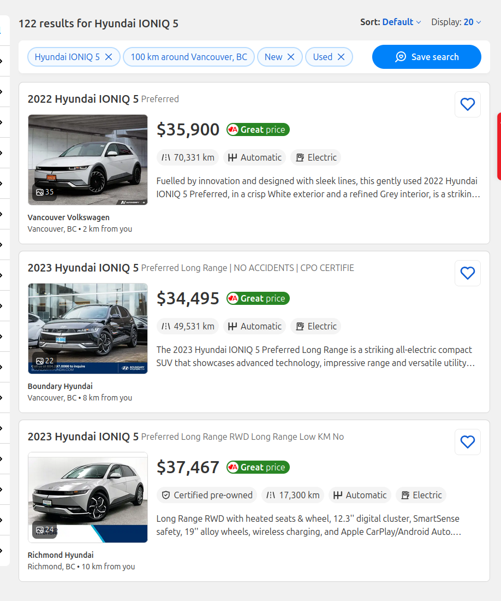
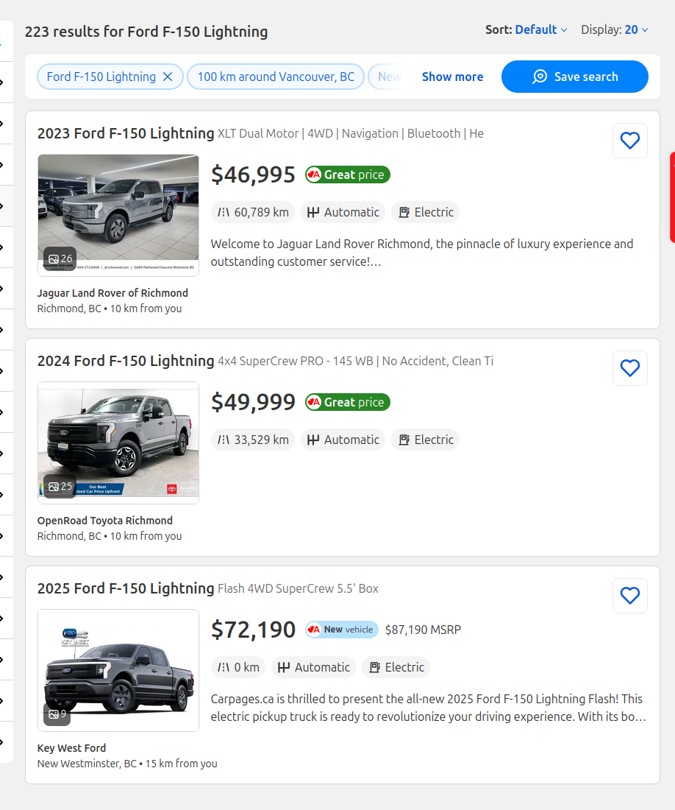

+++
title = "EV Time Is Nigh"
date = 2026-02-13T12:00:00-07:00
draft = false
categories = ["technology", "car"]
tags = ["toyota matrix", "toyota", "hyundai", "nissan", "ioniq", "bz4x", "leaf", "slate"]
description = "i'm not quite ready to buy a new car but I'm getting close"
images = ["ioniq.png"]
+++



<!--more-->

Sixteen years ago, when I bought my Toyota Matrix, I knew, in my heart of hearts, that it would be the only ICE vehicle I would ever own: because the plan was to own it for a long, long time, so long that by the time I was ready to move on to a new vehicle, hydrogen or electrics would be the standard. 

Lately, sometimes, I've been looking at EV options. 

End of 2024, in fact, I was starting to get such a bad EV itch that I spent a few grand on aftermarket upgrades to my car to try and forestall any EV purchasing impulses I might have. 

Here's the thing, though: in the past 16 years, I've put maybe 125,000 kilometers on the ol' Matrix. That's _not many_. It's hard to justify a lot of car expenditure based on the _quite limited usage_ of my existing car, which is only insured for pleasure usage _anyways_.

But _even given that_, 125,000 kilometers is quite a long ways!  It's a third of the way to the moon! 

Let's assume, based on the efficiency numbers for my car plus a little bit of fudge factor for weight and to make the numbers clean, I'm getting about 10L/100KM: that's 12,500L of gasoline. Assuming an average price of gas of about $1.50 over the car's lifetime, that's **$18,750** I've spent on gas over that time. 

That is a lot of money I've spent on gas! But also, if I wanted to drive for another 16 years in the _same_ car, assuming gas gets more expensive (everything does), I could expect to pay maybe another $25,000 on gasoline? That's quite a lot, but it's still quite a lot _less_ than it would cost to buy a whole new _car_. Hell, add that to the price of a 16-year old Matrix with 125,000 kilometers on it and mild body damage (about $8000, blue-book) and buying a brand new _sixteen-year-old-Matrix_ and driving it for 16 more years would _still_ be only **$32,000**, which is, notably, _about half what it would cost to buy a new EV_. 

**New EV's Are Pretty Expensive**. Especially because, as a soft middle-aged man, I'm way more likely to fall for all of the new bells and whistles. Why yes, I _would_ like heated seats and a heated wheel. After driving my Matrix in the winter I would like those things _very much_. 

## Why Do You Really Want a New Car?

Well, I had a few things I was curious about: 

* A car that's more fun to drive.
* More cargo space
* A car radio with bluetooth, so I don't have to keep fussing with and replacing AUX cables forever.

Well, let's look at these one by one:

## I'd Like More Cargo Space

"Cargo space? No, car go **road**, dummy."

Anyways, need more cargo space?  Fit it with a roof rack!

> 
> 
> This adds significantly more carrying capacity, although it does noticeably impact fuel economy, especially when I'm fully loaded.

To be honest, shopping for cars nowadays, it's a struggle to find a car in the "small SUV" segment that has as much cargo space as a Matrix, this car is a damn Tardis for how much it can store. 

I have a fun story where Tiff's Dad asked us to pick up some cabinetry for him from a place, and I cruised up in my tiny little car and they looked at their pile of cabinets, then at my car, and said "you're never going to fit it all in", and I cracked my knuckles and made it work, although I did feel like the drive to our destination was made from _within a cabinet_.

> 
> 
> Pictured: A cavernous 61.5 cubic feet of cargo space

For comparison, the Hyundai Kona, a compact SUV, has 63.7: more or less an equivalent amount of cargo space.


My little hatchback puts up big cargo numbers - when I bought it, I was optimizing for "cheap, reliable, gas efficient, big trunk", and the Toyota Matrix has been _absolutely crushing it_ at those metrics all this time.

## To Replace that Slot; With What I Once Bought ('Cause Somebody Stole My Car Radio, And Now I Just Sit in Silence)



Yeah, I should have done this one quite a while ago, because it was not an expensive thing to replace. I went to some local car sound guys and I asked them what they'd recommend for a head unit - I'd done a bunch of research up front, mind you - and they recommended about what I'd expected, this pretty good balance of price and performance, a $750 fella with wireless Android Auto and Apple Carplay. It cost me another $750 to have them install 
I watched a few installation YouTubes and quickly inferred that this would be well worth the money.
 and I was off to the races. 



Beauty. Now, when I turn on my car, this little computer boots up and automatically connects to my phone. By buying a high-end head unit, too, I have something that actually performs better than a lot of modern cars &mdash; it's fast and snappy. Hyundai didn't add _Wireless_ Android Auto/Apple CarPlay until a year _after_ I bought this unit.

## More Fun To Drive

When Tiff's Dad was out of town and moving to his new place, he asked us to help out, and some of this help involved me moving his very nice **Infiniti**. 

I'm not sure the exact model, but it's a car firmly in **BMW** territory: a low-slung, powerful, luxury car for project managers and doctors.



I _hated_ driving this car. 

It's _too nice_. 

It turns out that sixteen years driving the same car bakes in a lot of habits and feelings. My Matrix feels like an extension of my body. Driving the Infiniti gave me _car dysmorphia_ because it was the wrong _shape_ and _size_. 

It was too powerful. There's no _road noise_, I didn't feel _connected to the road_ at all. When I wanted to go fast it just _went fast_, not at all like my stodgy Matrix which steadfastly refuses to accelerate under anything but the most optimal 
At one point I checked online for the 0-60 time for a Toyota Matrix and the website posting the numbers had to indicate that they'd measured it with a _calendar_. 
.

When I got back into Friend Matrix, I had been cured of "I want to drive a nicer car" fever. _No sir_, I want to drive a car that I have a sixteen year long relationship with, it's much safer and more controllable that way.

And having resolved my **three issues**, my car was once again made new, and the itch to buy an EV retreated for a little longer.

## The Car's Been Pricey Lately

That was expensive, yeah, but the whole car glow-up amounted to about $3500, all in. In the past year, I've spent easily that much at the Toyota dealership on brakes, oil changes, tires, spark plugs... it turns out, keeping a 15-year old car healthy and happy can be an expensive project. I _should_ have a battery replacement coming up, soon, too - my first car battery gave out at year 7 and since I'm now at year 16, it's due.

Now, _some_ of those things are still an expense on EVs - if anything, I imagine that tires are _more_ expensive on EVs on account of how heavy they are. Brakes would still be an expense, although I'm told regenerative braking adds a _lot_ of lifespan to the old mechanical brakes. Chances are, with an EV, I'd still be doing my twice-yearly tire rotations where they also do some filter swaps and liquid refills and charge me exorbitantly for the privilege to do that. 

Honestly, if I had an adult garage I'd seriously consider buying some equipment and learning how to do these things myself, although I do appreciate that my car's maintenance currently just comes down to showing up at Toyota twice a year and giving them Some Amount of Money.

## 2 Years Later: Headwinds For the EV Itch

2025 and 2026 have been interesting years for EVs. 

Okay, so, federal EV rebates have been vanishing both above and below the border, so a lot of automakers have scaled back their EV plans - that's not great, buuuut...

YouTube has been reminding me that EVs are, in fact, very convenient.

"Hey, remember all of those times you've had to go to a gas station and fill up your car? Yeah, that sucks, right? What if you _only_ had to do that on long road trips and not at all the rest of the time."

Also: thanks to Global Geopolitical Tensions, China's entering the Canadian EV race with some of their heavy hitting brands like BYD and Chery, and that's going to mean _cheaper, more accessible EVs_.

> 
> 
> "[She'll go 300 hectares on a single tank of kerosene.](https://www.youtube.com/watch?v=9HXT7fDkf9I)"

So I started to poke around online to find out what people think about their BYD Dolphins and Chery Himla's: _oh no_, it turns out that China's built a global reputation for building solid, reliable EV's at an extremely reasonable price. 



It turns out that they're just _cars_. Most of the complaints about these cars are sinophobic noise from people who haven't driven them and never "Chinese technology is trash", posted from a Xiaomi 15 Pro.  

During one of these dives, I watched some car dealership guys talking about how it makes _so much more sense_ to lease rather than buy an EV, because _there are just so many new features coming out every year you'd be stupid to miss out on them all_. Obviously, my bullshit detector went into overdrive, but that activated a little neuron in my mind:

**"People (incorrectly) think that EV's age badly and a lot of people are leasing EVs: are lightly used EV's available at a large discount?"**

I checked AutoTrader and the answer is Very Yes, with _still very new_  EV's available at 20,000-25,000 under the MSRP of their newer variants. I don't think an IONIQ5 is worth it at $60,474

But it's a much more compelling proposition at $43,995, or $34,980.

I like the way the IONIQ 5 and 6 look, they're cool cars:





Although I'd _have to go with the Ioniq5_, the few times in my life when I've  needed a hatchback, I've absolutely needed a 
see the above "well-stuffed camping car" for an example, although "bringing a 65" TV home from Best Buy" is another prominent example that comes to mind. 
.

Time was particularly cruel to the Ford F-150 Lightning, a truck that would easily run over $100,000 in the base configuration and only got more expensive from there, now available for a tiny fraction of the price:

Honestly, **I'd** consider a F-150 Lightning at $50,000, it's a pretty great EV for people who want a suburban fuckabout for chores, although I'd get a little salty about never being able to park ever again. 

They also take _absolutely forever_ to charge, complicating long road trips and necessitating more home equipment, although it is a fun side effect that if you're going to get an electrician in anyways to install a Level 2 charger, you might as well also get them to set it up so you can run parts of your house from the _monstrous_ 130 KWh battery (4+ days, for most houses) in an emergency. 

And shortly after that, Hank Green made a video about how he'd purchased a _lightly used_ Ioniq5 because ... of exactly the effect I've described:



But also, the reason that the leasing thing has been so popular has been a weird loophole in American EV policy specifically, that has made it extremely cheap to lease a car, until... I don't know, a few months from now, probably: 



So, actually, if you take advantage of this and lease a car for very cheap in the USA, you're **helping**: not only do you get to drive a cool car for a few years, but also you've added a new cheap EV to the market, which someone else can buy - in fact, _you_ could be that someone else, a few years from now. 

Also, there've been some cool developments in EVs!

* More and more EV's (including the Ioniqs) offer V2L (Vehicle to Load) features that allow you to use them as potent, long-lasting, powerful emergency generators.  
* Post 2025, most cars ship with the NACS style charger, a new charger that's got a good shot at being the North American standard design going forward, meaning that if you buy a post-2025 EV, you're probably going to have the Right Plug for the next decade without having to fuss with adapters too much.
* The **Nissan Leaf** re-launched and is cheap, cheerful, and well-liked. It only has V2L on it's top trim level - which _isn't cheap_ - it has limited cargo space (10 cu ft less than the Matrix), and it's FWD (when AWD is widely accepted to be a borderline prerequisite for Canada), but... I honestly _love the look_ of this friendly If not friend, why friend shaped?: 



* The **Toyota BZ4X** got an updated 2026 model that has moved it from "easily one of the worst EVs on the market" to "8/10 pretty good, B+, solid car". Toyota's done a lot to earn brand loyalty with me, my sixteen years with the Matrix have been pretty trouble-free, and that comes off of a childhood of long-lasting, durable Corollas and Tercels. Toyotas are not enthusiast cars, they're boring and like me, and I am definitely willing to accept a slightly less flashy package because I genuinely _do_ trust them. Their plodding feature adoption is _hopefully_ born out of a conservative, quality-focused bent that hopefully speaks well for the longevity of their on the other hand, they launched the Mirai, so maybe they're just bad at this. 



* The **Hyundai Ioniq5** is enjoying total market dominance as everyone acknowledges that it is Hot Shit.
* _Vibrating With Excitement_: There's a chance that Hyundai is going to launch the **Ioniq3** in North America, which is their new "Hot Hatch". I fuckin' love hatchback 
SUVs are dumb, TEAM STATION WAGON REPRESENT.
. 



* Tesla's CEO came out as fully fascist, which is driving attention away from his dogshit cars. Which is good, because I've _always disliked Telsas_ and the fact that they're no longer sucking all of the air out of the EV discussion with their "no buttons" and their "self-driving that doesn't work and costs $100/month" and their "too much software, not enough hardware" is, I think, pushing the industry in a less stupid direction overall.
* [Slate](https://www.slate.auto/en) is trying to pitch to everyone a sub-$30K EV light truck with minimal features and a lot of customization. I don't love the Bezos connection or the fact that it's 🦅 AMERICAN 🦅, but that's the right pitch for me, at least. 
   * "People don't need a tablet computer built into their car when they already have a phone, they just need a place to put their phone."  Yes! Correct! 
   * "Just plunk a bluetooth speaker in your car and you'll get better sound quality than you would from a built-in system for a fraction of the cost." Okay, little suspicious of that one but I'll allow it.
   * This one has a real crack at avoiding some of the issues I'm going to talk about, below: less software is good, and simplicity also means _less things to break_. 
   * Honestly it seems like an ideal _second vehicle_ for a two-vehicle family but it might be a little spartan for a primary vehicle. Maybe I _do_ want heated seats.



## Hyundai's ICCU Problem

So, digging in to the IONIQ line specifically, because they're honestly kind of the pole position "one to beat" for EV's right now, they have _The ICCU Problem_.

> ### Hyundai's and Kia’s Charging Unit Issues Cause Problems for EV Owners
> Owners’ complaints related to the ICCU, including losing power while driving, hurt the brands' reliability scores in Consumer Reports' rankings. 
> 
> https://www.consumerreports.org/cars/car-recalls-defects/hyundai-ioniq-kia-iccu-failure-tesla-a3038878758/

The tl;dr is: Hyundai and Kia has an important component with a failure rate that they claim is "less than 1%" but as measured by Consumer Reports could be much closer to **5-10%**. 

Hyundai/Kia were already struggling against the perception that their cars are flashy but a little cut rate, quality-wise, this has _not helped_.

## Cars as a Service (CAAS)

I like that my Matrix has _minimal computer_ on board. There's some, but it's a lot of pretty dumb computing, mostly C, and it's barely connected to my radio head unit which I was able to _swap out entirely_. 

I work on software professionally, for a living, and that's given me one very strong feeling: _most of these people should not be allowed anywhere near dependable technology_.

And, lo, it turns out that the folks making car software are kinda bad at it.

That's one of the bigger complaints about the Tesla line, as well as Volkswagen's ID.4 and the _adorable_ new Volkswagen Van:

> 
> 
> I absolutely love the idea of this van, but the reviews have not been kind.

There's a lot of software in these cars and most of it isn't so good. In many cases, the software replaces things you needed, like _important buttons_. Like _the button that opened your glove compartment_.

In Drew Gooden's "Cars are Getting Dumber" he goes on at length about how frustrating modern car designs can be.



Jaiden, also, complains vociferously about how she missed something important because her car decided that it was Software Update Time when it was supposed to be **Driving Time**.



Tesla and BMW rightfully got pilloried for trying to hit people with monthly fees for car-related services, but neither of them are backing down:

> ### BMW Commits to Subscriptions Even After Heated Seat Debacle
> You may not have to pay a monthly fee to keep your butt warm, but BMW isn't backing down from subscription features.
>
> https://www.thedrive.com/news/bmw-commits-to-subscriptions-even-after-heated-seat-debacle

> ### Tesla Full Self Driving subscription to rise alongside its capabilities
> One-time FSD purchase no longer available as Elon Musk talks up future where drivers can be asleep at the wheel
>
> https://www.theregister.com/2026/01/23/tesla_full_self_driving_subscription/

So, instead of paying for _gas for your car_, the automakers would like for you to pay for _software for your car_. Better for the environment, but maaaaan, fuck that.

## Car Software Privacy _Very_ Bad

By the way, all of those cameras and microphones on your car, now? Every single EV maker on the market reserves the right to sell all of the data from those to _anybody they feel like_, so if you're wondering if advertisers or ICE can buy a comprehensive profile of you constructed from AI-summarized observation of your home collected by your car, the answer is "almost certainly".  

> ### ‘Privacy Nightmare on Wheels' 
> Every Car Brand Reviewed By Mozilla — Including Ford, Volkswagen and Toyota — Flunks Privacy Test
> 
> https://www.mozillafoundation.org/en/blog/privacy-nightmare-on-wheels-every-car-brand-reviewed-by-mozilla-including-ford-volkswagen-and-toyota-flunks-privacy-test/

## Installing a Home Charger

Ha ha! I own my home! I park right in front of it! **I could get a level 2 charger installed if I needed to**. 

But, uh, given my extremely light usage, I probably don't need to, I can probably just run an extension cord over and charge the car with a regular plug.  



A regular household plug provides, like, 5-8Km of range per hour, and can take _days_ to fully charge a car from 0 to 100.

But, like... If you plug-in charge for 12 hours a night, you're good for 60Km/day. My rolling average is 150Km of driving per _week_, and that's including the gigantic road trips I take out to the boonies every now and again. 

In order to suddenly be faced with more than 60Km of driving per day, I would need to _suddenly have a commute_ that's further out than Richmond or Langley, which... I don't want. And then, _if and when that happens_, I could *pretty trivially install the Level 2 charger*. 

## Anyways:

All of this makes me pretty sure: **It's not time yet**. The Matrix can make it to 20.  

Maybe if my teenage nephew needs a solid, reliable car in the next couple of years and is willing to engage in an epic roadtrip to transport it from Vancouver to Toronto, that would be a good continuation in the tale of **John Matrix, The Heroic Chariot**. I have some friends with oldest children coming up on driving age, he says, oldly...  

But it might be, soon. In a couple of years, a lightly used 2026-2027 Hyundai hatchback with V2L, NACS and _whatever they've done to fix the ICCU issue_? Or, heck, a Nissan Leaf or a Toyota BZ4X from _this year_, in a couple of years? 

_seems pretty good_

