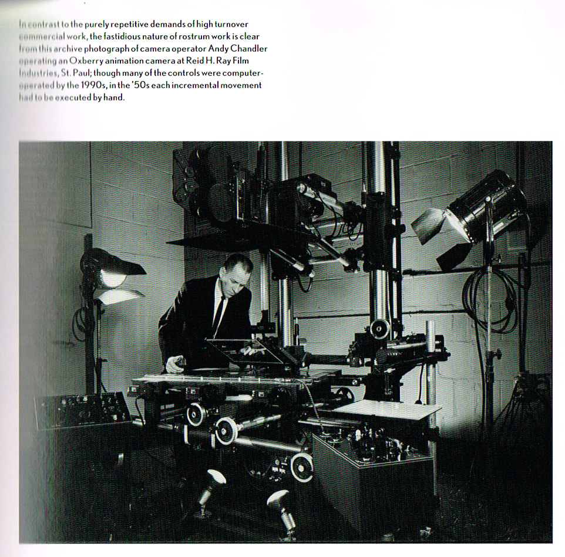

+++
title = "The Mountain, The Moon Cave and the Sad God"
date = 2026-02-18T12:00:00-07:00
draft = false
categories = ["music"]
tags = ["gorillaz", "plastic beach", "the mountain, the moon cave and the sad god"]
description = "damon albarn has been making music for my entire lifetime so far, and I'm old as shit"
images = ["cel.jpg"]
+++



I usually have a lot of windows open at once but sometimes you need to just stop and give something your full attention for just a few minutes, and this animated 8-minute short film from the Gorillaz was one of those things.

<!--more-->



This thing is still digitally animated and composited, don’t get me wrong, but they do a lot of stuff to try and imitate some absolutely beautiful tricks from the Jungle Book age of animation.

Seeing this cel you might think, as I did, "wait, did they cel animate this WHOLE THING?" - but... no, they hand-painted a few reference cels as a _style target_ for their digital animation.



Which makes more sense - the equipment that you need to actually cel animate in this day and age _doesn't exist_? Even in its heydey, we're talking complex camera rigs that took millions of dollars to produce and run. 

Or, say, in order to get a naturalistic looking waterfall, they'd film smoke, then color grade it, flip it upside-down, and composite it in to the painting.





That's a digital trick, but it's a _classic camera trick_, something that you _could_ have done in the 70s if you were very deft, and it looks stunning.

----

Gosh, Jamie Hewlett looks _old_. 

His role here is mostly doing Art Directory things, pointing at stuff and telling young, talented kids what to do. 



The whole Moon Cave sequence is, in fact, just another director entirely, a fella who Jamie believed in and wanted to give _space_ and _money_ to to see what he could do, and it looks great. 



-------

## I Like The Pop Stuff First

This most recent Gorillaz album has been trickling out bit by bit, a kind of trippy "Brit wandering around in India" album. My favorite song from this most recent album so far has been The Happy Dictator, because it always takes me forever to come around to the more experimental songs:



Like - I think "Plastic Beach" might be one of my favorite albums of all time, but a lot of that album's songs took a while to land. I think I finally came around to liking Sweepstakes, like, [a few years ago](/notes/2023/sweepstakes/). 



-------

## Forever A Mixed Media Project

As Lady Emily mentioned in her "Plastic Beach: The Masterpiece that Almost Ended Gorillaz"- 



the Gorillaz project has always been a partnership between Damon Albarn's experimental brit-pop/hip-hop mashup music and Jamie Hewlett's Tank-Girl-visual art.



The conflict - the _problem_ with this arrangement - has always been that the music industry is only interested in the Damon Albarn half of that arrangement, and only insofar as he can maintain his Daft Punk-like position _vaguely on the periphery of pop royalty_.  The Gorillaz are a _very_ expensive project to maintain in the hopes of, what, one, maybe two hit singles per decade? And yet.

One of the things I've always liked about the Gorillaz is the feeling that there's this _huge lore_ there that I'm just missing out on, although one time I did a deep dive on what that lore actually _is_ and it turns out it's disappointing to know _all_ of the details, so I don't recommend actually looking in to it. It's way cooler to think that these characters have a really interesting story that you're always just catching a tiny corner of. 

I know very little about the internal politics of this band or the details of the politics between Damon Albarn and Jamie Hewlett, but I will note that despite all of that, the Gorillaz have remained steadfast: this is not the Damon Albarn show, this remains _stubbornly and insistently_ a mixed-media project. Which is why this Clearly Very, Very Expensive animated music video is a triumph.