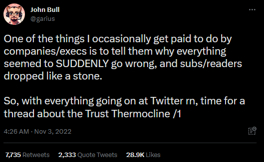
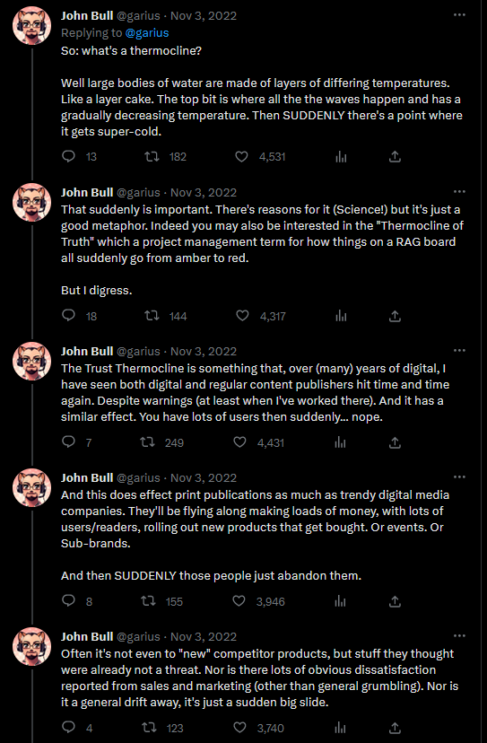
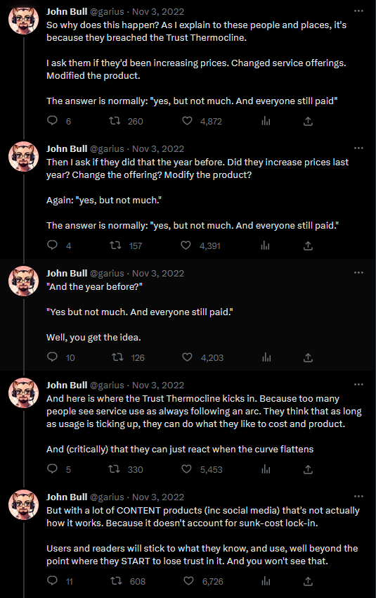
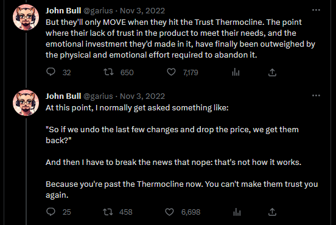

+++
title = "Infinite Velocity"
date = 2026-03-13T03:00:00-07:00
draft = false
categories = ["software"]
tags = ["ai"]
description = "What if AI delivered everything it promised, with no downsides, and that was still a huge problem?"
images = ["paw.gif"]
+++

What if your organization were finally able to deliver anything it wanted, as fast as it could imagine it?

<!--more-->

-----

## Wish Granted. 

Let's imagine we exist in the Sweet Spot world. 

Many of these may not be _actually_ true, 
but in order to present the hypothetical argument I'm about to make, let's imagine that they are, in fact, true:

* LLMs are just smart enough to help people do their jobs without replacing them entirely.
* LLMs are so smart that they are able to confidently do most jobs very quickly with minimal supervision (while at the same time leaving that first bullet point _also true_).
* Using exclusively LLMs as your work tool of choice for long stretches of time _does not_ gradually erode your ability to empathize with other human beings or make good decisions about software. 
* The people who build and sell LLM tools have humanity's best interests in mind and will continue to be exactly this altruistic for the foreseeable future.
* The environment and economy hold fast. A vibrant middle class remains, the economy booms, maintaining a large consumer base to support further growth across every technological field.
* We don't experience a [butlerian jihad](https://dune.fandom.com/wiki/Butlerian_Jihad) or any other large social I had to delete a whole multi-paragraph tirade, here, deleting a bunch of words like "robber baron capitalism", "guillotine", and "a small valley filled with some of the worst people I've ever met", I don't need to rehash this topic, I'm sure you've seen _plenty_ of it. . 

Okay, so, that may seem laughably optimistic as an outcome, but here we are. The ideal future.

Anyone can talk to the LLM until a patch is fully formed, and your LLM-augmented senior developers can tinker with, deeply analyze and approve those ideas in minutes. 

Gone are the sad days where engineers are delivering a paltry PR per day. Your best engineers are spending all of their time using their LLM-augmented intuition to rapidly push four, five - nay, dozens of patches a day, directly into production.

Engineering is now _free_, or effectively free. 



After that, you quickly discover that _the barriers to shipping at the speed of thought_ are not just engineering barriers: they're also human barriers. Much of your organization was devoted to prioritizing, planning, designing - all of that out the window now that features can be prototyped and shipped _instantly_. 

There's no need to prioritize or plan when engineering is free: simply _do everything, all the time_.

The designers are the next bottleneck, but they've become very fast, too - using the new LLM-enabled "Ligma" they can use their expert judgement to spin ideas into fully formed UI designs in what seems like no time at all.

The bottleneck after that? Product leadership, obviously. Presented with dozens or hundreds of new ideas a day, leaders can't keep up with the amount of _ideation_ that's happening. Vision and strategy is going to have to go by the wayside. LLMs can help, here, too: decision making must be unshackled from human bottlenecks. **Everything can be A/B tested**. There's no reason to stand in the way of anything, so long as users keep favorably responding to the increasing number of Net Promoter Score: that thing where you rate on a scale of 1 to 10 how likely you are to recommend a company to somebody, a common practice with people who've abrogated their responsibility for product development in favor of _growthhacking_. surveys they're receiving, average revenue per user is increasing, monthly active users are going up, churn is improving, and your company continues to score well on the Bilmer-Chuckley user enrichment scale.

With the new tightly optimized pipeline, a whole experiment can go from the ideation phase, through design, get baked into a UI, shipped to the development team, and launched in under a day. Patches are sourced from every team in your company. Product, design, customer support - anybody who's got skin in the game can kick off this process, make changes to the product that they desire and have them delivered, along with a test suite maintaining that everything still works and ample  of course, only the LLMs will bother to read the documentation: attempts to understand how your product works just create another bottleneck.. 

Finally: everyone in your company is a rockstar who can proactively change the game by engaging with stakeholders, addressing low-hanging fruit and delivering customer value at scale.

This is the dream of Silicon Valley. You've achieved **infinite velocity**. 

## Product Stability Is Somehow Decreasing?

Every change is going through intensive senior developer analysis, thoughtful review, and intense unit testing. Senior developers are empowered to make large, impactful refactors to the codebase. Still, somehow, outages and weird errors are proliferating faster than ever. What gives?

Well, for one thing, the product is now an _intensely moving target_. That velocity is _working_, and the product is becoming _huge_, and it's becoming huge _fast_. 

It's impossible to deliver new features and functionality without coordinating with all existing features and functionality, and the space of all existing features and functionality gets larger and larger _every single day_. The LLM is very confident that it can ship things without breaking anything, and the humans whose job it is to review it all... depend so much on the LLMs to get their job done that they no longer understand the _newly gargantuan_ underlying systems.

Nobody alive understands how that feature works, not even the developer who shipped it, because _it was the third thing out of six that they reviewed that day_. 

The complexity of the system is increasing faster than even LLM-aided understanding of the system can manage. 

This would never happen in real life, obviously.





Now, technically, a team of curators could be convinced to carefully, thoughtfully prune their systems to maximize stability and protect a stable system core - 



There's nothing product design loves more than _removing features and functionality_. Removing configuration options. Removing underperforming components. Products do that all the time, right? They're definitely not cramming in new features, day after day, running an endless treadmill of trying to be all things to all people, growing and growing eternally.  

Thoughtful curation and pruning, of course, exist in opposition to the idea of **infinite velocity**. Velocity isn't about care, thought, craftsmanship, it's about _delivering as much as possible, as fast as possible_. If it makes the line go up, it _stays in the product_.  

## The Metrics Are Somehow Getting Worse?

Each individual feature A/B tests well, and yet overall product satisfaction seems to be diminishing? 

Well, for one thing, _every other company in the world_ has _also_ embraced infinite velocity, so the best case scenario for the infinite velocity regime is _treading water_, maintaining your existing relevance in the face of the unyielding drumbeat of a brutal industry.

The human factor is getting weird, though: people are growing bitter with the constant NPS surveys. People don't like being A/B tested on. They feel angry that the product is changing in unusual ways every time they boot it up. They don't like the _stability issues_. They don't like being experimented on. 

The product they love is _also_ a moving target, and they can feel it _constantly shifting, optimizing for engagement at all costs_. The algorithm wants nothing less than 100% of their attention and money, and they notice, and they're becoming _angry_.

Few companies measure user _trust_.

Every A/B test, every stability issue, every unwanted new feature, every _thing intended to appeal to everyone but not you, specifically_ brings the product a little closer to breaching the trust thermocline.

### The Trust Thermocline

So, Twitter has become essentially a closed-loop ecosystem nowadays, and linking the original tweets about this is increasingly hard, so images:

Like Meta, or Twitter, the product is so optimized for engagement and so _widely distrusted by users_ that it hollows itself out from the inside, collapsing like a dying star, itself populated only by scattered LLMs designed to pretend to be users in order to boost engagement.

## All of the Employees are Exhausted and Unhappy?

One of the worst things about the **infinite velocity** workplace is _imagining working there_. 

Sure, the AI revolution could power a _dramatically shorter workweek_ - but it doesn't seem that companies are imagining "a slightly faster pace of development and happier employees", does it? It seems like companies are imagining hyper-efficient employees doing two or three or five jobs for the price of one. Doesn't that sound _fun_?  

What if, instead of designing software, it was your job to _have long conversations with AI agents_, _do code reviews_, and _attend meetings_ all day long?

I might be one of the remaining folks in tech old enough to remember George Jetson's white collar job of _pushing a button_.

This was presented as a joke about the future: despite George's job being _technically, very easy_, George _still_ manages to hate his job. 

I'm going to say it: I enjoy building software. I like digging in to tough technical problems. I like thinking about how to solve things. Being presented with a new unique and difficult puzzle to solve regularly is exhausting and difficult, but ultimately I believe that the job of a software developer _can be enjoyable_, particularly if one of the things you care about _developing_ is your _enjoyment_ of your job.

At my work, I have occasionally pitched a philosophy of something I call **joy-driven development**: sometimes you have to do something the _hard_ way, needlessly reinvent a wheel, build an over-complicated system component, _wildly overengineer a system that doesn't call for it_ - not because that's the best thing for the product, not because that's the best thing for velocity, but simply because _damn it, it's fun_, and developers who are having fun are _engaged_, and _playful_, and _creative_, and _more productive_, and _whoops_ you accidentally shipped something vibrant and full of heart. 

Building something neat is an antidote for burnout.

Maybe by being _weird_ and _sloppy_ and _human_ you ended up building [The Metaverse People Actually Like](https://www.youtube.com/watch?v=4PHT-zBxKQQ), rather than going to market with the _blandest, most broadly appealing product ever conceived_.

> 
>
> i don't know how this picture got here it definitely isn't related to what I'm saying

I _tolerate_ code reviews. I certainly don't relish the idea of doing way, way, _way_ more of them.

If I'm going to work, I've been relatively happy finding work that's at least passably enjoyable. [The struggle itself towards the heights is enough to fill a man's heart. One must imagine Sisyphus happy.](https://en.wikipedia.org/wiki/The_Myth_of_Sisyphus)

## Paperclip Maximization and You



I don't meaningfully own the company where I work. Its goals align with my own _only insofar_ as it remains:

* Able to continue employing me.
* A nice place to work.
* More good than evil.

I'm willing to be a little flexible on those last two points, because, y'know...

A company at **infinite velocity**, though, quickly becomes a paperclip maximizer: maximizing revenue for the owners as efficiently as possible.

Many companies have _values_, you know, _embodying the Six Sigmas_: [teamwork, insight, brutality, male enhancement, handshakefulness, and play hard.](https://138daysof30rock.wordpress.com/2014/08/14/day-45-retreat-to-move-forward/) It's important, though, to always be aware of the _secret actual corporate value_: maximize shareholder value at all costs or be replaced by someone who will. 

Never make the mistake of accidentally forgetting that this is the _secret actual corporate value_, the beating heart of every company, the dark voice whispering in the ears of management.

To be honest, I don't think I _want_ that ethos to have access to _infinite effectiveness_. All that does is concentrate more money in the hands of people who already have _entirely too much money_. I don't want to be a cog in a machine that's _the opposite of Woody Guthrie's guitar_. 



**I'm not convinced that enabling businesses to do business faster necessarily makes our lives better**.

## Perhaps There is a Healthy Middle Ground

You're probably going to read this article and think "wow, this is an extremely anti-LLM stance" - but, uh, I can't help myself, I use the damn things all the time. 

I also, controversially, _eat meat_. It turns out that you can have a moral objection to a thing and still _do it_. With age comes an increasing comfort with a certain baseline level of hypocrisy. Using and developing LLMs is wrong. Still doin' it.

I was on this relatively _early_, too - 5-6 years ago I was baking Tensorflow into a primitive music generator to produce [weird, borderline unlistenable music](https://www.youtube.com/watch?v=jRqIxvY86Rk) and [lots of it](https://soundcloud.com/user-120828335-918863707). I used the earlier, very _weird and abstract_ GAN generators and my own GPU - with human-powered paint-overs - to build a [playing card game](https://www.youtube.com/watch?v=WtCR9PHzIoI). I built a [very stupid CAPTCHA](https://cube-drone.com/posts/2023/generative_captcha/).



Ultimately it's hard to pull myself away from the problem that, _under all of the extractive capitalism_, the technology is **kinda neat**.

## So Many Valid Use Cases

First of all, there are a wide variety of problems that I am called upon to solve in day-to-day work that aren't, in fact, _fun puzzles_. The ratio of "puzzle" to "drudge" can vary widely from day to day.

Sometimes MongoDB has slightly changed the parameters to an important database interface we use, and the job is to look at every single place in the codebase where we use those parameters and make a subtle adjustment that's just complex enough that it can't be a find-and-replace. 

Sometimes I have to write OpenAPI spec YML to document an interface that I've already described in depth with integration tests and route definitions. I _hate_ writing OpenAPI spec. 

Sometimes I'm learning a new, publicly documented technology and I have a _lot_ of questions and I would very much like an infinitely patient and _often mostly correct-ish_ teacher to help walk me through it with examples and clarifications. 

Sometimes I'm starting a debugging puzzle and I want a machine to flag a couple of potential contributing problems to get the ball rolling. Sometimes I'm stuck and I want a machine to suggest something I haven't tried yet. Sometimes I want a [rubber duck](https://en.wikipedia.org/wiki/Rubber_duck_debugging) without bothering a co-worker. 

Sometimes I want to run my code by an impartial third party _before_ I show it to my co-workers. Sometimes I want someone to explain the PR to me. Sometimes I don't want to write the whole test, just the code that passes the test.  

Sometimes I've just written an article or blog post, and since I don't usually get much engagement or praise from the cold and unfeeling internet, I want [Dr. Flattery](https://time.com/7346052/problem-ai-flattering-us/) the Always Wrong 
I stole "Dr. Flattery the Always Wrong Robot" from YouTuber [Angela Collier](https://www.youtube.com/@acollierastro) because I think it is an extremely funny turn of phrase
to tell me that it's very thoughtful and that my points were well-constructed
, and also that on line 38 I accidentally said "and and". 

## I Have The Good Sense To Be Embarrassed About This

For me, the ideal output of "Curtis + LLMs" is just "Curtis seems unusually fast and effective". The illusion of humanity must be maintained at all times, and to accomplish this I guard the exit ports of my output _zealously_. Partially that's because I find AI output _unbearably tacky_, now that the whole world is aware of exactly what it looks like.

I put extra effort into my writing, now, to be weirder. To be more human. To phrase things unusually. I don't use em-dashes anymore. I'm dropping emoji. 

If you're reading something I wrote, _I wrote it_. I thought about it. The words came out of my keyboard. I can guarantee to you that _at least one person cared enough about this content to think about it_. That has to be true, because if that ever, for a moment, _didn't seem like it was the case_, you wouldn't trust _anything_ from me, anymore. 

Seeing generative content from a human quickly breaches _their_ trust thermocline. If they didn't care enough to write this, should you care enough to read it? 

I'm _careful_ about how I use LLMs because I have a brand, too. Work that comes from me has met a real - admittedly _low_ - but a **real** quality bar.   

## Rules Won't Save Us

Do you hear that weak-ass rationalization? It sucks.

Everybody and their goddamned _rules_. 

"I never use a LLM without checking the output first."

"I never let LLM code go into production without thorough code review."

"I never let other humans see non-human output."



> But I knew this could be addictive so I set myself some _rules_.
> 
> If you've ever experienced addiction, you know how this story goes.
> 
> I would never have Kratom two days in a row. There always had to be a day in between.
> 
> And I would make sure to rotate the strains so I wouldn't develop a tolerance.
> 
> And under _no_ circumstances would I ever even think of taking Kratom more than once a day.
> 
> You see, I've seen these sad stories online of these addicts who were taking Kratom every day and they were addicted to the drug, and - pfft - I'm smarter than them. That could never happen to me, no way. 
>
> I could have my cake and eat it, too.



If it were legal for companies to give workers which, you know how the USA is, is coming any day now to make them work faster, they _absolutely would, no question_. 

I'm sick of hearing why you think _you_ won't get suckered by the alluring machine that your job is depending on how "cool" your office is, this mandate might be a gentle suggestion or a strict mandate, but the message is the same, no matter how chill: adapt or die. to mandate that you use.

I'll take the office meth. I must remain employed. 

You will, too.

That's why I don't want to hear you talking about it, about the cool things you managed to get it to do on your behalf, about your _particular_ rules for keeping it from destroying you or your product. 

You'll become dependent on it. 

You'll trust it too much.

It will make you worse.

It will happen to me, too. 

Even _knowing that this will happen_ won't make me smart enough to prevent it from happening.

We will achieve **infinite velocity**. 

And the system will shake itself apart. And we'll be back to square one.

The next time, we will build it a little bit more carefully. 

## Maybe Being Forced To Prioritize and Plan Was Secretly A Good Thing All Along

That's right, I'm putting my career at risk by advancing the theory that _maybe too much velocity... bad?_ 

You're familiar with the idea that constraints breed creativity, yes? I believe that may also apply in the larger sense, that constraints on _productivity_ may also need, in some sense, to exist. 

Velocity exists in contrast with care, with thoughtfulness, with taste, with _craft_. As professionals, we're expected to balance these things - to take shortcuts when necessary, but ultimately to be meaningfully engaged in the act of creation. 