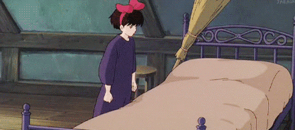

+++
title = "Why Kiki's Delivery Service is My Favorite Movie"
date = 2026-03-16T13:00:00-07:00
draft = false
categories = ["movies", "media", "art"]
tags = ["miyazaki", "kiki's delivery service", "depression", "meaning"]
description = "Oh wait it's actually about more than a cool girl having a pretty nice time in a city."
images = ["kiki.jpg"]
+++



<!--more-->

-----

I used to watch this movie whenever I had a cold, because it was such a chill, relaxing movie. Not much happens, but watching it would make me feel happy. 

I like The Sims, I like Robert A. Heinlein books, I like Stardew Valley &mdash; sometimes I like stories where not much of consequence happens at all, and I just feel like I'm hanging out with some characters that I like for a little while. 

That's what this movie meant to me in my teens and 20s, and even then it was a perennial favorite.

It means even more to me, now, as an adult, though.

It has what, in my opinion, might be the greatest villain I've ever seen.

It's a movie where the villain isn't a person, or a shadowy organization. The whole conflict doesn't show up until the third act, and it's just this feeling: 

> “I think something's wrong with me. I make friends, then suddenly I can't bear to be with any of them. Seems like that other me, the cheerful and honest one, went away somewhere.”

It's an animated movie where the villain is just "the main character started doing something that she loves for a career, and now she's too sad to want to do it any more."

She's young, she's brittle. All it takes is one impossibly rich, joyless customer who could care less about her delivery, 



... even though it was an extraordinarily difficult one to deliver.


And, yeah - that's... that's brutal, Kiki. Going the extra mile for a client who could _care less_ is soul-crushing. 

Kiki comes down with the magical analogue to _creative burnout_, and the story feels very much like Hayao Miyazaki very subtly explaining to you, a creative adult, what this looks like and how to deal with this situation when it crops up.








You idiot, just take care of yourself.







Find inspiration. Have a nice time with your friends. Eat pancakes in a cabin. 




You can't work through it. 



But it's more than that, you need to understand _why_ you're doing it.




It's still hard -


... but if you know why you're doing it, that helps. 


And it's nice to talk to other people about it.


We do it because we're curious, and fascinated:



Or we do it because we love making people other happy and being part of a community, even if our contributions are ephemeral:



Kiki's Delivery Service is a master craftsperson imparting a teeny tiny lesson to you about how to practice art, on purpose, with _joy_ and _intent_. It's also why this movie feels good to watch, why it's such a cozy-time favorite: it's a happy movie, _about happiness_. 