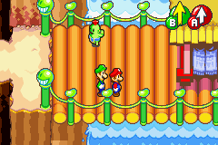

+++
title = "Pipistrello and the Cursed Yoyo"
date = 2026-02-15T12:00:00-07:00
draft = false
categories = ["video games"]
tags = ["pipistrello", "link to the past", "gba", "pixel art"]
description = "yo yo"
images = ["titlecard.png"]
+++



<!--more-->

### First Things First

8/10, Strong Recommend

## Let's Talk Briefly About the GBA
Pipistrello is a game that is very clearly intended to feel like a GameBoy Advance game.



I mean, this isn't subtle, the game can in fact be played in a 3D "Pocket Trap Advance", making it entirely clear exactly which hardware this game is meant to evoke. 



After 12 years of total Gameboy dominance of the mobile gaming market, in 2001, at the beginning of the Gamecube era, the Gameboy Advance was released: sure, it was only a little more powerful than a SNES, but compared to the _senescent_ Gameboy it felt revelatory to have such a powerful device in your pocket. 

With more muscle than the 9-year-old SNES, the best SNES games could be ported relatively smoothly to the Advance: lovely. There were pain paints, though: one was the slightly lower resolution: The SNES has a resolution of 256x224 pixels, while the GBA has a resolution of 240x160 pixels, so ports often had to do things like "use smaller fonts", "crop things weirdly", or even "rebuild existing art".

> 
> If you have my exact kind of brain damage, this image will look subtly wrong to you. 

The sound chip on the Advance was also kinda wheedly and performed completely different to the one on the SNES, forcing SNES compositions to be rewritten, often to their detriment.

But, and this is a huge but: the Advance's similarity to the SNES meant that the whole video game making world had 9 years of experience developing exactly the kind of games that people loved for it. While console developers had to struggle through the enormous 3D learning curve, GBA developers could just roll out _immaculate SNES games_. As a result, some of the most impressive stuff from the pixel-art 2D era come from the GBA - in the absolutely tiny 3 year span before the GBA was rolled over by the even more impressive new Nintendo DS.

> 

Anyways, I say this because I want to contextualize what it means for a game developer to point at the GBA and say "I want to make a GBA game". It's so much more specific than "I want to make a pixel-art game", it forces them to design against a _very specific set of parameters_. The game has to be _wide_, for one thing. 



Despite the low-res, the GBA supported a much more vibrant color gamut than the SNES, which is also reflected in the design: GBA games often featured richly detailed pixel art with _bold outlines_ to help them read more clearly on the small screen, and, again, Pipistrello is very clearly evocative of this style.

I can't help but point out that I was 15 years old the year that the GBA was released, and so this kind of nostalgia does in fact hit me for pretty reliable damage. Good choice of era, Pipistrello developers.



----

## The Gameplay

Pipistrello is a top-down action platformer with subtle RPG elements, which means that the most obvious analogue is **Zelda: Link to the Past**: 



And, like, yeah, Pipistrello's developers were, I think _very clearly_ making their own perfect Link to the Past.

I'm gonna admit it: I've never really vibed with any of the mainline 3D Zelda games. Not Ocarina of Time. Not the one with the big-ass moon. Not the gorgeous new ones like Breath of the Wild.  

What I want from a Zelda game is... well, this!  

Anyways, Pipistrello and the Cursed Yoyo is maybe the best Zelda game I've ever played.

This game gives you interesting Yoyo mechanics in spades and the world is just _coated_ in simple, satisfying puzzles that require you to use them in interesting ways.



It's not just puzzles, though, there are also fights, and platforming, which are fast and tight and _challenging_.



I'm a well-known sucker for 2D difficulty. (Except in Hollow Knight, I don't understand why I've never jived with that series. Too much backtracking?)

------

## Writing?

Sufficient, and a little funny! 

Pipistrello takes place in a setting that's used _often_ but that I don't think has a name, so I'm gonna call it "Animal Modern", citing examples like Richard Scarry and Zootopia





The writing of Pipistrello is _extremely 2025_, which is to say, it's got a strong anti-capitalist lean. Pipistrello is the heir to his grandmother's fortune which she's amassed by monopolizing local electricity generation and then squeezing her monopolistic advantage until everyone else is _poor and frustrated_, leading to a rebellion which kicks off the events of the game: four small local crime-bosses (once: honest business owners) shatter Grandma 'Strello's soul into four McGuffins which they abscond with, leaving only the tiniest bit left, trapped in Pipistrello's yoyo. 

As Pipistrello, you're... kind of on Team Evil? Your quest is getting those Grand McGuffins crammed back into your gran so that she can go back to oppressing the locals, which doesn't seem like _a terribly laudable goal_ - but the four petty crime bosses haven't exactly been doing a good job of running the show either. As you do this, Pipistrello's gran interjects greedy, self-serving rhetoric at our protagonist from inside the yoyo: "at least when I was in charge there was order", "I'm just running a business, if they can't pay that's their fault, not mine".

This writing was not intended to be subtle or on-the-nose: It's obscenely clear from every line of the game's dialogue that all of these problems were caused by Pipistrello's gran's monopoly in the first place. 

I haven't finished the game yet, nor do I want to spoil it for anybody else, but, like, _my money is on Pipistrello's Gran being the end boss_ of this game. That is not going to be a terribly shocking twist. (_ed: I've finished the game and the twist went in a slightly different direction, which was a surprise!_)

### Good Controller/Mobile Game

This game calls for a controller, I think that's non-optional, here. 

This game is a good use of a Steam Deck. Per its design influences, it has the _shape_ of a good mobile game that you'll enjoy playing on a bus or plane ride: well optimized for short, satisfying bursts of gameplay, easy to pick up and put down.

## Conclusion

Pipistrello good. 