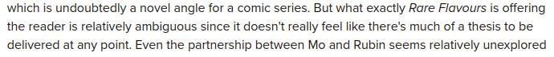

+++
title = "Rare Flavours"
date = 2026-02-14T02:00:00-07:00
draft = false
categories = ["comics", "food", "art"]
tags = ["art as suffering"]
description = "it's a comic about a demon who eats people: also the demon is kinda the good guy?"
images = ["rare.png"]
+++



<!--more-->

## Wait, Let's Talk about Venba For Just a Second

Recently I played [Venba](https://store.steampowered.com/app/1491670/Venba/), an indie game about indian cooking.

It's a very different story from Rare Flavours, with a very different theme, but these two stories are unified by their central metaphor: cooking - 
specifically, Indian cooking. 



I found Venba beautiful - but very short, not terribly difficult. I don't want to spoil it, (I didn't write about it, here) - because with such a short game the spoilers would ruin what little there is to enjoy!  What I will say is that it uses its mechanics and shifting viewpoints to very effectively convey some _feelings_ that I think are important and meaningful. Venba tells a story about how the difficult, traditional, ritual act of cooking difficult foods can be calming, a love language, a way of connecting with your family. 

## Okay, Back to Rare Flavours



Rare Flavors covers the short adventure of **Rubin Baksh**, formerly Bakasura the demonic rakshasa, on his adventure to create a food travelogue of the sort that Anthony Bourdain might make. Being a giant monster and slightly older than civilization itself, Bakasura has a lot of experience, a keenly refined palate, and is an obscenely talented chef. What he lacks is a camera and an auteur's eye, for which he recruits Mo, once an aspiring film student, now something of a layabout. 

Rubin is poetic and profoundly sympathetic, which is why it's so difficult to contend with the problem (barely a spoiler, it's revealed in the first chapter): the rarest flavor of all is human, and Rubin has a taste for that, too.

> 
> 
> wuh oh

"Technically not a cannibal" is a humorous point he makes in the book. Rubin isn't a human, so humans are fair game. 



As serial killers go, Rubin is sympathetic, urbane, poetic, deeply respectful of his victims, and ultimately - and this _is_ something of a surprise - the narrative takes _his_ side. Rare Flavours with the *extremely* out-of-left-field "pro-serial-killer" take. 

## Beautifully Illustrated

It just looks so good. 



## Part of the Journey is Forging Mo Back Into an Artist

Mo has forgotten how and why to create, and Rubin has selected him as his cinematographer because he _sees_ the artist within Mo and has made it part of his personal mission to bring that back to the forefront. 

## An Ethos of Meaningful Consumption

I believe the thesis of Rare Flavours is fairly clear from the text. It wants you to _think_ about what you consume. Even more than that, it wants you to become involved in the _production_ of what you consume. 

Food is the metaphor here: Ram is an _artist_ and he would like you to think about the role of the artist in art. 

In fact, I'd say that this whole book delivers an extremely similar message to Brandon Sanderson in [We Are the Art](/posts/2026/we_are_the_art) - we don't do art in order to _feed the machine_, we don't do art for the sake of having someone to sell it to: we do art because _the difficulty and hardship of understanding and constructing meaningful art shapes us into more complete people_. 

Rubin's refined palate is such that he doesn't just consume _food_ but the _chefs_ - literally, but also metaphorically, he's not just interested in the art, but the _artist behind the art_. It turns out it was the creators who were the Rare Flavours all along! 

Mo, at the end of the story, having understood the point of all of this, delivers a speech to an adoring crowd:

> It is in our nature to be such ungainly, consumptive beasts. 
>
> To live and labour so we may eat and be eaten, to consume and be consumed in eternity.
>
> And to this end, we have built around ourselves the machinery of consumption.
>
> It becomes easy to forget, then, that there is true flavour yet, beneath it all.
>
> In the face of such despair, our one saving grace is the ability to make things.
>
> And as long as it comes from a place of honesty, fascination, and true flavour...
>
> ... there will always be room for more.

I'm rarely mad at stories for just out and saying what they're trying to impart. Lord knows people will still miss the point. 

> 
> 
> _incl: an excerpt of someone missing the point_