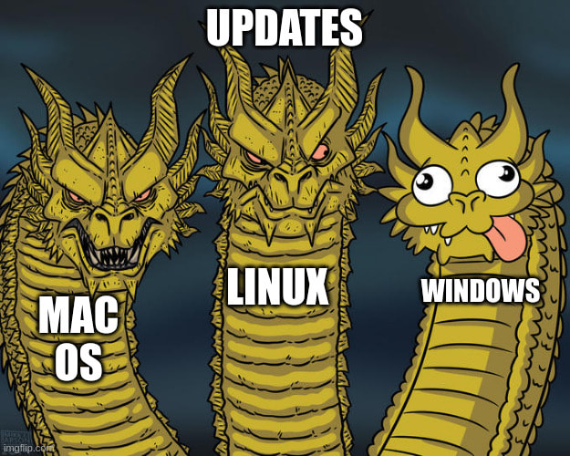
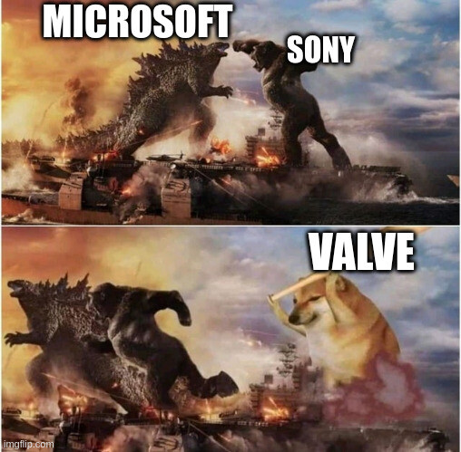
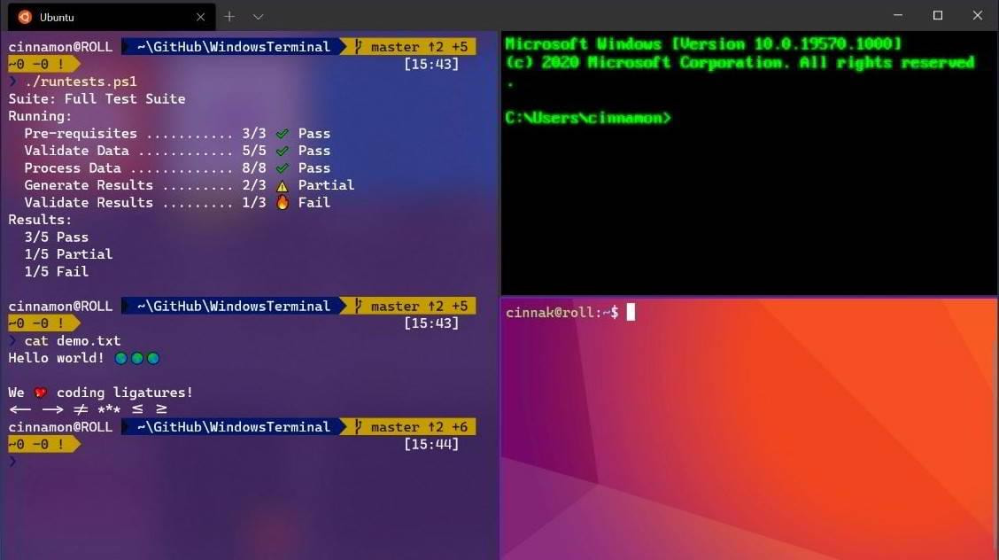
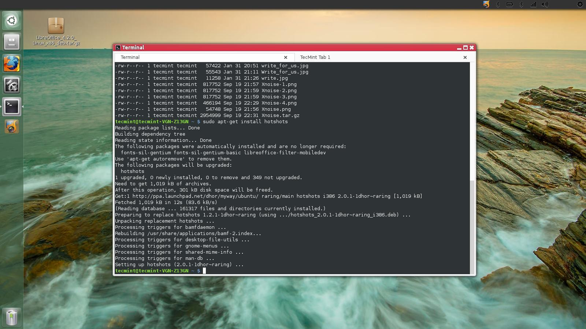
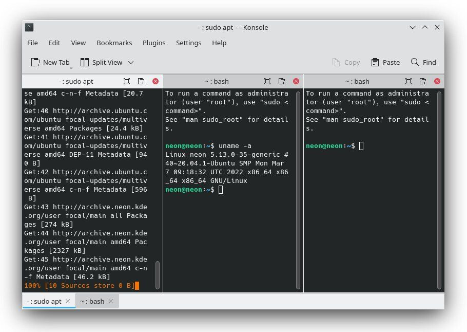
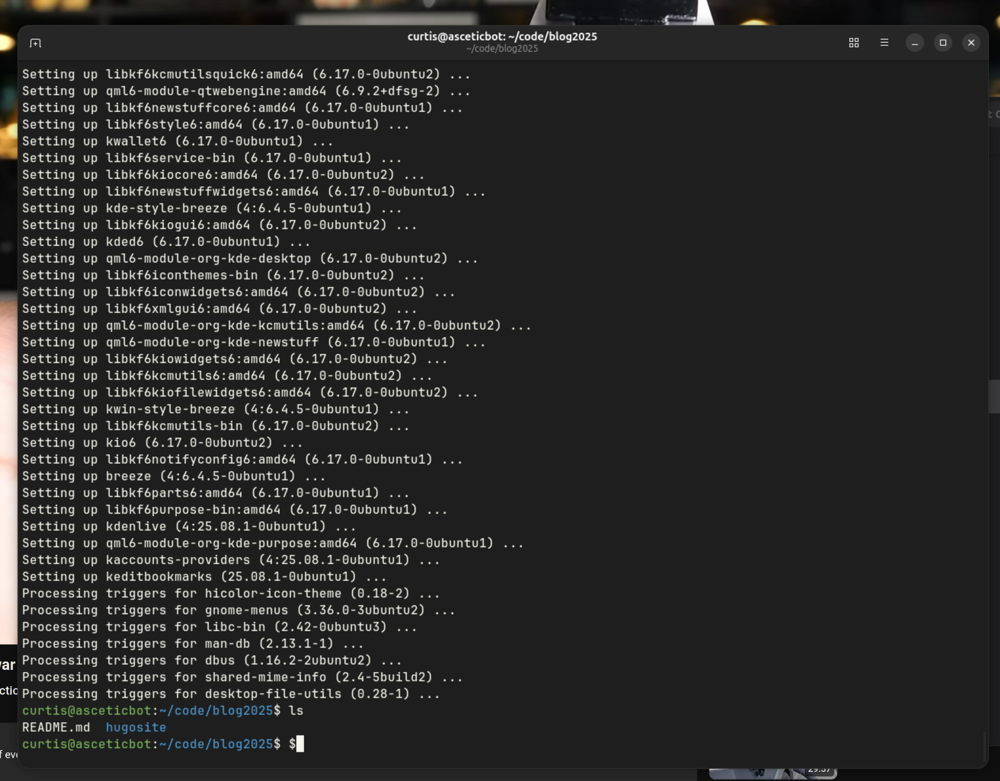
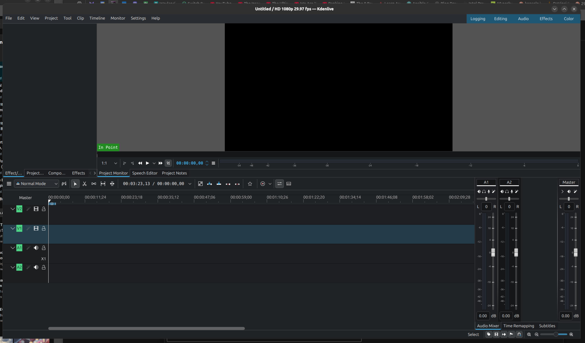
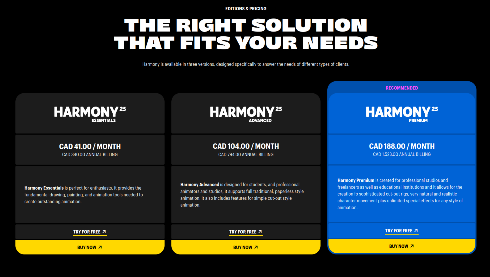
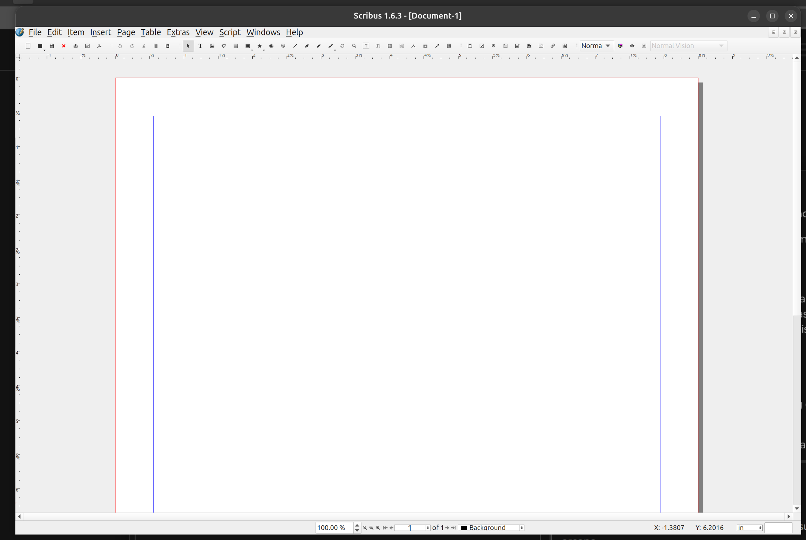

+++
title = "The Year of the Linux Desktop"
date = 2026-02-01T12:00:00-07:00
draft = false
categories = ["technology"]
tags = ["linux"]
description = "let's dual boot linux and see how that goes in this the year of our lord 2026"
+++



<!--more-->

The "X is the year of the Linux Desktop" meme lives on and on because Linux is such a fussy-ass bitch to work with that it's never _really_ true. 

But...

## Linux As a TV Computer
Okay, so, when we replaced Tiffwife's computer with a new computer, the Old computer was stuck running Windows 10 (**EOL**) because the elderly motherboard didn't have the mandatory security [TPM](https://www.pcmag.com/explainers/what-is-a-tpm-and-why-do-i-need-one-for-windows-11?test_uuid=04IpBmWGZleS0I0J3epvMrC), so Windows 11 is not an option for an upgrade there. That computer _can not securely run Windows any more_. 

That was an i7 with a heavy, hot 1080 in it: a near top-of-the-line computer at time of construction and _still_ significantly faster than the mini-PC that we'd bought in 2024 to run the TV. 

So, I installed Ubuntu Linux on it, and set it up as a media box computer, and with a little bit of Donking it turned into an honestly _pretty damn capable media center_. 

I did pick Ubuntu over Bazzite: [Bazzite](https://bazzite.gg/) seems like it might be a better distro for a media center, but I'm just... _so_... familiar with Ubuntu at this point. 

## Curtis Begins to Consider Electricity

Then: A friend moved in downstairs (temporarily, they're gone in a few weeks, now) with a heavy gaming PC of their own, and I quailed at the sheer electrical expense and load of running 5 gaming PCs under one roof. (My computer, my _separate_ WORK computer, Tiff's computer, the TV computer, and guest's computer) - at an average load of 400W we're looking at like 2 kilowatts of _just gaming PC_ in this house, equivalent to just _running a clothes dryer all the time, forever_. So I bought a Mac Mini (~50W) to run the TV and it's also very nice, and it can easily stream gaming content from more powerful devices in this house along the gigabit home ethernet.

## The Year of the Linux Desktop

So, this past week, I started to think... 

Why not? 

And it's not because Linux Desktop has got a lot better.

It's because Windows has got a lot worse. 

Nobody is fond of Windows needing to restart every 2 weeks to install a new security patch, like, the other OSes have got this one under wraps.

Then, when Windows 11 reboots, you have to sit through their little "hey, are you using all of the Microsoft products?" slideshow every time. Skip, skip, skip.

But, uh, while that's a little frustration, it's not enough to abandon the whole ecosystem, not quite yet. 

What's increasingly concerning is that the performance and stability of Windows is... starting to fall behind. LLMs are _slow as shit_ and it turns out, Windows trying to cram Copilot 365 into _every nook and cranny_ is not going swimmingly. 

Windows' last major software update, 24H2, has been something of a complete shitshow, introducing all kinds of system instability across a lot of systems. Not _mine_, just _systems_. 

> ### Some PCs can't boot after latest Windows 11 security update, no fix in sight —mostly affects 24H2 and 25H2 versions
>
> https://www.tomshardware.com/software/windows/some-pcs-cant-boot-after-latest-windows-11-security-update-no-fix-in-sight-mostly-affects-24h2-and-25h2-versions

The one that's most notable for us at VRChat are the "Easy AntiCheat" problems because _our software depends on that_. 

But, uh, one of the things that I found most galling was really, really simple. 

I have a directory with my mp3s in it. It's not that many mp3s, like... a thousand mp3s.  I went to sort it alphabetically. This operation took, easily, repeatably, 90 seconds. 

_I'm not sure how you can write a sort operation that badly in a modern system._  

This computer is a little old, but it was insanely overbuilt for 6 years ago: a 24c/48t threadripper, 128GB DDR4 RAM, NVME SSD - there's nothing in here that should give the OS a chance to run slowly, and yet I'm constantly running into little operations that Feel A Little Slow.

_Huph huph huph._

There are other, political reasons, to also consider some ways to reduce or reconsider our reliance on Big American Tech, but I'm gonna be honest: while that's often _back of mind_, I still probably use more American tech than your average Canadian by a pretty wide margin by virtue of simply using a lot of technology, often. Android, Steam and YouTube aren't going anywhere, so Microsoft getting the boot isn't exactly the big flag wave I'd want it to be. 

## Let's Try Dual Booting Linux

I haven't done this for over a decade, and the last time I tried I retreated from this position pretty quickly, because it was a huge pain and I'm generally here to DO STUFF with computers, not just FIDDLE WITH THEM.

A big part of the reason this has been so unnecessary for so long is that, with Docker, WSL, and even Git+MinGW, it's super easy to get to a linux-like shell in Windows with very little effort: if all you need is a linux-like coding environment, Windows has _every possible option readily available_.

But let's see what the actual experience of _maining linux_ is like.

## Actually Dual Booting is Very Hard 
Installing Ubuntu on an arbitrary system nowadays is so simple that most passably competent computer users could do it easily in an afternoon.

Getting a GRUB bootloader running properly on a Windows 11 system with UEFI, on the other hand, took hours, a bunch of web searches, and some help from ChatGPT. This is more Windows' fault than Ubuntu's, I think, but nevertheless it was _complex_. 

Dual booting OSes has _ever been_ the realm of folks who are completely batshit. 

## Gaming on Linux

I only _had_ a handful excuses not to main Linux, and Valve _absolutely' obliterated_ one of those excuses. 

I don't want to say "Gaming on Linux is a solved problem", but with the hard work of Valve and Proton the amount of effort it takes to run 90% of my entire video game library on any Linux computer is basically nil. 

## Coding on Linux

Well, of _course_ the experience of software development on Linux is top tier. The only people who _use_ Linux are software developers. Well, that and autistic enby Austrian furry 

Coincidentally, these are **also** the only people you can find on Mastodon.


There's one thing I do want to call out, though, the terminal emulator.

Terminal emulator is a big deal, especially for a web engineer like me. 

I actually think that Windows Terminal is, uh, the _best Terminal emulator on the market right now_.

In the 00's, the Linuxes had the nicest terminals, but with significant upgrades in Windows and Mac OS X land and _no forward progress_ in the Linuxiverse, they fell way behind, and in the 10's I'd actually say that Linux had the _worst_ terminal experience of all of the commonly used OSes.

(as often is the case, KDE's version was a little better) 

But Ubuntu 25.10 ships with a new contender for the throne, Ptyxis, which is quite nice. 

Lovely. 

Visual Studio Code, which is _unfortunately_ my main editor nowadays, works equivalently well across all systems.

## File Sync on Linux: Surprisingly Not Great

This one's unexpectedly terrible: the only file sync service that I know of that works natively on Linux is Dropbox, one I've already abandoned thanks to it's _expense_. 

Right now my whole personal file sync strategy is:

* **BIG STORGE**: My NAS syncs like 4 TB of storage with Wasabi, which is not full, fast, bi-directional sync of the kind you'd want all of the time, but it's sufficient for backup and _way_ cheaper than using a Dropbox or Google Drive or what-have-you to do this.
* **LITTLE STORGE**: I have 100GB of Google Drive space ($2.50/mo) that I sync to _every device I own_, and that space is for, like, documents and projects I'm currently working on and my books and stuff. 

Gnome can connect directly to Google Drive, mounting it as a network file system and requesting and caching the files when you ask for them - and this _does not work terribly well_, because the files kind of exist in [hammer space](https://en.wikipedia.org/wiki/Hammerspace) and I've used more than a few apps that _get confused when their files just vanish_. 

I can also, if I want, set up a `rclone` job with a `systemd` timer to do a full bi-directional sync between a directory and Google Drive every 60 seconds, if I want. I think I'm gonna have to do this at some point, because the reason I still maintain a full-synced project directory is because _that is where all of my actual active projects live_. 

For now, to bridge the gap temporarily, I'm just treating the Google Drive on my NAS (which is synced properly) _from_ this computer. With gigabit ethernet, the NAS only feels a hair slower than spinning platter access on this computer anyways. 

## Loads of Easy Wins

A lot of the applications I use are _already FOSS_, or they're Electron powered, or hell, just natively supported in Linux. If people are building apps using modern tools, Linux support can be easy as a couple of days of poobling around with build pipelines. 

* **Joplin** for notes
* **Obsidian** for _big knowledge bases_ (It's a DM's best friend)
* **OBS** for streaming
* **Parsec** for remote desktoppin'
* **Discord** and **Slack** for personal and work chat.
* **KeepassXC** for password management.
* **Calibre** for ebook management

Also, a lot of my workflow is just browser-based, so my **ProtonMail**, **Google Calendar**, **Google Docs**, **Discourse** forum and **Mastodon** socials are obviously unaffected. 

## Art on Linux: Pretty Bad

I am obligated to pay for Creative Cloud, because Tiff uses it for her job (and her personal portfolio) and I've been able to hold on to a Student/Educator discount by sneaking into my old `@sfu.ca` email address for long enough to apply for one. This means that the whole Creative Suite is mine for a paltry $60CAD/mo, which is still actually **a lot of fuckin' money** (about $700/yr), but if I'm going to pay for it anyways I might as well use it. 

Between that and years of pirating Photoshop as a teen, I've got like 25+ years of PHOTOSHOP MUSCLE MEMORY, and I've learned how to use a variety of other Creative Suite tools over the years: Audition for sound, Premiere for video editing, AfterEffects for motion graphics, InDesign for document layout, and Animate for basic animations.

I've also spent 'round $500 on two different DAWs, Ableton Live and FL Studio, to futz around with them.

**none of this shit works on Linux at all**

As soon as you want to do _An Art_, Linux just completely falls apart. There are _zero_ professionals paying money to use Linux for art so the professional art apps are just not here.

## However: The Enthusiast FOSS Art Apps and Local Alternatives

### Photoshop: Krita Good
Instead of **Photoshop**, there's **Krita**.

If you were used to Photoshop and someone told you that **GIMP** was a viable alternative, it would be entirely justified to spit directly in their open mouth. 

**Krita**, on the other hand, is _very powerful and nice_. It is _easy_ to find examples of artists _more talented than I am_ gushing about its feature-rich application and smooth, expressive brushes (and then turning around and maining Photoshop or Clip Studio Paint anyways).  

My problem with Krita is that _I know Photoshop_.  But, like, I keep _meaning_ to develop more familiarity with Krita - frustrating as it might be, Krita really should provide everything that I need from an art application, and it's free. That's an investment in being able to draw for free for the rest of my career.



I might just have to... suffer, for a bit.

### Premiere: KdenLive Acceptable, DaVinci Resolve On The High End

I use Adobe Premiere pretty often, actually, although it's mostly just to cut together an end-of-the-year New Years' clip show that only a handful of people ever watch, and sometimes cut together YouTube Nonsense.

For _professional_ video editors, there's actually a program that's been gaining steam: DaVinci Resolve. It's $295 USD ($400 CAD) for a full version at time of writing - seemingly expensive, but a one-time purchase and less than my $700 yearly Creative Cloud expenditure.  **DaVinci Resolve does ship a native Linux build**, although apocryphally it is a little fussy to get running, partially because it has a complex plugin ecosystem and many of the plugins do _not_ have native Linux builds. 

Still, though, that's _promising_.

But, uh, let's be honest with ourselves here. I am _not_ a professional video editor. DaVinci Resolve shot itself to prominence on the back of its _truly spectacular color correction_, and I don't even know what that **is**. What I do with a video editing package is only a hair's width away from what you could do with Windows Movie Maker - I basically need multi-track sound and video editing with some basic effects and transformations and I'm off to the races.

So, before shelling out for professional tools I'm never going to get the full use out of (a mistake I've made so, so many times in the past), I thought I'd donk around in Kdenlive a bit. 

And you know what? 

After about 15 minutes of fiddling I was able to import a video, do some basic multi-track editing and keyframe-animated transforms to it, and export it in H.264.

So for _my_ use case, Kdenlive seems _totally sufficient_. 

### Audition: Audacity is just fine.

The only reason I've _ever_ used Audition is because it came with Creative Suite, I've known all along that Audacity is a perfectly cromulent audio editing tool.

### Pixel Art: Asesprite Remains The Winner

This is a pretty specialized corner of art stuff, but I like a dedicated pixel art application if I'm gonna pixel the arts. Asesprite, though, ships builds for all platforms, so I'm fine there.  I could even re-buy it from Steam to have automatic updates.

### 2D Animate: ???

Okay, so, in the animation space, Toonboom Harmony releases a Linux build, I believe, but their pricing model is also deep into yikes country.

Some folks have reported _some_ success getting Clip Studio Paint or Moho running in Wine, but not too much.

OpenToonz is basically abandonware.

Krita, again, supports a full animation workflow under the hood, but it's definitely Photoshop-style "so you're stuck animating here rather than in a dedicated tool" draw-every-frame animation with limited tooling. 

If you want puppets, reusable assets, or rigging, you're SOL.

I mean, there's grease pencil in Blender, but... Blender? 🤮

### AfterEffects: ???

The only think I know how to _do_ in AfterEffects is 2D motion graphics - basically, the puppeting and keyframe animation stuff that you'd do in Flash. It's actually quite a bit easier and smoother in AfterEffects than Flash, IMO. AfterEffects also has robust 3D and compositing tools that I don't need to replace because _I never understood them in the first place_. 

Cavalry is a well-liked alternative to AfterEffects for Motion Graphics, but like ToonBoom Harmony, it's "more expensive", and unlike ToonBoom Harmony it has no Linux option. 

If you're looking for free animation tools in Linux, all roads point to **Blender**. Goddamn Blender. 



I AM A 2D ARTIST. I only have access to _these 2 dimensions_ (waves arms in a square).  

(cries) _i hate topology so much you guys_

Anyways, it seems like if I want to do more motion graphics in Linux, it's gonna be time to bite the bullet and finally, _finally_ embrace an additional dimension.

On top of Krita I have to learn **BLENDER**? God damn.

### Another Option: Godot

I _have_ learned a bunch of Godot, and as a video game engine it has pretty powerful puppeting and animation primitives - easy to use, too. Also I can trivially code in Godot. What it doesn't really have is "video export", but that's not the end of the world with OBS around...

### InDesign: ???

InDesign is useful if you're doing things like laying out board game components or typesetting whole books.

Which, like, I've done both of those things. Here's a book I typeset!

[The Gamemaster's Tarot](/books/the_gamemasters_tarot/)

The only alternative I can find is Scribus, in Linux, which is... well, "GIMP, Inkscape and Scribus" are like the original three "we have McDonalds at home" Linux equivalents that everyone hates because they're awful. 

My policy on any software that's crusty enough that Google takes you to a _Sourceforge_ page for it is that it basically **doesn't exist**.

Anyways, I booted it up and predictably: it bad.

Like, "not even usable with High-DPI" bad, a sign that nobody has seriously considered this software for... I don't know, over a decade? When was the last time 1080P screens were standard?

There are no serious typesetting options for Linux, full-stop.

### DAWs

So, while my expensive Audition and FL Studio licenses might end up not helping, when it comes to Making Music, there are enthusiasts _everywhere_ and they have no shortage of options. 

One small problem is that DAWs exist in a universe _full_ of proprietary VST plugins which mostly don't run on linux.  Which would be really inconvenient and irritating if I were enough of a professional music producer to have curated a laundry list of favorite VSTs, but actually I'm kind of a idiot who has no idea what he's doing, so like with Premiere, the full power of Audition and FL Studio have mostly gone _way over my head_ and I've been donking around with program defaults this whole time. 

**Ardour** is free and full-featured, **Bitwig Studio** is a well-liked and powerful DAW that you can buy for ~$500USD and runs on Linux, **Renoise** is also well-liked for a mere ~$90USD, **Reaper** is $60USD, it actually seems like there are ample DAW options for folks who want to make music on Linux.

So I'm not _too_ worried, here. 

## Linux Remains Enthusiast Computing, But I Am an Enthusiast

When I turned Tiff's computer into an Ubuntu media server for the TV downstairs - well, one of the reasons it made sense to switch to a Mac Mini was the power consumption, but another reason was just that there were still a lot of interactions with Ubuntu that Tiff found confusing and irritating.

It would automatically unmount all network drives on reboot, forcing me to come and reconnect our NAS after every power outage.

Lots of configuration - lots of _regular use_ of a Linux system - still involves cracking a terminal, modifying a config file, reading about problems online, trying some stuff, seeing what happens. Booting Steam on Linux starts with an _error message instructing you to go run some commands in the terminal in order to get the graphics card configured right_.  

Most of this stuff would be profoundly unpleasant for someone who's not already a very experienced computer user. 

It's still not really the year of the Linux Desktop for anybody but me.  But I think _for me_, 2026 **is** the year of the Linux Desktop.