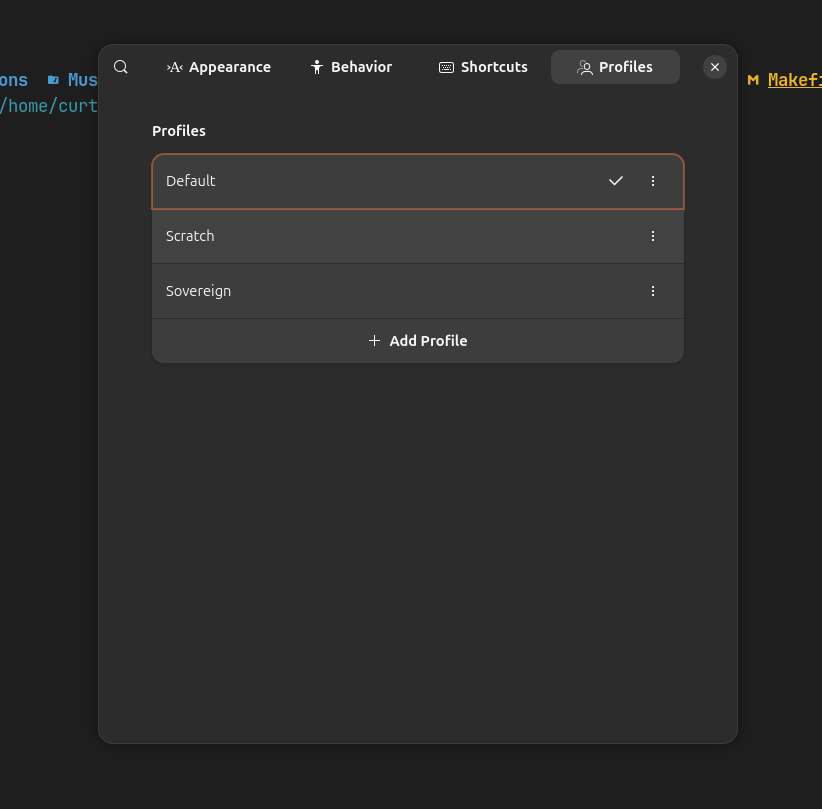
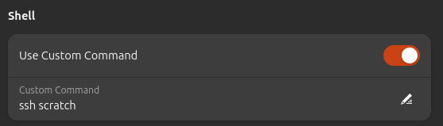
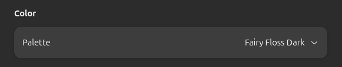

+++
title = "Why I Color Code My Environments"
date = 2026-03-10T11:00:00-07:00
draft = false
categories = ["software", "technology"]
tags = ["hosting", "infrastructure", "devops", "terminal", "windows terminal", "ptyxis"]
description = "Because it's easier to differentiate them, which is safer and more convenient"
images = ["winterminal.jpg"]
+++



<!--more-->

Here's something weird!

I **color-code** my environments, and aggressively theme them as much as my tools will allow.

In Ubuntu, for example:

I've been doing this since **Windows Terminal** made it easy and fun to have a different theme for _each environment I might want to have a theme for_.

This isn't just for funsies! I mean, it _is_ fun, but it's more important than that!

It's an important safety and usability feature!

I'm sure we've all had too many different environments open and, say, accidentally made a change in a "production" tab that was meant for a "development" tab, or been frustrated working with a codebase or server only to discover that you've been working on a tab for a _different server entirely_.  

Well, what if your production server used an unpleasantly garish light-mode theme? That would certainly provide an extra context clue that you should _step lightly, here_.

Ubuntu's brand new `ptyxis` is _not quite as polished as Windows Terminal_, (Gnome has actually had one of the worst terminals in the game for a long time, `ptyxis` is at least a big step in the right direction) - but I can define different color profiles for different environments at least:

So Scratch is purple:


And Sovereign is green:


although it doesn't quite match my gorgeous work layout, where our test-suite is rendered in gorgeous [Nyan](https://www.youtube.com/watch?v=2yJgwwDcgV8) 
because the first-ever test runner we installed was [mocha nyan](https://mochajs.org/reporters/nyan/):



Windows Terminal is still the best in the business.