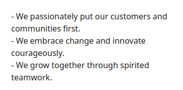
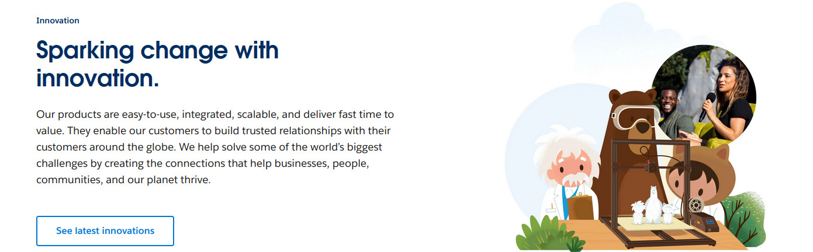
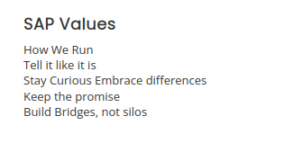

+++
title = "STOP DOING VALUES"
date = 2026-03-27T12:00:00-07:00
draft = false
categories = ["work work", "humor"]
tags = ["values", "corporate"]
description = "i'm sure you've memorized all 18 Values in your company handbook"
images = ["values1.png"]
+++

## STOP DOING VALUES

* CORPORATE CULTURE WAS NOT SUPPOSED TO BE TURNED INTO A RELIGION 
* YEARS OF PERFORMANCE REVIEW yet NO REAL-WORLD USE FOUND for "LEADING WITH INTEGRITY" 
* Wanted to codify and share corporate culture? We had a tool for that: it was called "DRINKING"
* "Yes, I am embodying CREATE ROOM TO GROW. This quarter I was incredible at DRIVE CURIOSITY." - Statements dreamed up by the utterly Deranged.

LOOK at what HR have been demanding your Respect for all this time, with all of the performance reviews & handbooks we built for them: 

<!--more-->

> 
> ???????

> 
> ????

> 
> ???????????

"Hello I would like to Stay Curious Embrace differences please"

**They have played us for absolute fools**

## Ok, Let's Get Started

As a part of Corporate America, I'm sure you've encountered a company that has _values_.

See, your company has a culture, and the executive desire is to shape that culture by _telling you what that culture is_. 

So invariably, you have a laundry list of things that The Company wants to see you do: no longer can you merely do a good Job, now you must be able to quantify that job in the Values Quadraxus, where every task is measured by whether or not it's modelling **Be Best**, **Innovate Strategically**, or **Handshakefulness**.  

## I'm Warning You: Do Not, Under Any Circumstances, Ask Any Senior Developer In Your Company To List The Values Without First Checking The Wiki

Look, I'm just saying, you might be disappointed to learn that company adoption of The Values may only be a handful of brown-nosers and some kids too green to have seen all of this before. 

## The Defaults: Problem Solving, Teamwork, Creativity, Integrity

As an employee in literally any large company, the expectation is that we will:

* Succeed at our work.
* Work well with our teammates.
* Be creative.
* Be honest.

So, let's say that the default, baseline expectation of every single white-collar employed adult is "problem solving", "teamwork", and "creativity" and "not embezzling". 

Even in companies like Amazon that have embraced _survival of the fittest_ style management where the default expectation is that the only way to succeed is while standing, hands bloodied, over the corpses of co-workers whose hearts you've eaten - even then, the expectation is still that you would at least _pretend_ to be a team player while we're doing it.

So, there are lots of different ways to phrase these, and we'll see them all come up in Every Values Statement:

### Success

Success is **fast-moving** _problem-solving analytical OWNERSHIP taking-on challenges **decision-making under fire** doing the thing WINNING, _delivering_ GETTING THE A+ _best-in-class_ **VELOCITY** award-winning top-tier conquering **VICTORIOUS** spirited!

### Teamwork
Teamwork is **collaboration** cross-function co-operation SYNCHRONIZING WITH ALIGNMENT respectful **HELPING** customer-focused _stakeholder engaged_ connected **togetherness**.

### Creativity

Creativity is **innovatively** _pushing the envelope_, pushing boundaries, iterating and refining to **rethink the status quo**, embracing change, _agility_ courage _bravery_ GOING YOUR OWN WAY ideas!!!

### Integrity

Integrity is having the trustworthy **honesty** not to be carrying an armload of stolen pencils into your Nissan Altima, and being enough of a clear-eyed straight-shooter to point out when someone else **is**. 

I'm seriously considering baking these in as the attributes in an exciting new corporate RPG. 

"I roll an 18 on my Teamwork check". 

"That's a fail, you didn't demonstrate stakeholder alignment. Take 4 wiki damage."

Anything that falls into these categories is **table stakes**. There aren't a lot of companies out there pitching that we should _fail at tasks, alone, bring no new ideas to the table, and then lie about it_.  

If you can not imagine a company intentionally adopting the opposite of a value, it is not a real distinctive value: it is a baseline human expectation. "Honesty", "quality", "customer service", this is all just what we're supposed to do.  

I may or may not have made fun of these in a video I recorded while I was 50lbs heavier than I am now:



These do not represent _values_ or _culture_ so much as a yawning absence of them: "just be a regular-ass good corporate citizen, like you would in any other company". 

I'm not bothered that these values exist and crop up often in Company Values - like, sure, it's okay to write down "you should be honest, collaborative, and productive, that's a baseline expectation of all employees everywhere" somewhere in your handbook.  What bothers me is that every company treats their own personal set of these like they've discovered The Rosetta Stone, so at one company you'll be **Boldly Collaborating**, but in another, you'll be **Embracing Teamsmanship** - as if these are completely different from place to place. 

## The Pretendium: Brutal Honesty

Even worse than the "table stakes" values are values that are... let's say, "aspirational but not actually true". 

Lots of companies would like to imagine that they embrace brutal honesty, _acknowledging and embracing the uncomfortable truths_ - and yet - somehow, during the all-hands, difficult questions come anonymously. 

I have a real and enduring habit of discovering exactly the line past which _saying uncomfortable truths_ is no longer 
"you don't say", reading this
 . I'm always walking a _very careful line_, no matter how boldly a company decides that it wants to embrace what they think might be the unfiltered truth.

## More Pretendium: Anything That Could Lose Money

We all know the _one true value_: make money or perish.

You know, Wu-Tang Clan rules: 

> 
> 
> Cash Rules Everything Around Me

If a value isn't more important than making money, it's not a value, and _precious few values are more important than making money_. 

If you're doing something enormously profitable that doesn't involve _collaboration_ or _innovation_, and you do it _all by yourself_ - like, say, it's your job and your job alone to perform regular maintenance on core payment systems - guess what, values be damned, you're important.

## Corporate Kayfabe: You Have To Pretend To Care

Nobody ever mentions it when Values come up, but they come with an implication that everybody finds exhausting. 

We have to pretend to be jazzed about this stuff, because it's invariably tied to promotions and advancements. 

We all, collectively, understand deep down in our bones how silly it sounds to say "This quarter, I **Moved The Needle** and **Teamed Hard** by building the Quinquunx Megaystem" - we have to say it, we have to go look up which value the _thing we did_ might be listed under, because that's how success is measured. 

Generally, surviving in the corporate world involves no small amount of existing in the world of pretend. We have to pretend that we're excited to help everyone, we have to pretend that all feedback is equally welcome, we have to pretend to be bright and chipper and full of energy - because at the end of the day, the whole illusion must be maintained that we're all buddies and we want to be here because we just love _working_ so gosh darn much.

It would be actively harmful to morale to admit that we're often tired, irritated, overwhelmed, angry, concerned -  everyone playing a bit of pretend is the oil that lubricates all of these work interactions.

At the end of the day, our co-workers aren't our friends, our workplace isn't our home, and we're exactly as replaceable as the next person if we're ever even a whiff of a liability. 

Do you know what? I don't even think this is even a bad thing. I don't think I want to work at a company where all of my co-workers are brutally honest about how they feel about me, or _work_, all of the time. I'm told that "we're all a family here" workplaces are nightmares. They still have all of the same problems, they're just more deluded about it. 

It's perfectly okay to admit, sometimes, that we're a band of professional mercenaries here to solve problems during the day so that we can continue to afford luxuries like "electricity" and "food". 

## The Ten Commandments of Consumer Satisfaction™

Corporate Values always feel like a bit of an extra stretch on top of the regular levels of corporate kayfabe, because we are expected to devote a bunch of time and effort to learning the specific lingo of _this company's particular spin_ on "collaboration, teamwork, honesty and problem solving". On top of all of this other playing of pretend, we also have to pretend to embrace this weird made-up corporate handbook religion to work here? 

Okay, I guess.

Every morning I wake up and tend to my little shrine to **Respectful Competition**. 

Now I'm devoted to **Innovation, with Integrity** and **Acting For Others, Curiously**, or whatever. 

## It's Okay To Codify and Reward Basic Professional Expectations

Saying "we value teamwork, success, problem-solving, respect, and integrity" is probably _fine_. Companies don't have to be unique. This certainly doesn't have to be a big deal with Formal Names. 

## What It Means to Have Real, Actual Core Values

First of all, I think every _person_ should have their own set of values. I think that they should reflect deeply about what's meaningful to them, what sets them apart.

I think that values are **non-obvious** and **involve some kind of trade-off**, because otherwise they're just things that everybody should be doing all the time - baseline professional expectations. 

Here are some of mine:

* **Impatience**: I am, for a developer, more willing than usual to sacrifice _quality_ for _velocity_. I will ship a worse thing, faster, because I respect the value of getting to market quickly. I still believe in craft - I want to make Good things, but I don't want to let it get in the way of making Things.
* **Whimsy**: I am willing to put a lot of extra effort into a product to make it _not noticeably better_ but simply to make it _weird, unique, or funny_. 
* **Uncomfortable Levels of Honesty**: I often over-share. I treat everybody like a confidante in our first meeting. I am willing to put my career or reputation at risk to speak truths, comfortable or no, but I am very careful not to be cruel or mean about it. I am rarely brutally honest but I am often _ha ha,  awkward_. 
* **Open-Mindedly Conservative** - I'm often not politically, I'm slightly center-left by Canadian standards, which means I'm a raving communist nutbar by American standards and slow-moving when it comes to reacting to or enacting big changes - I'm increasingly likely to embrace stability, reliability, to go "well, that's always worked well enough" - but I'm also _deeply suspicious_ of these instincts and try to be easily convinced otherwise.
* **Reluctant Helpfulness**: I'm willing to sacrifice personal velocity to unblock 
unless what they're doing doesn't seem very important or urgent
. Not because I want to or because I like it, but because I see it as my responsibility. 
* **Hard-working Laziness**: I do not like to do things, which is why I build so many tools and processes to make those things not bother me any more. My ideal state at work is _no meetings, no tasks, moisturized and unbothered_.

## Personal Values Aren't Company Values

I don't think that it would make sense for any of these to be company 
well, except for "whimsy", I'll go to bat for any company willing to put in extra effort to be needlessly strange, including, sometimes, _my own_ when I am [very lucky](https://www.youtube.com/watch?v=XXynhT4_Ayk)
 - in fact, when I was much more involved in hiring, I would intentionally try and pick people who would balance out some of my values with complementary ones. 

So _why did I list some of my personal values, here_? 

To try and help establish what makes values meaningful, interesting, distinct, and unique. 

They must involve trade-offs. Every value must exist in opposition to something.

**Why is your company like this? What's different about it? Do you want to preserve that?** 

## Values Do Exist

All of this might make it seem like I don't think company values exist. I do!
Valve is different, culturally, from Activision. Toyota and Tesla are culturally very different, they value different things. 

But - I think that, largely, company values aren't so much  
Toyota, notably, lists **10** on their website, and most of them are the same Basic, Obvious Stuff I've been complaining about, here.
. They're discovered, modeled, emulated.  If you're very lucky, someone clear-eyed might notice and codify some of them. 

Company values aren't what a company _says in the handbook_. They're what they reward, who they listen to, what they're willing to trade for, which pathologies they punish and which ones they tolerate, and what they're willing to suffer to keep. 

The values are accreted over years, decades, they're often fractious - a patchwork of the ideals and values of the people who are influential, a constantly moving and evolving target. Some of them change on a dime, or with new leadership, some of them are so deeply held and intuitively understood that if a new person inadvertently breaks one of them in an all-hands the whole company will be quietly shocked for weeks afterwards.

STOP DOING VALUES. Start _having_ Does this line kinda feel like an LLM wrote it? _I definitely wrote it_, I thought it was a good button for the article. It just kinda gives off that Machine vibe. Consider reworking..