+++
title = "We Are the Art"
date = 2026-02-04T12:00:00-07:00
draft = false
categories = ["technology"]
tags = ["ai"]
description = "an exploration into the meaning of art as LLMs are trying to eat the world"
+++



<!--more-->

-----

Brandon Sanderson decided to talk a bit about LLMs.



The discussion of _what AI is doing_ is writ large on YouTube at the moment. You can't walk more than a few feet without tripping over someone's opinion.

The pull quote, the reason that I liked _this_ opinion enough to bring it in to a blog post (and accidentally write 2000 words on it) 
was because it tries to address the question of _why we make art in the first place_.

> Art is the means by which we become what we want to be.

> The book you write [...] is a mark of proof that you have done the work to learn, because in the end of it all, you are the art. The most important change made by an artistic endeavor is the change it makes in you. 

Powerful stuff.

Oh no, now you're going to have to listen to _my_ take on what LLMs mean to artists. 

## The Role of the Author in Criticism

Oh, gosh, this is something I've had to hear scodes about as a result of two literary critics talking _endlessly_ about it on Ranged Touch's [Homestuck Made this World](https://rangedtouch.com/homestuck-made-this-world/).

In [The Death of the Author](https://en.wikipedia.org/wiki/The_Death_of_the_Author) Roland Barthes argues that critical analysis of fictitious works should not be constrained by author context, because author context is and will always remain an unknowable quantity, because _our internal models of other humans are, at best, an approximation_. We can pitch that [J.K. Rowling writes a lot of fiction about cross-dressing serial killers](https://www.youtube.com/watch?v=7gDKbT_l2us) for reasons that seem obvious from outside: she's fiercely anti-trans and terrified of men - but we can't really know that for sure, can we? 

In the response that gets brought up most immediately to that is Michel Foucault's [What is an Author](https://www.open.edu/openlearn/49/d4/49d4e759f7fece3c946da3382b857d9d1feeb6fe?response-content-disposition=inline%3Bfilename%3D%22a840_1_michel_foucault.pdf%22&response-content-type=application%2Fpdf&Expires=1770178500&Signature=KKsvqBPMoERpDRSDAfNePLc1ICeD23Tn-odBQ1onL6EmN67Jln3NQJBfeGjBsyeH10KfpQY~9DLb7lQn998qBWGSY5mBd~spf9lf-Z4dmkRlSjgaYKrMeURwSwGLMxSaTpthj1j-5N1pzd1Rw2dCxnIoTWm3V-pOqi4Xj5CMqobYptZeb9mX3IWoYZEK7vhmCj5v2i0nO4gP9FNy6zvy6fiBDwOP9QAJSTgNHYaDNc12Dx99QCz2xLE~9VvpvIXBS4wBzZj31zO9TuWoPyETvMHmNsy~8ZfMrWn5X6kiaev~2XEPhCRFWmgzND3RFiFzNS0Q1IzbrvT3j~zWxD9RIA__&Key-Pair-Id=K87HJKWMK329B), which I will summarize as "bitch, we can't know _for sure_ but we can _guess_ and if we refuse to do that we'll lose out on a lot of crucial interpretive context", and creates the term **author function** , which is not representative of "the author" but "our mental model of the author", a proxy which we can apply all of our interpretive readings of the author's mental state to.

So, J.K. Rowling's **author function**, which _i've generated in my own head_, is fiercely anti-trans and terrified of men, but that's a component of my own interpretive lens. It might be wholly imagined!

This comes up a lot in the "Homestuck Made this World" analysis because:
* Andrew Hussie is kind of a dick, and that is an enormous component in understanding the meaning of his work ( see: [Psycholonials](/posts/2024/psycholonials) )
* Homestuck contains an "Andrew Hussie" character, as well as a _very prominent narrator_, as well as _shifting narrators_, which allows it to **shape the author function from within itself**. Neat trick.

## Is it important to model the intent of an art's creator? 

Academic criticism would like you to know:

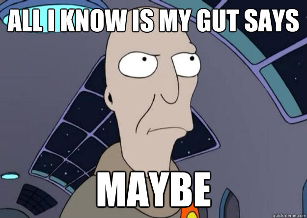

The discussion of "The Death of the Author" centers around _whether or not it is possible to critically analyze fiction without an author function_ - and while it's an interesting conversation, it seems like the whole purpose of the conversation is just to _have_ the interesting conversation, and then immediately go back to evaluating work in the critical context of "thinking about who created it and why", because that's an invaluable critical tool. 

## Why Are We Talking about The Role of the Author in Fiction?

Well, because I haven't seen it stated **in reverse**. What's the role of _fiction_ in the _author_? 

Brandon's answer here is that it's formative and necessary: fiction creates the author. 

## The Problems of AI Criticism

There are two things I see often in the modern Butlerian Jihad:

### LLM-generated work cannot have authorial intent because it doesn't have an author

There's some logic to this, but I feel like I have to, ultimately, reject it. A fully automated process doesn't have an author, but as soon as you introduce a human into the loop, behold: an author. 

The idea that an art director doesn't have authorial intent just because they aren't hand-drawing every drop of water is ludicrous. 

A lot of the scenery in Flow is not generated by people's in-depth understanding of how light dapples on trees or how water ripples: it's built by generative physical models that obviate the need for this work by simply _simulating light and water_. 

It's possible for someone to have a good idea for a story without a fine, in-depth understanding of scene-by-scene prose construction. 

I think that **finding cool looking rocks** counts as an artistic endeavor.  The process that created these rocks was not a human process, but by sifting through a great many rocks and _finding the rocks that people would want to look at_, we've applied authorial intent, and thus: art is born.

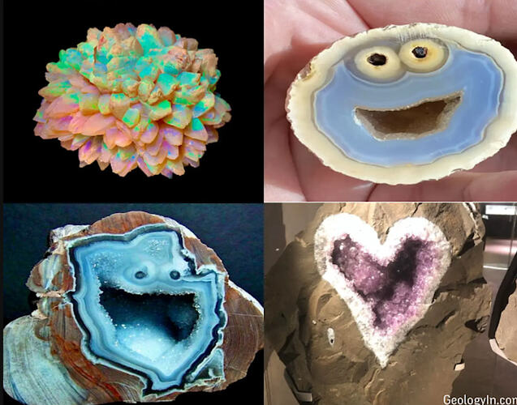

In the same way, I think it's possible to micromanage an LLM until art comes out. It's a process that involves curation and editing rather than direct production skill, but nevertheless: curation and editing can still be an artistic endeavor.

### Suffering is necessary to create art. 

There's a story arc in Bojack Horseman that I _always think about_ when this topic comes up. 

Diane wants to write something dark, and gritty, and emotionally raw. But attempting to do this just sinks her into a deep depression.

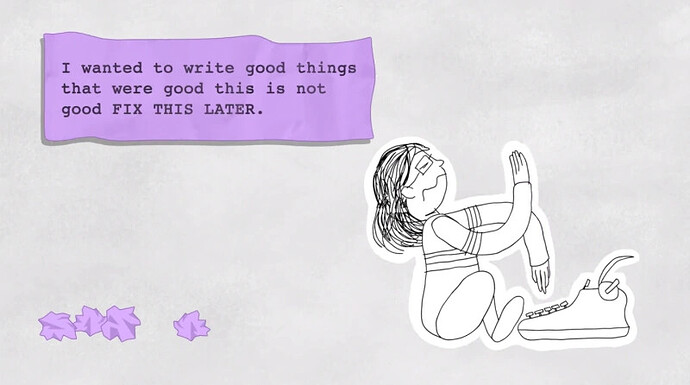

Diane tries antidepressants, which help elevate her mood... and also stand in the way of writing something dark, and gritty, and emotionally raw. Diane, feeling a little happier, starts working on Ivy Tran, Food Court Detective, which everybody likes a lot more.

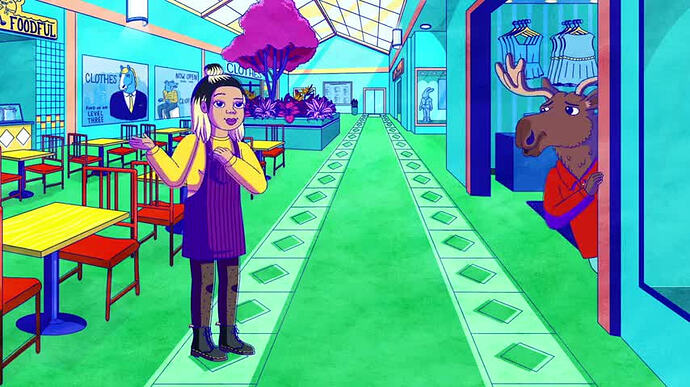

Diane is concerned by this. The art was meant to contextualize and in many cases _justify_ her suffering. Why was she miserable if it _wasn't_ to become a great artist? **Ivy Tran** didn't come from suffering, is it not as artistic as the dark, gritty, emotionally raw project?

A lot of artists believe that _difficulty_ makes the artist, that the truest art is hewn from the most onerous processes:

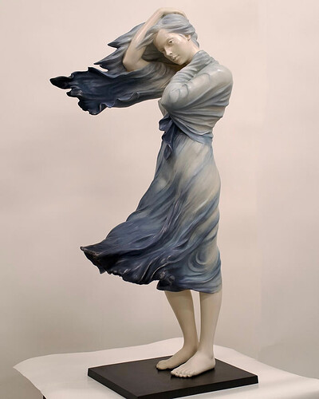

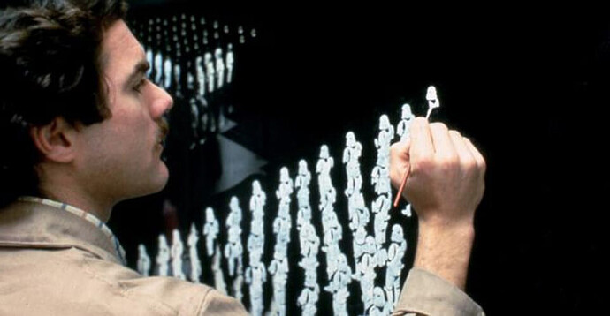

And that's, I think, what Brandon Sanderson's argument is about, here: that the process of overcoming artistic adversity forges a better artist, a more interesting and nuanced person, and one of the things that's key **to** interesting art is not _just_ authorial intent, but authorial intent of a person who has put in enough effort to _be_ interesting in the first place. 

I _want_ to reject the idea that suffering is a necessary component of art. 

I'm not sure if I can, though. 

Why do **I** want to create art? It's not <small>just</small> because I demand the validation that comes from adulation from an adoring I wouldn't say no to a little adulation, though.. It's because I want to shape myself into the sort of person I'd want to hang out with at parties, because **nobody is forced to spend more time with me than I am** so it is best if I don't completely suck. 

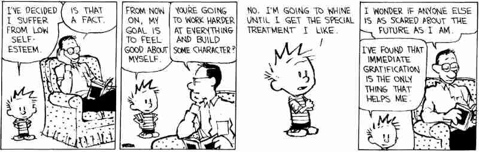

So, maybe, art demands _some_ suffering, because art is a method of communication, and you want to _listen_ to folks who have _something of value to say_, and by becoming a virtuoso talent at **some kind of skillset** you develop towards being someone worth listening to.

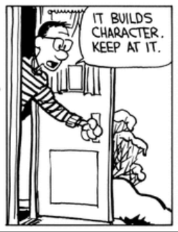

## Room for the Expert Non-Writer

In Dan Olson's "Contrepreneurs", he describes a scam whereby idiots pay  Fiverr writers and voice actors to write them a book, then narrate it, so that their terrible book can occupy some valuable space in the Audible search rankings.



The fact that it's Fiverr contractors rather than AI is barely of importance, here. AI Slop existed way before AI, before that it was just Fiverr slop.

In this video, Dan explains the value of real-life, actual ghost-writers, with a chart:

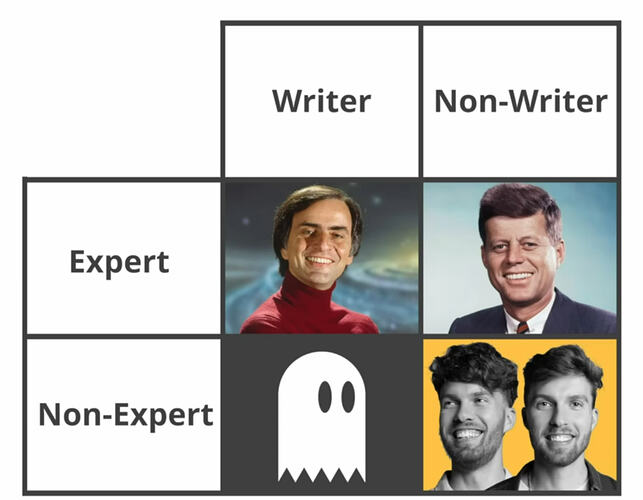

Look at Carl, there, smug in his "Writer/Expert" box. He's both full of fascinating information **and** able to deliver it clearly and professionally. He's absolutely worth listening to.

Then there's JFK, there: he's _not_ a talented writer, but there <small>was</small> something else about him that made him interesting and worth listening to. His books were ghost-written, but still worth interacting with, because _JFK was an interesting person, even if he wasn't much of a writer_.

Then, you have the ghost-writer: able to clearly structure and impart ideas, but without expertise in a specific topic, they're able to clearly impart information but they're not _interesting_, so they can sell their services to a JFK, and this creates a virtuous pairing of "expert and writer".

I think it would probably be okay if JFK wrote a book with AI assistance. In this metaphor, the ghost-writer is replaced by an even-ghostier-writer, but we're not really here for them in the first place. 

And, of course, in the "Non-Expert, Non-Writer" column, you have the con artists, who are both uninteresting AND untalented. They do not know anything about the topics they're writing about, so their ability to hire ghost writers just allows them to amplify their worthless voices. 

So, of course, that takes us to Brando Sandersman's impassioned plea, which is that there's not really such a thing as "non-expert/writer" because by forging yourself into a writer you've become an expert at at least that one thing: writing! 

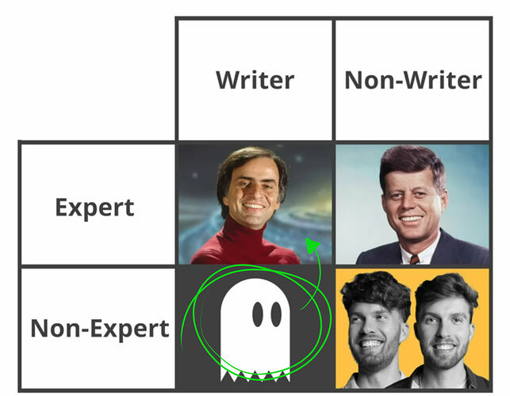

Oh shit, you accidentally became interesting!

And, of course, and this is the oft-discussed problem of "no room for juniors any more", without folks being forced to do the work to become experts, we'll run out of both: 

* people who are interesting enough that we care what they'd write in the first place
* expert input to steal from to train the AI

Without any incentive to become interesting, we create an environment where only loud idiots and con artists thrive.

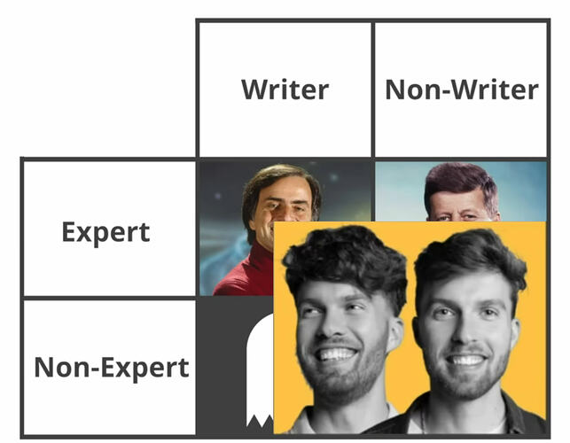

## Berserk Was Too Much Suffering, Though

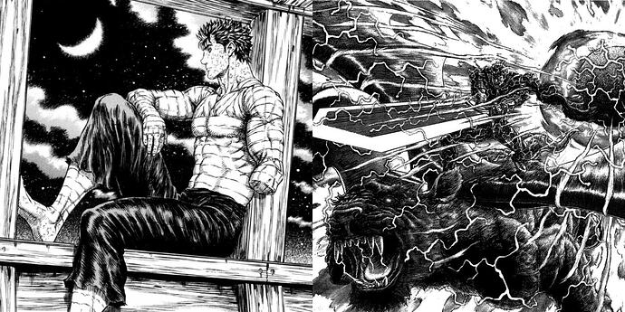

Kentaro Miura's [Berserk](https://en.wikipedia.org/wiki/Berserk_(manga)) is virtuoso artwork by an unbelievably talented creator. 

However, Berserk is borderline _poisoned_ by suffering. Kentaro wasn't just dedicated to the task of becoming a virtuoso artist, he was _consumed_ by it - in his early life working _back-breaking_ hours and giving up a great deal of his own life to the task of creating Berserk. It comes through in the work, too: Berserk is a dour, grim tale with a hero who himself is consumed by a desire to be _the very best_ at any cost. In a very real sense, Berserk is about _finding the line_, about _pushing too hard_, and eventually Kentaro found his own balance and happiness in his life.

If art requires suffering, then art becomes, in some sense, _about_ suffering, which creates _dour art_. 

Sometimes we want to leave Diane's Pain Journal behind and make an Ivy Tran, Food Court Detective. 

So we need to find a nice... happy... _medium_ amount of suffering. Work to get better at stuff that matters, automate to get rid of details that don't. We don't suffer _needlessly_. 

I think for some artists that balance may well include some LLM usage, but even trying to use LLM responsibly can be a pretty slippery slope to slop country.

## The Problem of Losing Virtuoso Skill as a Stand-In Proxy For An Interesting Author:

Or, to put it in another way, "slop".  **The smell of AI on a project is a sign that it's gone bad.**

Up until very recently, we could use virtuoso skill as kind of a proxy measure for whether something is worth our attention.

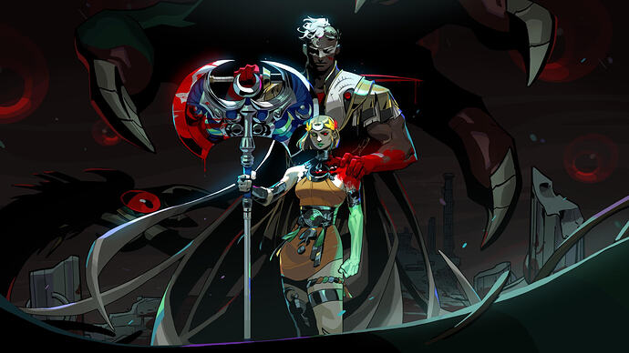

Look at this! Look at it! Whoever created it must have had incredible skill! And projects don't just attract unbelievably talented artists unless they have _something_ going for them, right?

And you also know that this guy:

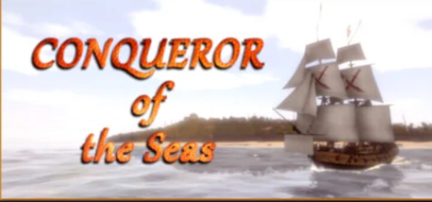

This creator is some rando, and their game will have basically no quality bar. That looks handmade! 

But now there's a new problem: 

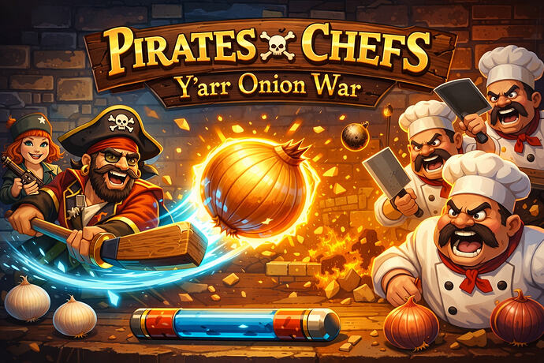

**This** guy (this is me, I generated this in 2 seconds, it's for a theoretical pirates vs. chefs arkanoid game where you shoot onions at bricks) put even _less_ effort and skill into his product than the "CONQUEROR of the Seas" guy did. The art is bullshit in the AI ways (all of the chefs are the same! one guy is holding two cleavers and one of them is backwards! the pirate has a weird pirate stick and an eye-patch that you can see one of his eyes through but also might be glasses! the pirate girl is holding her gun with multiple right hands!)

The "CONQUEROR of the Seas"  A Real Game: [Conqueror of the Seas](https://store.steampowered.com/app/2187390/Conqueror_of_the_Seas/)  is _so far ahead_ of my skill level, here. They _actually made a game_. "Conqueror of the Seas" is a much, MUCH better game than "Pirates vs. Chefs: Y'arr Onion War". It looks like they've poured a lot of love into this thing. 

If I were able to generate **much better** capsule art, it wouldn't make _gaming_ better. It would simply make capsule art _worthless_, because it would no longer signify _anything_ about game quality. Which, I mean, isn't that different: we're already most of the way there. 

AI Slop is very, very quickly developing an association with _incredibly low quality work_.

In Jenna Stoeber's "230 Games Came out in the First Week of 2026: An Investigation":



She explores what people are dumping on to Steam, and - AI or not - it's mostly trash. AI is just there to help as a marker of the very lowest effort trash, games where people couldn't even be bothered to put in the effort of _creating them_.

Maybe that creates a future where this is the true sign of quality:

Obviously, unabashedly handmade. Boldly amateur. 

You know, like how fast fashion turned homemade and vintage-looking clothes into something desirable rather than _a sign your parents are poor_. 

